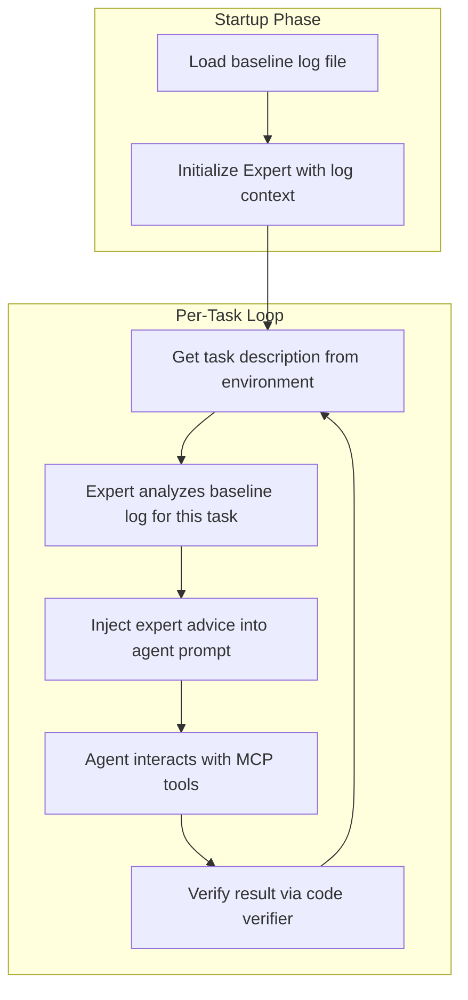
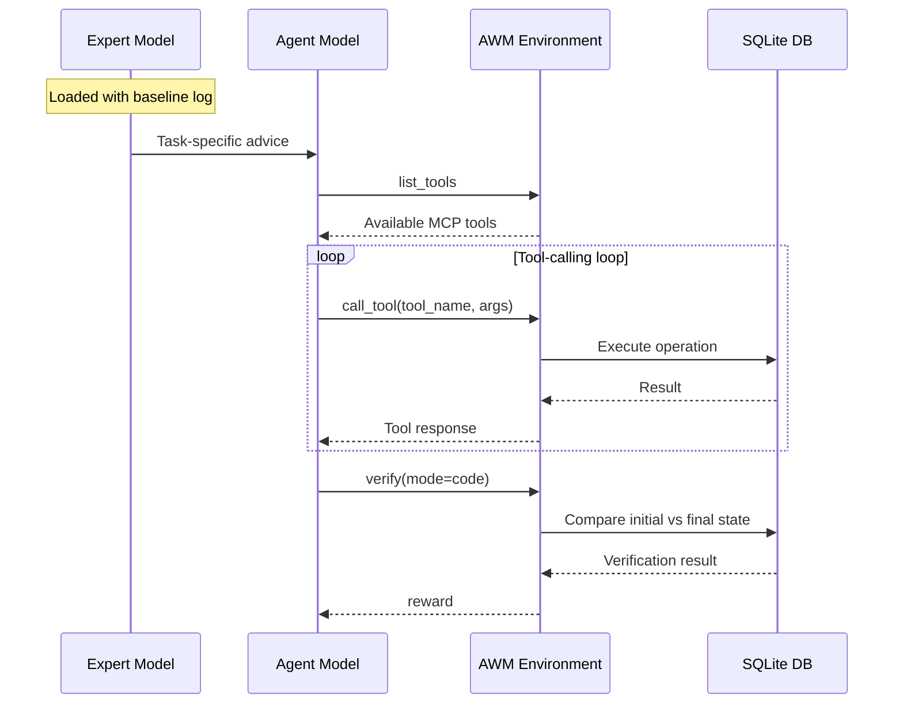

# Expert Enhancement for Agent World Model

This document describes the expert-advised agent architecture, benchmark results, bug fixes, and learnings from evaluating the AWM environment on the `workflow_automation_1` scenario.

## Overview

We built a **two-model expert-advised architecture** that pairs a cheaper agent model with a stronger expert model. The expert analyzes logs from a previous baseline run and provides task-specific guidance before the agent begins each task. This approach matches the accuracy of the strong model alone while using the cheaper model for the bulk of the interaction.

## Architecture



### How It Works

1. **Startup**: The expert model loads the full output log from a previous baseline run into its system prompt context.
2. **Per task**: Before the agent starts, the expert is asked about the specific task. It identifies whether the baseline passed or failed, summarizes the strategy used, and provides concise actionable advice.
3. **Agent loop**: The expert's advice is injected as a user message before the task description. The agent then proceeds with its normal tool-calling loop, informed by the guidance.
4. **Verification**: After the agent finishes, the code verifier checks the final database state against expected outcomes.

### Agent Interaction Flow



## Benchmark Results

Scenario: `workflow_automation_1` (10 tasks)

| Task | gpt-5.1 (baseline) | o4-mini (solo) | o4-mini + expert |
|------|---------------------|----------------|-------------------|
| 0    | 4 steps, PASS       | 4 steps, PASS  | 4 steps, PASS     |
| 1    | 5 steps, PASS       | 5 steps, PASS  | 5 steps, PASS     |
| 2    | 8 steps, PASS       | 9 steps, PASS  | 10 steps, PASS    |
| 3    | 3 steps, PASS       | 7 steps, PASS  | 5 steps, PASS     |
| 4    | 3 steps, PASS       | 6 steps, PASS  | 5 steps, PASS     |
| 5    | 4 steps, FAIL       | 4 steps, FAIL  | 3 steps, FAIL     |
| 6    | 4 steps, PASS       | 4 steps, PASS  | 4 steps, PASS     |
| 7    | 6 steps, PASS       | 6 steps, PASS  | 6 steps, PASS     |
| 8    | 9 steps, PASS       | 7 steps, FAIL  | 9 steps, PASS     |
| 9    | 4 steps, PASS       | 7 steps, PASS  | 6 steps, PASS     |
| **Total** | **9/10 (90%)** | **8/10 (80%)** | **9/10 (90%)**    |

### Key Observations

- **Expert closes the gap**: o4-mini alone scores 8/10, but with expert guidance it matches gpt-5.1 at 9/10. The critical difference is Task 8, where the expert's advice helps o4-mini succeed.
- **Task 5 fails universally**: All three configurations fail Task 5. Investigation shows this is a verifier logic issue, not a model problem.
- **Step efficiency**: o4-mini solo uses more steps on average (5.9 vs 5.0 for gpt-5.1). The expert helps reduce this (5.7), though not to baseline levels.
- **Cost advantage**: The expert adds only 1 LLM call per task (10 total for the scenario). The remaining calls use the cheaper agent model, significantly reducing cost while maintaining accuracy.

## Bug Fixes

### 1. SQLite Seed Data Quoting (`db_manager.py`)

**Problem**: The AWM dataset from HuggingFace contains SQL INSERT statements with backslash-escaped single quotes (e.g., `\'high\'`). SQLite does not recognize `\'` as an escape sequence -- the standard way is to double the quote (`''`).

**Impact**: Seed data for some tables silently failed to insert, leaving the environment in an inconsistent state. This caused agents to encounter unexpected 500 errors when interacting with resources that should have existed.

**Fix**: Added `_fix_escaped_quotes()` function that walks SQL string literals and replaces `\'` with `''` before execution. The function is used as a fallback when the original statement fails.

### 2. FastAPI Exception Handler (`scenario_manager.py`)

**Problem**: Dynamically generated FastAPI sub-environments returned opaque 500 errors with no traceback, making it impossible to diagnose failures.

**Fix**: Injected a Starlette exception handler into the patched environment code that prints the full traceback and returns the error detail in the JSON response.

### 3. Configurable Azure OpenAI Settings (`example_usage.py`)

**Problem**: The example script had hardcoded model names and used `ENDPOINT_URL` instead of the standard `AZURE_OPENAI_ENDPOINT` environment variable.

**Fix**: Model, endpoint, and API version are now read from environment variables with sensible defaults:
- `AZURE_OPENAI_MODEL` (default: `gpt-5.1`)
- `AZURE_OPENAI_ENDPOINT`
- `OPENAI_API_VERSION` (default: `2025-04-01-preview`)

## Learnings

### 1. System Prompt Engineering Matters

The initial agent system prompt led to only 3/10 tasks passing. Two key improvements brought it to 9/10:

- **Avoid playbook shortcuts**: The AWM environments expose both high-level "playbook" tools and granular CRUD tools. Playbooks often don't match task requirements exactly. Instructing the agent to always use granular tools improved accuracy significantly.
- **Check before create**: Many environments have pre-existing seed data. Agents that blindly CREATE resources hit UNIQUE constraint errors. Adding "check if it exists first, update if so" to the prompt eliminated most failures.

### 2. Seed Data Integrity Is Critical

The SQLite quoting bug was subtle -- it caused silent failures during database initialization. The environment appeared to work, but some tables were missing rows. This led to cascading errors that looked like agent mistakes but were actually infrastructure bugs. Always validate that seed data loads correctly.

### 3. Expert Advice Is Most Valuable for Edge Cases

The expert's biggest impact was on Task 8, where o4-mini solo failed but the expert-guided version succeeded. For straightforward tasks (0, 1, 6, 7), both approaches performed identically. The expert shines when tasks require specific sequences or when there are non-obvious pitfalls.

### 4. Some Failures Are Not Agent Failures

Task 5 fails across all models and configurations. The agent appears to perform the correct actions, but the code verifier does not recognize the result as correct. This highlights the importance of verifier validation when benchmarking agent performance.

## File Structure

```
agent_world_model_env/
├── run_awm_task.py                 # Multi-task runner (single model)
├── run_awm_task_with_expert.py     # Expert-advised runner (two models)
├── results/
│   ├── awm_workflow_automation_1_output_v4.txt          # Baseline: gpt-5.1, 9/10
│   ├── awm_workflow_automation_1_o4mini_output.txt      # o4-mini solo, 8/10
│   ├── awm_workflow_automation_1_expert_output_v2.txt   # o4-mini + expert, 9/10
│   └── awm_workflow_automation_1_expert_results.json    # Structured results
└── EXPERT_ENHANCEMENT.md           # This file
```

## Usage

### Single Model Runner

```bash
# Set credentials
export AZURE_OPENAI_ENDPOINT="https://your-endpoint.openai.azure.com/"
export AZURE_OPENAI_API_KEY="your-key"
export AZURE_OPENAI_MODEL="gpt-5.1"

# Start the AWM server
uvicorn agent_world_model_env.server.app:app --host 127.0.0.1 --port 8899

# Run all 10 tasks for a scenario
python run_awm_task.py workflow_automation_1
```

### Expert-Advised Runner

```bash
# Run with expert guidance (uses baseline log for advice)
python run_awm_task_with_expert.py workflow_automation_1 \
  --baseline-log results/awm_workflow_automation_1_output_v4.txt \
  --agent-model o4-mini \
  --expert-model gpt-5.1
```
