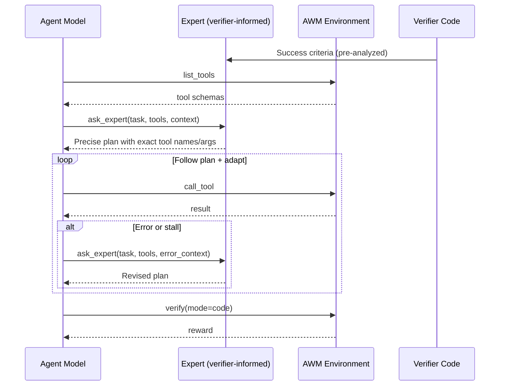

# Teaching Agents to Ask for Help

**Dynamic Expert-in-the-Loop for Agent World Model — with GRPO Reinforcement Learning**

> *"The mark of wisdom is not knowing everything — it's knowing when to ask."*

---

## The Big Idea

Imagine teaching a new employee their job. You wouldn't just hand them a manual and walk away. You also wouldn't stand behind them dictating every keystroke. The best approach? **Let them try, and tell them an expert is available if they get stuck.**

That's exactly what this project does — but for AI agents.

We give a small language model (Qwen3-4B) a set of 38 API tools, a task description, and access to a brilliant advisor (GPT-5.1). Then we use reinforcement learning (GRPO) to teach the agent *when* calling the expert leads to better outcomes — and ultimately, when it can fly solo.

**The result: validation accuracy jumped from 3.4% to 55.2%, and the agent learned to complete complex multi-step API workflows that required navigating tool schemas, handling errors, and modifying database state.**


---

## Table of Contents

- [Overview](#overview)
- [Architecture](#architecture)
- [The Expert Tool](#the-expert-tool)
- [GRPO Training Results](#grpo-training-results)
  - [Baseline: No Expert](#experiment-1-baseline-no-expert)
  - [Expert-Assisted Training](#experiment-2-expert-assisted-training)
  - [Mixed Mode: The 50/50 Experiment](#experiment-3-mixed-mode-the-5050-experiment)
  - [Adaptive Ratio: Training Wheels](#experiment-4-adaptive-ratio-training-wheels)
- [The Training Wheels Analogy](#the-training-wheels-analogy)
- [Key Findings](#key-findings)
- [Expert Calling Behavior Analysis](#expert-calling-behavior-analysis)
- [Bug Fixes](#bug-fixes)
- [Learnings](#learnings)
- [Research Directions](#research-directions--whats-next)
- [File Structure](#file-structure)
- [Usage](#usage)

---

## Overview

The dynamic expert is exposed as a callable **tool** (`ask_expert`) that the agent invokes **during** the task whenever it needs guidance. Unlike upfront advice approaches, the agent decides when to consult the expert based on real-time context — errors, partial progress, or task complexity.

The expert is "verifier-informed": before the task starts, it analyzes the Python verification code to extract the exact database state required for success. Combined with full MCP tool schemas, it produces precise step-by-step plans with exact tool names and argument values.

Think of it like an open-book exam where one of the "books" is a brilliant tutor who knows the answer key — but you have to decide when it's worth raising your hand.

---

## Architecture



### How It Works

1. **Verifier analysis**: Before the task begins, the expert LLM analyzes the Python verifier code and extracts the exact success criteria — table names, column values, JSON field contents, and record relationships the verifier checks.
2. **Tool discovery**: The agent calls `list_tools` to get the full MCP tool catalog. The expert receives these schemas with parameter names, types, and descriptions.
3. **On-demand consultation**: The agent calls `ask_expert` with the task description, available tools, and any context (errors, partial progress). The expert returns a precise plan.
4. **Adaptive execution**: The agent follows the plan using `call_tool`. If a step fails, the system nudges the agent to re-consult the expert with the error details.
5. **Verification**: After completing tool calls, the code verifier checks the final database state.

### Key Features

- **Agent-initiated**: The agent decides when to call the expert (0 to N times per task)
- **Verifier-informed**: Expert knows the exact DB state the verifier checks for
- **Schema-aware**: Expert receives full MCP tool schemas to generate precise calls
- **Error recovery**: System nudges agent to consult expert after errors or stalls
- **No prior data needed**: Works from the first run — no baseline log required

---

## The Expert Tool

The `ask_expert` tool is implemented as a GPT-5.1 call with a carefully constructed prompt:

| Parameter | Details |
|-----------|---------|
| **Model** | GPT-5.1 (Azure OpenAI) |
| **Input** | Task description + available MCP tool schemas + error context |
| **Output** | Precise step-by-step plan with exact tool names and argument values |
| **Max calls per episode** | 3 (forces the agent to be selective) |
| **Latency** | ~2-3 seconds per call |

The expert is "verifier-informed" — it has already analyzed the Python verification function and knows exactly what database state constitutes success. This is like giving the tutor the answer key before the exam.

---

## GRPO Training Results

We ran four experiments, each building on the insights of the previous one. Here's the story of how we got from 3.4% to 55.2% validation accuracy.

**Training setup:**

| Parameter | Value |
|-----------|-------|
| Model | Qwen3-4B (SFT checkpoint) |
| Algorithm | GRPO (Generalized RL Policy Optimization) |
| GPUs | 8x NVIDIA B200 (183GB each) |
| Batch size | 16 prompts x 8 rollouts = 128 rollouts/step |
| Training tasks | 53 workflow automation scenarios |
| Validation tasks | 29 held-out scenarios |
| Total steps | 48 |
| Reward | Code verifier + LLM judge (GPT-5.1) |

### Experiment 1: Baseline (No Expert)

**The control group.** The agent has only `list_tools` and `call_tool` — no expert to lean on.

| Milestone | Step | Notes |
|-----------|------|-------|
| Start | 0 | Val accuracy: **3.4%**, train reward: -0.67 |
| First improvement | 9 | Reward jumps to -0.40 |
| Crosses zero | 16 | Reward turns positive (+0.15) |
| Peak | 42 | Reward reaches **+0.75** |
| Final | 48 | Val accuracy: **55.2%** |

> **Takeaway:** The baseline works, but it takes 16 steps just to reach positive reward. The agent spends most of early training producing malformed XML tool calls (format errors > 90%).

### Experiment 2: Expert-Assisted Training

**Every rollout has access to `ask_expert`.** The agent can call the GPT-5.1 expert up to 3 times per task.

| Step Window | Expert Train Reward | Baseline Train Reward | Expert Advantage |
|-------------|--------------------|-----------------------|-----------------|
| Steps 1-5 | **-0.37** | -0.73 | **+0.36** |
| Steps 6-10 | **-0.01** | -0.52 | **+0.51** |
| Steps 11-17 | **+0.19** | -0.22 | **+0.41** |

> **Takeaway:** The expert provides a massive early boost (+0.51 reward advantage by steps 6-10). Initial validation accuracy starts at 10.3% vs baseline's 3.4% — the expert system prompt alone helps even before any RL training.

### Experiment 3: Mixed Mode — The 50/50 Experiment

**The hypothesis:** If we give the expert to only *half* the rollouts, the agent might learn when it needs help vs when it can manage alone. Plus, a +0.5 bonus reward for completing tasks *without* the expert should incentivize independence.

For each prompt, 4 out of 8 rollouts get expert access ("expert chains"), and 4 don't ("solo chains").


**What happened:**

| Step Window | Baseline Completions | Mixed Completions | Mixed Advantage |
|-------------|---------------------|-------------------|----------------|
| Steps 1-5 | avg 2.4 (1.9%) | avg **8.2 (6.4%)** | **3.4x** |
| Steps 6-10 | avg 4.4 (3.4%) | avg **11.0 (8.6%)** | **2.5x** |
| Steps 11-15 | avg 13.0 (10.2%) | avg **19.2 (15.0%)** | **1.5x** |
| **Steps 16-17** | **avg 39.0 (30.5%)** | avg 25.0 (19.5%) | **Baseline wins** |

The mixed approach dominated early training (3.4x more completions in the first 5 steps!), but **the baseline overtook it at step 16**. Why?


**The culprit: solo chains are dead weight.** Solo chains maintain 85-87% format error rates throughout training, while expert chains drop to ~42%. Half the batch produces almost no useful gradient signal, diluting the learning for the entire model.

> **Takeaway:** A fixed 50/50 split wastes compute. The solo chains can't learn XML formatting fast enough without the expert's structured guidance, creating an anchor that drags down the whole run.

### Experiment 4: Adaptive Ratio — Training Wheels

**The insight from Experiment 3** was clear: don't use a fixed ratio. Instead, **adapt the expert/solo split based on how well the agent is doing.**


The adaptive algorithm reads the format error rate from the previous step and adjusts:

| Format Error Rate | Phase | Expert Chains | Solo Chains | Rationale |
|-------------------|-------|--------------|-------------|-----------|
| **> 70%** | Scaffold | 6 | 2 | Model can't even format tools — heavy expert support |
| **40-70%** | Balanced | 4 | 4 | Model has basics — equal exposure |
| **< 40%** | Independence | 2 | 6 | Model is proficient — push toward self-reliance |

**Results after 10 steps:**

| Step | Reward | Format Error % | Completions | Completion Rate |
|------|--------|---------------|-------------|-----------------|
| 1 | -0.470 | 87.5% | 8 | 6.2% |
| 2 | -0.508 | 82.8% | 9 | 7.0% |
| 3 | -0.496 | 82.0% | 12 | 9.4% |
| 4 | -0.390 | 82.8% | 2 | 1.6% |
| 5 | -0.313 | 82.0% | 17 | 13.3% |
| 6 | -0.058 | 77.3% | 15 | 11.7% |
| 7 | -0.320 | 75.0% | 14 | 10.9% |
| 8 | -0.393 | 75.8% | 11 | 8.6% |
| 9 | **+0.068** | 70.3% | **25** | **19.5%** |
| 10 | -0.114 | 71.9% | 17 | 13.3% |

**The adaptive approach is the only one to cross zero reward (step 9: +0.068).** Neither the baseline nor the 50/50 mixed mode achieved this in the same number of steps.

**Head-to-head comparison (averaged over steps 1-9):**

| Metric | Adaptive 6E/2S | Mixed 50/50 | Baseline (no expert) |
|--------|---------------|-------------|---------------------|
| Avg reward | **-0.299** | -0.355 | -0.697 |
| Avg completions/step | **11.7** | 10.3 | 3.0 |
| First 10+ completions | **Step 3** | Step 3 | Never |
| First 15+ completions | **Step 5** | Step 9 | Never |
| First 20+ completions | **Step 9** | Never | Never |
| Reward crosses zero | **Step 9** | Never | Never |

The model started in the **Scaffold phase** (6 expert / 2 solo) at 87.5% format errors. By step 9, format errors dropped to 70.3% — right at the threshold where the adaptive logic transitions to the **Balanced phase** (4 expert / 4 solo), meaning the model is earning its way to more independence.

---

## The Training Wheels Analogy

The best way to think about adaptive expert ratio is **training wheels on a bicycle.**


- **Phase 1 (Scaffold):** The child can barely balance. Training wheels are firmly on. Most chains get expert guidance so the agent learns *what good tool calls look like* before worrying about *when to ask for help.*

- **Phase 2 (Balanced):** The child is wobbly but upright. One training wheel comes off. Half the chains must solve tasks solo, but the expert is still there for the harder half.

- **Phase 3 (Independence):** The child is riding confidently. Both training wheels come off, with just a hand hovering nearby. Most chains are solo, proving the agent can ride on its own.

The key insight: **you don't yank training wheels off a kid who can't balance yet.** That's what the fixed 50/50 split did — and it's why it failed.

---

## Key Findings

### 1. Expert Scaffolding Accelerates Early Learning 3.4x

With expert access, the agent achieves 6.4% completion rate in the first 5 steps versus baseline's 1.9%. The expert doesn't just solve tasks — it teaches the model what *correct tool-calling sequences look like*, providing rich positive-reward training signal in a regime where the baseline produces almost none.

### 2. But Scaffolding Has a Shelf Life

The baseline overtakes mixed-mode at step 16. Expert scaffolding provides diminishing returns after the model learns basic tool formatting. At that point, the expert becomes a crutch — the model learns "always ask first" instead of "think, then ask if stuck."

### 3. Format Errors Are The Gateway Skill

75-95% of rollouts die from malformed XML tool calls in early training. This is the single biggest bottleneck. Expert chains reduce format errors to 42% by step 17, but solo chains remain stuck at 85%. **An agent that can't format a tool call can't learn anything else.**

### 4. The Solo Bonus Paradox

The +0.5 reward bonus for solving without the expert never triggered in the first 7 steps. Every single successful completion used the expert. The RL signal reinforces "expert = success" faster than "solo bonus = higher reward" — because you have to succeed at all before the bonus matters.

### 5. The Adaptive Ratio Is Critical

A fixed 50/50 split wastes half the batch on chains that produce no useful gradient. The adaptive approach ensures maximum useful signal at every training stage: heavy expert early (to teach formatting), then gradually shifting to solo (to build independence).

---

## Expert Calling Behavior Analysis

How does the agent actually *use* the expert over time?


### Two Patterns Emerge:

**1. "Blind Planning" (dominant):** The agent calls `ask_expert` as its very first action, before even trying any tools. This goes from 19 calls at step 1 to 36 at step 7 — it's **growing**, not shrinking.

**2. "Error Recovery" (emerging):** The agent tries a tool, fails, then calls the expert for help. This pattern goes from 7 to 11 calls — a healthy sign that the agent is learning to "try first, ask if stuck."

| Step | Blind Expert Calls | Recovery Calls | Multi-Expert Calls | Solo Completions |
|------|-------------------|----------------|-------------------|-----------------|
| 1 | 19 (73%) | 7 (27%) | 4 | 0 |
| 4 | 21 (75%) | 7 (25%) | 5 | 1 |
| 7 | 36 (77%) | 11 (23%) | 9 | 3 |

> **The uncomfortable truth:** RL is reinforcing "always ask the expert first" because it correlates with higher reward. The agent hasn't yet learned the nuance of "try first, ask if confused." This is the core challenge of teaching agents to ask for help *selectively*.

---

## Benchmark Results

### Inference-Time (GPT-5.1 agent, no RL)

Scenario: `workflow_automation_1` (10 tasks), gpt-5.1

| Metric | Baseline (no expert) | Dynamic Expert | Delta |
|--------|---------------------|----------------|-------|
| Avg reward | 0.500 | 0.800 | **+0.300 (+60%)** |
| Complete tasks | 5/10 | 8/10 | **+3** |

### GRPO Training (Qwen3-4B, 48 steps)

| Metric | Before Training | After Training | Delta |
|--------|----------------|----------------|-------|
| Val accuracy | 3.4% | 55.2% | **+51.8pp** |
| Train reward | -0.67 | +0.75 | **+1.42** |
| Format error rate | 94% | 40% | **-54pp** |
| Tasks solvable | 1/29 | 16/29 | **+15** |

---

## Bug Fixes

### SQLite Seed Data Quoting (`db_manager.py`)

**Problem**: The AWM dataset contains SQL INSERT statements with backslash-escaped single quotes (e.g., `\'high\'`). SQLite does not recognize `\'` — the standard escape is doubled quotes (`''`).

**Impact**: Seed data for some tables silently failed to insert, leaving the environment in an inconsistent state. Agents encountered unexpected errors interacting with resources that should have existed.

**Fix**: Added `_fix_escaped_quotes()` that converts `\'` to `''` before execution, used as a fallback when the original statement fails.

### FastAPI Exception Handler (`scenario_manager.py`)

**Problem**: Dynamically generated FastAPI sub-environments returned opaque 500 errors with no traceback.

**Fix**: Injected a Starlette exception handler that prints full tracebacks and returns error details in the JSON response.

### Configurable Azure OpenAI Settings (`example_usage.py`)

**Problem**: Hardcoded model names and non-standard env var names.

**Fix**: Model, endpoint, and API version now read from environment variables:
- `AZURE_OPENAI_MODEL` (default: `gpt-5.1`)
- `AZURE_OPENAI_ENDPOINT`
- `OPENAI_API_VERSION` (default: `2025-04-01-preview`)

---

## Learnings

### System Prompt Engineering Matters

Two key improvements brought task pass rate from 3/10 to 8/10:

- **Avoid playbook shortcuts**: AWM environments expose both high-level "playbook" tools and granular CRUD tools. Playbooks often don't match task requirements exactly. Using granular tools improved accuracy significantly.
- **Check before create**: Many environments have pre-existing seed data. Adding "check if it exists first, update if so" eliminated UNIQUE constraint errors.

### Seed Data Integrity Is Critical

The SQLite quoting bug caused silent failures during database initialization. The environment appeared to work, but tables were missing rows. This led to cascading errors that looked like agent mistakes but were infrastructure bugs.

### Expert Is Most Valuable for Edge Cases

For straightforward tasks, the agent succeeds without expert help. The expert's biggest impact is on tasks that require specific sequences or have non-obvious pitfalls — error recovery via re-consultation is the key differentiator.

### RL Training Insights

- **Format errors dominate early training.** 90%+ of rollouts die before any meaningful tool interaction. Reducing format errors is the single highest-leverage improvement.
- **Expert scaffolding has diminishing returns.** It provides 3.4x more completions in early steps but the baseline catches up by step 16. Know when to remove the scaffold.
- **Fixed expert ratios waste compute.** A 50/50 split sounds fair but creates "dead weight" — solo chains that can't learn fast enough drag down the whole batch.
- **Agents learn "always ask" before "ask selectively."** The RL signal reinforces calling the expert because it correlates with success, even when the agent could theoretically solve simpler tasks alone.

---

## Research Directions — What's Next?

The experiments above scratched the surface of a fascinating question: **how do you teach an agent to know what it doesn't know?**

Here are promising directions for future exploration:

### 1. Curriculum Learning for Expert Withdrawal

Instead of adapting based on format error rate alone, build a curriculum that explicitly tracks *per-task* difficulty. Easy tasks lose expert access first; hard tasks keep it longer. This mirrors how human education works — you don't stop teaching long division because the student mastered addition.

### 2. Confidence-Calibrated Expert Calls

Train the agent to output a confidence score before each action. If confidence is below a threshold, it calls the expert. This requires auxiliary training signal but could produce genuinely selective expert usage — the holy grail of "knowing when you don't know."

### 3. Expert Distillation

Instead of calling a live GPT-5.1 expert at training time, distill the expert's knowledge into a small auxiliary model. This removes the latency and cost of expert calls during training while preserving the scaffolding benefit.

### 4. Multi-Expert Ensembles

What if the agent could choose between different experts — a "tool formatting" expert, a "task planning" expert, and an "error recovery" expert? Teaching an agent to route to the right specialist is a richer learning problem.

### 5. Self-Play Expert Bootstrapping

As the agent improves, use its own successful trajectories as "expert" demonstrations for the next training round. The agent bootstraps its own expertise, gradually replacing the external expert with internalized knowledge.

### 6. Meta-Learning Across Tasks

Train on a diverse set of environments (not just workflow automation) so the agent learns a general "when to ask for help" policy that transfers across domains. An agent that knows when to ask in *any* environment is far more valuable than one that memorizes when to ask in *one* environment.

> **The broader vision:** In the future, the most capable AI systems won't be the ones that know everything — they'll be the ones that know the boundaries of their own knowledge and can effectively collaborate with other systems (or humans) to fill the gaps. Teaching agents to ask for help is a step toward that future.

---

## File Structure

```
agent_world_model_env/
├── run_awm_task.py                      # Single-model runner (no expert)
├── run_awm_task_dynamic_expert.py       # Dynamic expert benchmark runner
├── EXPERT_ENHANCEMENT.md               # This file
└── assets/
    ├── reward_curves.png               # GRPO training reward over 48 steps
    ├── completion_comparison.png        # Baseline vs mixed completions
    ├── format_error_divergence.png      # Expert vs solo chain format errors
    ├── adaptive_ratio.png              # Adaptive phase transition diagram
    ├── training_wheels_analogy.png     # Visual analogy for adaptive training
    └── expert_behavior_evolution.png   # How the agent uses the expert over time
```

## Usage

```bash
# Set credentials
export AZURE_OPENAI_ENDPOINT="https://your-endpoint.openai.azure.com/"
export AZURE_OPENAI_API_KEY="your-key"

# Start the AWM server
uvicorn agent_world_model_env.server.app:app --host 127.0.0.1 --port 8899

# Run full benchmark: baseline vs dynamic expert
python run_awm_task_dynamic_expert.py workflow_automation_1

# Run with a different model
python run_awm_task_dynamic_expert.py workflow_automation_1 --model gpt-5.1

# Run only the expert mode (skip baseline)
python run_awm_task_dynamic_expert.py workflow_automation_1 --expert-only

# Run only baseline (skip expert)
python run_awm_task_dynamic_expert.py workflow_automation_1 --baseline-only

# Limit to fewer tasks
python run_awm_task_dynamic_expert.py workflow_automation_1 --tasks 3
```

---
