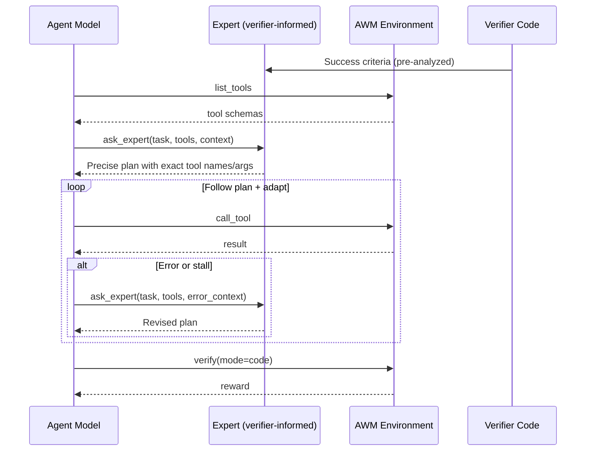

# Dynamic Expert-in-the-Loop for Agent World Model

A verifier-informed, on-demand expert advisor that the agent calls as a tool during AWM tasks.

## Overview

The dynamic expert is exposed as a callable **tool** (`ask_expert`) that the agent invokes **during** the task whenever it needs guidance. Unlike upfront advice approaches, the agent decides when to consult the expert based on real-time context — errors, partial progress, or task complexity.

The expert is "verifier-informed": before the task starts, it analyzes the Python verification code to extract the exact database state required for success. Combined with full MCP tool schemas, it produces precise step-by-step plans with exact tool names and argument values.

## Architecture



### How It Works

1. **Verifier analysis**: Before the task begins, the expert LLM analyzes the Python verifier code and extracts the exact success criteria — table names, column values, JSON field contents, and record relationships the verifier checks.
2. **Tool discovery**: The agent calls `list_tools` to get the full MCP tool catalog. The expert receives these schemas with parameter names, types, and descriptions.
3. **On-demand consultation**: The agent calls `ask_expert` with the task description, available tools, and any context (errors, partial progress). The expert returns a precise plan.
4. **Adaptive execution**: The agent follows the plan using `call_tool`. If a step fails, the system nudges the agent to re-consult the expert with the error details.
5. **Verification**: After completing tool calls, the code verifier checks the final database state.

### Key Features

- **Agent-initiated**: The agent decides when to call the expert (0 to N times per task)
- **Verifier-informed**: Expert knows the exact DB state the verifier checks for
- **Schema-aware**: Expert receives full MCP tool schemas to generate precise calls
- **Error recovery**: System nudges agent to consult expert after errors or stalls
- **No prior data needed**: Works from the first run — no baseline log required

## Benchmark Results

Scenario: `workflow_automation_1` (10 tasks), gpt-5.1

| Metric | Baseline (no expert) | Dynamic Expert | Delta |
|--------|---------------------|----------------|-------|
| Avg reward | 0.500 | 0.800 | **+0.300 (+60%)** |
| Complete tasks | 5/10 | 8/10 | **+3** |

## Bug Fixes

### SQLite Seed Data Quoting (`db_manager.py`)

**Problem**: The AWM dataset contains SQL INSERT statements with backslash-escaped single quotes (e.g., `\'high\'`). SQLite does not recognize `\'` — the standard escape is doubled quotes (`''`).

**Impact**: Seed data for some tables silently failed to insert, leaving the environment in an inconsistent state. Agents encountered unexpected errors interacting with resources that should have existed.

**Fix**: Added `_fix_escaped_quotes()` that converts `\'` to `''` before execution, used as a fallback when the original statement fails.

### FastAPI Exception Handler (`scenario_manager.py`)

**Problem**: Dynamically generated FastAPI sub-environments returned opaque 500 errors with no traceback.

**Fix**: Injected a Starlette exception handler that prints full tracebacks and returns error details in the JSON response.

### Configurable Azure OpenAI Settings (`example_usage.py`)

**Problem**: Hardcoded model names and non-standard env var names.

**Fix**: Model, endpoint, and API version now read from environment variables:
- `AZURE_OPENAI_MODEL` (default: `gpt-5.1`)
- `AZURE_OPENAI_ENDPOINT`
- `OPENAI_API_VERSION` (default: `2025-04-01-preview`)

## Learnings

### System Prompt Engineering Matters

Two key improvements brought task pass rate from 3/10 to 8/10:

- **Avoid playbook shortcuts**: AWM environments expose both high-level "playbook" tools and granular CRUD tools. Playbooks often don't match task requirements exactly. Using granular tools improved accuracy significantly.
- **Check before create**: Many environments have pre-existing seed data. Adding "check if it exists first, update if so" eliminated UNIQUE constraint errors.

### Seed Data Integrity Is Critical

The SQLite quoting bug caused silent failures during database initialization. The environment appeared to work, but tables were missing rows. This led to cascading errors that looked like agent mistakes but were infrastructure bugs.

### Expert Is Most Valuable for Edge Cases

For straightforward tasks, the agent succeeds without expert help. The expert's biggest impact is on tasks that require specific sequences or have non-obvious pitfalls — error recovery via re-consultation is the key differentiator.

## File Structure

```
agent_world_model_env/
├── run_awm_task.py                      # Single-model runner (no expert)
├── run_awm_task_dynamic_expert.py       # Dynamic expert benchmark runner
└── EXPERT_ENHANCEMENT.md               # This file
```

## Usage

```bash
# Set credentials
export AZURE_OPENAI_ENDPOINT="https://your-endpoint.openai.azure.com/"
export AZURE_OPENAI_API_KEY="your-key"

# Start the AWM server
uvicorn agent_world_model_env.server.app:app --host 127.0.0.1 --port 8899

# Run full benchmark: baseline vs dynamic expert
python run_awm_task_dynamic_expert.py workflow_automation_1

# Run with a different model
python run_awm_task_dynamic_expert.py workflow_automation_1 --model gpt-5.1

# Run only the expert mode (skip baseline)
python run_awm_task_dynamic_expert.py workflow_automation_1 --expert-only

# Run only baseline (skip expert)
python run_awm_task_dynamic_expert.py workflow_automation_1 --baseline-only

# Limit to fewer tasks
python run_awm_task_dynamic_expert.py workflow_automation_1 --tasks 3
```
