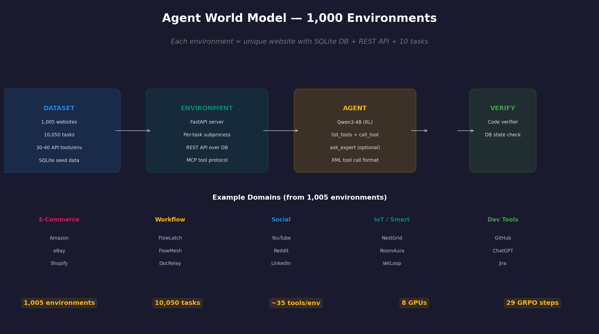
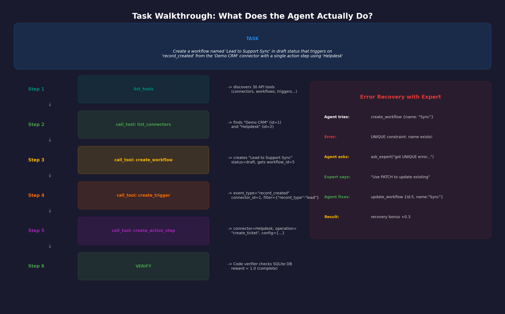
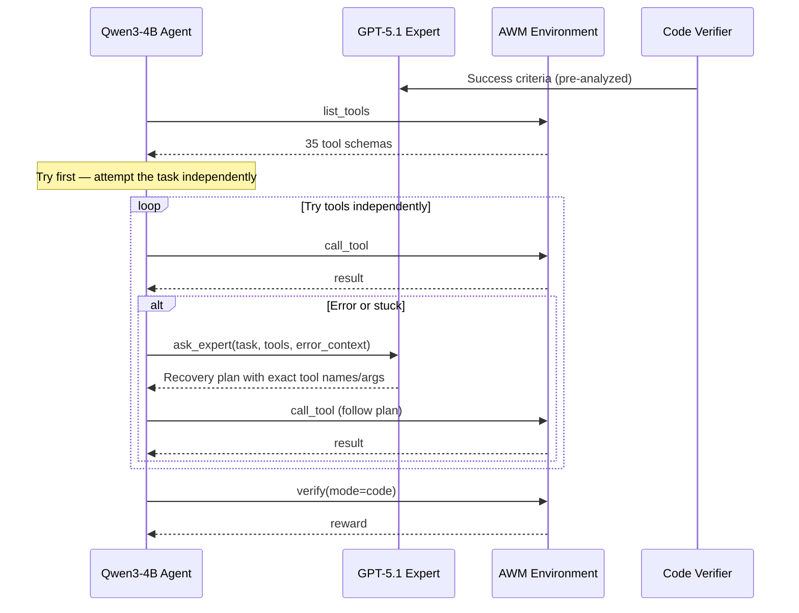
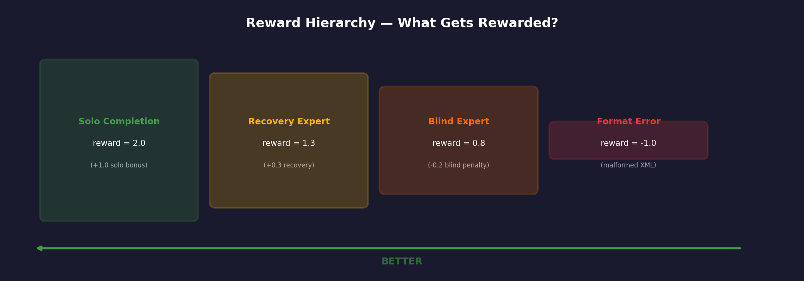
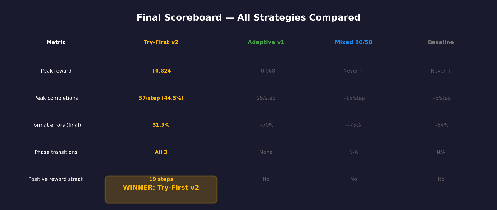

# Teaching Agents to Ask for Help

### Dynamic Expert-in-the-Loop GRPO Training on Agent World Model

> *"The mark of wisdom is not knowing everything — it's knowing when to ask."*

---

## The Result

| | Before | After 29 Steps |
|---|---|---|
| **Completion Rate** | 5.5% | **44.5%** |
| **Reward** | -0.528 | **+0.824 peak** |
| **Format Errors** | 88.3% | **31.3%** |
| **Phase** | Scaffold (6 expert / 2 solo) | **Independence (2 expert / 6 solo)** |


---

## What Is This?

Imagine teaching a new employee. You wouldn't just hand them a manual and walk away. You also wouldn't stand behind them dictating every keystroke.

**The best approach? Let them try, and tell them an expert is available if they get stuck.**

We give a small language model (**Qwen3-4B**) a set of ~35 API tools, a task description, and access to a brilliant advisor (**GPT-5.1**). Then we use reinforcement learning (**GRPO**) to teach it *when* calling the expert leads to better outcomes — and ultimately, when it can fly solo.

---

## The Environment: Agent World Model



The **Agent World Model (AWM)** is a benchmark of **1,005 simulated web environments** — each one a unique "website" backed by a SQLite database and a REST API exposed as MCP tools.

### What's inside each environment?

| Component | Details |
|-----------|---------|
| **Database** | SQLite with pre-seeded data (users, records, relationships) |
| **API** | 30-40 REST endpoints auto-generated as MCP tools |
| **Tasks** | 10 per environment — natural language instructions the agent must complete |
| **Verifier** | Python code that checks the final DB state for correctness |

### Example domains (from 1,005 environments)

| Domain | Example Environments | Example Task |
|--------|---------------------|--------------|
| **Workflow Automation** | FlowLatch, FlowMesh, DocRelay | *"Create a workflow named 'Lead to Support Sync' in draft status..."* |
| **E-Commerce** | Amazon, eBay, Shopify Admin | *"Search for 'wireless headphones' and add the top-rated item to cart..."* |
| **Dev Tools** | GitHub, Jira, ChatGPT | *"Create a new branch 'feature/dark-mode' and open a pull request..."* |
| **IoT / Smart Home** | NestGrid, RoomAura, VetLoop | *"Register a smart thermostat for room 805 with firmware v3.1.0..."* |
| **Social Media** | YouTube, Reddit, LinkedIn | *"Subscribe to 'Kurzgesagt' and add their latest video to my playlist..."* |

### Our training split

We train on **53 tasks** across 8 workflow automation environments and validate on **29 held-out tasks** across 11 environments.

---

## What Does the Agent Actually Do?



The agent interacts through two simple primitives:

1. **`list_tools`** — discovers all available API endpoints (typically 30-40 per environment)
2. **`call_tool`** — calls a specific API endpoint with JSON arguments

And optionally:

3. **`ask_expert`** — consults GPT-5.1 for a step-by-step plan (max 3 calls per task)

Every tool call must be wrapped in XML:

```xml
<tool_call>
{"name": "call_tool", "arguments": {"tool_name": "create_workflow", "arguments": "{\"name\": \"Lead Sync\", \"status\": \"draft\"}"}}
</tool_call>
```

**88% of rollouts in step 1 fail just to format this XML correctly.** That's the gateway skill the agent must learn first.

---

## The Expert Tool

The `ask_expert` tool is a GPT-5.1 call with a key advantage: it has already analyzed the Python verifier code and knows exactly what database state constitutes success.

| Parameter | Details |
|-----------|---------|
| **Model** | GPT-5.1 (Azure OpenAI) |
| **Input** | Task description + available MCP tool schemas + error context |
| **Output** | Precise step-by-step plan with exact tool names and argument values |
| **Max calls** | 3 per episode |
| **Secret weapon** | Verifier-informed — it knows the answer key |

Think of it like an open-book exam where one of the "books" is a brilliant tutor who already read the answer key — but you have to decide when it's worth raising your hand.

---

## Architecture



**The workflow:**
1. **Discover** — Agent calls `list_tools` to get the API catalog
2. **Try first** — Agent attempts the task independently using `call_tool`
3. **Ask if stuck** — If an error occurs, agent calls `ask_expert` with context
4. **Execute plan** — Agent follows the expert's recovery plan
5. **Verify** — Code verifier checks the SQLite database for correctness

---

## Training Setup

| Parameter | Value |
|-----------|-------|
| **Model** | Qwen3-4B (SFT checkpoint) |
| **Algorithm** | GRPO (Generalized RL Policy Optimization) |
| **GPUs** | 8x NVIDIA B200 (183GB each) |
| **Batch size** | 16 prompts x 8 rollouts = 128 rollouts/step |
| **Training tasks** | 53 workflow automation scenarios |
| **Validation tasks** | 29 held-out scenarios |
| **Reward** | Code verifier + LLM judge (GPT-5.1) |

---

## Reward Hierarchy



Not all completions are equal. The reward system creates a clear hierarchy that teaches the agent *how* to use the expert, not just *whether* to use it:

| Pattern | Reward | What Happened |
|---------|--------|---------------|
| **Solo completion** | **2.0** | Agent solved it without calling the expert |
| **Recovery expert** | **1.3** | Agent tried first, hit an error, asked for help, then succeeded |
| **Blind expert** | **0.8** | Agent called expert immediately without trying first |
| **Incomplete** | **0.1** | Agent did something but didn't finish |
| **Format error** | **-1.0** | Agent produced malformed XML — no tool call executed |

---

## Experiment 1: Baseline (No Expert)

The control group. Agent has only `list_tools` and `call_tool`.

| Milestone | Step | Value |
|-----------|------|-------|
| Start | 1 | Reward: -0.80, FE: 92% |
| First improvement | 9 | Reward: -0.40 |
| Crosses zero | ~28 | Reward: +0.02 |
| Final (step 29) | 29 | Reward: +0.05, 22 completions |

> The baseline works, but slowly. It takes ~28 steps just to reach positive reward. The agent spends most of early training producing malformed XML.

---

## Experiment 2: Expert-Assisted Training

Every rollout has access to `ask_expert`.

| Step Window | Expert Reward | Baseline Reward | Expert Advantage |
|-------------|--------------|-----------------|-----------------|
| Steps 1-5 | **-0.37** | -0.73 | **+0.36** |
| Steps 6-10 | **-0.01** | -0.52 | **+0.51** |
| Steps 11-17 | **+0.19** | -0.22 | **+0.41** |

> The expert provides a massive early boost. But the agent learns "always ask first" rather than "ask selectively."

---

## Experiment 3: Mixed Mode (50/50 Split)

Half the rollouts get expert access, half don't. Plus a +0.5 bonus for completing solo.


**The 50/50 split dominated early** (3.4x more completions in steps 1-5), **but the baseline overtook it** by step 16.


**Why?** Solo chains maintain 85-87% format errors throughout training — they're dead weight. Half the batch produces almost no useful gradient signal, dragging down the whole model.

> A fixed 50/50 split wastes compute. You don't yank training wheels off a kid who can't balance yet.

---

## Experiment 4: Adaptive Ratio — Training Wheels

**The breakthrough.** Instead of a fixed ratio, adapt the expert/solo split based on how well the agent is doing.


| Format Error Rate | Phase | Expert | Solo | Rationale |
|-------------------|-------|--------|------|-----------|
| **> 70%** | Scaffold | 6 | 2 | Can't even format tools — heavy expert support |
| **40-70%** | Balanced | 4 | 4 | Has basics — equal exposure |
| **< 40%** | Independence | 2 | 6 | Proficient — push toward self-reliance |

Combined with **"Try First" prompting** and **graduated reward shaping**, this is our winning strategy:

| Step | Reward | Format Error % | Completions | Rate | Phase |
|------|--------|---------------|-------------|------|-------|
| 1 | -0.528 | 88.3% | 7 | 5.5% | Scaffold (6E/2S) |
| 5 | -0.427 | 87.5% | 13 | 10.2% | Scaffold |
| 10 | -0.021 | 65.6% | 25 | 19.5% | **-> Balanced** |
| 11 | **+0.316** | 65.6% | 28 | 21.9% | Balanced (4E/4S) |
| 15 | **+0.589** | 56.3% | 41 | 32.0% | Balanced |
| 20 | **+0.603** | 50.0% | 37 | 28.9% | Balanced |
| 23 | **+0.824** | 43.0% | 51 | 39.8% | Balanced |
| 28 | +0.426 | 35.2% | 53 | 41.4% | **-> Independence** |
| 29 | +0.407 | **31.3%** | **57** | **44.5%** | Independence (2E/6S) |

---

## The Training Wheels Analogy


- **Scaffold (Steps 1-10):** Training wheels firmly on. The child can barely balance. FE: 88% -> 66%. Reward: -0.53 -> -0.02.

- **Balanced (Steps 11-27):** One training wheel comes off. The child is wobbly but upright. Peak reward: **+0.824**. Completions climb to 51.

- **Independence (Steps 28+):** Both training wheels off, just a hand hovering nearby. **57 completions (44.5%)**, FE down to **31.3%**.

**You don't yank training wheels off a kid who can't balance yet.** That's what the fixed 50/50 split did — and it's why it failed. The adaptive approach lets the model *earn* each transition.

---

## Head-to-Head: Final Scoreboard



| Metric | Try-First v2 | Adaptive v1 | Mixed 50/50 | Baseline |
|--------|-------------|-------------|-------------|----------|
| **Peak reward** | **+0.824** | +0.068 | Never positive | Never positive |
| **Peak completions/step** | **57 (44.5%)** | 25 | ~15 | ~5 |
| **Lowest format errors** | **31.3%** | ~70% | ~75% | ~64% |
| **Phase transitions** | **All 3** | None | N/A | N/A |
| **Sustained positive reward** | **19 consecutive steps** | No | No | No |

---

## Expert Calling Behavior

How does the agent actually *use* the expert over time?


| Pattern | After 8 Steps | After 16 Steps | After 29 Steps | Trend |
|---------|--------------|----------------|----------------|-------|
| **Blind expert** (called first) | 255 | 360 | 1,115 | Decreasing share |
| **Recovery expert** (called after error) | 28 | 55 | 272 | Steadily growing |
| **Solo completions** (no expert) | 9 | 34 | **635** | Exploding growth |

> **The shift happened.** Solo completions rocketed from 0 to 635. The blind-to-solo ratio went from infinity to roughly 2:1, and keeps improving.

---

## Key Findings

### 1. "Try First, Ask If Stuck" Is The Winning Strategy
Changing a single instruction — from "call the expert for complex tasks" to "try first, then ask if stuck" — combined with reward shaping, produced agents that are **10x better** than baseline (44.5% vs ~4% completion rate).

### 2. Graduated Reward Shaping Beats Binary Bonuses
A blunt +0.5 solo bonus rarely triggered early on. The graduated system (solo=2.0, recovery=1.3, blind=0.8) gives the model a gradient to climb at *every* skill level. Over 29 steps: **635 solo completions** and **272 recovery expert calls**.

### 3. Format Errors Are The Gateway Skill
88% of rollouts die from malformed XML in step 1. By step 29, this drops to **31.3%**. An agent that can't format a tool call can't learn anything else.

### 4. All Three Adaptive Phase Transitions Fired
The model graduated through every phase: Scaffold (step 10) -> Balanced (step 28) -> Independence. It thrived at each transition rather than regressing.

### 5. Scaffolding Then Independence > Either Alone
Expert scaffolding teaches *what* good tool calls look like (steps 1-10). Balanced exposure teaches *when* to ask (steps 11-27). Independence proves the agent can ride solo (steps 28+).

---

## Bug Fixes

| Bug | Impact | Fix |
|-----|--------|-----|
| **SQLite escaped quotes** | `\'` not recognized — seed data silently failed | Convert `\'` to `''` in `db_manager.py` |
| **FastAPI 500 errors** | Opaque errors, no traceback | Injected Starlette exception handler |
| **Hardcoded Azure config** | Couldn't switch models | Model/endpoint/version from env vars |

---

## Research Directions

The experiments above scratch the surface of a fascinating question: **how do you teach an agent to know what it doesn't know?**

### 1. Curriculum Learning for Expert Withdrawal
Track *per-task* difficulty. Easy tasks lose expert access first; hard tasks keep it longer. Like human education — you don't stop teaching long division because the student mastered addition.

### 2. Confidence-Calibrated Expert Calls
Train the agent to output a confidence score before each action. Below a threshold, it calls the expert. The holy grail: an agent that *knows when it doesn't know*.

### 3. Expert Distillation
Distill the expert's knowledge into a small auxiliary model. Remove the latency and cost of live GPT-5.1 calls while preserving the scaffolding benefit.

### 4. Multi-Expert Ensembles
What if the agent could choose between a "tool formatting" expert, a "task planning" expert, and an "error recovery" expert? Teaching routing to the right specialist is a richer learning problem.

### 5. Self-Play Expert Bootstrapping
Use the agent's own successful trajectories as "expert" demonstrations for the next round. The agent bootstraps its own expertise, gradually replacing the external expert.

### 6. Meta-Learning Across Tasks
Train across diverse environments so the agent learns a general "when to ask for help" policy that transfers. An agent that knows when to ask in *any* environment is far more valuable than one that memorizes *one* environment.

> **The broader vision:** The most capable AI systems won't be the ones that know everything — they'll be the ones that know the boundaries of their own knowledge and can effectively collaborate with other systems (or humans) to fill the gaps.

---

## File Structure

```
agent_world_model_env/
├── run_awm_task.py                      # Single-model runner (no expert)
├── run_awm_task_dynamic_expert.py       # Dynamic expert benchmark runner
├── EXPERT_ENHANCEMENT.md               # This file
└── assets/
    ├── awm_overview.png                # Environment architecture overview
    ├── task_walkthrough.png            # Step-by-step task example
    ├── reward_curves.png               # GRPO training reward over 29 steps
    ├── reward_hierarchy.png            # Reward shaping tier diagram
    ├── completion_comparison.png        # Baseline vs Try-First completions
    ├── format_error_divergence.png      # FE rate with phase transitions
    ├── adaptive_ratio.png              # Adaptive phase transition diagram
    ├── training_wheels_analogy.png     # Visual analogy for adaptive training
    ├── expert_behavior_evolution.png   # How the agent uses the expert over time
    └── scoreboard.png                  # Head-to-head strategy comparison
```

---

## Quick Start

```bash
# Set credentials
export AZURE_OPENAI_ENDPOINT="https://your-endpoint.openai.azure.com/"
export AZURE_OPENAI_API_KEY="your-key"

# Start the AWM server
uvicorn agent_world_model_env.server.app:app --host 127.0.0.1 --port 8899

# Run benchmark: baseline vs dynamic expert
python run_awm_task_dynamic_expert.py workflow_automation_1

# Run with a different model
python run_awm_task_dynamic_expert.py workflow_automation_1 --model gpt-5.1

# Expert mode only
python run_awm_task_dynamic_expert.py workflow_automation_1 --expert-only

# Baseline only
python run_awm_task_dynamic_expert.py workflow_automation_1 --baseline-only
```

---
