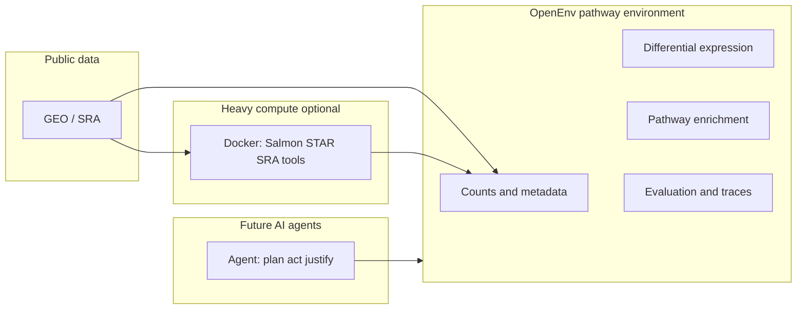

# OpenEnv & your pathway work — advisor meeting brief

**Audience:** you and your advisor as **molecular biology experts** with **limited coding background**.  
**Goal:** explain **what OpenEnv is**, **why it matters for biology**, **what you built that is new**, and **what becomes possible next** — from basics to a clear pitch.

---

## Part 1 — The basic idea (2–3 minutes)

### What is an “environment” in this sense?

Not a lab bench. A **computational workflow** treated like a **controlled world** a computer program (often an **AI agent**) can interact with:

- It has **inputs** (for example: a gene expression matrix and sample metadata).
- It has **actions** (for example: run differential expression, run pathway enrichment).
- It has **outputs** and **rules** (what counts as a valid step, what “success” means).

Think of it like a **flight simulator for analysis**: same type of task as real research, but **packaged** so it can be run, logged, and compared **many times**.

### What is OpenEnv (one sentence)?

**OpenEnv is a framework (from Meta / PyTorch OpenEnv) for building these computational environments so that AI systems can be trained and evaluated on real tasks — not on toy examples.**

### Why should a molecular biologist care?

1. **Modern biology is already computational.** RNA-seq, single-cell, spatial, proteomics — the bottleneck is often **robust, reproducible analysis**, not only wet lab design.

2. **AI is coming into every pipeline.** Tools will propose contrasts, filters, gene sets, and interpretations. We need to know **when they are right**, **when they drift**, and **how to compare models fairly**.

3. **Reproducibility and standards.** A public “environment” tied to **real data** (for example GEO studies) is a way to say: *here is the exact analysis setup; here is the benchmark; here is the score.*

---

## Part 2 — Build the picture slowly (5–7 minutes)

### The old way vs the “environment” way

| Traditional script | OpenEnv-style environment |
|--------------------|---------------------------|
| You run a notebook once | The same workflow is a **stable package** others can run |
| Hard to compare two AI tools fairly | Same **inputs, actions, scoring** for every competitor |
| “It worked on my laptop” | Clear **interfaces** (what is allowed, what is measured) |

You are **not** replacing biologists. You are building **infrastructure** so that **human judgment + machine assistance** can be tested on **realistic biology**.

### Two useful analogies

1. **Assay validation.** An ELISA has a protocol, controls, and acceptance criteria. An OpenEnv environment is similar: **protocol (steps), controls (data), criteria (metrics).**

2. **Animal models (very loose analogy).** A model organism is **simplified but structured** so you can ask repeatable questions. A computational environment is **simplified but structured** so you can ask repeatable **analysis** questions.

### What *your* pathway environment does (biology language)

Your **`pathway_analysis_env`** wraps a common post-genomics path:

1. **Gene-level data** (counts or appropriately formatted tables).
2. **Differential expression** (which genes change between conditions).
3. **Pathway / gene-set enrichment** (which programs or processes are enriched among those genes).

So the “world” is: *given this experiment’s numbers, what does a rigorous DE + pathway workflow look like, and how can an agent navigate it under rules?*

---

## Part 3 — Why OpenEnv matters (not just “another pipeline”) (3–4 minutes)

### 1. Training and evaluating **agents**, not only running one-off scripts

Many bioinformatics tools run **once**. OpenEnv is aimed at situations where a system must:

- **inspect** data,
- **choose** steps,
- **recover** from mistakes,
- **justify** choices,

…under **explicit constraints** (for example: no cheating by peeking at hidden answers).

That matches how **graduate students and postdocs** actually work — iterative, decision-heavy — and it is where **AI assistance** will matter most.

### 2. **Separation of concerns** (why non-coders should still care)

OpenEnv emphasizes boundaries such as:

- **Agents** interact through a defined interface (they do not “reach into” the server however they want).
- **Rewards / grading** live **inside** the environment (so benchmarks stay honest).

For biology: this is like **blinded scoring** and **pre-registered analysis plans** — structure that reduces **silent hacks** and **accidental p-hacking**.

### 3. **Public benchmarks tied to real biology**

You invested effort in **GEO-linked benchmark studies** (true counts, author tables, TPM limitations, SRA-based reconstruction). That is exactly the kind of **external anchor** reviewers and funders want: *not only synthetic data.*

---

## Part 4 — Your novel contribution (be precise and confident) (4–6 minutes)

Frame this as **three layers** of contribution. Adjust wording to match exactly what *you* personally implemented vs what you integrated.

### Layer A — A **real biology** environment inside OpenEnv

- A **pathway analysis** “world” that uses **real statistical tools** (for example **PyDESeq2-style** differential expression and **Enrichr-based** pathway enrichment), not toy arithmetic.
- A **user interface** (Gradio) so the workflow can be **demonstrated** and **inspected** without reading code.

**Pitch line:** *“I turned a standard RNA-seq → DE → pathway workflow into a reproducible OpenEnv environment so agents can be trained and tested on realistic molecular oncology-style questions.”*

### Layer B — **Rigorous external benchmarking** on GEO-style data

You went beyond a demo case by connecting to **public datasets** and documenting **what each study can and cannot support**:

- **True integer counts** when GEO provides them (strongest case).
- **Author-reported DE** when counts are missing (tests ingestion + enrichment, not refitting DE).
- **“Counts-like”** stress tests when only author-derived numeric columns exist (quantitative agreement metrics — clearly labeled as **approximate**, not FASTQ truth).
- **SRA → quantification → counts** where GEO only offers tracks or raw reads (harder, but the gold path for some questions).

**Pitch line:** *“I built a benchmark ladder that matches how messy real GEO submissions are — so we evaluate tools on what the field actually has, not only on curated matrices.”*

### Layer C — **Engineering for reliability** (what advisors respect even if they do not read code)

- **Dockerized** heavy RNA-seq tooling (Salmon / STAR / SRA tools) **separate** from the lightweight teaching UI — keeps day-to-day use practical.
- **Clear failure modes** and documentation so runs fail **understandably** (disk, locale, RAM, missing counts) instead of mysteriously.
- **Scripts** that reproduce “Study 1 … Study 5” style runs — that is **methods-grade** thinking.

**Pitch line:** *“I treated reproducibility and operator error as first-class problems, not afterthoughts.”*

---

## Part 5 — One diagram you can draw on a whiteboard

**What to say while drawing:**  
*“Public data feeds either directly into the environment or through an optional Docker ‘instrument room’ for raw reads. The environment exposes the same scientific steps we already publish in papers — but packaged so an agent can be trained and scored consistently.”*

---

## Part 6 — The pitch at its best (60–90 seconds)

You can read this almost verbatim:

> “OpenEnv is a framework for packaging real computational workflows so AI agents can be trained and evaluated the way we evaluate assays — with explicit protocols and scoring.  
>  
> My work focuses on a pathway-analysis environment grounded in RNA-seq differential expression and enrichment, using real tools rather than toy math.  
>  
> What I believe is new is the combination: a credible biological workflow **inside** OpenEnv, plus a **GEO-grounded benchmark ladder** that mirrors how messy public data actually are — from true counts to author tables to TPM-only limitations — with reproducible runners and Dockerized heavy steps.  
>  
> The reason this matters is that biology will increasingly rely on AI copilots for analysis. Without standardized environments and public benchmarks, we cannot tell which copilots are safe, which ones hallucinate pathways, and which ones only work on demo data.  
>  
> Next, I want to extend this approach to additional disease contexts, stricter ‘clinical reporting’ constraints for agents, and collaboration-style tasks — for example multi-omic integration or cohort-level summaries — still anchored in public data and transparent scoring.”

---

## Part 7 — What you can do **next** with this class of environment (2–3 minutes)

Pick 2–3 of these depending on your timeline and funding story.

### Near term (3–6 months)

1. **More GEO “study archetypes”** (counts vs author DE vs raw reads), each with a one-page **biological interpretation** + **failure taxonomy** (already aligned with how you think about failed experiments).

2. **Agent tasks that match lab meeting questions**  
   Examples: *“Given this contrast, is estrogen pathway enrichment plausible?”*; *“Which QC step should be checked first?”* — scored with **structured rubrics**, not vibes.

3. **Teaching / onboarding**  
   The same environment becomes a **safe sandbox** for students to break RNA-seq logic without breaking production pipelines.

### Medium term (6–18 months)

4. **Multi-step “paper reproduction” challenges**  
   Environment episodes that require **multiple evidence types** (DE + pathway + sanity checks on known genes like *ESR1*, *MKI67*, etc.).

5. **Human–AI collaboration metrics**  
   Not only “did the agent get the right pathway,” but **did it save expert time** and **did it flag uncertainty** appropriately (very fundable framing).

### Longer horizon

6. **Licensed / clinical-style synthetic cohorts** (if you move toward translation) — same OpenEnv pattern, stricter privacy constraints.

7. **Cross-environment curricula**  
   Pathway env + a separate “experimental design env” + a “literature retrieval env” — agents must **hand off** evidence across tasks (more realistic science).

---

## Part 8 — Anticipated advisor questions (short answers)

**“Is this just GEOparse + DESeq2?”**  
No. Those are **components**. The contribution is the **packaged, repeatable benchmark + agent interface** and the **honest handling of what GEO can support** per study.

**“Will AI replace bioinformaticians?”**  
Unlikely. It will **shift** the job toward **framing questions, choosing constraints, interpreting biology, and auditing models** — exactly why **benchmarked environments** matter.

**“What is the closest non-AI analogy?”**  
**Proficiency testing** for clinical labs, or **challenge studies** in methods journals — standardized tasks, public data, reported metrics.

**“What do you need to scale?”**  
Compute for large SRA studies, pinned software versions for long-term reproducibility, and (if applicable) co-advisors who care about **ML evaluation** or **cancer systems biology** for joint papers.

**“What is one risk you should acknowledge?”**  
Agents can **game** poorly designed rewards; benchmarks can **overfit**. Your GEO ladder and explicit disclaimers (counts-like vs true counts) are the scientifically mature response.

---

## Suggested slide order (12–15 slides)

1. Title — your name, date, one-line thesis  
2. Big picture — biology is computational; AI needs training grounds  
3. What is OpenEnv (simulator / assay analogy)  
4. What is *your* environment (RNA-seq → DE → pathways)  
5. Why packaging matters (reproducibility, fair comparison)  
6. Demo screenshot or workflow cartoon (optional)  
7. Benchmark philosophy — “ladder” not one-size-fits-all  
8. Study examples at high level (1 true counts, 2 author, 3 SRA, 4 merged counts, 5 TPM caveats) — **one slide, not five** unless they ask  
9. Your novel contribution — **three bullets** (real tools + GEO ladder + engineering)  
10. Results you can mention qualitatively (e.g. estrogen pathway face validity; correlation metrics where applicable)  
11. Limitations — honesty wins (replicates, TPM not counts, compute)  
12. Future directions — pick your top 3  
13. Ask — feedback on **which direction** is most compelling for a first paper or fellowship narrative  

---

## Closing tone

You are not selling “more code.” You are selling **scientific infrastructure**: a way to **evaluate intelligent analysis assistance** on **real molecular biology**, with **clear methods** and **public anchors**.

That is a **credible** advisor conversation.
