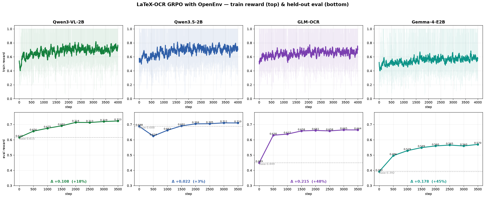

# Training a Vision Model to Read Math with GRPO + OpenEnv

A beginner-friendly tutorial that uses **GRPO (Group Relative Policy Optimization)** to teach a
**vision-language model** to transcribe images of math formulas into **LaTeX** — with the images
*and* the reward supplied by the [`latex_ocr_env`](../../envs/latex_ocr_env) OpenEnv environment.

## 🎯 What This Example Shows

- **OpenEnv as a reward source**: the environment serves each formula image (`reset`) and grades the
  model's LaTeX server-side (`step`) — no reward code to write yourself.
- **GRPO with TRL**: `GRPOTrainer` + `environment_factory`, LoRA adapters, on a single GPU.
- **Eval before & after**: score the model on the held-out `test` split (same reward used in
  training) to measure the actual improvement (the delta).
- **Live tracking**: reward/loss curves stream to a [Trackio](https://huggingface.co/blog/trackio)
  dashboard, embedded right in the notebook.
- **Ship it**: merge the LoRA adapter and push the trained model to the Hub.

## 📁 Files

- `grpo_latex_ocr_tutorial.ipynb` — the tutorial notebook (start here)
- `README.md` — this file

## 🚀 Quick Start

Open the notebook in Colab (badge above) and run top to bottom. A GPU is required — an **A100** is
recommended for the 4B model; drop to a 2B model or fewer generations on smaller GPUs.

The notebook is self-contained: it `pip install`s TRL and the environment package, so no local
checkout is needed. By default it connects to the **hosted** environment Space
([`AdithyaSK/latex-ocr-env`](https://huggingface.co/spaces/AdithyaSK/latex-ocr-env)); set
`USE_LOCAL_ENV = True` to run the environment locally instead.

## 🧩 The Environment

See [`envs/latex_ocr_env`](../../envs/latex_ocr_env) for the full environment: a dataset-backed,
single-step (bandit) RL task with a weighted, server-side reward (edit similarity, exact match,
structural validity, length/format). It ships `train` and `test` splits.

## 📈 Results

We ran this GRPO setup against the environment on four open vision-language models (colocated vLLM,
8 generations per prompt, held-out `test` reward scored every 500 steps — the same reward used in
training). All four **improve monotonically and stay stable**:

| Model | Base eval | Best eval | Δ (absolute) | Δ (relative) |
|---|---|---|---|---|
| **GLM-OCR** | 0.449 | 0.665 | **+0.215** | **+48%** |
| **Gemma-4-E2B** | 0.392 | 0.570 | +0.178 | +45% |
| **Qwen3-VL-2B** | 0.615 | **0.723** | +0.108 | +18% |
| **Qwen3.5-2B** | 0.688 | 0.711 | +0.022 | +3% |

*Reward is the environment's own score (0–1). The models with the most headroom (GLM-OCR, Gemma) see
the largest gains; Qwen3.5-2B already starts near the ceiling. Qwen3-VL-2B reaches the highest final
score with the cleanest curve. Numbers are for the hosted [`AdithyaSK/latex-ocr-env`](https://huggingface.co/spaces/AdithyaSK/latex-ocr-env)
environment; your exact deltas will vary with model, generations, and step budget.*
