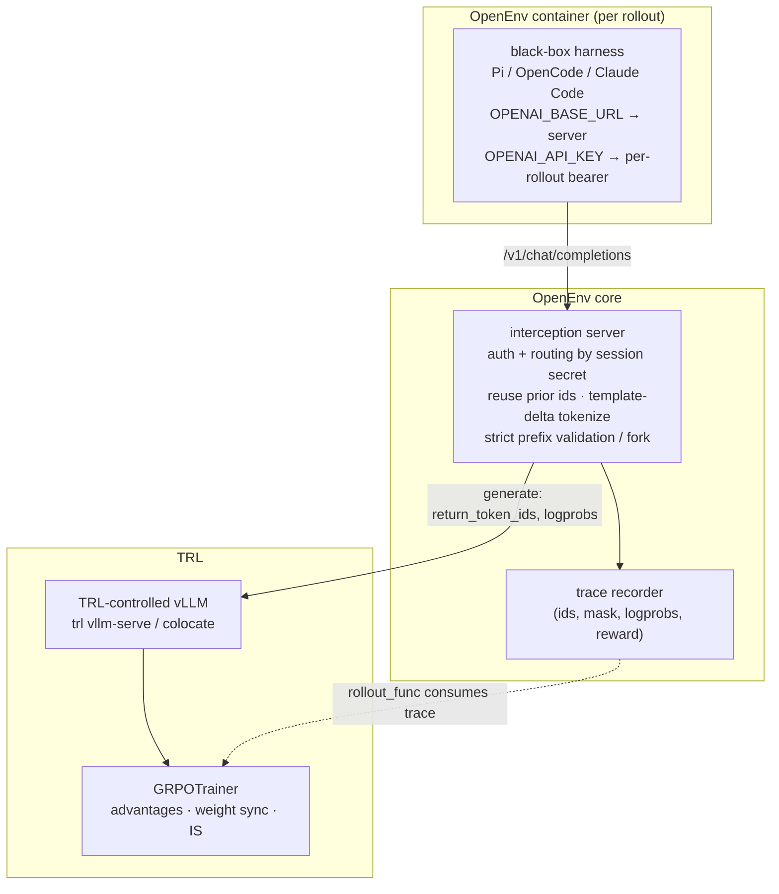
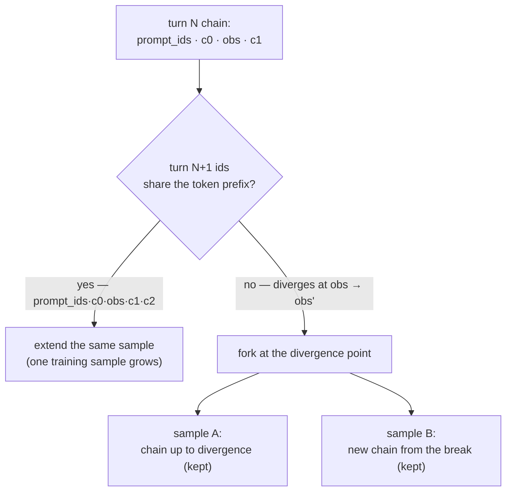
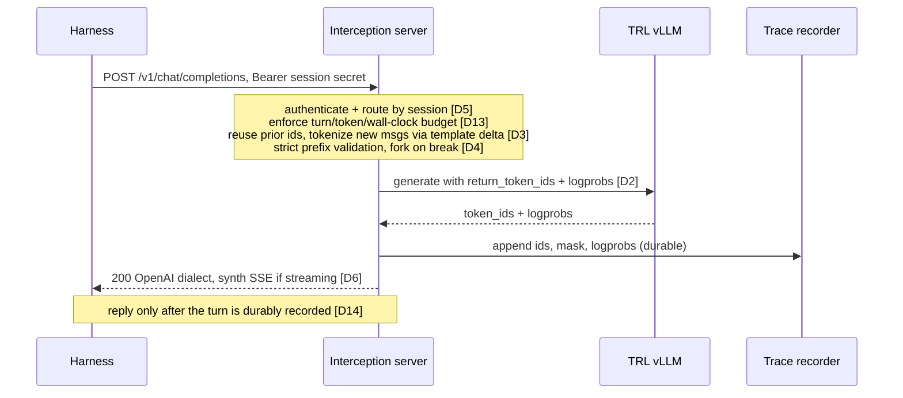

# RFC: Agentic RL through Harness Interception — token-faithful traces for TRL

**Status**: Draft
**Authors**: @rycerzes
**RFC ID**: 006

## Summary

This RFC defines how OpenEnv trains the policy driving a **black-box agent harness** (Pi, OpenCode, Claude Code, …) without modifying the harness. The harness issues LLM calls at an OpenAI-compatible HTTP boundary; OpenEnv hosts an **interception server** that fronts a trainer-controlled inference engine, generates with generation-time token IDs and logprobs, and records a **token-faithful trace** — `(prompt_ids, response_ids, loss_mask, response_logprobs, reward)` — per rollout. The trace is consumed by TRL through its `rollout_func` contract via `CLIHarnessAdapter.run_white_box`.

This turns RFC 005's `run_white_box` stub (currently `NotImplementedError`) into a real implementation. It is the **installed-agent** training path — the counterpart to the **external-agent** pattern that TRL's Harbor integration already covers, where installed CLI agents cannot be trained because the trainer does not own tokens/logprobs.

The design is validated against independent implementations of the same pattern — NVIDIA Polar/ProRL, Prime Intellect verifiers, AReaL, Agent Lightning, rLLM — which have independently converged on the same trace contract.

## Motivation

### Problem 1: RFC 005 left the training seam unbuilt

RFC 005 (Agentic Harness Integration) defined the wrapping pattern — a harness runs inside an OpenEnv container, MCP tools are injected, and in simulation mode the training loop retains episode control. But its white-box training seam, [`CLIHarnessAdapter.run_white_box`](../src/openenv/core/harness/__init__.py), raises `NotImplementedError`. There is no way today to get the token-level signal a trainer needs out of a black-box harness.

### Problem 2: the installed-agent training gap

TRL's [Harbor integration](https://huggingface.co/docs/trl/harbor) supports the *external-agent* pattern only: installed agents (Claude Code, Codex, Pi as opaque CLIs) **cannot** be trained through it because the trainer must own tokens and logprobs. Harbor's own RL docs name "vLLM interception" as the alternative token-capture strategy but ship no general implementation. This is the gap OpenEnv fills.

### Problem 3: the naive approaches silently corrupt training

Two failure modes are established in the literature and were present in the prior attempt ([#694](https://github.com/huggingface/OpenEnv/pull/694)/[#695](https://github.com/huggingface/OpenEnv/pull/695)):

- **Retokenization drift.** Re-rendering full message history through `apply_chat_template` each turn while splicing raw sampled tokens into the training stream makes the trained sequence differ from what the policy conditioned on. [vLLM added `return_token_ids`](https://blog.vllm.ai/2025/10/22/agent-lightning.html) specifically to end this debate.
- **Silent, KL-invisible collapse.** Infrastructure-level logprob mismatch alone collapses training *even fully on-policy*, and recomputed-logprob KL stays flat for ~700 steps while reward degrades ([TIM, arXiv:2605.14220](https://arxiv.org/abs/2605.14220)). Rollout-side logprobs recorded at generation time are therefore a required primitive, not hygiene.

### Goals

1. Turn `run_white_box` into a working seam feeding TRL's `rollout_func`.
2. Guarantee token fidelity as an OpenEnv-enforced property, not a hope about the trainer.
3. Keep a clean ownership boundary with TRL (below).
4. Front any trainer-controlled OpenAI-compatible engine; never relay to an external provider.

### Non-goals

- Owning generation, weight sync, advantages, or importance-sampling correction — those are TRL's.
- Per-model chat-template renderers (see Decision 3).
- The `swe_rl_env` task environment itself — a separate deliverable that works black-box without this seam.

## Design

### Ownership boundary

| Concern | Owner | Mechanism |
|---|---|---|
| Interception of the harness's LLM calls | **OpenEnv core** | interception server, session-ID-as-API-key auth |
| Token-faithful trace | **OpenEnv core** | trace recorder, TITO discipline, prefix-break forking |
| Reward / grading | **OpenEnv env** | `verify()` — tests run in sandbox, reward never leaves the env |
| Generation (inference engine) | **TRL** | `trl vllm-serve` / colocate; `return_token_ids`, logprobs at generation |
| Tokenizer / chat-template correctness | **TRL** | [`chat_template_utils`](https://github.com/huggingface/trl/blob/main/trl/chat_template_utils.py) |
| Weight sync | **TRL** | NCCL sync before each `rollout_func` call |
| Advantages, GRPO, IS correction | **TRL** | `GRPOTrainer` |
| Multi-turn loss masking | **OpenEnv emits, TRL consumes** | `env_mask` → `tool_mask` |
| Integration seam | **both** | TRL `rollout_func` via `run_white_box` + `build_harness_rollout_func` |

Interception living in framework core (not the trainer) is the field-consistent placement: verifiers/prime-rl run the trainer, the environment/orchestrator, and vLLM as disaggregated components; Agent Lightning's `LLMProxy`, rLLM's model gateway, Polar's `gateway/proxy.py`, and AReaL's `experimental/openai/proxy/` are all framework-side. Code ownership (OpenEnv core) is separate from runtime placement — the process may be colocated with the trainer for weight-sync fencing (Decision 12).

### Architecture overview



### Core abstractions

**The trace contract.** One sample per prefix-consistent chain:

```python
@dataclass
class HarnessTrace:
    prompt_ids: list[int]           # verbatim, generation-time
    response_ids: list[int]         # verbatim sampled completion IDs
    loss_mask: list[int]            # 1 = agent-generated, 0 = env/template output
    response_logprobs: list[float]  # rollout-engine logprobs, aligned to response_ids
    reward: float                   # from the env's verify(), never the harness
    metadata: dict                  # provenance (Decision 11), δ diagnostics (Decision 10),
                                    # stop condition (Decision 13), message-level record (Decision 15)
```

This is the shape Polar (`prompt_ids, response_ids, loss_mask, response_logprobs, reward`), Prime, and OpenEnv main's [`HarnessRolloutResult`](../src/openenv/core/harness/__init__.py) converged on, and what TRL's `rollout_func` consumes directly.

The three parallel arrays stay index-aligned; the mask gates both loss and advantage (D9), and every masked-in position carries a real logprob (D15). Columns are token positions in one turn:

| array | agent-generated | env output | agent-generated |
|---|---|---|---|
| `response_ids` | `c c c c c` | `o o o` | `c c` |
| `loss_mask` | `1 1 1 1 1` | `0 0 0` | `1 1` |
| `response_logprobs` | `lp lp lp lp lp` | `0. 0. 0.` | `lp lp` |

(mask `0` = env/template output only, D9; `0.0` logprob filler at mask=0, D15)

**The seam.** `CLIHarnessAdapter.run_white_box(...)` launches the harness against the interception server, drives one episode, and returns the assembled traces; [`build_harness_rollout_func`](../src/openenv/core/harness/__init__.py) adapts them to TRL's `rollout_func` (`prompt_ids`, `completion_ids`, `logprobs`, `env_reward`, `env_mask`).

### Key design decisions

**D1 — Token-level trace contract, not a message-level seam.** Return `(prompt_ids, response_ids, loss_mask, response_logprobs, reward)` per sample. *Rationale:* token fidelity becomes an enforced guarantee; TRL consumes it directly. *Trade-off:* richer than a message log, but the message record is kept alongside (D15). Supersedes draft [#864](https://github.com/huggingface/OpenEnv/pull/864)'s message-level design.

**D2 — Trainer owns generation; the proxy re-generates, never relays.** The harness is black-box; the interception server fronts a trainer-controlled vLLM with `return_token_ids` and logprobs at generation time. *Rationale:* a relay to an external provider has no token identity, uses the provider's logprobs, and forces retokenization for training — it cannot even *measure* the δ diagnostic (D10). *Trade-off:* requires a trainer-controlled engine; that is the point.

**D3 — TITO discipline via TRL's `chat_template_utils`, no per-model renderers.** Keep a token-ID buffer; append sampled completion IDs verbatim; tokenize tool/user results once via a chat-template dummy-diff delta; gate on the [`is_chat_template_prefix_preserving`](https://github.com/huggingface/trl/blob/main/trl/chat_template_utils.py) property test. *Rationale:* [TITO](https://huggingface.co/spaces/qgallouedec/tito) is HF-house doctrine and TRL is the trainer; 18/19 templates pass, one Qwen3 fix. *Trade-off:* PrimeIntellect [renderers](https://www.primeintellect.ai/blog/renderers) are the maximalist alternative (per-model objects) — rejected for the ~3× re-render compute and because the same invariant holds with the buffer. Copy verifiers' skip-condition guardrails (multimodal, non-`[tool*, user?]` tail → controlled full re-render + fork).

**D4 — Prefix-break forking.** Strict token-prefix validation before extending a chain; a break starts a new training sample; never splice heuristically. *Rationale:* Polar observed per-request + outcome-reward broadcast caused "significant reward hacking" and 20.4% vs 87.7% GPU utilization; prefix-merged chains win. Fork like [verifiers](https://github.com/PrimeIntellect-ai/verifiers) (commit forks a branch at first divergence, both sides kept) — not Polar's mid-chain truncation, which silently drops the captured suffix.



Compaction and sub-agent calls fork naturally; never splice across the break.

**D5 — Session-ID-as-API-key.** A random per-rollout bearer token is both auth and routing; every endpoint authenticated, including exit. *Rationale:* fixes #694's shared-secret + unauthenticated `/exit` hole. Strict verifiers model (unknown key → 401) — not Polar's permissive variant, where an unknown key silently mints an orphan session and admin endpoints are open.

**D6 — Synthetic SSE replay.** For a non-streaming upstream call, synthesize the SSE stream if the harness streams (which CLI agents do by default). *Rationale:* accepted practice, confirmed in Polar's code.

**D7 — Rewards inside the env; TRL keeps IS correction.** Reward comes from the env's `verify()`; weight sync, advantages, and IS correction stay in TRL via `rollout_func` + `env_mask`. Keep truncated IS on even with captured logprobs — Polar itself trains with TIS enabled (paper Table 4); captured logprobs *enable* the correction, they don't replace it.

**D8 — Reconcile with RFC 005, don't parallel it.** The trainer-side generate hook is `ModelStep`; `CLIHarnessAdapter.run_white_box` goes from `NotImplementedError` to the real implementation feeding `build_harness_rollout_func`.

**D9 — Loss-mask invariant.** Mask environment-*output* tokens only; never mask agent-*generated* tokens (including inspection commands). *Rationale:* supervising observation generation is where much of the signal lives ([arXiv:2606.03461](https://arxiv.org/abs/2606.03461)); the mask must gate advantage estimation too, not just the loss (SAO, [arXiv:2607.07508](https://arxiv.org/abs/2607.07508)).

**D10 — δ diagnostics as a standard trace metric.** Per-token δ = |log π_train − log π_rollout| (max and mean). *Rationale:* KL alone misses early collapse (TIM). Trace stays algorithm-agnostic: `(ids, mask, logprobs, reward)` also serves value-based methods.

**D11 — Provenance in traces.** Record sampling params, engine/kernel versions, agent-harness version, and **hashes of the agent's config files** per intercepted call. *Rationale:* a sandboxed agent can rewrite its own prompts mid-episode ([arXiv:2607.03935](https://arxiv.org/abs/2607.03935)) and the reported score is always model-plus-harness ([arXiv:2605.26112](https://arxiv.org/abs/2605.26112)). Neither Polar nor verifiers hashes config files — this and D10 are where this design is ahead of both.

Operational requirements both reference implementations handle that v1 must too:

**D12 — Weight-sync fencing.** Pause/drain in-flight generations before each policy update (Polar's `/admin/inference/pause` gate); otherwise one trace mixes policy versions. Implicit with TRL colocate; explicit with `trl vllm-serve`.

**D13 — Proxy-enforced rollout budgets.** Check max turns / tokens / wall-clock *before* serving each turn, recording the cap on the trace as its stop condition (verifiers `RolloutLimits`) — a black-box harness never stops on its own.

**D14 — Error relay semantics.** Map engine failures to status codes the agent SDK handles (retry 5xx/429, fail fast on 4xx); stash the original error so the rollout reports the real cause. Never emit the terminal SSE / `[DONE]` until the turn is durably recorded (verifiers defers it until `commit()` succeeds).

**D15 — Trace hygiene.** Keep the message-level record alongside token IDs (debugging/SFT); logprob arrays same-length-aligned to `response_ids` with `0.0` filler at mask=0 positions, plus a validation that every mask=1 slot has a real logprob; one server multiplexes many rollouts keyed by session secret.

### Request lifecycle

The harness launches with `OPENAI_BASE_URL` → interception server and a per-rollout bearer token as API key (D5). One intercepted call:



Per call: reuse the session's prior `prompt_ids + completion_ids` verbatim, tokenize only new messages via the chat-template dummy-diff delta (D3); strict token-prefix validation — a break forks a new sample (D4); generate on the trainer-controlled vLLM with `return_token_ids` + logprobs (D2); reply in OpenAI dialect, synthesizing SSE if the harness streams (D6); append to the trace.

### Reconciliation with RFC 005

RFC 005 owns the wrapping pattern, MCP injection, session isolation, and episode control. This RFC only fills its white-box seam and adds the interception server + trace recorder to core. `ModelStep` is the generate hook; `run_white_box` is the entry point; `build_harness_rollout_func` is the TRL bridge. No RFC 005 abstraction is rewritten.

## Examples

A thin TRL `rollout_func` wiring (lives in `examples/`, never as infrastructure in `envs/`):

```python
from openenv.core.harness import CLIHarnessAdapter, build_harness_rollout_func

adapter = CLIHarnessAdapter(spec=swe_rl_agent_spec)      # black-box harness spec
rollout_func = build_harness_rollout_func(adapter)       # → TRL contract

trainer = GRPOTrainer(
    model=policy,
    rollout_func=rollout_func,   # returns prompt_ids, completion_ids, logprobs, env_reward, env_mask
    ...,                         # TRL owns vLLM (return_token_ids), weight sync, advantages, IS
)
trainer.train()
```

Property tests runnable without GPUs: prefix preservation (D3), round-trip tokenization, break detection (D4), logprob alignment (D15), auth rejection (D5).

## References

### OpenEnv seams and prior art
- RFC 005 — Agentic Harness Integration: [`rfcs/005-agentic-harnesses.md`](./005-agentic-harnesses.md); runtime in [`src/openenv/core/harness/__init__.py`](../src/openenv/core/harness/__init__.py) (`ModelStep`, `run_white_box` stub, `build_harness_rollout_func`), landed via [#652](https://github.com/huggingface/OpenEnv/pull/652)/[#903](https://github.com/huggingface/OpenEnv/pull/903)
- PR [#694](https://github.com/huggingface/OpenEnv/pull/694) / [#695](https://github.com/huggingface/OpenEnv/pull/695) — prior attempt (closed, being re-landed as a stack)
- PR [#864](https://github.com/huggingface/OpenEnv/pull/864) — minimal message-level contract (superseded by D1)

### Reference implementations of the interception pattern
- **Polar / ProRL-Agent-Server** (NVIDIA NeMo, Apache-2.0): [github.com/NVIDIA-NeMo/ProRL-Agent-Server](https://github.com/NVIDIA-NeMo/ProRL-Agent-Server) · Polar paper [arXiv:2605.24220](https://arxiv.org/abs/2605.24220) · ProRL Agent [arXiv:2603.18815](https://arxiv.org/abs/2603.18815). Key files: `gateway/proxy.py`, `trajectory/builder/prefix_merging.py`, `agent/presets/{pi,claude_code}.py`
- **verifiers** (Prime Intellect): [github.com/PrimeIntellect-ai/verifiers](https://github.com/PrimeIntellect-ai/verifiers) (`v1/interception/server.py`, `clients/train.py`, `graph.py`) · trainer: [prime-rl](https://github.com/PrimeIntellect-ai/prime-rl)
- **AReaL** (inclusionAI): [github.com/inclusionAI/AReaL](https://github.com/inclusionAI/AReaL) · [arXiv:2505.24298](https://arxiv.org/abs/2505.24298) · AReaL2.0 position paper [arXiv:2607.01120](https://arxiv.org/abs/2607.01120)
- **Agent Lightning** (Microsoft): [arXiv:2508.03680](https://arxiv.org/abs/2508.03680) · [LLM Proxy docs](https://microsoft.github.io/agent-lightning/latest/deep-dive/serving-llm/)
- **rLLM** (Agentica): [rllm-project.readthedocs.io](https://rllm-project.readthedocs.io/en/stable/core-concepts/sdk/)
- **SkyRL** (NovaSky): [github.com/NovaSky-AI/SkyRL](https://github.com/NovaSky-AI/SkyRL) · [arXiv:2511.16108](https://arxiv.org/abs/2511.16108)

### Token fidelity (TITO / retokenization drift)
- **TITO** (Q. Gallouédec, TRL): [huggingface.co/spaces/qgallouedec/tito](https://huggingface.co/spaces/qgallouedec/tito)
- TRL productionization: [`trl/chat_template_utils.py`](https://github.com/huggingface/trl/blob/main/trl/chat_template_utils.py) · chat-template audit [trl#5460](https://github.com/huggingface/trl/issues/5460) · rollout decoupling [trl#5121](https://github.com/huggingface/trl/issues/5121)
- **vLLM `return_token_ids` blog**: [blog.vllm.ai/2025/10/22/agent-lightning.html](https://blog.vllm.ai/2025/10/22/agent-lightning.html)
- **PrimeIntellect renderers**: [github.com/PrimeIntellect-ai/renderers](https://github.com/PrimeIntellect-ai/renderers) · [blog](https://www.primeintellect.ai/blog/renderers)
- LMSYS "No Token Left Behind": [lmsys.org/blog/2026-05-13-no-token-left-behind](https://www.lmsys.org/blog/2026-05-13-no-token-left-behind/)
- Numeric mismatch fixes: [verl#2953](https://github.com/verl-project/verl/pull/2953) · [trl#4159](https://github.com/huggingface/trl/issues/4159)

### TRL integration surface
- OpenEnv integration doc: [huggingface.co/docs/trl/main/openenv](https://huggingface.co/docs/trl/main/openenv)
- `rollout_func` + `env_mask`→`tool_mask`: [`trl/trainer/grpo_trainer.py`](https://github.com/huggingface/trl/blob/main/trl/trainer/grpo_trainer.py)
- vLLM server mode (token IDs, NCCL weight sync): [`trl/scripts/vllm_serve.py`](https://github.com/huggingface/trl/blob/main/trl/scripts/vllm_serve.py)
- Harbor integration (external-agent pattern only): [huggingface.co/docs/trl/harbor](https://huggingface.co/docs/trl/harbor)

### Recent literature
- TIM — training/inference mismatch, KL-invisible collapse: [arXiv:2605.14220](https://arxiv.org/abs/2605.14220)
- SAO — single-rollout async, double-sided token-level clipping: [arXiv:2607.07508](https://arxiv.org/abs/2607.07508)
- Loss-mask invariant: [arXiv:2606.03461](https://arxiv.org/abs/2606.03461)
- Rollout survey (Generate–Filter–Control–Replay): [arXiv:2605.02913](https://arxiv.org/abs/2605.02913)
- Model-plus-harness confound: [arXiv:2605.26112](https://arxiv.org/abs/2605.26112)
- HASE — co-evolving harness, immutable-oracle reward: [arXiv:2607.03935](https://arxiv.org/abs/2607.03935)
- Agentic Monte Carlo — test-time SMC alternative: [arXiv:2606.05296](https://arxiv.org/abs/2606.05296)
