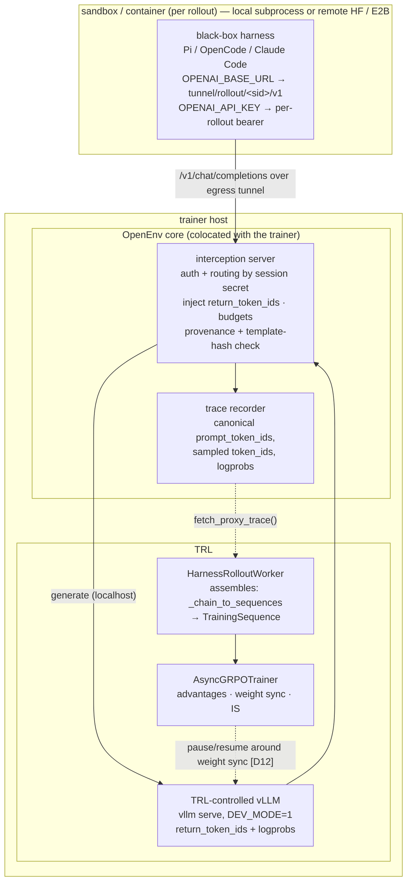
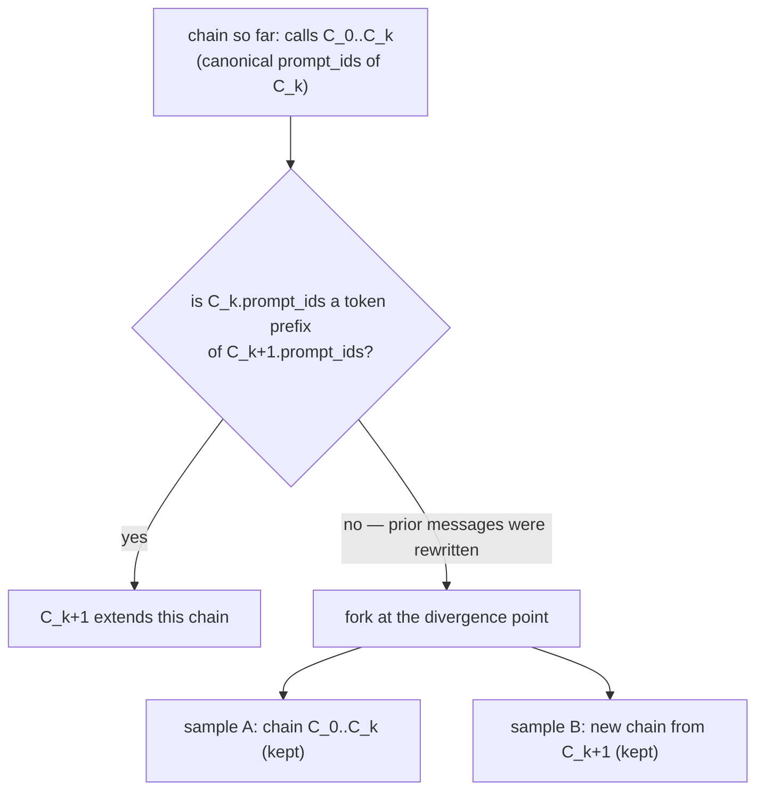

# RFC: Agentic RL through Harness Interception — token-faithful traces for TRL

**Status**: Draft
**Created**: 2026-07-11
**Authors**: @rycerzes, @sergiopaniego
**RFC ID**: 006

## Summary

This RFC defines how OpenEnv trains the policy driving a **black-box agent harness** (Pi, OpenCode, Claude Code, …) without modifying the harness. The harness issues LLM calls at an OpenAI-compatible HTTP boundary; OpenEnv hosts an **interception server** that fronts a trainer-controlled inference engine and records, per call, the engine's **canonical token IDs** — `prompt_token_ids` and sampled `token_ids` — with their generation-time logprobs. That recording is sufficient to assemble a token-faithful training sample `(prompt_ids, response_ids, loss_mask, response_logprobs, reward)` with no re-tokenization anywhere, which is the property this design exists to guarantee.

OpenEnv is a **recorder, not an assembler**: it keeps no token buffer, imports no tokenizer, and renders no chat template. Sample assembly belongs to the consuming trainer — the split every reference implementation of this pattern uses (see [Cross-framework evidence](#cross-framework-evidence-where-assembly-happens)).

The trace is consumed by TRL through the **loop-owning path of `AsyncGRPOTrainer`**: a `HarnessRolloutWorker` ([trl#6420](https://github.com/huggingface/trl/pull/6420), merged) drives an OpenEnv `ResourceSessionFactory`, reads the recorded trace, and reconciles it into training rows. This is the **installed-agent** training path — the counterpart to the **external-agent** pattern that TRL's Harbor integration already covers, where installed CLI agents cannot be trained because the trainer does not own tokens/logprobs.

The same worker also supports the **white-box** path (`harness_adapter=...` → `HarnessAdapter.run_white_box` with TRL sampling each turn through `ModelStep`), so RFC 005's `run_white_box` seam stays live; it is the secondary mode. `GRPOTrainer.rollout_func` / `build_harness_rollout_func` remain a valid synchronous bridge but are **not** the path this RFC targets.

The design is checked against independent implementations of the same pattern — NVIDIA Polar/ProRL, Prime Intellect verifiers, TRL itself, plus AReaL, Agent Lightning and rLLM — which converged on the same trace contract and, on inspection, on the same recorder/assembler split.

## Motivation

### Problem 1: OpenEnv has no interception server, so token capture is per-env and in-sandbox

RFC 005 (Agentic Harness Integration) defined the wrapping pattern — a harness runs inside an OpenEnv container, MCP tools are injected, and in simulation mode the training loop retains episode control. Two gaps remain in core:

- [`CLIHarnessAdapter.run_white_box`](../src/openenv/core/harness/__init__.py) raises `NotImplementedError`, so opaque CLI harnesses have no white-box seam at all.
- The only working token capture today is a **per-env, in-sandbox proxy**: [`envs/opencode_env/sandbox/interception.py`](../envs/opencode_env/sandbox/interception.py) forwards `/v1/chat/completions` upstream with `logprobs=true` injected and writes JSON-lines `TurnRecord`s inside the sandbox, which the trainer reads back after the rollout. It works (validated end to end on E2B and HF sandboxes, [#998](https://github.com/huggingface/OpenEnv/pull/998)) but it is one env's private code, it records no prompt token IDs, and the recorder lives on the wrong side of the trust and weight-sync boundary (see [Interception topology](#interception-topology-local-and-remote-sandboxes)).

Neither is a reusable core primitive. This RFC promotes interception + recording into `openenv.core` and defines what it must guarantee.

### Problem 2: the installed-agent training gap

TRL's [Harbor integration](https://huggingface.co/docs/trl/harbor) supports the *external-agent* pattern only: installed agents (Claude Code, Codex, Pi as opaque CLIs) **cannot** be trained through it because the trainer must own tokens and logprobs. Harbor's own RL docs name "vLLM interception" as the alternative token-capture strategy but ship no general implementation. This is the gap OpenEnv fills.

### Problem 3: the naive approaches silently corrupt training

Two failure modes are established in the literature and were present in the prior attempt ([#694](https://github.com/huggingface/OpenEnv/pull/694)/[#695](https://github.com/huggingface/OpenEnv/pull/695), both closed):

- **Retokenization drift.** Re-rendering full message history through `apply_chat_template` each turn while splicing raw sampled tokens into the training stream makes the trained sequence differ from what the policy conditioned on. [vLLM added `return_token_ids`](https://blog.vllm.ai/2025/10/22/agent-lightning.html) specifically to end this debate.
- **Silent, KL-invisible collapse.** Infrastructure-level logprob mismatch alone collapses training *even fully on-policy*, and recomputed-logprob KL stays flat for ~700 steps while reward degrades ([TIM, arXiv:2605.14220](https://arxiv.org/abs/2605.14220)). Rollout-side logprobs recorded at generation time are therefore a required primitive, not hygiene.

### Goals

1. Give `AsyncGRPOTrainer`'s loop-owning path (`HarnessRolloutWorker`) a core interception server and trace recorder to consume, replacing the per-env in-sandbox proxy.
2. Guarantee token fidelity as an OpenEnv-enforced property, not a hope about the trainer: record generation-time prompt **and** completion IDs so no reconstruction step is needed downstream.
3. Keep a clean ownership boundary with TRL (below), and keep `openenv.core` free of both trainer imports and a tokenizer dependency.
4. Front any trainer-controlled OpenAI-compatible engine; never relay to an external provider.
5. Work unchanged for local-subprocess and network-isolated remote sandboxes (HF Sandbox, E2B).
6. Turn `run_white_box` into a working seam for opaque CLI harnesses (secondary mode).

### Non-goals

- Owning generation, weight sync, advantages, or importance-sampling correction — those are TRL's.
- Owning training-row assembly, turn-selection policy, or reward shaping — TRL's `_chain_to_sequences` and its `rollout_reward_fn`/`train_turn_fn`/`agent_turn_fn` hooks (D17).
- Per-model chat-template renderers (see Decision 3).
- The `swe_rl_env` task environment itself — a separate deliverable that works black-box without this seam.

## Design

### Ownership boundary

| Concern | Owner | Mechanism |
|---|---|---|
| Interception of the harness's LLM calls | **OpenEnv core** | interception server, session-ID-as-API-key auth (D5) |
| Token-faithful recording | **OpenEnv core** | `return_token_ids` injection; canonical `prompt_token_ids` + sampled ids + logprobs per call (D3) |
| Served-template == training-template invariant | **OpenEnv core** | template hash in provenance, fail loudly on mismatch (D3, D11) |
| Token buffer / chain assembly | **TRL** | `_chain_to_sequences`; OpenEnv keeps no buffer (D3, D4) |
| Trace record shape | **OpenEnv core** | `TraceEntry` / `HarnessTrace`, exported for any trainer (D16) |
| Exposing the server to a remote sandbox | **OpenEnv core** | egress tunnel + per-rollout base URL (D18) |
| Reward / grading | **OpenEnv env** | `verify()` — tests run in sandbox, reward never leaves the env |
| Generation (inference engine) | **TRL** | `vllm serve` in `VLLM_SERVER_DEV_MODE=1`; `return_token_ids`, logprobs at generation |
| Chat-template *authoring* correctness | **TRL / transformers** | [`chat_template_utils`](https://github.com/huggingface/trl/blob/main/trl/chat_template_utils.py), template audits |
| Weight sync + its fence | **TRL** | NCCL transfer bracketed by `WeightTransferClient.pause()` / `.resume()` (D12) |
| Advantages, GRPO, IS correction | **TRL** | `AsyncGRPOTrainer` |
| Training-row assembly from the trace | **TRL** | `_chain_to_sequences` → `TrainingSequence(input_ids, completion_mask, old_log_probs)` |
| Turn selection / reward shaping policy | **TRL caller** | `agent_turn_fn`, `train_turn_fn`, `rollout_reward_fn` (D17) |
| Integration seam | **both** | `AsyncGRPOTrainer(rollout_worker=HarnessRolloutWorker(...))` |

Interception living in framework core (not the trainer) is the field-consistent placement: verifiers/prime-rl run the trainer, the environment/orchestrator, and vLLM as disaggregated components; Agent Lightning's `LLMProxy`, rLLM's model gateway, Polar's `gateway/proxy.py`, and AReaL's `experimental/openai/proxy/` are all framework-side. Code ownership (OpenEnv core) is separate from runtime placement — the server process is colocated with the trainer so weight-sync fencing stays a local call (D12, D18).

The boundary is drawn to keep OpenEnv a **recorder, not an assembler**: it owns what can only be observed at the interception point (canonical ids, auth, budgets, provenance, fencing) and owns none of the tokenization or row-building. See D3 and the evidence below.

### Cross-framework evidence: where assembly happens

Three independent implementations of harness interception have shipped. Reading their source, they agree on the recorder/assembler split and differ only on who renders messages into tokens:

| | Who renders messages → tokens | Where ids come from | Where samples are assembled | How divergence is detected |
|---|---|---|---|---|
| **Polar** | the **engine** (harness posts OpenAI chat) | gateway injects `return_token_ids` (vLLM) / `return_prompt_token_ids` (SGLang), normalizes to canonical `prompt_token_ids` + `token_ids` + logprobs | **post-hoc** — `PrefixMergingBuilder.build(session)` over the finished session | canonical prompt-prefix test; break → truncate |
| **verifiers** | the **train client** (HF chat template, then `/inference/v1/generate`) | engine returns `prompt_ids` / `completion_ids` / `completion_logprobs` into `TurnTokens` | **post-hoc** — `graph.py` `_commit_turn` / `prepare_turn`; the interception server only does retry dedup and in-flight coalescing | message **content hash** matching; commits a new branch at first divergence |
| **TRL** | the **rollout worker** (`apply_chat_template`, then `/v1/completions` with `"prompt": prompt_ids`) | `return_token_ids: True`; reads `choice["token_ids"]` + `token_logprobs` | **post-hoc** — `_chain_to_sequences` / `_SampleBuilder` | token-prefix drift classified `CLEAN` / `REALIGN` / `FORK` |

Two conclusions. First, **no implementation keeps a live token buffer in the proxy** — recording and assembly are separate stages everywhere. Second, only Polar's rendering topology matches ours: a black-box harness posts OpenAI-dialect messages, so the engine renders and the proxy can only observe. verifiers and TRL both render client-side because they own the message list, which a black-box harness does not give us. Polar is therefore the applicable precedent, and its canonical-id recording plus post-hoc merging is what D3 adopts.

### Architecture overview



Only the base-URL host differs between the local and remote cases; nothing OpenEnv writes runs inside the sandbox.

### Core abstractions

Two record shapes, at two levels.

**Per intercepted call — `TraceEntry`.** What the recorder writes, one entry per LLM call. This shape exists today, split across [`envs/opencode_env/sandbox/interception.py`](../envs/opencode_env/sandbox/interception.py) (`TurnRecord`, the writer) and TRL's `openenv_harness.py` (`TraceEntry`, the reader, carrying a `TODO(@openenv)` that OpenEnv should own it). This RFC moves it to `openenv.core.harness` as the single definition and adds the fields marked **new**:

```python
class TraceEntry(TypedDict, total=False):
    request: dict                    # forwarded chat body: {"messages": [...], "tools": [...] | None}
    response: dict                   # upstream reply: {"choices": [{"message": {...}}]}
    prompt_token_ids: list[int]      # NEW — generation-time prompt ids from the engine
    completion_token_ids: list[int]  # verbatim sampled completion ids
    completion_tokens: list[str]     # fallback "token_id:{id}" strings when ids are absent
    per_token_logps: list[float]     # rollout-engine logprobs for the generated tokens
    call_kind: str                   # NEW — "agent" | "aux" (D17)
    provenance: dict                 # NEW — sampling params, engine/harness versions, config hashes (D11)
    limits: dict                     # NEW — budget state and stop condition when capped (D13)
```

`prompt_token_ids` is the load-bearing addition: with it, no consumer needs `apply_chat_template` to recover what the policy conditioned on, and interstitial tokens are recoverable by slicing the next call's canonical prompt after the end-of-turn token (D3). **This is the only shape OpenEnv produces.**

**Per training sample — `HarnessTrace`.** One sample per prefix-consistent chain. OpenEnv does **not** build this; the consumer does (TRL's `_chain_to_sequences`, Polar's `PrefixMergingBuilder`). It is specified here as the target the recording must be sufficient for — if a trainer cannot construct this from a stream of `TraceEntry`s, the recorder is missing something:

```python
@dataclass
class HarnessTrace:
    prompt_ids: list[int]           # verbatim, generation-time
    response_ids: list[int]         # verbatim sampled completion IDs
    loss_mask: list[int]            # 1 = agent-generated, 0 = env/template output
    response_logprobs: list[float]  # rollout-engine logprobs, aligned to response_ids
    reward: float                   # from the env's verify(), never the harness
    metadata: dict                  # provenance (D11), δ diagnostics (D10),
                                    # stop condition (D13), message-level record (D15)
```

This is the shape Polar and Prime converged on. Polar's `Trace` is `prompt_ids, response_ids, loss_mask, prompt_messages, response_messages, tools, finish_reason, response_logprobs, reward, metadata`, with model validators asserting `len(loss_mask) == len(response_ids)` and `len(response_logprobs) == len(response_ids)` — independent confirmation of both the shape and D15's alignment check. It maps 1:1 onto TRL's `TrainingSequence(input_ids, completion_mask, old_log_probs, rollout_id)` plus the reward, and onto verifiers' per-message `MessageNode(token_ids, mask, logprobs, is_content)`.

It is **not** what OpenEnv core has today: [`HarnessRolloutResult`](../src/openenv/core/harness/__init__.py) carries `prompt_ids`, `completion_ids`, and `logprobs` only — no `loss_mask`, no `reward` (reward is resolved separately by `_resolve_env_reward` from `verify()`). Whether `HarnessRolloutResult` should grow toward this shape is path-dependent: on the white-box path OpenEnv does assemble per-turn records, so a `loss_mask` there is coherent; on the loop-owning path it should not, since assembly is the consumer's. Either way these are proposed changes, not descriptions of current state.

The three parallel arrays stay index-aligned; the mask gates both loss and advantage (D9), and every masked-in position carries a real logprob (D15). Columns are token positions in one turn:

| array | agent-generated | env output | agent-generated |
|---|---|---|---|
| `response_ids` | `c c c c c` | `o o o` | `c c` |
| `loss_mask` | `1 1 1 1 1` | `0 0 0` | `1 1` |
| `response_logprobs` | `lp lp lp lp lp` | `0. 0. 0.` | `lp lp` |

(mask `0` = env/template output only, D9; `0.0` logprob filler at mask=0, D15)

**The seam.** Primary path (loop-owning): the env's session factory starts the harness pointed at the interception server; TRL's `HarnessRolloutWorker` blocks on `wait_for_completion()`, reads `fetch_proxy_trace()`, and reconciles the entries into `TrainingSequence` rows. These two methods are the *loop-owning session* extension to `ResourceSession` — currently declared as a `LoopOwningSession` Protocol inside TRL with a `TODO(@openenv)`; this RFC moves it to `openenv.core.harness` (D16).

Secondary path (white-box): `HarnessAdapter.run_white_box(model_step, session, limits)` drives the tool loop while TRL samples each turn via `ModelStep`; `CLIHarnessAdapter.run_white_box` goes from `NotImplementedError` to a real implementation for opaque CLI harnesses.

Synchronous bridge (unchanged, not this RFC's target): [`build_harness_rollout_func`](../src/openenv/core/harness/__init__.py) returns `prompt_ids`, `completion_ids`, `logprobs`, `env_reward` (key configurable via `reward_key`), and `verify_metrics`. It emits **no** mask field today; adding `env_mask` alongside `loss_mask` support is a proposed follow-up, not current behavior.

### Key design decisions

**D1 — Token-level trace contract, not a message-level seam.** Return `(prompt_ids, response_ids, loss_mask, response_logprobs, reward)` per sample. *Rationale:* token fidelity becomes an enforced guarantee; TRL's reconciler consumes it directly. *Trade-off:* richer than a message log, but the message record is kept alongside (D15). Supersedes draft [#864](https://github.com/huggingface/OpenEnv/pull/864)'s message-level `RolloutMessages` design — the two seams there (`generate(rollout_id, turn, …) -> completion_text` plus a message log) put messages-to-tokens on the trainer with no ids crossing the boundary; the merged worker instead reads ids from the trace, which is this contract.

**D2 — Trainer owns generation; the proxy re-generates, never relays.** The harness is black-box; the interception server fronts a trainer-controlled vLLM with `return_token_ids` and logprobs at generation time. *Rationale:* a relay to an external provider has no token identity, uses the provider's logprobs, and forces retokenization for training — it cannot even *measure* the δ diagnostic (D10). *Trade-off:* requires a trainer-controlled engine; that is the point.

**D3 — OpenEnv records canonical ids and never tokenizes; assembly stays framework-side.** The interception server injects `return_token_ids` into every forwarded call and records what the engine reports: canonical `prompt_token_ids` (the input ids *after* the engine's chat-template processing), the sampled `token_ids`, and their real logprobs. It keeps **no token buffer**, imports no tokenizer, and renders no chat template. Assembling those records into training rows is the consumer's job — TRL's `_chain_to_sequences`, Polar's `PrefixMergingBuilder`, verifiers' graph commit.

*Rationale.* Every reference implementation records at the boundary and assembles **post-hoc**; none keeps a live token buffer in the proxy ([Cross-framework evidence](#cross-framework-evidence-where-assembly-happens)). Three properties make that the right split here too:

1. **No tokenizer is needed at all.** Interstitial tokens (tool results, chat-template glue, intermediate user turns) are recoverable by slicing the *next* call's canonical `prompt_ids` after the first end-of-turn token, with assistant bodies taken from the raw sampled `response_ids` — so nothing is ever decoded and re-encoded. This is what Polar's builder does; the only configuration it needs is the EOT token id, auto-detectable from the last token of the first natural-stop completion. A recorder that ships canonical ids therefore needs no chat-template delta machinery of any kind.
2. **A rendering buffer in core would need `transformers`, which core's dependency policy reserves.** `pyproject.toml` is explicit: core carries a minimal dependency set and *"heavy dependencies (torch, numpy, smolagents, etc.) should be in individual environment pyproject.toml files."* Core has no tokenizer today, and every env would inherit one.
3. **The delta-tokenize machinery is not reusable at any placement.** TRL's is `GRPOTrainer._get_tool_suffix_ids`, a private *method* bound to `self.processing_class` / `self.chat_template` / `self._is_vlm`, carrying template-specific fixes (Qwen3/Qwen3.5 `<|im_end|>\n` EOS-boundary alignment, GPT-OSS deriving tool headers from the assistant's tool-call name, VLM unbatching, a `transformers#45290` workaround). Any OpenEnv-side buffer would have to reimplement that knowledge and track it indefinitely. Recording canonical ids avoids needing it.

A note on the obvious alternative, since it is *not* blocked by dependency concerns: `trl.chat_template_utils` is a public TRL module (`_import_structure` exports `add_response_schema`, `clone_chat_template`, `get_training_chat_template`, `supports_tool_calling`) depending only on `transformers`/`jinja2`/`packaging`, so importing it pulls in no training stack. The two functions relevant here — `is_chat_template_prefix_preserving` and `parse_response` — are simply not exported. If OpenEnv ever does need the prefix-preservation predicate, the right move is a one-line TRL PR adding it to `_import_structure` (TRL already imports it across modules), not vendoring it. Under this decision neither is needed.

*Residual obligation.* Recording canonical ids is faithful only if the engine that served the harness rendered with the same template the trainer trains under. TRL substitutes one when the model's own template is not prefix-preserving (`async_rollout_worker.py`: `if self.tools and not is_chat_template_prefix_preserving(...): self.chat_template = get_training_chat_template(...)`). The interception server therefore records a hash of the served chat template in provenance (D11) and fails loudly on mismatch. That is an assertion, not a tokenization job, so core stays dependency-free.

*Alternatives rejected.* PrimeIntellect [renderers](https://www.primeintellect.ai/blog/renderers) (per-model renderer objects) — rejected for the ~3× re-render compute and because canonical-id recording obtains the same invariant for free. Recording only `(messages, completion_token_ids, logprobs)` and reconstructing prompts downstream with `apply_chat_template`, as TRL's `_turns_from_trace` does today — works for prefix-preserving templates, but stays *conditionally* faithful when recording `prompt_token_ids` makes it unconditional for one extra request field. Note the existing proxy ([`envs/opencode_env/sandbox/interception.py`](../envs/opencode_env/sandbox/interception.py)) does not request `return_token_ids` at all, which is why ids are currently recovered from `"token_id:{id}"` logprob strings via vLLM's `--return-tokens-as-token-ids` server flag; that hack goes away with this decision.

**D4 — Chain grouping compares canonical prompts only; a break forks rather than truncates.** Group each recorded call into the chain it append-extends by testing **`prompt_ids` against `prompt_ids`**: call `C_{k+1}` joins the chain whose last call's `prompt_ids` is a token prefix of it. On a break, fork and keep both sides.

*The comparison must never involve sampled `response_ids`.* Sampled tokens can re-tokenize when they reappear inside the next canonical prompt — Polar's own example is `[fish, ing]` → `[fishing]` — so testing an accumulated `prompt · c0 · obs · c1` stream against the next prompt produces spurious breaks. Comparing canonical-to-canonical is stable because both sides are the same engine's tokenization of the same message prefix, including across the special-token generation-prompt boundary.

Prompt-prefix grouping also handles interleaved parallel sub-agents for free — each has a distinct prompt prefix, so their calls route to distinct chains without any sub-agent-aware logic.

*Fork, don't truncate.* Polar breaks out of the merge loop on a prefix break and counts the rollout as `chains_reconstructed_truncated`, discarding the captured suffix. Keeping both sides as separate samples is strictly more sample-efficient and is what [verifiers](https://github.com/PrimeIntellect-ai/verifiers) does (its graph commits a new branch at the first divergence). This remains the one place this design deliberately improves on Polar. *Rationale for merging at all:* Polar reports per-request samples with outcome-reward broadcast caused "significant reward hacking" and 20.4% vs 87.7% GPU utilization; prefix-merged chains win.



Compaction and sub-agent hand-offs surface as prompt-prefix breaks and fork naturally; never splice across a break.

**Division of labour with TRL's reconciler.** TRL's `_chain_to_sequences` / `_SampleBuilder` classifies each turn's drift as `CLEAN` (new prompt starts with the held tokens → append), `REALIGN` (small tail change inside the last response → overwrite as context), or `FORK`, with a `fork_threshold_tokens` knob. Since D3 makes OpenEnv the recorder and TRL the assembler, that reconciler is the primary assembler on the TRL path — OpenEnv does not duplicate it. What OpenEnv contributes is the *input* that makes it behave well: when the recorded ids are canonical, every turn inside one chain should classify `CLEAN`. A `REALIGN` or `FORK` becomes a *signal that fidelity broke* rather than routine bookkeeping, so counts of both are exported as trace metrics next to the δ diagnostic (D10). That turns "are the recorded ids faithful?" into a number visible in a training run.

**D5 — Session-ID-as-API-key.** A random per-rollout bearer token is both auth and routing; every endpoint authenticated, including exit. *Rationale:* fixes #694's shared-secret + unauthenticated `/exit` hole. Strict verifiers model (unknown key → 401) — not Polar's permissive variant, where an unknown key silently mints an orphan session and admin endpoints are open.

**D6 — Synthetic SSE replay.** For a non-streaming upstream call, synthesize the SSE stream if the harness streams (which CLI agents do by default). *Rationale:* accepted practice, confirmed in Polar's code.

**D7 — Rewards inside the env; TRL keeps IS correction.** Reward comes from the env's `verify()`; weight sync, advantages, and IS correction stay in TRL. The worker already calls `session.verify(completion)` and reads `env_reward` from it; a caller-supplied `rollout_reward_fn` may map the outcome to the training reward or return `None` to drop an unscorable rollout from the group baseline, but it cannot synthesize task correctness — that stays in `verify()` (D17). Keep truncated IS on even with captured logprobs — Polar itself trains with TIS enabled (paper Table 4); captured logprobs *enable* the correction, they don't replace it.

**D8 — Reconcile with RFC 005, don't parallel it.** The trainer-side generate hook is `ModelStep` — already wired: `HarnessRolloutWorker._sample_turn` *is* a `ModelStep` implementation returning `ModelStepResult(response, prompt_ids, completion_ids, logprobs)`. `CLIHarnessAdapter.run_white_box` goes from `NotImplementedError` to a real implementation on the same signature. No RFC 005 abstraction is rewritten.

**D9 — Loss-mask invariant.** Mask environment-*output* tokens only; never mask agent-*generated* tokens (including inspection commands). *Rationale:* supervising observation generation is where much of the signal lives ([arXiv:2606.03461](https://arxiv.org/abs/2606.03461)); the mask must gate advantage estimation too, not just the loss (SAO, [arXiv:2607.07508](https://arxiv.org/abs/2607.07508)).

**D10 — δ diagnostics as a standard trace metric.** Per-token δ = |log π_train − log π_rollout| (max and mean). *Rationale:* KL alone misses early collapse (TIM). Trace stays algorithm-agnostic: `(ids, mask, logprobs, reward)` also serves value-based methods.

**D11 — Provenance in traces.** Record sampling params, engine/kernel versions, agent-harness version, and **hashes of the agent's config files** per intercepted call. *Rationale:* a sandboxed agent can rewrite its own prompts mid-episode ([arXiv:2607.03935](https://arxiv.org/abs/2607.03935)) and the reported score is always model-plus-harness ([arXiv:2605.26112](https://arxiv.org/abs/2605.26112)). Neither Polar nor verifiers hashes config files — this and D10 are where this design is ahead of both.

Operational requirements both reference implementations handle that v1 must too:

**D12 — Don't break TRL's existing weight-sync fence; record the policy version.** In-flight generations must be quiesced before each policy update, or one trace mixes policy versions. On the target path this fence **already exists and is TRL's**: `WeightTransferClient.pause()` / `.resume()` (`trl/experimental/async_grpo/weight_transfer.py`) drive `POST /pause?mode=keep` and `POST /resume` on the vLLM server via `vllm_client.py`, around the NCCL transfer. It requires a vLLM server started with `VLLM_SERVER_DEV_MODE=1`, which is already the documented launch for `AsyncGRPOTrainer`. Note `trl/scripts/vllm_serve.py` exposes no such endpoint — that script serves `GRPOTrainer`, not this path.

So OpenEnv asks for no new fencing primitive. Its obligations are the complementary ones: (a) a harness call in flight across a pause must either block until resume or fail with a retryable status (D14) rather than surfacing a torn generation; (b) each recorded call carries the policy version/step that served it, so a trace spanning a sync is detectable rather than silently mixed; (c) the interception server is colocated with the trainer (D18) so pause/resume stays a localhost concern instead of a distributed one. *Rationale:* Polar gates the same way with `/admin/inference/pause`.

**D13 — Proxy-enforced rollout budgets.** Check max turns / tokens / wall-clock *before* serving each turn, recording the cap on the trace as its stop condition (verifiers `RolloutLimits`) — a black-box harness never stops on its own.

**D14 — Error relay semantics.** Map engine failures to status codes the agent SDK handles (retry 5xx/429, fail fast on 4xx); stash the original error so the rollout reports the real cause. Never emit the terminal SSE / `[DONE]` until the turn is durably recorded (verifiers defers it until `commit()` succeeds).

**D15 — Trace hygiene.** Keep the message-level record alongside token IDs (debugging/SFT); logprob arrays same-length-aligned to `response_ids` with `0.0` filler at mask=0 positions, plus a validation that every mask=1 slot has a real logprob; one server multiplexes many rollouts keyed by session secret.

**D16 — OpenEnv owns and exports the trace contract.** `TraceEntry` and the loop-owning session protocol (`wait_for_completion`, `fetch_proxy_trace`) live in `openenv.core.harness` and are exported. *Rationale:* they are OpenEnv's record shape and OpenEnv's session extension; TRL currently declares both locally with explicit `TODO(@openenv)` markers, which makes every trainer that wants to consume an OpenEnv trace re-declare them. Framework-neutrality is only real if the contract is importable without importing a trainer. *Trade-off:* it pins a public API OpenEnv must then keep stable — accepted; that is the point of a contract.

**D17 — Trace records enough to classify calls; the trainer keeps the policy.** A real harness fires LLM calls that must never be trained on — title generators, context summarizers, sub-agent scaffolding. The recorder tags each entry with `call_kind` ("agent" / "aux") from what it can observe at the boundary (endpoint, declared model, sampling shape, harness-specific markers). *Rationale:* today TRL's default `agent_turn_fn` has to guess this from trace structure; the interception point has strictly more information. *Trade-off:* the tag is a hint, not a verdict — the decision stays the caller's, via TRL's existing `agent_turn_fn` (which entries are real agent turns), `train_turn_fn` (which turns to reinforce, e.g. `has_tool_call` for action-only agents), and `rollout_reward_fn` (outcome → training reward). OpenEnv must not bake a training policy into a recorder.

**D18 — Remote sandboxes reach a trainer-side server through an egress tunnel.** The server stays colocated with the trainer; a network-isolated sandbox (HF Sandbox, E2B) reaches it over an egress HTTPS tunnel. The harness receives only `OPENAI_BASE_URL = <tunnel>/rollout/<sid>/v1` and the per-rollout bearer (D5). Nothing OpenEnv writes runs inside the sandbox. *Rationale (validated end to end by @sergiopaniego on OpenCode and Pi, local subprocess and remote HF sandboxes):* managed sandboxes can egress HTTPS but have no easy inbound, so "the harness connects to the server" is not automatic and has to be specified. *Trade-off:* a tunnel is one more moving part per rollout, in exchange for two properties detailed below.

### Interception topology (local and remote sandboxes)

Where the recorder runs is not an implementation detail — it decides what crosses the network and whether weight-sync fencing is a local call.

```
In-sandbox (what the merged path does today):
  [sandbox]  agent  →  in-sandbox proxy  →(tunnel)→  vLLM  [trainer host]
             the proxy records the trace inside the sandbox, trainer reads it back afterwards

Trainer-side (this RFC):
  [sandbox]  agent  →(tunnel)→  interception server  →  vLLM  [trainer host, localhost]
             the server records canonical ids on the trainer host, live; the trainer assembles
```

Two properties follow from the trainer-side placement:

1. **Weight-sync fencing (D12) stays a local call.** The pause/drain gate and the generations it fences are in the same process group as the trainer. An in-sandbox recorder makes fencing a distributed problem — the trainer would have to reach into N sandboxes to quiesce them before each update, and a missed one silently mixes policy versions inside a single trace.
2. **Less crosses the wire, and nothing sensitive does.** The token-faithful data — prompt/completion ids, logprobs — is produced and recorded on the trainer host and never enters the sandbox. Only the OpenAI-dialect request and the completion text traverse the tunnel. The agent's environment holds a per-rollout bearer scoped to one session and no model internals.

Because only the base-URL host differs between the local-subprocess and remote-sandbox cases, one code path covers both: local runs point at `http://127.0.0.1:<port>/rollout/<sid>/v1`, remote runs at the tunnel hostname. The in-sandbox proxy in `envs/opencode_env` remains supported as a legacy mode during migration, but is not where new work goes.

### Request lifecycle

The harness launches with `OPENAI_BASE_URL` → interception server and a per-rollout bearer token as API key (D5). One intercepted call:


Per call: forward the harness's messages to the engine unmodified except for `return_token_ids` and budget-derived caps; record the canonical `prompt_token_ids` the engine reports alongside the sampled `token_ids` and their logprobs (D3); generate on the trainer-controlled vLLM (D2); reply in OpenAI dialect, synthesizing SSE if the harness streams (D6); append the record. Chain grouping and sample assembly happen afterwards, on the consumer side (D4) — the server never holds a token buffer.

### Reconciliation with RFC 005

RFC 005 owns the wrapping pattern, MCP injection, session isolation, and episode control. This RFC only adds the interception server + trace recorder to core and fills the white-box seam. `ModelStep` stays the generate hook, `ResourceSession` / `ResourceSessionFactory` stay the session contract (extended, not replaced, by the loop-owning protocol in D16), and `run_white_box` stays the white-box entry point. No RFC 005 abstraction is rewritten.

### What OpenEnv must land

The merged TRL worker names its OpenEnv-side dependencies directly. Current state:

| Item | Status |
|---|---|
| `ResourceSessionFactory` generic over its session type | **done** — [#1007](https://github.com/huggingface/OpenEnv/pull/1007) |
| Session `create()` retry with backoff (external processes are the flakiest step) | **done** — [#1009](https://github.com/huggingface/OpenEnv/pull/1009) |
| Export `TraceEntry` from `openenv.core.harness` (D16) | open — removes a `TODO(@openenv)` |
| Export the loop-owning session protocol (D16) | open — removes a `TODO(@openenv)` |
| Async harness layer (`_generate_one` currently runs whole sessions on a thread pool) | open — `TODO(@openenv)`, performance |
| Sandbox protocol + E2B/HF/Docker backends into `core/harness/sandbox/` | open — deferred follow-up to [#998](https://github.com/huggingface/OpenEnv/pull/998) |
| Interception server + trace recorder in core (this RFC) | open |
| Inject `return_token_ids` and record `prompt_token_ids` (D3) | open — one request field; retires the `--return-tokens-as-token-ids` / `"token_id:{id}"` workaround |
| End-of-turn token id (config or auto-detect) so consumers can slice interstitials (D3) | open |
| Served-template hash in provenance + mismatch check (D3, D11) | open |

## Examples

Loop-owning wiring against the merged TRL path (lives in `examples/`, never as infrastructure in `envs/`):

```python
from trl.experimental.async_grpo import AsyncGRPOTrainer, HarnessRolloutWorker, has_tool_call
from swe_rl_env import SWERLSessionFactory

factory = SWERLSessionFactory(...)  # starts the harness pointed at the interception server

worker = HarnessRolloutWorker(
    harness_session_factory=factory,
    # harness_adapter=None → loop-owning: the agent runs its own loop and we read its trace.
    # Pass an adapter instead to take the white-box path (TRL samples each turn via ModelStep).
    train_turn_fn=has_tool_call,   # reinforce action-taking turns only (caller policy, D17)
    ...,                           # the usual AsyncRolloutWorker kwargs
)

trainer = AsyncGRPOTrainer(
    model=policy,
    rollout_worker=worker,   # TRL owns vLLM (return_token_ids), weight sync, advantages, IS
    ...,
)
trainer.train()
```

Property tests runnable without GPUs, none of which need a tokenizer in core: canonical ids recorded for every call (D3), served-template hash mismatch is fatal (D3), prompt-prefix chain grouping never consults sampled `response_ids` (D4), `CLEAN`-classification of in-chain turns on the TRL side (D4), logprob alignment (D15), auth rejection (D5), `call_kind` tagging (D17), local-vs-tunnel base-URL parity (D18).

## References

### OpenEnv seams and prior art
- RFC 005 — Agentic Harness Integration: [`rfcs/005-agentic-harnesses.md`](./005-agentic-harnesses.md); runtime in [`src/openenv/core/harness/__init__.py`](../src/openenv/core/harness/__init__.py) (`ModelStep`, `run_white_box` stub, `build_harness_rollout_func`), landed via [#652](https://github.com/huggingface/OpenEnv/pull/652)/[#903](https://github.com/huggingface/OpenEnv/pull/903)
- Tracking issue [#940](https://github.com/huggingface/OpenEnv/issues/940) — `swe_rl_env`, `swe_rl_agent`, sandbox backends in core, interception + trace, this RFC
- Existing in-sandbox proxy: [`envs/opencode_env/sandbox/interception.py`](../envs/opencode_env/sandbox/interception.py) (`TurnRecord`, logprob capture)
- PR [#998](https://github.com/huggingface/OpenEnv/pull/998) — `HFSandboxBackend` + `sandbox_home` fix (merged); consolidating `SandboxBackend`/`SandboxHandle`/`BgJob` + E2B/HF into `core/harness/sandbox/` is its deferred follow-up
- PR [#1007](https://github.com/huggingface/OpenEnv/pull/1007) — `ResourceSessionFactory` generic over its session type (merged)
- PR [#1009](https://github.com/huggingface/OpenEnv/pull/1009) — session `create()` retry with backoff (merged)
- PR [#694](https://github.com/huggingface/OpenEnv/pull/694) / [#695](https://github.com/huggingface/OpenEnv/pull/695) — prior attempt (both closed)
- PR [#864](https://github.com/huggingface/OpenEnv/pull/864) — minimal message-level contract (superseded by D1)

### Reference implementations of the interception pattern
- **Polar / ProRL-Agent-Server** (NVIDIA NeMo, Apache-2.0): [github.com/NVIDIA-NeMo/ProRL-Agent-Server](https://github.com/NVIDIA-NeMo/ProRL-Agent-Server) · Polar paper [arXiv:2605.24220](https://arxiv.org/abs/2605.24220) · ProRL Agent [arXiv:2603.18815](https://arxiv.org/abs/2603.18815). Verified for the evidence table: `src/polar/gateway/engine.py` (per-engine `prepare_request` / `normalize_response`), `src/polar/gateway/server.py` + `storage.py` (live recording), `src/polar/trajectory/builder/prefix_merging.py` (post-hoc grouping + canonical-interstitial slicing; the `[fish, ing]` → `[fishing]` hazard is documented in its module docstring), `src/polar/trajectory/models.py` (`Trace` + length validators), `agent/presets/{pi,claude_code}.py`
- **verifiers** (Prime Intellect): [github.com/PrimeIntellect-ai/verifiers](https://github.com/PrimeIntellect-ai/verifiers) — `v1/clients/train.py` (`response_from_generate` → `TurnTokens`), `v1/graph.py` (`prepare_turn` / `_commit_turn`, message-hash matching, `MessageNode`), `v1/interception/server.py` (retry dedup / in-flight coalescing only), `v1/trace.py` · trainer: [prime-rl](https://github.com/PrimeIntellect-ai/prime-rl) (`trainer/batch.py` consumes `token_ids` / `mask` without re-tokenizing)
- **AReaL** (inclusionAI): [github.com/inclusionAI/AReaL](https://github.com/inclusionAI/AReaL) · [arXiv:2505.24298](https://arxiv.org/abs/2505.24298) · AReaL2.0 position paper [arXiv:2607.01120](https://arxiv.org/abs/2607.01120)
- **Agent Lightning** (Microsoft): [arXiv:2508.03680](https://arxiv.org/abs/2508.03680) · [LLM Proxy docs](https://microsoft.github.io/agent-lightning/latest/deep-dive/serving-llm/)
- **rLLM** (Agentica): [rllm-project.readthedocs.io](https://rllm-project.readthedocs.io/en/stable/core-concepts/sdk/)
- **SkyRL** (NovaSky): [github.com/NovaSky-AI/SkyRL](https://github.com/NovaSky-AI/SkyRL) · [arXiv:2511.16108](https://arxiv.org/abs/2511.16108)

### Token fidelity (TITO / retokenization drift)
- **TITO** (Q. Gallouédec, TRL): [huggingface.co/spaces/qgallouedec/tito](https://huggingface.co/spaces/qgallouedec/tito)
- TRL productionization: [`trl/chat_template_utils.py`](https://github.com/huggingface/trl/blob/main/trl/chat_template_utils.py) · chat-template audit [trl#5460](https://github.com/huggingface/trl/issues/5460) · rollout decoupling [trl#5121](https://github.com/huggingface/trl/issues/5121)
- **vLLM `return_token_ids`**: [blog](https://vllm.ai/blog/2025-10-22-agent-lightning) · [OpenAI-compatible server docs](https://docs.vllm.ai/en/latest/serving/online_serving/openai_compatible_server/) — since v0.10.2, returns `prompt_token_ids` (post-chat-template input ids) and `token_ids` (generated); added in [vllm#22587](https://github.com/vllm-project/vllm/pull/22587). Known limits checked for D3: streaming tool-call runs dropped intermediate ids ([vllm#27482](https://github.com/vllm-project/vllm/issues/27482), **fixed** by [vllm#29074](https://github.com/vllm-project/vllm/pull/29074)); GPT-OSS-120b returns `token_ids: null` while `prompt_token_ids` is populated ([vllm#28246](https://github.com/vllm-project/vllm/issues/28246), closed as not-planned) — so a completion-id fallback stays necessary, but prompt ids are reliable
- **PrimeIntellect renderers**: [github.com/PrimeIntellect-ai/renderers](https://github.com/PrimeIntellect-ai/renderers) · [blog](https://www.primeintellect.ai/blog/renderers)
- LMSYS "No Token Left Behind": [lmsys.org/blog/2026-05-13-no-token-left-behind](https://www.lmsys.org/blog/2026-05-13-no-token-left-behind/)
- Numeric mismatch fixes: [verl#2953](https://github.com/verl-project/verl/pull/2953) · [trl#4159](https://github.com/huggingface/trl/issues/4159)

### TRL integration surface
- **The target seam** — [trl#6420](https://github.com/huggingface/trl/pull/6420) (merged 2026-07-24): `AsyncGRPOTrainer` loop-owning path. [`trl/experimental/async_grpo/openenv_harness.py`](https://github.com/huggingface/trl/blob/main/trl/experimental/async_grpo/openenv_harness.py) (`HarnessRolloutWorker`, `TraceEntry`, `LoopOwningSession`, `HarnessRolloutOutcome`, `HarnessTurn`, `_turns_from_trace`, `has_tool_call`) · example [`examples/scripts/openenv/opencode.py`](https://github.com/huggingface/trl/blob/main/examples/scripts/openenv/opencode.py)
- Drift reconciler (D4): [`trl/experimental/async_grpo/async_rollout_worker.py`](https://github.com/huggingface/trl/blob/main/trl/experimental/async_grpo/async_rollout_worker.py) — `TurnRecord`, `TrainingSequence`, `DriftKind{CLEAN,REALIGN,FORK}`, `_SampleBuilder`, `_chain_to_sequences`
- OpenEnv integration doc ("Training on harnesses"): [huggingface.co/docs/trl/main/openenv](https://huggingface.co/docs/trl/main/openenv)
- Synchronous bridge (not the target path): `rollout_func` + `env_mask`→`tool_mask` in [`trl/trainer/grpo_trainer.py`](https://github.com/huggingface/trl/blob/main/trl/trainer/grpo_trainer.py)
- Weight sync + fencing on the target path (D12): [`trl/experimental/async_grpo/weight_transfer.py`](https://github.com/huggingface/trl/blob/main/trl/experimental/async_grpo/weight_transfer.py) (`pause`/`resume`) and [`vllm_client.py`](https://github.com/huggingface/trl/blob/main/trl/experimental/async_grpo/vllm_client.py) (`POST /pause?mode=keep`, `/resume`, `/init_weight_transfer_engine`, `/update_weights`); launch documented in [`docs/source/async_grpo_trainer.md`](https://github.com/huggingface/trl/blob/main/docs/source/async_grpo_trainer.md) as `VLLM_SERVER_DEV_MODE=1 vllm serve …`
- `trl vllm-serve` ([`trl/scripts/vllm_serve.py`](https://github.com/huggingface/trl/blob/main/trl/scripts/vllm_serve.py)) serves `GRPOTrainer`, not this path — its routes are `/generate/`, `/chat/`, `/init_communicator/`, `/update_named_param/`, `/reset_prefix_cache/`, with no pause endpoint
- Harbor integration (external-agent pattern only): [huggingface.co/docs/trl/harbor](https://huggingface.co/docs/trl/harbor)

### Recent literature
- TIM — training/inference mismatch, KL-invisible collapse: [arXiv:2605.14220](https://arxiv.org/abs/2605.14220)
- SAO — single-rollout async, double-sided token-level clipping: [arXiv:2607.07508](https://arxiv.org/abs/2607.07508)
- Loss-mask invariant: [arXiv:2606.03461](https://arxiv.org/abs/2606.03461)
- Rollout survey (Generate–Filter–Control–Replay): [arXiv:2605.02913](https://arxiv.org/abs/2605.02913)
- Model-plus-harness confound: [arXiv:2605.26112](https://arxiv.org/abs/2605.26112)
- HASE — co-evolving harness, immutable-oracle reward: [arXiv:2607.03935](https://arxiv.org/abs/2607.03935)
- Agentic Monte Carlo — test-time SMC alternative: [arXiv:2606.05296](https://arxiv.org/abs/2606.05296)
