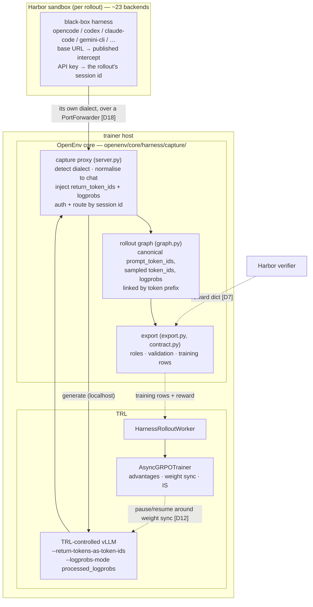
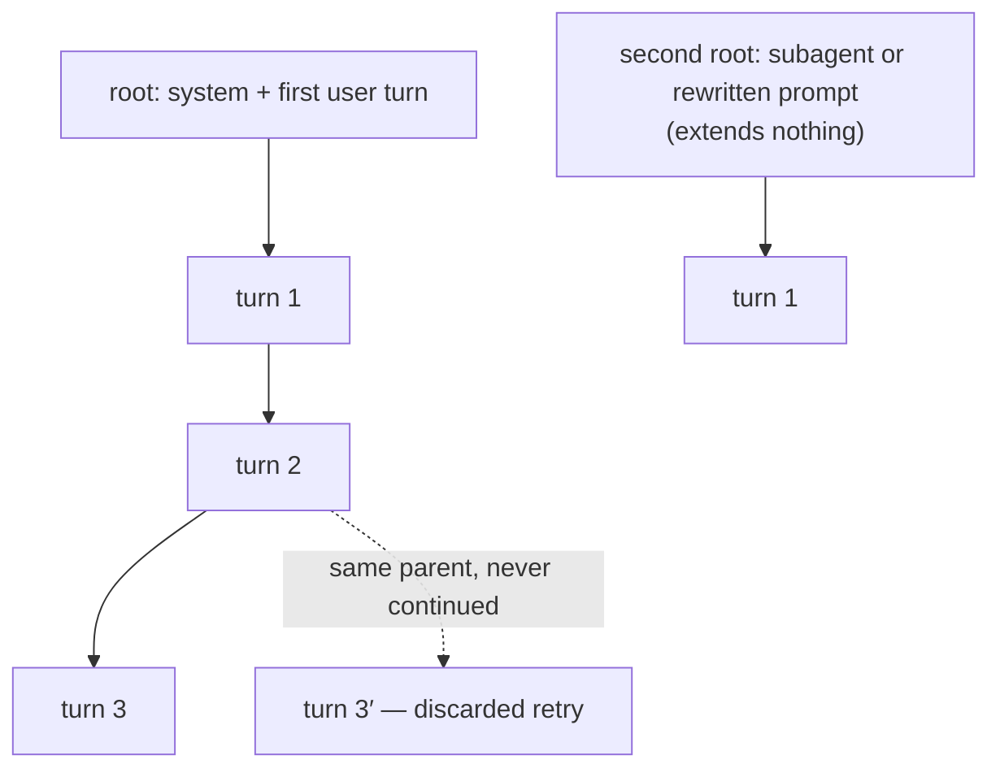
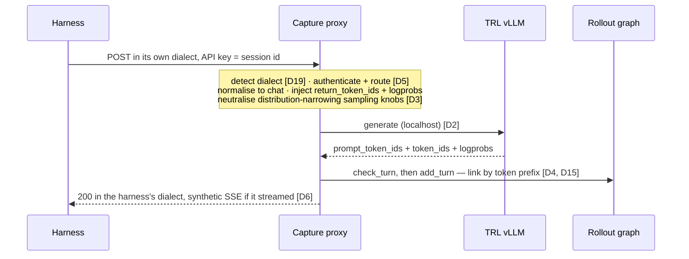

# RFC: Agentic RL through Harness Interception — the token capture contract

**Status**: In Review
**Created**: 2026-07-11
**Revised**: 2026-08-12 — rescoped against [#1036](https://github.com/huggingface/OpenEnv/pull/1036)
**Authors**: @rycerzes, @sergiopaniego
**RFC ID**: 006

## Summary

This RFC defines how OpenEnv trains the policy driving a **black-box agent harness** (opencode, Pi, Claude Code, codex, …) without modifying the harness. The harness issues LLM calls at an OpenAI-compatible HTTP boundary; OpenEnv hosts a **capture proxy** that fronts a trainer-controlled inference engine and records, per call, the engine's **canonical token ids** — `prompt_token_ids` and sampled `token_ids` — with their generation-time logprobs. That recording is sufficient to produce a token-faithful training sample `(input_ids, loss_mask, logprobs, reward)` with no re-tokenization anywhere, which is the property this design exists to guarantee.

### What changed in this revision

The original revision of this RFC argued for a capture layer OpenEnv did not have, and specified it in the abstract. **[#1036](https://github.com/huggingface/OpenEnv/pull/1036) builds it** — `src/openenv/core/harness/capture/`, a dialect-agnostic capture proxy with a rollout graph, ingest validation and LLM certification, consumed by `src/openenv/harbor/` to serve Harbor's task datasets as trainable environments.

So this document is no longer a proposal for a component. It is **the design rationale and the contract spec for a component that now exists**, plus the list of what remains open. Four decisions were settled by the implementation, and settled *against* what this RFC previously argued:

| | Previous revision | Settled by #1036 |
|---|---|---|
| **D3** assembly placement | OpenEnv is a "recorder, not an assembler"; TRL assembles | OpenEnv assembles, **without a tokenizer**. The dependency argument that motivated the split never applies. |
| **D4** chain grouping | compare `prompt_ids` to `prompt_ids`, keep chains | compare **`prompt_ids + sampled_ids`** to the next `prompt_ids`, keep a **graph** |
| **D17** aux-call classification | tag `call_kind` from boundary heuristics | **structural** role assignment from graph shape, cross-checked against the harness's own ATIF trajectory |
| **D18** remote transport | prefer trainer-dials-in over `Sandbox.proxy_url_for` | **sandbox dials out** to a published trainer-side intercept, with measured reliability data |

Each is discussed in place below. The rest of the RFC — the ownership boundary with TRL, the failure modes it exists to prevent, and the reference-implementation evidence — stands.

### What is still true

OpenEnv fronts a trainer-controlled engine and never relays to an external provider (D2). Rewards come from the environment (D7). Weight sync, advantages and importance-sampling correction stay TRL's (D12). The trace is consumed by TRL through the **loop-owning path of `AsyncGRPOTrainer`**: a `HarnessRolloutWorker` ([trl#6420](https://github.com/huggingface/trl/pull/6420), merged) drives an OpenEnv session factory and reconciles the trace into training rows. This is the **installed-agent** training path — the counterpart to the external-agent pattern TRL's Harbor integration already covers, where installed CLI agents cannot be trained because the trainer does not own tokens and logprobs.

The design is checked against independent implementations of the same pattern — NVIDIA Polar/ProRL, Prime Intellect verifiers, TRL itself, plus AReaL, Agent Lightning and rLLM.

## Motivation

### Problem 1: token capture was per-env and in-sandbox — now it is both

RFC 005 (Agentic Harness Integration) defined the wrapping pattern. The gap this RFC opened against was that the only working token capture lived inside one environment: [`envs/opencode_env/sandbox/interception.py`](../envs/opencode_env/sandbox/interception.py) forwards `/v1/chat/completions` upstream with `logprobs=true` injected and writes JSON-lines `TurnRecord`s inside the sandbox, which the trainer reads back afterwards.

**#1036 does not close this gap; it forks it.** The new `core/harness/capture/` is a strictly better implementation — four wire dialects instead of one, canonical `prompt_token_ids` instead of `"token_id:{id}"` string recovery, graph stitching, ingest validation — but it touches **no file** under `envs/opencode_env/` or `envs/pi_env/`. The repository would therefore ship two independent interception proxies, and the older one is load-bearing:

| Site | What |
|---|---|
| `envs/pi_env/harness.py:70` | reads `opencode_env/sandbox/interception.py` off disk and uploads it into the Pi sandbox |
| `envs/pi_env/__init__.py:24` | re-exports `HFSandboxBackend` / `SandboxBackend` / `SandboxHandle` from `opencode_env.sandbox` as part of `pi_env`'s own public API |
| `docs/source/tutorials/opencode-agent-grpo.md`, `pi-agent-grpo.md` | document that path as public surface |

`envs/pi_env/pyproject.toml` also declares `opencode_env` only as a **comment**, not a dependency, so `pip install openenv-pi-env` yields a broken package unless `openenv-opencode-env` is installed separately.

This is not an argument against #1036. It is the statement that **consolidation is now a scheduled obligation rather than an aspiration**: `opencode_env` and `pi_env` should become thin adapters over `core.harness.capture`, and the RFC's original Problem 1 is only closed when they are. See [What remains open](#what-remains-open).

### Problem 2: the installed-agent training gap

TRL's [Harbor integration](https://huggingface.co/docs/trl/harbor) supports the *external-agent* pattern only: installed agents (Claude Code, Codex, Pi as opaque CLIs) **cannot** be trained through it, because the trainer must own tokens and logprobs. Harbor's own RL docs name "vLLM interception" as the alternative token-capture strategy but ship no general implementation. This is the gap OpenEnv fills, and #1036 fills it for ~16 validated harnesses at once rather than one environment package per agent.

### Problem 3: the naive approaches silently corrupt training

Two failure modes are established in the literature and were present in the prior attempt ([#694](https://github.com/huggingface/OpenEnv/pull/694)/[#695](https://github.com/huggingface/OpenEnv/pull/695), both closed):

- **Retokenization drift.** Re-rendering full message history through `apply_chat_template` each turn while splicing raw sampled tokens into the training stream makes the trained sequence differ from what the policy conditioned on. [vLLM added `return_token_ids`](https://blog.vllm.ai/2025/10/22/agent-lightning.html) specifically to end this debate.
- **Silent, KL-invisible collapse.** Infrastructure-level logprob mismatch alone collapses training *even fully on-policy*, and recomputed-logprob KL stays flat for ~700 steps while reward degrades ([TIM, arXiv:2605.14220](https://arxiv.org/abs/2605.14220)). Rollout-side logprobs recorded at generation time are therefore a required primitive, not hygiene.

**#1036 adds a third, and it is the one that motivates the whole validation layer.** Every capture bug found during its bring-up returned a well-formed payload and reported success: a missing `--return-tokens-as-token-ids` yields text with no ids and trains on nothing; an SSE client handed a JSON body yields zero tokens and no error anywhere; a harness sending an empty `tools` array got a 400 that truncated its trajectory while leaving a graph that looked perfectly well-formed. **None of these raise.** That is why validation is graded and runs on ingest rather than export (D15), and why `check_rollout` treats a one-call agentic rollout as FATAL — four harnesses passed every other check while solving 0/5 tasks.

### Goals

1. Give `AsyncGRPOTrainer`'s loop-owning path a core capture layer to consume, replacing the per-env in-sandbox proxy. **(#1036 — built; consolidation outstanding.)**
2. Guarantee token fidelity as an OpenEnv-enforced property, not a hope about the trainer: record generation-time prompt **and** completion ids so no reconstruction step is needed downstream. **(#1036 — built.)**
3. Keep a clean ownership boundary with TRL, and keep `openenv.core` free of both trainer imports and a tokenizer dependency. **(#1036 — held; see D3.)**
4. Front any trainer-controlled OpenAI-compatible engine; never relay to an external provider. **(#1036 — built, with graded degradation to eval.)**
5. Work unchanged for local-subprocess and network-isolated remote sandboxes. **(#1036 — built; see D18.)**
6. Turn `run_white_box` into a working seam for opaque CLI harnesses (secondary mode). **(open.)**

### Non-goals

- Owning generation, weight sync, advantages, or importance-sampling correction — those are TRL's.
- Owning turn-selection policy or reward shaping — the trainer's, via `rollout_reward_fn` / `train_turn_fn` / `agent_turn_fn` (D17).
- Per-model chat-template renderers (D3).
- Sandbox implementation. On the Harbor path this is Harbor's entirely — a `TrialConfig` names an environment type and Harbor supplies ~23 backends. OpenEnv adds no provider SDK imports and no image building.

## Design

### Ownership boundary

| Concern | Owner | Mechanism |
|---|---|---|
| Interception of the harness's LLM calls | **OpenEnv core** | capture proxy, session-id-as-API-key auth (D5) |
| Wire-dialect translation | **OpenEnv core** | four dialects normalised to chat-completions (D19) |
| Token-faithful recording | **OpenEnv core** | `return_token_ids` injection; canonical `prompt_token_ids` + sampled ids + logprobs per call (D3) |
| **Graph structure and row assembly** | **OpenEnv core** | `RolloutGraph` → `TrainingSequence`; no tokenizer (D3, D4) |
| **Role assignment (agent / auxiliary / discarded)** | **OpenEnv core** | structural, cross-checked against ATIF (D17) |
| Ingest and export validation | **OpenEnv core** | graded `check_turn` / `check_sequence` / `check_rollout` (D15) |
| Connecting a remote sandbox to the proxy | **OpenEnv core** | `PortForwarder` strategies (D18) |
| Sandboxing the agent | **Harbor** | `TrialConfig` environment type; ~23 backends |
| Reward / grading | **OpenEnv env / Harbor verifier** | reward never synthesised by the recorder (D7) |
| Generation (inference engine) | **TRL** | `vllm serve` in `VLLM_SERVER_DEV_MODE=1`; `return_token_ids`, logprobs at generation |
| Weight sync + its fence | **TRL** | NCCL transfer bracketed by `WeightTransferClient.pause()` / `.resume()` (D12) |
| Advantages, GRPO, IS correction | **TRL** | `AsyncGRPOTrainer` |
| Turn selection / reward shaping policy | **TRL caller** | `agent_turn_fn`, `train_turn_fn`, `rollout_reward_fn` (D17) |
| Integration seam | **both** | `AsyncGRPOTrainer(rollout_worker=HarnessRolloutWorker(...))` |

Three rows moved from TRL to OpenEnv relative to the previous revision. The justification is D3.

Interception living in framework core (not the trainer) is the field-consistent placement: verifiers/prime-rl run the trainer, the environment/orchestrator, and vLLM as disaggregated components; Agent Lightning's `LLMProxy`, rLLM's model gateway, Polar's `gateway/proxy.py`, and AReaL's `experimental/openai/proxy/` are all framework-side.

### Cross-framework evidence: where assembly happens

Three independent implementations of harness interception have shipped. Reading their source, they agree on *what* is recorded and differ on who renders messages into tokens:

| | Who renders messages → tokens | Where ids come from | Where samples are assembled | How divergence is detected |
|---|---|---|---|---|
| **Polar** | the **engine** (harness posts OpenAI chat) | gateway injects `return_token_ids` (vLLM) / `return_prompt_token_ids` (SGLang) | **post-hoc** — `PrefixMergingBuilder.build(session)` | canonical prompt-prefix test; break → truncate |
| **verifiers** | the **train client** (HF chat template) | engine returns `prompt_ids` / `completion_ids` / `completion_logprobs` | **post-hoc** — `graph.py` `_commit_turn`; its interception server only does retry dedup | message **content hash** matching; new branch at first divergence |
| **TRL** | the **rollout worker** (`apply_chat_template` → `/v1/completions`) | `return_token_ids: True` | **post-hoc** — `_chain_to_sequences` / `_SampleBuilder` | token-prefix drift classified `CLEAN` / `REALIGN` / `FORK` |
| **OpenEnv (#1036)** | the **engine** (harness posts its own dialect) | proxy injects `return_token_ids`, normalises four dialects | **post-hoc, inside OpenEnv** — `RolloutGraph.sequences()` | token-prefix; break → **new root**, kept |

Two conclusions, and the second one is where this revision departs from the previous.

First, **no implementation keeps a live token buffer in the proxy.** Recording and assembly are separate *stages* everywhere, including #1036: `add_turn` records, `sequences()` walks the finished graph. That property is preserved.

Second — and this is the correction — **"assembly is post-hoc" and "assembly is the trainer's job" are different claims, and the previous revision conflated them.** Polar assembles post-hoc *inside Polar*. verifiers assembles post-hoc *inside verifiers*. Neither hands a raw call log to its trainer and asks it to reconstruct the structure. What they share with #1036 is the staging, not the ownership. The evidence table never supported a framework-side/trainer-side split; it supported a record-then-assemble split, which #1036 implements.

Only Polar's *rendering* topology matches ours: a black-box harness posts its own dialect, so the engine renders and the proxy can only observe. Polar remains the applicable precedent.

### Architecture overview



Nothing OpenEnv writes runs inside the sandbox. Only the base-URL host differs between local and remote.

### Core abstractions

**Per model call — `TurnNode`** (`capture/graph.py`). What the proxy records, one node per call.

```python
@dataclass
class TurnNode:
    node_id: str
    prompt_ids: list[int]              # canonical, from the engine — never re-rendered
    sampled_ids: list[int]
    sampled_logprobs: list[float] | None
    parent_id: str | None              # the call this one extends, by token prefix (D4)
    # provenance; never used in token math
    index: int; model: str | None; finish_reason: str | None
    harness_session_id: str | None     # the harness's OWN id, kept but never used for routing
    n_tools: int                       # tool manifest size — the role signal (D17)
    request_messages: list[dict]; request_tools: list[dict] | None
    sampling_params: dict              # what the harness asked for (D11)
    response_message: dict
```

**Per training sample — `TrainingSequence`.** One root-to-leaf path through the graph, flattened.

```python
@dataclass
class TrainingSequence:
    input_ids: list[int]
    loss_mask: list[int]      # 1 = agent-generated, 0 = context (env output, template glue)
    logprobs: list[float]     # aligned to input_ids; 0.0 filler at mask=0
    node_ids: list[str]
    prompt_len: int
    root_id: str
    n_turns: int
```

This maps 1:1 onto TRL's `TrainingSequence(input_ids, completion_mask, old_log_probs)` plus the reward, and onto verifiers' `MessageNode(token_ids, mask, logprobs, is_content)`. Polar's `Trace` carries the same arrays with model validators asserting `len(loss_mask) == len(response_ids)` — independent confirmation of both the shape and D15's alignment check.

**Per rollout — the export document** (`capture/export.py`). One JSON document per rollout: `stats`, `turns` (every call in arrival order), `sequences` (one row per path, each labelled `agent` / `auxiliary` / `discarded` with its own `validation` findings), rollout-level `validation`, and a single `trainable` gate.

Rows are **labelled, never filtered**. A caller that silently drops rows cannot be distinguished from one that had none to drop, and "the group quietly shrank" is far harder to diagnose than "three rows were labelled auxiliary."

### Key design decisions

**D1 — Token-level contract, not a message-level seam.** Return `(input_ids, loss_mask, logprobs, reward)` per sample. *Rationale:* token fidelity becomes an enforced guarantee. *Trade-off:* richer than a message log, but the message record is kept alongside (D15). Supersedes draft [#864](https://github.com/huggingface/OpenEnv/pull/864)'s message-level `RolloutMessages` design.

**D2 — Trainer owns generation; the proxy re-generates, never relays.** The capture proxy fronts a trainer-controlled vLLM with `return_token_ids` and logprobs at generation time. *Rationale:* a relay to an external provider has no token identity and uses the provider's logprobs. *Trade-off:* requires a trainer-controlled engine; that is the point.

*Settled by #1036:* the degradation is **graded and named**, not binary. `capture/upstream.py` defines three `CAPTURE_LEVELS`:

| level | injected | what you get |
|---|---|---|
| `tokens` | `return_token_ids`, `logprobs`, `top_logprobs`, sampling neutralised | trainable rollouts |
| `logprobs` | `logprobs`, `top_logprobs` | confidence readout, not trainable |
| `text` | nothing | trace only; current OpenAI models 400 on `logprobs`, and a rejected request loses the agent's turn entirely |

`capture/validate_llm.py` certifies the endpoint **before a sandbox is spent** and `openenv harbor serve` refuses to start below `tokens`. The document carries `capture_level` and `rollout_type` so a consumer never has to infer why `sequences` is empty, and `contract.py` raises rather than returning a well-formed empty contract from an eval rollout.

**D3 — OpenEnv records canonical ids, assembles without a tokenizer, and renders no chat template.** The proxy injects `return_token_ids` into every forwarded call and records what the engine reports: canonical `prompt_token_ids` (input ids *after* the engine's chat-template processing), the sampled `token_ids`, and their real logprobs. It **imports no tokenizer and renders no chat template**. It *does* assemble those records into training rows.

> **This reverses the previous revision**, which held that OpenEnv is "a recorder, not an assembler" and that assembly belongs to TRL. @sergiopaniego's position in [#941](https://github.com/huggingface/OpenEnv/pull/941#issuecomment-5069908703) — keep the buffer framework-side to preserve OpenEnv's framework-agnosticism — was accepted on the record. #1036 chose otherwise, and the reasoning below is why that is the better call rather than a drift.

*Rationale.* The previous revision gave three arguments for framework-side assembly. The first two do not survive contact with the implementation:

1. **"A rendering buffer in core would need `transformers`, which core's dependency policy reserves."** This assumed assembly means rendering. It does not. Assembly here is **pure prefix arithmetic over ids the engine already returned**: `context_ids = prompt_ids[len(parent.end_ids):]`, then concatenate along a path. No decode, no encode, no template, no vocabulary. `capture/` imports no tokenizer and adds no dependency. The argument that forced the split never applies.
2. **"The delta-tokenize machinery is not reusable at any placement."** True of TRL's `_get_tool_suffix_ids`, and irrelevant: recording canonical ids means that machinery is never needed by anyone. This was already stated in the previous revision as the reason no tokenizer is required — it just was not followed to its conclusion, which is that the assembler needs no tokenizer either, and so has no reason to live where the tokenizer lives.
3. **"Every reference implementation assembles post-hoc."** True, and preserved — see the [evidence table](#cross-framework-evidence-where-assembly-happens). Post-hoc is a claim about *staging*, not about *which repository*. Polar and verifiers both assemble inside themselves.

What actually decides placement is **where the information is**. The structure a trainer needs — which calls are retries, which are subagents, which branch died, which conversation a call continues — is only observable across *all* the calls of a rollout, which is exactly and only what the capture point holds. A flat trace handed to a trainer has already destroyed it, which is why TRL's `_turns_from_trace` has to re-derive it with an `agent_turn_fn` heuristic and a `TODO(@openenv)` saying the proxy knew all along. Framework-agnosticism is preserved by the *contract being importable without a trainer*, not by refusing to compute — and `capture/contract.py` ships converters (`to_trace_entries`, `to_turn_records`) so any consumer, TRL included, reads the shape it wants.

*Residual obligation.* Recording canonical ids is faithful only if the engine that served the harness rendered with the same template the trainer trains under. TRL substitutes one when the model's own template is not prefix-preserving. **Still open** — the served-template hash and mismatch check (D11) are not in #1036.

*A hazard #1036 found that this RFC had not anticipated.* `--logprobs-mode processed_logprobs` applies `log_softmax` *after* every logit processor, so a harness sampling with `top_p<1`, `top_k` or a repetition penalty yields logprobs over a truncated, renormalised distribution — while a trainer recomputing over the full vocabulary gets different numbers for the same tokens. Neither side is wrong; they answer different questions, and the mismatch is invisible. `upstream.py` therefore sends the distribution-narrowing knobs at their **no-op values** at `tokens` level, records what the harness actually asked for on the node, and emits a `sampling_neutralised` finding. At `logprobs`/`text` they are passed through, because an eval should score the model the harness asked for. Measured on vLLM 0.25.1, same prompt and token at temperature 0.7: `-1.3292` with both flags, `-1.2546` without — both plausible, both aligned, one wrong.

**D4 — Calls form a graph, linked by prompt+completion prefix; a break opens a new root.**

> **Corrected.** The previous revision specified comparing **`prompt_ids` against `prompt_ids`** and keeping *chains*. Both halves were wrong.

The parent of a call is the existing node whose **`prompt_ids + sampled_ids`** (`end_ids`) is the longest exact prefix of this call's `prompt_ids`. Comparing prompt-to-prompt would attach a call to its grandparent as readily as its parent and could not recover the interstitial span at all; the span between a parent's end and a child's start *is* the tool results and template glue the harness inserted, and it is obtained by slicing `prompt_ids[len(parent.end_ids):]`. Longest-match wins so a deep chain attaches to its immediate predecessor.

*The comparison must never involve an accumulated stream of sampled tokens re-tokenized.* That hazard — Polar's `[fish, ing]` → `[fishing]` — is why the comparison is against the **engine's own** `prompt_ids` on the child side. Both sides are the same engine's tokenization of the same message prefix, so the test is stable across the generation-prompt boundary.

*Why a graph and not merged chains.* Three things fall out that a chain cannot express:

- **Retries become visible.** A retried turn is a sibling that never continued: same parent, no children. A proxy cannot ask the harness what it discarded; the shape shows it. Training a discarded branch with the rollout's reward credits work that never happened.
- **Subagents separate themselves.** A subagent has its own system prompt, so its first call extends nothing and starts its own root. No system-prompt keyword matching.
- **Compaction is representable.** A rewritten history is not a prefix extension, so it opens a new root instead of corrupting the chain it came from.

*Fork, don't truncate.* Polar breaks out of its merge loop on a prefix break and discards the captured suffix as `chains_reconstructed_truncated`. Keeping both sides is strictly more sample-efficient and is what verifiers does. #1036 goes further: a break opens a **root**, and `_assign_roles` treats multiple agent roots as normal and all of them trainable. claude-code swaps a 12118-char system prompt for a 12541-char one at call 6 while its message list grows 2 → 26 unbroken; an earlier "keep the single longest tool-using path" rule silently discarded 6 genuine agent turns there.

*Arrival order is not meaningful*, because harnesses issue concurrent requests. Linking is symmetric: on insert, `_adopt_orphaned_roots` also looks *forwards* and re-parents existing roots the new node turns out to precede.



**D5 — Session-id-as-API-key.** A random per-rollout bearer is both auth and routing; the key that arrives *is* the rollout identifier, so one proxy serves a whole GRPO group without per-rollout ports. Strict model: unknown key → reject. *Settled by #1036, with two rules learned the hard way:* a registered key **beats every other hint** (opencode sends its own `x-session-id` from the AI SDK; letting that win files the trajectory under an id the caller never sees, which reads as "the agent made no model calls" while every turn was captured), and the harness's own session id is **kept** on the node as ground truth for separating subagents. `require_registered` defaults to True because the proxy sits behind a public forward in front of a GPU.

**D6 — Synthetic SSE replay.** Capture non-streaming, reply in whatever the client asked for. *Rationale:* one complete response carries ids and logprobs whole; reassembling them from deltas is error-prone in exactly the way that silently corrupts training data. But a harness that requested SSE and receives a JSON body **does not error** — opencode reports `step-finish reason:"unknown"`, zero tokens, no message, having been handed a perfectly valid tool call. *Settled by #1036*, with a per-dialect detail the RFC had not: the typed-event dialects (Anthropic, Responses) need their full lifecycle event sequence and their own terminal event, and only chat-completions takes `[DONE]`; emitting only the first event silently truncated gemini-cli's stream into `Incomplete JSON segment at the end`.

**D7 — Rewards inside the env; TRL keeps IS correction.** Reward comes from the environment's verifier; weight sync, advantages and IS correction stay in TRL. Keep truncated IS on even with captured logprobs — Polar trains with TIS enabled (paper Table 4); captured logprobs *enable* the correction, they do not replace it.

*Extended by #1036:* Harbor's verifier produces a `dict[str, float]` and OpenEnv wants a scalar. The dict travels verbatim; the scalar is chosen by an explicit rule — one key, or one named `reward`, otherwise **fail and require `--reward-key`**. Combining keys automatically would be inventing reward semantics. And **`reward=None` is not zero**: it means the verifier never ran, and conflating the two makes a dead sandbox look like a wrong answer.

**D8 — Reconcile with RFC 005, don't parallel it.** `ModelStep` stays the trainer-side generate hook; `HarnessRolloutWorker._sample_turn` is already a `ModelStep` implementation. `CLIHarnessAdapter.run_white_box` goes from `NotImplementedError` to a real implementation on the same signature. No RFC 005 abstraction is rewritten. **Still open.**

**D9 — Loss-mask invariant.** Mask environment-*output* tokens only; never mask agent-*generated* tokens, including inspection commands. *Rationale:* supervising observation generation is where much of the signal lives ([arXiv:2606.03461](https://arxiv.org/abs/2606.03461)); the mask must gate advantage estimation too, not just the loss (SAO, [arXiv:2607.07508](https://arxiv.org/abs/2607.07508)).

*Strengthened by #1036, in a direction this RFC did not specify.* `sequence_for` enforces a second invariant: **a turn whose logprobs are missing or misaligned contributes its tokens as context (mask 0), never as targets.** A trainable token without a real behaviour-policy logprob would make GRPO's importance ratio `exp(new − old)` a ratio against a number we invented. The tokens are still real context for later turns, so they are kept — masked, not dropped.

**D10 — δ diagnostics as a standard trace metric.** Per-token δ = |log π_train − log π_rollout| (max and mean). *Rationale:* KL alone misses early collapse (TIM). **Partially open.** #1036 ships [`scripts/logprob_parity.py`](https://github.com/huggingface/OpenEnv/pull/1036/files), which checks captured logprobs against engine rescoring and measures the top_p truncation bias — the right measurement, as a script rather than a trace field.

**D11 — Provenance in traces.** Record sampling params, engine/harness versions, and **hashes of the agent's config files** per call. *Rationale:* a sandboxed agent can rewrite its own prompts mid-episode ([arXiv:2607.03935](https://arxiv.org/abs/2607.03935)) and the reported score is always model-plus-harness ([arXiv:2605.26112](https://arxiv.org/abs/2605.26112)). **Partially open:** #1036 records `sampling_params` per turn — for a sharper reason than this RFC gave, see D3 — plus `finish_reason`, `harness_session_id` and `model`. Config-file hashing and the served-template hash are not implemented.

**D12 — Don't break TRL's existing weight-sync fence; record the policy version.** The fence **already exists and is TRL's**: `WeightTransferClient.pause()` / `.resume()` drive `POST /pause?mode=keep` and `/resume` on the vLLM server around the NCCL transfer, requiring `VLLM_SERVER_DEV_MODE=1` — already the documented `AsyncGRPOTrainer` launch. (`trl/scripts/vllm_serve.py` exposes no such endpoint; it serves `GRPOTrainer`, not this path.)

OpenEnv asks for no new fencing primitive. Its obligations are complementary: (a) a harness call in flight across a pause must block until resume or fail retryably (D14) rather than surfacing a torn generation; (b) each recorded call carries the policy version that served it, so a trace spanning a sync is detectable rather than silently mixed; (c) the proxy is colocated with the trainer (D18) so pause/resume stays a localhost concern. **(b) is open** — no policy-version field exists yet.

**D13 — Proxy-enforced rollout budgets.** Check max turns / tokens / wall-clock *before* serving each turn, recording the cap as the stop condition — a black-box harness never stops on its own. **Open.** #1036 has the observability half (`GET /sessions` reports per-session turn count, root count and idle seconds) but no enforcement.

**D14 — Error relay semantics.** Map engine failures to status codes the agent SDK handles; stash the original error so the rollout reports the real cause. **Partially settled:** #1036 adds provider-400 auto-fixes (`install_fixes.py`), an `upstream_errors` counter per session, and a rule this RFC should have stated — **ingest never raises.** A capture problem degrades one turn, not a rollout, and never the server multiplexing every other rollout. A 200 with no choices is explicitly *not* recorded as a turn, because doing so inflated `n_roots` and could push a worthless rollout past the `degenerate_rollout` check that exists to catch it.

**D15 — Trace hygiene and graded validation.** Keep the message-level record alongside token ids; logprob arrays aligned to `input_ids` with `0.0` filler at mask=0; every mask=1 slot carries a real logprob; one server multiplexes many rollouts.

*Substantially expanded by #1036, and this is the part worth adopting as doctrine.* Validation is **graded** (FATAL = drop the row, WARN = trainable but understand it, INFO = recorded) and runs at four points: `check_upstream_response` before a rollout is spent, `check_turn` per call, `check_sequence` on the flattened output, `check_rollout` on graph shape. It runs **on ingest, not on export**, because a turn whose logprobs are misaligned must be caught while we still know which turn it was. Three checks earn their place by catching things nothing else can:

- `token_strings` — logprob tokens arriving as strings rather than `token_id:N` means `--return-tokens-as-token-ids` was not passed, which means its partner `--logprobs-mode processed_logprobs` probably was not either, which means the logprobs are **raw pre-temperature** rather than the sampling distribution's. `token_ids` arrive regardless (they come from the request parameter), so every other check passes and the rollout grades fully trainable while carrying a wrong importance ratio.
- `degenerate_rollout` — exactly one model call for a whole agentic task is FATAL. Capture is trivially self-consistent with nothing to stitch, so every other check passes. swe-agent, trae-agent, nemo-agent and antigravity-sdk each passed 5/5 while producing one turn per task and solving 0/5, for four unrelated harness-side reasons.
- `positive_logprob` / `masked_has_logprob` — a context position carrying a logprob means context was scored; a trainable position without one means a target was invented. Silent corruption in opposite directions.

**D16 — OpenEnv owns and exports the contract.** *Reshaped by #1036.* Rather than OpenEnv declaring `TraceEntry` for TRL to import, `capture/contract.py` ships **converters** into the consumer's shape (`to_trace_entries` → TRL's `TraceEntry`; `to_turn_records`), and refuses to build one from an eval rollout. This is the better factoring: it decouples OpenEnv's record shape from any one trainer's, and it lets the converter apply the graph's knowledge — auxiliary roots and discarded retries are excluded *before* TRL sees them, so `agent_turn_fn` is not needed on this path. The `TODO(@openenv)` markers in TRL at `openenv_harness.py:44` and `:53` are still open; the resolution is now "import the converter", not "import the type".

**D17 — Roles are assigned structurally, not heuristically; the trainer keeps the policy.**

> **Superseded.** The previous revision proposed tagging each entry `call_kind` ("agent"/"aux") from what is observable at the boundary — endpoint, declared model, sampling shape, harness-specific markers. #1036 tried the harness-marker family of approaches and rejected it: matching known system-prompt strings "needed a new entry per harness and failed silently on the harnesses nobody had profiled yet."

A real harness fires LLM calls that must never be trained on: title generators, summarisers, sub-agent scaffolding. The replacement rule is **structural first**:

- a path ending in a **discarded** node (a sibling that never continued) is a retry;
- a path whose turns carry a **tool manifest** is the agent working;
- anything else is auxiliary.

with one guard that matters more than it looks: tools only *discriminate* when some paths have them and others do not. terminus-2 parses tool calls out of raw model text, so every one of its paths has `n_tools == 0`; applying the tool rule there labelled the entire rollout auxiliary, and a "keep the longest" fallback then kept 1 of its 13 turns. So if nothing in the rollout uses tools, tools carry no signal and every live path is agent work.

*The cross-check is the part with no analogue in the previous revision.* Harbor agents write `agent/trajectory.json` in **ATIF** (Agent Trajectory Interchange Format v1.7), independently of anything OpenEnv does. `harbor/atif.py` reconciles the two call by call — turn count, per-call completion token counts, and which calls the harness considers real agent steps — and a rollout comes back `atif="match"`, `"MISMATCH"` or `"none"`. This is **the only check that is not self-referential**: every internal check shares our own assumptions. Validated on opencode + Qwen3.5-4B over 8 agent steps, ATIF `completion_tokens` and intercept `turn_lengths` agreed exactly ([37, 36, 104, 264, 255, 119, 32, 27], total 874), and ATIF's step-1 `prompt_tokens` 7990 equalled the intercept's `prompt_len`. A mismatch has already caught a real bug: one harness sending an empty `tools` array got a 400 from vLLM, truncating its trajectory while leaving a well-formed graph. Calls ATIF marks auxiliary are demoted so they cannot be credited with the reward earned by solving the task.

ATIF also carries three things a proxy structurally cannot see: `llm_call_count > 1` (the harness retried), `subagent_trajectories` (ground truth for subagents rather than inference from roots), and `tool_call_id ↔ source_call_id`. Since ATIF's `Metrics` has optional `logprobs` and `completion_token_ids` fields that harnesses leave empty, the end state is not two formats to reconcile but **ATIF with our token fields filled in** — one artifact that is trace, SFT dataset and RL data at once (`merge_into_atif`).

*Trade-off unchanged:* the label is a hint, not a verdict. Rows are labelled and exported, never filtered, and the decision stays the caller's via `agent_turn_fn` / `train_turn_fn` / `rollout_reward_fn`. OpenEnv must not bake a training policy into a recorder.

**D18 — The sandbox dials out to a published trainer-side proxy.**

> **Settled, against the previous revision's preference.** It proposed two routes and preferred **trainer-dials-in**: a thin in-sandbox shim multiplexing to the trainer over a WebSocket the trainer opened via `Sandbox.proxy_url_for(port, scheme="wss://")`, on the grounds that it needs nothing beyond `huggingface_hub`. The open question left for @sergiopaniego was which of the two he had validated. **His #941 comment described the outbound tunnel, and #1036 implements exactly that** — so the question is answered by both, in agreement.

The proxy stays colocated with the trainer and is published at a URL the sandbox can reach. Exactly one hop is forwarded; the engine itself never needs exposing, staying on localhost behind the proxy. `capture/forwarding.py` makes the hop a swappable `PortForwarder` strategy, chosen by what the sandbox *is* rather than by preference:

| strategy | when |
|---|---|
| `DirectExposure` | the sandbox can already route to us (local docker, same VPC). No third party, no expiry, no throughput ceiling. Prefer whenever true. |
| `GradioForwarder` | frpc via `gradio.networking.setup_tunnel` |
| `CloudflareForwarder` | cloudflared quick or named forwards |

*Measured, not assumed*, over a full day of harness bring-up on one intercept: gradio/frpc served 521 POSTs with **zero** forwarding errors in the server log, ~370ms health round trip, still up after 24h; cloudflared produced 10765 log lines on the sibling experiment with repeated `failed to accept QUIC stream: timeout` and `lookup region1.v2.argotunnel.com: i/o timeout` — always reconnecting, so churn rather than outage, but churn. **gradio is the better default at eval scale**; cloudflared named forwards earn their place where a stable hostname and real access policies matter, since gradio.live URLs expire at 72h and are a single frpc hop that becomes a bottleneck at GRPO group width.

Two properties this RFC claimed for trainer-side placement hold: weight-sync fencing (D12) stays a local call, and the token-faithful data — ids, logprobs — is produced and recorded on the trainer host and **never enters the sandbox**. Only the OpenAI-dialect request and completion text traverse the hop.

*Share tokens are not auth.* A forwarder's `share_token` identifies the forward to the share server; the resulting URL is public either way. What protects the GPU behind it is the proxy's own key check (D5), which is why `require_registered` defaults to True. The same reasoning governs the hosted topology: a Space has one port and one URL, so the proxy is mounted on the env server's app at `/capture` with nothing forwarded, and the Space must be **public** because a private one requires an auth header the agent inside the sandbox does not send. That is safe only because the proxy rejects any caller without a registered session id — the mount is not an open relay.

*A forwarder must never return a half-open forward.* `ForwardingError` is raised instead, because a stale URL that still looks valid produces a rollout that silently captures nothing.

**D19 — Four wire dialects, normalised to chat-completions. (new)**

Coding agents did not converge on one wire format, and supporting only chat-completions would cost the four most interesting harnesses:

| dialect | agents |
|---|---|
| chat-completions | opencode, goose, qwen-coder, swe-agent, mini-swe-agent, openhands-sdk, openclaw, hermes, kimi-cli, pi, vibe, terminus-2 |
| OpenAI Responses | codex, trae-agent |
| Anthropic Messages | claude-code |
| Google `generateContent` | gemini-cli |

Requests are detected by **path first, then headers, then body shape** — strongest signal to weakest. Getting this wrong is not subtle: a Google request parsed as chat-completions produces a 400 and the agent silently does nothing, which reads as "captured nothing" rather than as a routing bug. trae-agent looked like a chat harness for a full night because its config says `provider: openai`, while the access log showed exactly one `POST /v1/responses` against 465 chat calls. Google's streaming route capitalises the G in `:streamGenerateContent`, so the path test must be case-insensitive or every streaming call is misrouted.

The dialect transformers are adapted from the **Polar** gateway (Apache-2.0) and vendored into `capture/dialects/` rather than depended on, because the PyPI package named `polar` is unrelated; provenance is in `dialects/README.md`. Polar's engine and proxy layers are *not* vendored — they target SGLang, which cannot return token ids at all ([sgl-project/sglang#18378](https://github.com/sgl-project/sglang/issues/18378)) — so a ~160-line vLLM-only `upstream.py` replaces them. verifiers' `Dialect` ABC informed two cases that are easy to get wrong: auxiliary routes (claude-code's `count_tokens` must be answered without becoming a model turn) and per-dialect streaming detection (Google signals streaming in the URL, not the body).

### Interception topology

```
Previously shipped, still shipping (opencode_env, pi_env):
  [sandbox]  agent → in-sandbox proxy →(HTTPS egress)→ vLLM  [trainer host]
             records inside the sandbox; the trainer reads the trace back afterwards

This RFC, implemented by #1036:
  [sandbox]  agent →(PortForwarder)→ capture proxy → vLLM   [trainer host]
             records canonical ids on the trainer host, live; OpenEnv assembles
```

The in-sandbox proxy remains a *supported* mode rather than a legacy one — it is the simpler deployment — but it is no longer the *recommended* one, and Problem 1 is not closed until both shipped harness envs are adapters over `core.harness.capture`. Both modes can share the graph and the export contract, differing only in where the process runs.

### Request lifecycle



Role assignment, flattening and validation happen afterwards over the finished graph — the proxy holds no token buffer during the rollout.

### Reconciliation with RFC 005

RFC 005 owns the wrapping pattern, MCP injection, session isolation and episode control. This RFC adds the capture layer to core and (still) fills the white-box seam. `ModelStep` stays the generate hook, `ResourceSession` / `ResourceSessionFactory` stay the session contract, and `run_white_box` stays the white-box entry point. No RFC 005 abstraction is rewritten.

## Implementation status

Landed in [#1036](https://github.com/huggingface/OpenEnv/pull/1036):

| Item | Where |
|---|---|
| Capture proxy, session-as-API-key auth (D5) | `core/harness/capture/server.py`, `sessions.py` |
| Four-dialect detection + translation (D19) | `capture/detection.py`, `capture/dialects/` |
| Canonical id recording, sampling neutralisation (D3) | `capture/upstream.py` |
| Rollout graph, prefix linking, discard detection (D4) | `capture/graph.py` |
| Row assembly, structural roles, export document (D3, D17) | `capture/export.py` |
| Graded ingest/export validation (D15) | `capture/validate.py` |
| Endpoint certification before a rollout is spent (D2) | `capture/validate_llm.py` |
| Synthetic SSE replay (D6) | `capture/sse.py` |
| PortForwarder strategies (D18) | `capture/forwarding.py` |
| Consumer converters (D16) | `capture/contract.py` |
| ATIF reconciliation, aux demotion, merge (D17) | `harbor/atif.py` |
| Reward-key resolution, `None` ≠ 0 (D7) | `harbor/models.py`, `harbor/rollout.py` |
| δ measurement as a script (D10) | `scripts/logprob_parity.py` |

### What remains open

| Item | Decision | Note |
|---|---|---|
| Consolidate `opencode_env` / `pi_env` onto `core.harness.capture` | Problem 1 | two proxies ship today; `pi_env` reads the older one off disk and re-exports its sandbox types |
| Declare `opencode_env` as a real dependency of `pi_env` | Problem 1 | currently a comment in `pyproject.toml`; the package is broken without it |
| Sandbox protocol + E2B/HF/Docker backends into `core/harness/sandbox/` | — | deferred follow-up to [#998](https://github.com/huggingface/OpenEnv/pull/998); orthogonal to Harbor, which brings its own |
| Served-template hash in provenance + mismatch check | D3, D11 | the one remaining fidelity assertion; not an assembly job |
| Config-file hashing per call | D11 | agents can rewrite their own prompts mid-episode |
| Policy version / step on each recorded call | D12 | makes a trace spanning a weight sync detectable |
| Proxy-enforced turn / token / wall-clock budgets | D13 | observability exists, enforcement does not |
| δ as a trace field rather than a script | D10 | |
| `CLIHarnessAdapter.run_white_box` | D8, Goal 6 | still `NotImplementedError` |
| Async harness layer | — | `TODO(@openenv)` in TRL; performance, not correctness |
| Eval-path role assignment: roots with empty `prompt_ids` all group under one key | D4, D17 | `discarded_nodes()` mislabels auxiliary conversations as discarded when no token ids exist; fix identified, landing separately |

### The TRL-side ask

Two `TODO(@openenv)` markers in `trl/experimental/async_grpo/openenv_harness.py` are already stale — `:187` (factory `create()` retry with backoff) is satisfied by [#1009](https://github.com/huggingface/OpenEnv/pull/1009) and `:210` (generic `ResourceSessionFactory`) by [#1007](https://github.com/huggingface/OpenEnv/pull/1007).

The substantive one is `_turns_from_trace` (`:314`), which reconstructs each turn's prompt with `apply_chat_template` rather than reading recorded ids. Three divergence paths make this a correctness issue rather than a cleanup: `chat_template_kwargs` are dropped; the training-template substitution is skipped on this path (`_sample_turn` at `:253` passes `chat_template=self.chat_template, **self.chat_template_kwargs`, `_turns_from_trace` at `:331` passes **neither** — a TRL-internal inconsistency independent of anything OpenEnv does); and serving-side differences the messages do not capture. When prompts diverge, `_chain_to_sequences` classifies every turn `FORK`, prefix merging is lost, and `input_ids` end up paired with logprobs from a different rendering.

Under D3 the ask is smaller than the previous revision's: consume `capture/contract.py`'s converters, which already exclude auxiliary and discarded turns, rather than re-deriving structure from a flat trace.

## Examples

The Harbor path, end to end. `--llm-url` is required and has no default and no environment fallback, because an unset endpoint produces rollouts that look completely normal and carry no token ids.

```bash
LLM=http://127.0.0.1:8000/v1

# What can this machine actually run? Read-only, boots nothing.
openenv harbor info --llm-url $LLM \
  --dataset AdithyaSK/data_agent_rl_environment_train,AdithyaSK/data_agent_rl_environment_eval

# Rollouts with no env server involved — also the debugging path:
# if this works and `serve` does not, the fault is in the serving layer.
openenv harbor rollout --llm-url $LLM \
  --dataset AdithyaSK/data_agent_rl_environment_train \
  --task-index 0 -n 5 --harness opencode --sandbox modal

# The env server: Task API for discovery, one long-running run_rollout MCP tool, and a web UI.
# Refuses to start if the LLM cannot return token ids.
openenv harbor serve --llm-url $LLM \
  --dataset AdithyaSK/data_agent_rl_environment_train,AdithyaSK/data_agent_rl_environment_eval
```

Training against the merged TRL path (lives in `examples/`, never as infrastructure in `envs/`):

```python
from trl.experimental.async_grpo import AsyncGRPOTrainer, HarnessRolloutWorker, has_tool_call

worker = HarnessRolloutWorker(
    harness_session_factory=factory,   # starts the harness pointed at the capture proxy
    # harness_adapter=None → loop-owning: the agent runs its own loop and we read its trace.
    train_turn_fn=has_tool_call,       # reinforce action-taking turns only (caller policy, D17)
    ...,
)

trainer = AsyncGRPOTrainer(
    model=policy,
    rollout_worker=worker,   # TRL owns vLLM, weight sync, advantages, IS
    ...,
)
trainer.train()
```

Property tests runnable without GPUs, none of which need a tokenizer in core: canonical ids recorded for every call (D3), prefix linking is symmetric under arrival order (D4), a discarded sibling never enters a training path (D4), role assignment survives a toolless harness (D17), logprob alignment and the mask/logprob invariants (D9, D15), auth rejection of an unregistered key (D5), dialect detection for the streaming Google route (D19), local-vs-forwarded base-URL parity (D18).

## References

### OpenEnv seams and prior art
- **PR [#1036](https://github.com/huggingface/OpenEnv/pull/1036) — the implementation this revision is written against**: `src/openenv/core/harness/capture/` (proxy, graph, export, contract, validation, dialects, forwarding), `src/openenv/harbor/` (seams, tasks, rollout, ATIF, serving, UI), `envs/harbor_env/`, `openenv harbor` CLI
- RFC 005 — Agentic Harness Integration: [`rfcs/005-agentic-harnesses.md`](./005-agentic-harnesses.md); runtime in [`src/openenv/core/harness/__init__.py`](../src/openenv/core/harness/__init__.py), landed via [#652](https://github.com/huggingface/OpenEnv/pull/652)/[#903](https://github.com/huggingface/OpenEnv/pull/903)
- Tracking issue [#940](https://github.com/huggingface/OpenEnv/issues/940)
- Existing in-sandbox proxy: [`envs/opencode_env/sandbox/interception.py`](../envs/opencode_env/sandbox/interception.py); second consumer [`envs/pi_env/harness.py`](../envs/pi_env/harness.py) ([#999](https://github.com/huggingface/OpenEnv/pull/999))
- Tutorials documenting the in-sandbox path: [`docs/source/tutorials/opencode-agent-grpo.md`](../docs/source/tutorials/opencode-agent-grpo.md) ([#1028](https://github.com/huggingface/OpenEnv/pull/1028)), [`pi-agent-grpo.md`](../docs/source/tutorials/pi-agent-grpo.md) ([#1023](https://github.com/huggingface/OpenEnv/pull/1023))
- PR [#998](https://github.com/huggingface/OpenEnv/pull/998) — `HFSandboxBackend` + `sandbox_home` fix (merged); sandbox consolidation is its deferred follow-up
- **`huggingface_hub.Sandbox`** (first-class since 1.22.0, plus an `hf sandbox` CLI): [`src/huggingface_hub/_sandbox.py`](https://github.com/huggingface/huggingface_hub/blob/main/src/huggingface_hub/_sandbox.py) (`proxy_url_for`, `proxy_headers`, `$SBX_PROXY_DIR/<port>.sock`), [guide](https://huggingface.co/docs/huggingface_hub/main/en/guides/sandbox) — the trainer-dials-in route D18 considered and did not take
- PRs [#1007](https://github.com/huggingface/OpenEnv/pull/1007), [#1009](https://github.com/huggingface/OpenEnv/pull/1009) — merged, satisfying two TRL `TODO(@openenv)`s
- PRs [#694](https://github.com/huggingface/OpenEnv/pull/694) / [#695](https://github.com/huggingface/OpenEnv/pull/695) — prior attempt (closed); [#864](https://github.com/huggingface/OpenEnv/pull/864) — message-level contract (superseded by D1)

### Reference implementations of the interception pattern
- **Polar / ProRL-Agent-Server** (NVIDIA NeMo, Apache-2.0): [github.com/NVIDIA-NeMo/ProRL-Agent-Server](https://github.com/NVIDIA-NeMo/ProRL-Agent-Server) · Polar paper [arXiv:2605.24220](https://arxiv.org/abs/2605.24220) · ProRL Agent [arXiv:2603.18815](https://arxiv.org/abs/2603.18815). Verified for the evidence table: `src/polar/gateway/engine.py`, `gateway/server.py` + `storage.py`, `trajectory/builder/prefix_merging.py` (the `[fish, ing]` → `[fishing]` hazard is in its module docstring), `trajectory/models.py` (`Trace` + length validators). Its transformers are vendored into `capture/dialects/` (D19)
- **verifiers** (Prime Intellect): [github.com/PrimeIntellect-ai/verifiers](https://github.com/PrimeIntellect-ai/verifiers) — `v1/graph.py`, `v1/interception/server.py`, `v1/trace.py`, and the `Dialect` ABC that informed D19 · trainer: [prime-rl](https://github.com/PrimeIntellect-ai/prime-rl)
- **AReaL** (inclusionAI): [github.com/inclusionAI/AReaL](https://github.com/inclusionAI/AReaL) · [arXiv:2505.24298](https://arxiv.org/abs/2505.24298) · [arXiv:2607.01120](https://arxiv.org/abs/2607.01120)
- **Agent Lightning** (Microsoft): [arXiv:2508.03680](https://arxiv.org/abs/2508.03680) · [LLM Proxy docs](https://microsoft.github.io/agent-lightning/latest/deep-dive/serving-llm/)
- **rLLM** (Agentica): [rllm-project.readthedocs.io](https://rllm-project.readthedocs.io/en/stable/core-concepts/sdk/) · **SkyRL** (NovaSky): [github.com/NovaSky-AI/SkyRL](https://github.com/NovaSky-AI/SkyRL) · [arXiv:2511.16108](https://arxiv.org/abs/2511.16108)
- **ATIF** — Agent Trajectory Interchange Format v1.7, the independent cross-check behind D17; ~27 Harbor agents emit it
- **SGLang cannot return token ids**: [sgl-project/sglang#18378](https://github.com/sgl-project/sglang/issues/18378) — why Polar's engine layer is not vendored

### Token fidelity (TITO / retokenization drift)
- **TITO** (Q. Gallouédec, TRL): [huggingface.co/spaces/qgallouedec/tito](https://huggingface.co/spaces/qgallouedec/tito)
- TRL productionization: [`trl/chat_template_utils.py`](https://github.com/huggingface/trl/blob/main/trl/chat_template_utils.py) · chat-template audit [trl#5460](https://github.com/huggingface/trl/issues/5460) · rollout decoupling [trl#5121](https://github.com/huggingface/trl/issues/5121)
- **vLLM `return_token_ids`**: [blog](https://vllm.ai/blog/2025-10-22-agent-lightning) · [server docs](https://docs.vllm.ai/en/latest/serving/online_serving/openai_compatible_server/) — since v0.10.2, added in [vllm#22587](https://github.com/vllm-project/vllm/pull/22587). Known limits: streaming tool-call runs dropped intermediate ids ([vllm#27482](https://github.com/vllm-project/vllm/issues/27482), **fixed** by [vllm#29074](https://github.com/vllm-project/vllm/pull/29074)); GPT-OSS-120b returns `token_ids: null` while `prompt_token_ids` is populated ([vllm#28246](https://github.com/vllm-project/vllm/issues/28246), closed not-planned) — so a completion-id fallback stays necessary, prompt ids are reliable
- **PrimeIntellect renderers**: [github.com/PrimeIntellect-ai/renderers](https://github.com/PrimeIntellect-ai/renderers) · [blog](https://www.primeintellect.ai/blog/renderers) — rejected for ~3× re-render compute; canonical-id recording obtains the same invariant for free
- LMSYS "No Token Left Behind": [lmsys.org/blog/2026-05-13-no-token-left-behind](https://www.lmsys.org/blog/2026-05-13-no-token-left-behind/) · numeric mismatch fixes: [verl#2953](https://github.com/verl-project/verl/pull/2953) · [trl#4159](https://github.com/huggingface/trl/issues/4159)

### TRL integration surface
- **The target seam** — [trl#6420](https://github.com/huggingface/trl/pull/6420) (merged 2026-07-24): [`trl/experimental/async_grpo/openenv_harness.py`](https://github.com/huggingface/trl/blob/main/trl/experimental/async_grpo/openenv_harness.py) (`HarnessRolloutWorker`, `TraceEntry`, `LoopOwningSession`, `_turns_from_trace`, `has_tool_call`) · example [`examples/scripts/openenv/opencode.py`](https://github.com/huggingface/trl/blob/main/examples/scripts/openenv/opencode.py)
- Drift reconciler: [`async_rollout_worker.py`](https://github.com/huggingface/trl/blob/main/trl/experimental/async_grpo/async_rollout_worker.py) — `TrainingSequence`, `DriftKind{CLEAN,REALIGN,FORK}`, `_chain_to_sequences`
- Weight sync + fencing (D12): [`weight_transfer.py`](https://github.com/huggingface/trl/blob/main/trl/experimental/async_grpo/weight_transfer.py), [`vllm_client.py`](https://github.com/huggingface/trl/blob/main/trl/experimental/async_grpo/vllm_client.py); launch documented as `VLLM_SERVER_DEV_MODE=1 vllm serve …`. `trl vllm-serve` serves `GRPOTrainer`, not this path, and has no pause endpoint
- OpenEnv integration doc: [huggingface.co/docs/trl/main/openenv](https://huggingface.co/docs/trl/main/openenv) · Harbor integration (external-agent only): [huggingface.co/docs/trl/harbor](https://huggingface.co/docs/trl/harbor)

### Recent literature
- TIM — training/inference mismatch, KL-invisible collapse: [arXiv:2605.14220](https://arxiv.org/abs/2605.14220)
- SAO — single-rollout async, double-sided token-level clipping: [arXiv:2607.07508](https://arxiv.org/abs/2607.07508)
- Loss-mask invariant: [arXiv:2606.03461](https://arxiv.org/abs/2606.03461)
- Rollout survey (Generate–Filter–Control–Replay): [arXiv:2605.02913](https://arxiv.org/abs/2605.02913)
- Model-plus-harness confound: [arXiv:2605.26112](https://arxiv.org/abs/2605.26112) · HASE — co-evolving harness: [arXiv:2607.03935](https://arxiv.org/abs/2607.03935)
- Agentic Monte Carlo — test-time SMC alternative: [arXiv:2606.05296](https://arxiv.org/abs/2606.05296)
