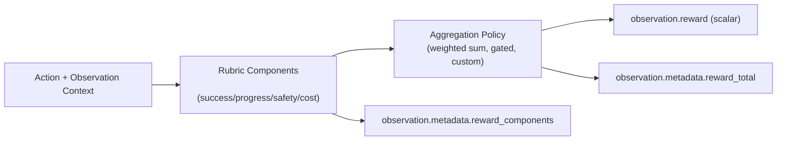

# RFC 006: Multi-Component Reward Signals

**Status**: In Review
**Created**: 2026-04-29
**Authors**: @adithya-s-k
**RFC ID**: 006

## Summary

This RFC extends OpenEnv's reward model from "single scalar only" to a **multi-component reward representation** that remains fully backward compatible with existing training loops.

The key design is simple: environments continue returning a scalar `observation.reward` for optimization, but may additionally attach a structured breakdown of reward components in `observation.metadata`. This enables richer reward engineering patterns (terminal success, dense progress, penalties, shaping, format compliance, safety constraints) while preserving compatibility with current consumers.

This RFC does **not** change the core invariant that rewards are computed inside the environment boundary (RFC 001, RFC 004), and does not expose reward internals as agent-callable tools (RFC 005).

---

## Motivation

### Problem 1: Scalar reward is necessary but insufficient for reward engineering

Today, OpenEnv observations expose one reward scalar:

- `observation.reward: bool | int | float | None` (RFC 002)

This scalar is sufficient for optimization, but it hides where the score came from. For agentic tasks (coding, browsing, tool use), authors often need to combine multiple objectives:

- Outcome success (did task complete?)
- Process quality (did behavior remain safe and efficient?)
- Progress signal (did trajectory improve?)
- Constraint penalties (unsafe commands, policy violations, over-editing)

All of this can be hand-coded into one scalar, but without a standard representation, teams lose introspection, comparability, and debugging.

### Problem 2: Reward hacking is hard to diagnose without component visibility

In policy optimization training, updates depend on relative reward differences. If reward is sparse or conflates incompatible objectives, models can learn shortcuts (e.g., format gaming, shallow hacks) that look good in scalar reward but fail desired behavior.

When only a scalar is logged, it is hard to answer:

- Did performance improve because correctness improved, or because shaping dominated?
- Are penalties actually binding?
- Is "success" high while safety degrades?

### Problem 3: No standard contract for reward decomposition across environments

RFC 004 introduced composable rubrics, but there is no shared output contract for component-level reward reporting. Environment authors use ad-hoc metadata keys, making downstream tooling inconsistent.

### Goals

1. Preserve scalar reward compatibility for existing training loops.
2. Add a standard, typed component schema for reward decomposition.
3. Support common reward styles (binary, sparse, dense, shaping, penalty) without forcing one aggregation strategy.
4. Keep rewards inside the environment boundary and opaque to the agent.
5. Enable gradual migration with zero breakage for existing environments.

---

## Design

### High-Level Model

OpenEnv continues to optimize on a scalar reward per step. Component rewards are optional structured diagnostics that also serve as the source of truth for scalar aggregation when used.



### Core Types

#### RewardComponentType

```python
from enum import Enum

class RewardComponentType(str, Enum):
    BINARY = "binary"      # e.g., task success ∈ {0,1}
    SPARSE = "sparse"      # mostly zero, event-driven non-zero
    DENSE = "dense"        # frequent per-step progress signal
    SHAPING = "shaping"    # guidance term to shape exploration
    PENALTY = "penalty"    # negative constraint/cost term
```

#### RewardComponent

```python
from pydantic import BaseModel, Field
from typing import Any, Dict, Optional

class RewardComponent(BaseModel):
    name: str = Field(..., description="Stable component identifier")
    type: RewardComponentType
    value: float = Field(..., description="Raw component value before weighting")
    weight: float = Field(default=1.0, description="Aggregation weight")
    weighted_value: Optional[float] = Field(
        default=None,
        description="Optional explicit weighted value for transparent logging",
    )
    terminal_only: bool = Field(
        default=False,
        description="True when component is only meaningful at episode end",
    )
    metadata: Dict[str, Any] = Field(default_factory=dict)
```

### Observation Contract (Backward Compatible)

No breaking change to `Observation` fields.

- `observation.reward` remains the scalar optimization target.
- `observation.metadata["reward_components"]` is optional and, when present, follows `list[RewardComponent]` (JSON-serialized).
- `observation.metadata["reward_total"]` is optional but recommended.
- `observation.metadata["reward_aggregation"]` may describe the applied policy (e.g., `weighted_sum_v1`, `gated_weighted_sum_v2`).

### Aggregation Semantics

This RFC standardizes **representation**, not one universal math formula. Environments may choose aggregation policy, but must follow these invariants:

1. If `reward_components` are present, `observation.reward` MUST equal the environment's declared aggregated total for that step.
2. Aggregation MUST be deterministic given action, observation, and environment state.
3. Component names SHOULD be stable across runs for a given environment version.
4. Penalty components SHOULD use negative values by convention (not requirement), to ease analysis.

### Rubric Integration

RFC 004 rubrics remain the computation mechanism. This RFC adds a convention for rubrics to expose structured components.

Suggested pattern:

```python
class MultiComponentRubric(Rubric):
    def evaluate_components(self, action, observation) -> list[RewardComponent]:
        ...

    def aggregate(self, components: list[RewardComponent]) -> float:
        return sum(c.value * c.weight for c in components)

    def forward(self, action, observation) -> float:
        components = self.evaluate_components(action, observation)
        total = self.aggregate(components)

        md = getattr(observation, "metadata", {})
        md["reward_components"] = [c.model_dump() for c in components]
        md["reward_total"] = total
        md["reward_aggregation"] = "weighted_sum_v1"
        observation.metadata = md
        return total
```

### Example: Coding Agent with Bash Tool

A coding environment may combine:

- `task_success` (`binary`, terminal-only)
- `tests_fixed_fraction` (`dense`)
- `unsafe_command` (`penalty`)
- `edit_scope_penalty` (`penalty`)
- `format_compliance` (`sparse` or `binary`)

```python
components = [
    RewardComponent(name="task_success", type="binary", value=1.0, weight=0.5, terminal_only=True),
    RewardComponent(name="tests_fixed_fraction", type="dense", value=0.6, weight=0.25),
    RewardComponent(name="unsafe_command", type="penalty", value=-1.0, weight=0.2),
    RewardComponent(name="edit_scope_penalty", type="penalty", value=-0.3, weight=0.1),
    RewardComponent(name="format_compliance", type="binary", value=1.0, weight=0.05),
]
total = sum(c.value * c.weight for c in components)
```

The trainer still optimizes `total` via `observation.reward`, but now diagnostics can reveal *why* reward moved.

### Training Integrations

This RFC does not require trainer API changes.

- **Optimization path**: unchanged (`observation.reward` scalar)
- **Diagnostics path**: enhanced (`reward_components` metadata)

For grouped relative-reward training methods in particular, where within-batch reward differences drive updates, component visibility helps detect:

- sparse-only collapse (no learning signal before terminal events)
- shaping domination (policy optimizes proxy, not outcome)
- safety constraint drift (success up, penalties up)

### Security and Boundary Constraints

This RFC inherits existing invariants:

1. Rewards stay inside the environment boundary (RFC 001, RFC 004).
2. Agents/harnesses cannot call reward internals as tools (RFC 005).
3. Reward components are observational outputs only; they are not controllable APIs.

---

## What Changes

### Core

1. Add `RewardComponentType` and `RewardComponent` to core reward/rubric module.
2. Add helper utilities:
- `serialize_reward_components(...)`
- optional `aggregate_weighted_sum(...)`
3. Add docs and examples for component emission pattern.

### Environment Authoring

No mandatory migration. Existing rubrics remain valid.

Environments can adopt incrementally:

1. Keep existing scalar reward logic.
2. Add component computation and metadata emission.
3. Optionally refactor scalar to aggregate from components.

### Tooling / Logging

Downstream logging can consume standardized component payloads without custom parsers per environment.

---

## Backward Compatibility

1. `Observation.reward` remains unchanged.
2. Existing clients that ignore metadata continue to function.
3. Existing environments need no code changes.
4. New metadata keys are additive and optional.

---

## Alternatives Considered

### Alternative A: Keep scalar-only and rely on rubric hooks

Pros:

- No new schema.

Cons:

- No cross-environment standard.
- Harder integration for generic logging/analysis tools.
- Re-implements component conventions in every environment.

### Alternative B: Replace scalar reward with vector reward

Pros:

- Native multi-objective expression.

Cons:

- Breaking change for existing training stacks.
- Most RL trainers still require scalar objective unless additional algorithms are introduced.

Rejected for now due to compatibility costs.

### Alternative C: Standardize one fixed aggregation formula

Pros:

- Simpler comparability.

Cons:

- Too restrictive across diverse tasks/domains.

Rejected in favor of standardizing representation + invariants.

---

## Open Questions

1. Should core enforce value ranges (e.g., clip component values) or leave entirely to environments?
2. Should OpenEnv include built-in aggregation containers for common policies (`weighted_sum`, `gated_weighted_sum`) in core rubrics?
3. Should environment metadata expose a static component schema for discoverability (`/metadata`)?

---

## Implementation Plan

### PR 1: This RFC

Submit for review and iterate to consensus.

### PR 2: Core Types + Serialization

1. Add `RewardComponentType`, `RewardComponent`.
2. Add component serialization helpers.
3. Add unit tests for schema validation.

### PR 3: Rubric Helpers

1. Add optional aggregation utilities (weighted sum, validation helper).
2. Add tests for deterministic aggregation + invariants.

### PR 4: Reference Environment Migration

1. Migrate one environment (recommended: `repl_env`) to emit `reward_components`.
2. Keep `observation.reward` fully compatible.
3. Add snapshot tests for metadata payload.

### PR 5: Docs and Training Guidance

1. Add docs section: scalar optimization + component diagnostics.
2. Add training-loop logging example.
3. Update reward RFC index references.

---

## References

- RFC 001: OpenEnv Basic Abstractions
- RFC 002: OpenEnv Framework Spec
- RFC 004: Rubric System for Reward Computation
- RFC 005: Agentic Harness Integration
- OpenReward Standard concepts: [Rewards](https://openrewardstandard.io/concepts/rewards)
