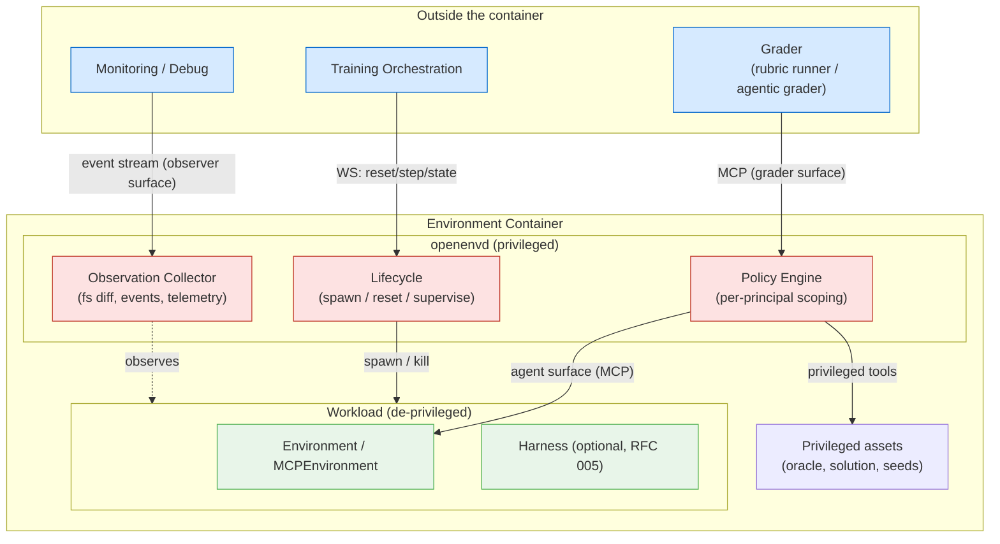

# RFC 009: openenvd — Privileged Environment Sidecar with Policy-Scoped Surfaces

**Status**: Draft
**Created**: 2026-08-04
**Authors**: @zkwentz (idea credit: Adithya S Kolavi)
**RFC ID**: 009

## Summary

OpenEnv today distinguishes exactly two principals: the **agent** (MCP tools) and the
**infrastructure** (Gym-like `reset`/`step`/`state`). Everything that doesn't fit one of those
two boxes — harness observation streams, agentic graders, oracle replay, telemetry collection —
gets hand-rolled per environment or per adapter, usually by carefully *not* exposing a port or
by prefixing a tool name.

This RFC proposes **openenvd**: a privileged daemon that runs alongside the environment workload
and becomes the single enforcement point for *policy-scoped surfaces*. Instead of two hardcoded
boundaries, openenvd exposes N surfaces, each bound to a declared **principal** (agent, grader,
observer, orchestrator) with its own **policy** (which tools, which filesystem paths, which
lifecycle controls). The agent keeps exactly what it has today. Graders get an *expanded* surface
(read the solution, replay the oracle, inspect full state) without those affordances ever being
reachable from the agent's surface. Harness integrations get observation and process supervision
from a component that the harness cannot see, replacing RFC 005's per-adapter isolation
conventions with structural enforcement.

Nothing changes for existing environments: openenvd is opt-in, and when absent, the current
two-boundary model is unchanged.

---

## Motivation

### Problem 1: Privilege separation is enforced by convention, not structure

RFC 005's "Harness Security Boundary" section is a list of things adapters must remember to do:
don't expose the orchestration port inside the container's network namespace, use
`unshare --net` on non-Docker deployments, never inject reward tools, keep
`RESERVED_TOOL_NAMES` out of the bridge config. Each is correct, and each is a convention that
every new adapter, environment, and deployment mode must re-implement and can silently get wrong.
The invariant "agents cannot reset" (INVARIANTS.md, RFC 001) deserves a structural home — one
component whose job is to make the violation impossible rather than discouraged.

### Problem 2: Graders need affordances the agent must never have

RFC 008's contract graders make this concrete. "Oracle replay" needs to execute the privileged
solution script. "No solution leakage" needs to read the solution in order to verify the agent
*can't*. "Denied egress" needs to observe network activity. And the thread that prompted this RFC
points further: **agentic graders** — an LLM-driven grader that inspects the environment after
(or during) an episode — need a distinct or expanded set of tools: read any file, diff the
filesystem against the initial snapshot, query internal state, run test suites with elevated
access.

Today there is nowhere to put such a surface. The MCP endpoint is the *agent's* surface; adding
grader tools to it leaks them to the agent. Rubrics run in-process on the server, which works for
programmatic scoring but gives an agentic grader no tool surface at all. The result is that
grader affordances get smuggled in as "domain tools the agent hopefully won't call" or built as
one-off side channels.

### Problem 3: Observation of the workload is per-adapter plumbing

RFC 005 defines `HarnessEvent` streams, but the collection point is the adapter — inside the same
trust zone as the process being observed. A harness (or an agent using shell access) can in
principle tamper with its own observation stream. Training-time telemetry (filesystem diffs,
process trees, network activity, resource usage) is rebuilt ad hoc per environment. A privileged
observer that the workload cannot see or affect gives one collection point with integrity
guarantees, usable by harness adapters, graders, and debugging tools alike.

### Goals

1. Introduce a single privileged component (**openenvd**) that owns lifecycle, supervision, and
   privileged resources inside the environment boundary.
2. Generalize the dual API boundary into **policy-scoped surfaces**: N principals, each with a
   declared policy, structurally isolated from one another.
3. Give verification a first-class **grader surface**: expanded MCP tools scoped to graders,
   never reachable from the agent surface (serves RFC 008 contract graders and agentic graders).
4. Make RFC 005's harness security boundary structural: the harness runs as a de-privileged
   child of openenvd, observation happens from outside its trust zone.
5. Remain fully backward compatible and opt-in.

### Non-Goals

- Replacing container-level sandboxing (Docker/gVisor/Firecracker). openenvd operates *inside*
  the environment boundary; the outer sandbox is unchanged.
- Defining new reward semantics. Rewards stay inside the environment (RFC 004); openenvd only
  changes *where grader code gets its affordances*, not who owns the reward.
- Multi-tenant serving. One env = one trajectory is preserved; openenvd supervises one workload.

---

## Design

### Key Insight: Policies Attach to Principals, Not to Endpoints

The current architecture encodes policy positionally: *this* port is for infrastructure, *that*
endpoint is for the agent. That works for exactly two principals and breaks the moment a third
appears (a grader, an observer, a harness supervisor). The generalization is to name the
principals and declare their policies, then have one privileged component mint surfaces from
those declarations:

| Principal | Surface | Typical policy |
|-----------|---------|----------------|
| `orchestrator` | Gym-like WebSocket (`reset`/`step`/`state`) | Full lifecycle control (unchanged) |
| `agent` | MCP endpoint (unchanged) | Domain tools only; no lifecycle, no reward, no solution paths |
| `grader` | Second MCP endpoint | Domain tools **plus** privileged tools: read-all filesystem, snapshot diff, oracle replay, state introspection |
| `observer` | Event/telemetry stream (read-only) | `HarnessEvent`s, fs/process/network telemetry; no tools, no mutation |

The agent surface is byte-for-byte what exists today. The other three are the same *kind* of
thing (a surface bound to a policy) rather than three bespoke mechanisms.

### Architecture Overview



Structural properties:

- **openenvd is the parent**: it spawns the workload (environment server and, when present, the
  harness) as de-privileged children — separate user, working directory, and (where supported)
  network namespace. The workload cannot reach openenvd's control surfaces because they are not
  present in its namespace, not because a config file said so.
- **Privileged assets live on openenvd's side of the line**: oracle scripts, solution files, and
  seeds are readable by openenvd and exposed only through grader-surface tools. RFC 008's "no
  solution leakage" check becomes verifiable by construction: the solution is not in the
  workload's filesystem view at all.
- **Observation is external to the observed**: the collector reads the workload's filesystem,
  process table, and event pipes from outside the workload's trust zone. A harness cannot tamper
  with its own trace.

### Core Abstractions

#### Principal and SurfacePolicy

```python
class Principal(str, Enum):
    """Who is on the other end of a surface."""
    ORCHESTRATOR = "orchestrator"   # training loop; Gym-like API
    AGENT = "agent"                 # the policy being trained/run; MCP
    GRADER = "grader"               # verification; expanded MCP
    OBSERVER = "observer"           # read-only telemetry stream


class SurfacePolicy(BaseModel):
    """What a principal's surface may expose.

    Attributes:
        principal (`Principal`):
            The principal this policy binds to.
        tools (`list[str]`):
            Tool names exposed on this surface. Supports globs
            (`"env.*"`, `"grader.*"`). Reserved lifecycle names
            (`reset`, `step`, `state`, `close`) are rejected for
            `AGENT` at validation time.
        fs_read (`list[str]`):
            Path globs readable through surface tools. The agent
            surface never lists privileged asset paths.
        allow_lifecycle (`bool`):
            Whether the surface may control episode lifecycle.
            Forced to `False` for `AGENT` and `OBSERVER`.
        allow_privileged_exec (`bool`):
            Whether the surface may run privileged scripts
            (oracle replay). Only meaningful for `GRADER`.
    """
    principal: Principal
    tools: list[str] = []
    fs_read: list[str] = []
    allow_lifecycle: bool = False
    allow_privileged_exec: bool = False
```

Policies are **declared in `openenv.yaml`** (and surfaced in the RFC 008 normalized manifest, so
validation can check them) rather than constructed in code:

```yaml
# openenv.yaml (excerpt)
openenvd:
  enabled: true
  surfaces:
    agent:
      tools: ["env.*"]                # unchanged from today
    grader:
      tools: ["env.*", "grader.*"]
      fs_read: ["/workspace/**", "/openenvd/assets/**"]
      allow_privileged_exec: true     # oracle replay
    observer:
      stream: ["harness_events", "fs_diff", "process", "network"]
  privileged_assets:
    oracle: assets/oracle.sh
    solution: assets/solution/
```

#### Grader Surface

The grader surface is a second MCP endpoint (`/mcp/grader`) minted by openenvd. It exposes the
environment's domain tools **plus** a standard privileged toolset:

```python
# Standard grader tools provided by openenvd (not by env authors):
#   grader.read_file(path)          — read any policy-permitted path
#   grader.fs_diff(since="reset")   — filesystem diff vs. episode-start snapshot
#   grader.run_oracle()             — execute the privileged oracle script, return its result
#   grader.get_full_state()         — env state including fields hidden from the agent
#   grader.get_trajectory()         — full event history for the episode
```

Two consumption modes, both outside the agent's reach:

1. **Programmatic graders** (RFC 008 contract graders, RFC 004 rubrics): call grader tools as a
   library client. Oracle replay, no-solution-leakage, and egress checks become straightforward
   clients of this surface instead of bespoke harness code.
2. **Agentic graders**: an LLM-driven grader is pointed at `/mcp/grader` exactly the way an agent
   is pointed at `/mcp`. It explores, reads, replays, and returns a judgment. Same protocol, a
   different — deliberately expanded — set of affordances.

The reward boundary is unchanged: grader output feeds reward computation *inside* the environment
boundary (RFC 004). What moves is only where the grader's hands are — from "hopefully the agent
doesn't call these tools" to a surface the agent cannot reach.

#### Observer Surface

A read-only stream endpoint carrying typed events:

```python
class ObservationEventType(str, Enum):
    HARNESS_EVENT = "harness_event"   # RFC 005 HarnessEvent passthrough
    FS_CHANGE = "fs_change"           # path, kind (create/modify/delete)
    PROCESS = "process"               # spawn/exit in the workload
    NETWORK = "network"               # connection attempts (allowed/denied)
    RESOURCE = "resource"             # cpu/mem/disk samples
```

Harness adapters (RFC 005) publish their `HarnessEvent`s to openenvd instead of buffering them
adapter-side; the collector adds what the workload can't self-report (fs, process, network).
Consumers: `env.trajectory`, training-time monitoring, RFC 008 runtime checks (e.g. "network
egress denied by default" reads `NETWORK` events instead of instrumenting each env).

#### Lifecycle Ownership

openenvd owns the orchestration surface and workload supervision:

- `reset()` → openenvd kills the workload process tree, restores the filesystem snapshot, spawns
  a fresh workload, then delegates to the environment's `reset_async()`. Crash recovery and
  `session_timeout_s` enforcement (RFC 005) move here from adapters.
- The Gym-like WebSocket binds in openenvd's namespace. The workload's namespace contains only
  its own MCP surface. "Agents cannot reset" stops being a routing rule and becomes a property of
  the process tree.

### Deployment Shapes

**Chosen approach**: openenvd is **PID 1 inside the existing environment container** (a
supervisor process), not a separate sidecar container.

**Rationale**: keeps the "one container = one env = one trajectory" model and the existing
Docker/HF Spaces packaging unchanged; filesystem snapshotting and process supervision are
straightforward for a parent process; no pod orchestration required.

**Trade-offs**: weaker isolation than a two-container pod (shared kernel namespace unless we
apply per-child namespaces). Mitigation: openenvd applies user separation always, and network/
mount namespace separation where the runtime allows it. A two-container pod shape (true sidecar)
remains a compatible future deployment for Kubernetes-native hubs — the surfaces and policies are
identical; only the enforcement mechanism strengthens.

### Enforcement Mechanisms (v1)

| Boundary | Mechanism |
|----------|-----------|
| Workload cannot reach orchestrator/grader/observer surfaces | Surfaces bind outside the workload's network namespace; fallback: loopback ports + per-child UID and firewall rules where namespaces are unavailable |
| Workload cannot read privileged assets | Assets stored under openenvd-owned paths (`/openenvd/assets`), mode `0700`, different UID; excluded from the workload's mount view where supported |
| Grader tools unavailable on agent surface | Policy engine mints each surface's tool list independently; `AGENT` policy validation rejects `grader.*` and reserved names |
| Observation integrity | Collector runs in openenvd's process; event pipes are write-only from the workload side |

v1 explicitly does **not** claim kernel-grade security (that's the outer sandbox's job). The bar
is: no *accidental* privilege leakage, and structural rather than conventional enforcement of the
existing invariants.

### Backward Compatibility

- `openenvd.enabled: false` (the default) → nothing changes. The HTTP/WS server runs exactly as
  today; there is no grader or observer surface.
- The agent-facing MCP surface is unchanged in both modes.
- RFC 005 harness adapters work unchanged; when openenvd is enabled they may delegate process
  supervision and event collection to it (adapter code shrinks, semantics identical).
- RFC 008 validation gains an optional check: if a manifest declares `openenvd` surfaces, the
  policy declarations are validated (agent surface must not include privileged tools or asset
  paths).

---

## Examples

### Example 1: Agentic grader for a coding environment

```python
from openenv.core import MCPClient

# The agent worked at /mcp. The grader connects to the expanded surface.
grader_client = MCPClient("http://env-host:8000/mcp/grader")

# An LLM-driven grader session: same protocol as an agent, more affordances
tools = grader_client.list_tools()
# [... all domain tools ..., grader.read_file, grader.fs_diff,
#  grader.run_oracle, grader.get_full_state, grader.get_trajectory]

diff = grader_client.call_tool("grader.fs_diff", {"since": "reset"})
oracle = grader_client.call_tool("grader.run_oracle", {})
# grader LLM reasons over diff + oracle output + trajectory, emits a score
```

### Example 2: RFC 008 contract grader (no-solution-leakage) as a surface client

```python
def check_no_solution_leakage(agent_surface, grader_surface) -> CheckResult:
    solution = grader_surface.call_tool("grader.read_file", {"path": "assets/solution/answer.txt"})
    # The agent surface must be structurally unable to read it:
    result = agent_surface.call_tool("read_file", {"path": "/openenvd/assets/solution/answer.txt"})
    return CheckResult(passed=result.is_error, evidence=result)
```

### Example 3: Harness observation without adapter buffering

```python
# Training-side monitor: watch a harness work, from outside its trust zone
async for event in observer_stream("ws://env-host:8000/observe"):
    if event.type == ObservationEventType.NETWORK and event.data["denied"]:
        log.warning("harness attempted egress to %s", event.data["dest"])
    elif event.type == ObservationEventType.HARNESS_EVENT:
        record(event.data)  # RFC 005 HarnessEvent
```

### Example 4: Environment opts in via openenv.yaml only

```yaml
openenvd:
  enabled: true
  surfaces:
    agent:  { tools: ["env.*"] }
    grader: { tools: ["env.*", "grader.*"], allow_privileged_exec: true }
  privileged_assets:
    oracle: assets/oracle.sh
```

No environment code changes: the standard grader tools are provided by openenvd, and the
environment's existing `MCPEnvironment` tools appear on both surfaces per policy.

---

## Key Design Decisions

1. **Generalize to policy-scoped surfaces vs. adding a one-off grader endpoint.**
   Chosen: general principals + policies. A bespoke `/mcp/grader` endpoint would solve RFC 008's
   immediate need but leave harness observation and future principals (e.g., a human debugging
   surface) as new one-offs. The policy model makes the third, fourth, and fifth surface cheap
   and uniformly validated. Trade-off: more upfront design surface; mitigated by shipping only
   the four named principals in v1 (no user-defined principals yet).

2. **openenvd as in-container supervisor vs. sidecar container.**
   Chosen: in-container PID 1 (see Deployment Shapes). Preserves packaging; sidecar remains a
   strictly-stronger future deployment of the same contract.

3. **Standard grader tools provided by openenvd vs. authored per environment.**
   Chosen: openenvd ships `grader.read_file` / `fs_diff` / `run_oracle` / `get_full_state` /
   `get_trajectory`; environments add domain-specific grader tools only if they need them.
   Rationale: RFC 008's contract graders must work on *every* environment without per-env code —
   that only holds if the baseline toolset is framework-provided.

4. **Policies declared in `openenv.yaml` vs. constructed in code.**
   Chosen: declarative. Declarations land in the RFC 008 normalized manifest, so hubs and
   `openenv validate` can check them statically (e.g., reject a manifest whose agent surface
   includes `grader.*`). Code-constructed policies would be invisible to validation.

5. **Agent surface is frozen.** openenvd must not change a single byte of the agent's view — no
   new tools, headers, or metadata that would let a trained policy detect whether openenvd is
   present. Training/eval parity requires the agent's world to be identical in both modes.

---

## Relationship to Existing RFCs

- **RFC 001 / INVARIANTS**: "agents cannot reset" and the dual API boundary are preserved and
  strengthened — the two existing boundaries become two of the four named principals, enforced
  structurally.
- **RFC 003 (MCP)**: the grader surface reuses the MCP transport and tool model wholesale; no
  protocol changes.
- **RFC 004 (Rubrics)**: rubrics remain the reward owner. A rubric may *use* the grader surface
  (especially `LLMJudge`-style agentic grading) but the reward still materializes inside the
  environment boundary.
- **RFC 005 (Harnesses)**: openenvd subsumes the hand-rolled security boundary (network
  isolation, tool scoping, timeout enforcement) and gives `HarnessEvent` collection an
  integrity-preserving home. Adapters keep their protocol duties (start/stop/send_message).
- **RFC 008 (Auto-validation)**: contract graders and agentic graders become clients of the
  grader surface; surface policies are validated as part of the manifest.

## Future Work (Out of Scope)

- **User-defined principals** beyond the four named ones.
- **Sidecar-container deployment shape** for pod-native hubs (same contract, stronger isolation).
- **Mid-episode grader access policies** (e.g., grader may only connect after `done`) — v1 allows
  operator-side discipline; a declarative episode-phase policy can follow.
- **Signed observation streams** for audit-grade trajectory provenance.

## Implementation Plan

### PR 1: This RFC
Review and consensus on principals, surfaces, and the deployment shape.

### PR 2: Types and policy validation
`Principal`, `SurfacePolicy`, `openenv.yaml` schema extension, manifest integration (RFC 008),
static policy validation. No runtime behavior.

### PR 3: openenvd core
Supervisor process (spawn/reset/supervise), surface minting, agent surface passthrough
(byte-identical), orchestration WS relocation behind a feature flag.

### PR 4: Grader surface
Standard grader toolset, `/mcp/grader` endpoint, privileged asset handling, one RFC 008
contract grader (oracle replay) ported as the reference client.

### PR 5: Observer surface + harness integration
Event collector, `/observe` stream, RFC 005 adapter delegation, egress-observation events.

---

## References

- Slack: [#openenv-colab thread](https://reflection-ai.slack.com/archives/C09FNMB4BK3/p1785810542784819) — original openenvd idea (Adithya S Kolavi) and the agentic-grader extension
- RFC 001: Basic Abstractions (dual interface, agents-cannot-reset)
- RFC 003: MCP Support
- RFC 004: Rubric System (rewards inside the environment)
- RFC 005: Agentic Harness Integration (harness security boundary this RFC formalizes)
- RFC 008: Environment Auto-Validation (contract graders, normalized manifest)
- [INVARIANTS.md](../.claude/docs/INVARIANTS.md)
