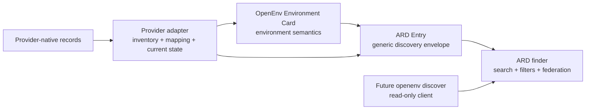
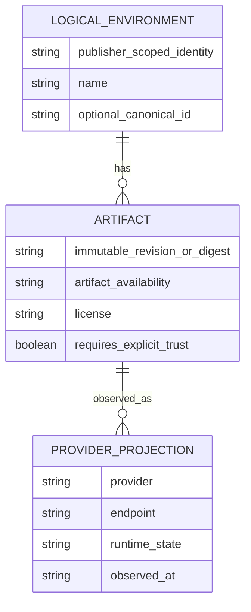
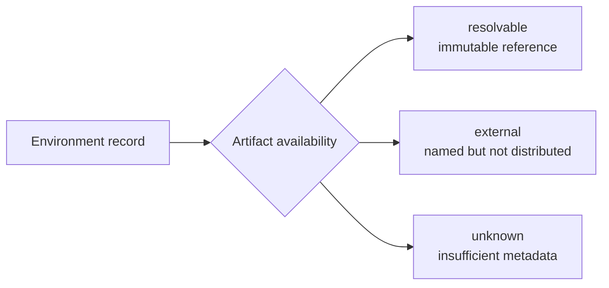
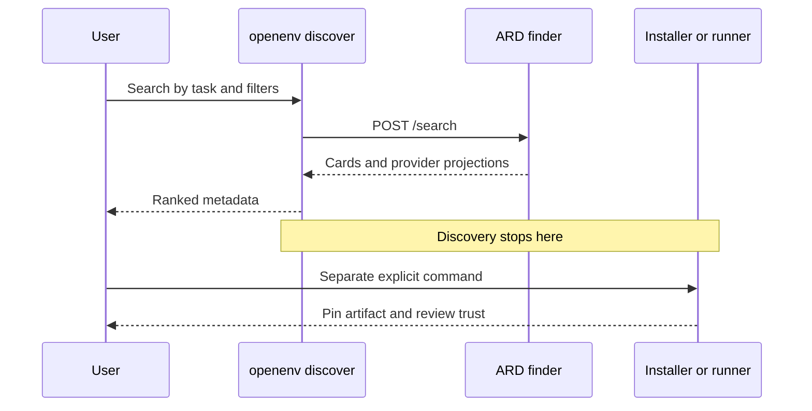
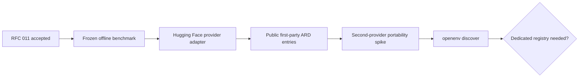

# RFC 011: ARD-backed catalog discovery for portable environments

**Status**: Draft
**Created**: 2026-08-27
**Authors**: @thegovind
**RFC ID**: 011

## Summary

OpenEnv can list installed environment packages, resolve a known Hugging Face
repository, and connect to a known endpoint. It cannot answer a different
question: "Which environment should I use for this task?" across environments
the user does not already know.

This RFC proposes catalog discovery through
[Agentic Resource Discovery (ARD)](https://github.com/ards-project/ard-spec).
ARD supplies the generic entry, search, and federation contract. OpenEnv
supplies an experimental Environment Card that defines what a portable RL
environment is. A provider adapter enumerates its native inventory, maps static
metadata into cards, and attaches current provider state to search results.

Discovery is metadata-only. It does not install code, pull images, start or wake
a deployment, reset or step an environment, or call an MCP tool. The proposal
adds no runtime protocol and does not make ARD an OpenEnv dependency. This RFC
ships no implementation. Implementation starts only if a preregistered offline
inventory and ranking benchmark beats the current baseline on held-out queries.

## Motivation

### Problem statement

Several existing features use the word "discovery," but none is a remote
catalog search:

| Surface | Input | What it finds | Side effects |
| --- | --- | --- | --- |
| `EnvironmentDiscovery` in `src/openenv/auto/_discovery.py` | Current Python environment | Installed `openenv-*` distributions and their packaged manifests | Reads package metadata and a local cache |
| `AutoEnv.from_env("owner/repo")` in `src/openenv/auto/auto_env.py` | Known repository ID | One explicitly named Hugging Face Space or package | May probe a deployment and install publisher code |
| `docs/source/environments.md` and `scripts/manage_hf_collection.py` | Curated list or Hugging Face inventory | Provider-specific environment records | Maintainer-operated publication workflow |
| Proposed catalog discovery | Task description and filters | Unknown environments across indexed providers | Reads catalog metadata only |

The missing path matters before execution. A user needs to know:

1. Does an environment for this task exist?
2. Who published the record and who claims to own the artifact?
3. Is there an immutable artifact, or is the environment external?
4. Which interfaces are declared or validated?
5. What code or deployment would a later explicit command trust?

The current Hugging Face data also shows why search cannot define inventory. On
2026-08-26, enumeration found 14 public Spaces in the first-party `openenv/*`
author set. Thirteen matched the proposed eligibility rule of Docker SDK plus
the exact `openenv` tag. Direct Hub semantic retrieval found 2 of those 13 with
running-only defaults and 7 of 13 when non-running candidates were included.
The deployed typed `hf-discover` Space search returned no raw Space results for
the tested queries.

These measurements are feasibility evidence, not a benchmark result. They show
that search cannot define inventory. An independently audited provider snapshot
defines ground truth, and search ranks that bounded inventory afterward.

### Goals

- Search for an unknown environment by task through one read-only contract.
- Keep ARD generic while giving OpenEnv environments a domain-specific card.
- Support public, private, external, and non-distributable environments without
  claiming that each has a pullable artifact.
- Keep logical identity, immutable artifacts, and current deployments separate.
- Surface license, provenance, interface evidence, and remote-code trust before
  any execution step.
- Preserve the orchestration and agent interface boundary.
- Reuse RFC 008 validation contracts when they land instead of creating a
  second normalized manifest or report format.
- Prove provider portability with a second-provider portability spike before
  considering a dedicated registry.

### Non-goals

- No registry service, crawler, queue, submission API, or index host in this
  repository.
- No ranking service in this repository.
- No implementation of `openenv discover` in this RFC.
- No change to `AutoEnv`, `EnvironmentDiscovery`, `EnvClient`, `openenv push`,
  or `openenv.yaml`.
- No new runtime endpoint or third interface alongside orchestration and MCP.
- No automatic injection of catalog results into the prompt or tool surface of
  the agent being trained, and no discovery-initiated install, invocation, or
  selection for execution.
- No v0.1 representation of harness-specific streaming surfaces from RFC 005.
  The card records OpenEnv orchestration and evidenced agent tools only.
- No automatic install, deployment, wake-up, or tool invocation.
- No generic deployment schema. That work remains with
  [ards-project/ard-spec#44](https://github.com/ards-project/ard-spec/issues/44).
- No trust reputation system, signing scheme, or new attestation format.
- No quality gate. Discovery may show validation evidence, but operator policy
  decides whether an environment is accepted.
- No fuzzy cross-provider deduplication.

## Design

### 1. Ownership

ARD, OpenEnv, and provider adapters own different layers:



- **ARD owns** the entry envelope, `POST /search`, filters, referrals, and
  federation behavior.
- **OpenEnv owns** the Environment Card, environment identity semantics,
  artifact rules, and interface roles.
- **Each provider adapter owns** native enumeration, provider facts, card
  generation, and current provider projections.
- **A finder owns** indexing, ranking, pagination, and freshness policy.
- **OpenEnv does not own** the provider's runtime state or the registry's
  ranking algorithm.

ARD does not crawl a Hub by itself. A Hub is searchable only when it publishes
ARD entries or a queried finder has an adapter for that Hub.

This RFC targets ARD v0.91 at commit
[`aa3e598`](https://github.com/ards-project/ard-spec/commit/aa3e598bb7752a9175897823234311216acfa864).
ARD is pre-1.0. An implementation must pin the supported ARD revision and treat
unknown or changed fields as unknown rather than guessing.

### 2. Resource model

One environment is represented at three layers:



#### Logical environment

The logical environment is the stable domain concept, such as "Echo
Environment." It can have several artifact versions and several provider
projections.

The ARD `identifier` identifies the published record under the authority that
minted it. It is not automatically a cross-provider canonical identity.

#### Artifact

Each resolvable v0.1 Environment Card describes exactly one immutable
environment revision. Different revisions are different cards and may be
related with `version_of`. `artifacts` may list multiple immutable
representations of that revision, but each representation must identify the
evidence that binds it to the source revision. What evidence is sufficient is
part of Open Question 2.

Card-level `license`, `interfaces`, `requires_explicit_trust`, and `validation`
claims apply to that revision unless a field explicitly identifies a narrower
artifact. Artifact metadata remains meaningful when every deployment is
stopped.

`artifact_availability` is one of:

- `resolvable`: the record contains an immutable artifact reference.
- `external`: the environment exists, but the catalog cannot distribute or
  verify its artifact.
- `unknown`: the adapter cannot establish either state.

This field does not mean "running now." That is provider state.

#### Provider projection

A provider projection describes one current deployment or hosting view. It may
include the provider, endpoint, region, runtime state, and observed timestamp.
It is dynamic finder output, not part of the static Environment Card.

Provider projections must bind to the artifact revision they were observed
against. A projection for another revision is stale and must not be silently
carried forward.

Execution-provider offers, jobs, training configuration, evaluation runs,
rollouts, and traces are out of scope for this RFC and are not Environment Card
fields. Discovery does not imply an offer or an executable action.

### 3. OpenEnv Environment Card

The proposed media type is:

```text
application/vnd.openenv.environment-card+json
```

ARD intentionally keeps its `type` term open. The OpenEnv media type is an
extension type, not a request to add an OpenEnv concept to ARD core.

The initial card is experimental. Its schema version is independent of the
current `openenv.yaml` `spec_version`, which is emitted and recorded today but
is not a complete catalog compatibility contract.

#### Card fields

| Field | Requirement | Meaning |
| --- | --- | --- |
| `schema_version` | Required | Version of the Environment Card shape |
| `environment_spec_version` | Required | OpenEnv environment protocol compatibility claim |
| `name` | Required | Human-readable environment name |
| `description` | Required | Short task-oriented description |
| `owner` | Required | Artifact-owner claim or the literal `unknown`; separate from the ARD publisher |
| `canonical_id` | Optional | Cross-provider identity assertion from an authority the consumer trusts |
| `source` | Required | Provider-native record identity and environment locator; resolvable cards also require the source revision; provider profiles define concrete fields and stability guarantees |
| `artifact_availability` | Required | `resolvable`, `external`, or `unknown` |
| `artifacts` | Conditional | One or more immutable representations of the card's single revision when availability is `resolvable` |
| `license` | Required | SPDX expression, `other`, or `unknown`; never inferred |
| `license_url` | Conditional | Required when `license` is `other` |
| `interfaces` | Required | One orchestration descriptor plus optional agent-tools descriptors |
| `requires_explicit_trust` | Required | Whether a later operation must explicitly trust catalog-supplied remote code |
| `validation` | Conditional | Required when an agent-tools descriptor has `status: validated` |

Omission and an explicit sentinel mean different things:

- Fields where silence may look permissive or safe, such as `license`, require
  the explicit value `unknown`.
- Optional capability claims are omitted when there is no evidence. Omission
  means unknown, not absent.

`source` is a revision-bound locator, not canonical environment identity. A
provider profile must define which identifier remains stable across mutable
names or transfers, how an environment is located within a multi-environment
record, and how a source revision is made immutable. One provider record may
therefore yield multiple cards distinguished by locator and revision.

A resolvable card carries exactly one revision. Where present,
`source.revision`, every `artifacts[].revision`, and every
`interfaces[].source_revision` must be identical. `source.revision` is
authoritative. A card whose revision fields disagree is invalid.

Adapters must preserve the authoritative source and revision for mapped
claims. They must not promote provider heuristics to authoritative card claims.
Missing or conflicting license evidence yields `unknown`; unsupported optional
claims are omitted.

#### Example card

This example uses a real immutable source revision from the Echo Space. It
intentionally reports `license: unknown` and makes no cross-provider canonical
identity claim.

```json
{
  "schema_version": "0.1-draft",
  "environment_spec_version": 1,
  "name": "echo_env",
  "description": "A deterministic environment for testing OpenEnv clients and training infrastructure.",
  "owner": {
    "authority": "huggingface.co",
    "id": "openenv"
  },
  "source": {
    "provider": "huggingface",
    "id": "openenv/echo_env",
    "revision": "2b73c927ac6e70a55555efeabdc58bf4c448dfba"
  },
  "artifact_availability": "resolvable",
  "artifacts": [
    {
      "kind": "git",
      "uri": "https://huggingface.co/spaces/openenv/echo_env",
      "revision": "2b73c927ac6e70a55555efeabdc58bf4c448dfba"
    }
  ],
  "license": "unknown",
  "interfaces": [
    {
      "role": "orchestration",
      "protocol": "openenv",
      "version": "1"
    },
    {
      "role": "agent-tools",
      "protocol": "mcp",
      "status": "declared",
      "source_revision": "2b73c927ac6e70a55555efeabdc58bf4c448dfba"
    }
  ],
  "requires_explicit_trust": true
}
```

The example is not a normative schema file. A schema is an implementation
artifact after RFC acceptance.

`source.id` in this example is the Hugging Face provider-native locator. A
Hugging Face provider profile defining a transfer-stable identity remains part
of Open Question 3.

`environment_spec_version` is the integer compatibility claim derived from the
OpenEnv manifest. `interfaces[].version` is the protocol descriptor's string
version. They are separate version axes and must not be coerced into one field.

### 4. Identity and relationships

Several identities appear in one result:

| Identity | Example | Authority |
| --- | --- | --- |
| ARD publisher claim | `huggingface.co` in `urn:air:huggingface.co:...` | Authority anchor claimed by the record; verified through ARD trust data |
| Provider-native source | `openenv/echo_env` | Hugging Face |
| Artifact owner claim | `openenv` | Card claim, checked against provider facts |
| Immutable artifact | Commit `2b73c9...` | Source repository |
| Optional canonical ID | Omitted in the example | Trusted asserting authority |
| Deployment host | `*.hf.space` | Provider projection |

The adapter must preserve both facts and claims. The publisher segment in an
ARD identifier is an authority claim, not proof by itself. ARD's optional
`trustManifest` carries publisher-identity and provenance inputs for
verification under the applicable trust framework; presence alone proves
nothing. A finder may display the publisher as verified only after that
verification succeeds. A finder that verifies a `trustManifest` must enforce
ARD section 4.5.1 publisher-authority binding. An entry whose trust domain does
not align with its publisher segment is rejected from verified results or
shown as unverified.

The OpenEnv `owner` field is a separate artifact-owner claim. It may differ
from the record publisher, as with republished upstream software.

ARD trust data and OpenEnv trust fields do not duplicate each other:

- ARD `trustManifest` supplies record-publisher identity and provenance inputs;
  verified status is a finder result, not a card claim.
- OpenEnv `owner` states who the card claims owns the environment artifact.
- OpenEnv `requires_explicit_trust` tells a later executor whether
  catalog-supplied remote code requires an explicit user decision.

`canonical_id` is optional. A finder may use it only when its trust policy
accepts the authority that made the assertion. An adapter must not synthesize a
canonical ID from a display name, repository slug, or model-generated
similarity.

Deduplication is layer-specific:

- Equal immutable digests establish artifact identity. They do not alone merge
  two logical environments.
- Logical environments merge only on a trusted canonical or `same_as`
  assertion.
- A provider adapter may emit a `version_of` relationship inside one verified
  publisher namespace. This is a relationship, not a collapse.
- Provider projections never merge.
- Near matches without trusted identity evidence remain separate and may be
  shown as related.

### 5. Interface claims

#### Orchestration

Every card carries exactly one minimal orchestration descriptor:

```json
{
  "role": "orchestration",
  "protocol": "openenv",
  "version": "1"
}
```

The descriptor declares role and compatibility only. It does not list
`reset`, `step`, `state`, endpoints, transports, server mode, or liveness.
Those details either belong to the OpenEnv protocol or to a dynamic provider
projection.

Anything labelled `role: orchestration` must not be copied into an
agent-facing capability list, tool list, or prompt. Root ARD `capabilities`
must not contain simulation controls.

#### Agent tools

Agent-facing interfaces are optional. When an agent-tools descriptor is
present, its `status` is:

- `declared`: a publisher or manifest claim, with its source revision.
- `validated`: evidence produced for the same artifact revision.

The descriptor is omitted when there is no evidence. Omission means unknown.
It must not be rendered as "no tools."

A validated descriptor is legal only when the card-level `validation`
reference resolves to an RFC 008 report whose
`runtime.tool_declaration_accuracy` result passed and whose embedded source
digest matches the artifact. The report also supplies its existing policy,
lane, and verdict fields. The RFC 008 contract PR must define an immutable
report reference before any adapter emits `status: validated`. Until then an
adapter may emit `declared` or omit the agent-tools descriptor.

Endpoint reachability is not MCP evidence. OpenEnv can expose an MCP endpoint
even when an environment has no MCP tools. Validation must inspect the
interface and bind its result to the artifact revision.

An agent tool that provides simulation control is an invalid OpenEnv card,
regardless of its name. Names such as `reset`, `step`, or `state` trigger a
diagnostic because they are likely boundary violations, but a name alone is
not a semantic proof. Conversely, a harmless name does not make a
simulation-control tool safe. A consumer must not silently remove a suspect
tool and upgrade the remaining card to valid.

RFC 008's `runtime.tool_declaration_accuracy` can verify that the declared tool
surface matches the runtime. It does not verify the semantic
agent/orchestration boundary. Before any card claims that boundary was
validated, RFC 008 needs a distinct check such as
`runtime.orchestration_boundary`. Until then the boundary is a required card
invariant reviewed by the adapter, not a mechanically certified claim.

### 6. ARD carriage

For v0.1, an Environment Card is carried inline as the `data` value of an ARD
Entry. Carriage by `url`, and the authorization-preserving dereference it would
require, are deferred to Open Question 13.

```json
{
  "@context": "https://agenticresourcediscovery.org/context/v1",
  "identifier": "urn:air:huggingface.co:space:openenv:echo_env",
  "displayName": "Echo Environment",
  "type": "application/vnd.openenv.environment-card+json",
  "data": {
    "schema_version": "0.1-draft",
    "environment_spec_version": 1,
    "name": "echo_env",
    "description": "A deterministic environment for testing OpenEnv clients and training infrastructure.",
    "owner": {
      "authority": "huggingface.co",
      "id": "openenv"
    },
    "source": {
      "provider": "huggingface",
      "id": "openenv/echo_env",
      "revision": "2b73c927ac6e70a55555efeabdc58bf4c448dfba"
    },
    "artifact_availability": "resolvable",
    "artifacts": [
      {
        "kind": "git",
        "uri": "https://huggingface.co/spaces/openenv/echo_env",
        "revision": "2b73c927ac6e70a55555efeabdc58bf4c448dfba"
      }
    ],
    "license": "unknown",
    "interfaces": [
      {
        "role": "orchestration",
        "protocol": "openenv",
        "version": "1"
      },
      {
        "role": "agent-tools",
        "protocol": "mcp",
        "status": "declared",
        "source_revision": "2b73c927ac6e70a55555efeabdc58bf4c448dfba"
      }
    ],
    "requires_explicit_trust": true
  },
  "description": "A deterministic environment for testing OpenEnv clients and training infrastructure.",
  "tags": [
    "openenv",
    "rl-environment",
    "smoke-test"
  ],
  "capabilities": [
    "deterministic-smoke-test",
    "mcp-tool-environment"
  ],
  "representativeQueries": [
    "find a minimal environment for testing an OpenEnv client",
    "find a deterministic smoke test for an agent training pipeline",
    "find an environment that echoes MCP tool calls"
  ]
}
```

The ARD Entry remains valid even for a consumer that does not understand the
OpenEnv card. That consumer can still use the generic identifier, name, type,
description, tags, and representative queries.

The example intentionally omits ARD `trustManifest`. A finder must display its
publisher authority as unverified until trust data binds the publisher claim to
`huggingface.co`.

A provider projection may be attached to finder output as namespaced extension
data. Its exact generic deployment shape is deferred to ARD issue #44. The
static card never contains runtime state.

### 7. External and unknown artifacts

A pullable artifact is not required.



Examples:

| State | Card behavior | Discovery behavior |
| --- | --- | --- |
| `resolvable` | Contains at least one immutable artifact reference | May offer a separate install or run command after trust review |
| `external` | Names the external source and omits a catalog-distributed artifact | Shows requirements and ownership without claiming portability |
| `unknown` | Preserves the provider record with explicit unknowns | Remains searchable but cannot be presented as runnable |

This preserves external and dataset-bound environments without manufacturing a
package, image, license, or runtime claim.

The single-revision invariant applies only to `resolvable` cards. `external`
and `unknown` cards are revision-unbound in v0.1 because the adapter cannot
establish an immutable environment artifact. A provider snapshot revision may
still appear in adapter evidence, but it is not an artifact revision.

### 8. Relationship to RFC 008

[RFC 008](./008-environment-auto-validation.md) defines a normalized manifest
and validation report contract. The RFC document is merged into `main` with
status **In Review**, while the contract and implementation PRs remain open. No
`src/openenv/validation` package or normative RFC 008 report schema exists on
`main` when this RFC is written.

OpenEnv already has a narrower `openenv validate` command. Its current JSON
output uses `standard_version`, `standard_profile`, `criteria`, and `passed`.
That output predates the RFC 008 report contract. RFC 011 deliberately does not
treat it as RFC 008 evidence or define an adapter between the two formats.

RFC 011 therefore depends on RFC 008 contracts landing. It does not copy their
schemas or define substitutes.

The intended mapping is:

| Source | Environment Card use |
| --- | --- |
| Normalized manifest `name`, `version`, `capabilities`, and type tags | Static descriptive inputs |
| Provider metadata | Source owner, repository ID, and immutable revision |
| RFC 008 validation report | Optional revision-bound evidence reference |
| Discovery adapter | Description, license, canonical assertion, and artifact identity only when supported by authoritative source data |

Current gaps are recorded rather than silently filled:

- Generic short description
- License
- Optional canonical cross-provider identity
- Immutable artifact identity
- Provider projection identity

A validation reference points to an immutable RFC 008 report and identifies the
result used by the card. The referenced report remains the source of truth for
`policy_version`, `lane`, `results`, `verdict`, and its embedded source digest.
RFC 011 does not duplicate those fields. The storage URI, byte
canonicalization, and integrity-addressing rule are dependencies on the RFC 008
contract PR, not new fields defined here.

Discovery does not filter an entry because of its validation verdict. A finder
may expose and rank evidence. Gating remains operator policy, as RFC 008
requires.

### 9. Read-only CLI boundary

The future CLI flow is:



`openenv discover` must not:

- Install a package.
- Import candidate code.
- Pull an image.
- Start, wake, reset, or step an environment.
- Probe arbitrary candidate endpoints by default.
- Call an MCP tool.
- Choose one candidate and execute it automatically.

A user-directed assistant may issue a metadata-only discovery query on behalf
of a user. This does not give the agent being trained catalog access. Any
assistant client must preserve the interface-role boundary in section 5 and
treat catalog text as untrusted data under section 10.

A local result cache is an implementation decision. If one is added, the
implementation review must define versioning, expiry, user and credential
scoping, `--offline`, and `--refresh` behavior. Private-result handling follows
the credential-scope rule in section 10. A discovery cache must never contain
executable candidate code.

Any live reachability probe is opt-in. It must be restricted to the provider's
declared host set and must report its observation time. Finder-reported runtime
state remains a hint, not an artifact availability claim.

Illustrative output:

```text
$ openenv discover "deterministic environment for testing a client"

1. Echo Environment
   publisher:  huggingface.co
   source:     openenv/echo_env@2b73c927
   artifact:   resolvable
   license:    unknown
   agent tools: MCP declared
   validation: not supplied
   trust:      remote code requires explicit approval

Discovery returned metadata only. No code was installed or executed.
```

A later command may accept the pinned source. That execution path is outside
this RFC and must retain the existing trust confirmation.

### 10. Security model

Catalog data is untrusted input.

#### Prompt injection

Names, descriptions, tags, representative queries, owner claims, and tool
descriptions are publisher-controlled. A client that sends them to a model must
delimit and escape them as data. Entry content must not alter system
instructions, ranking policy, filters, or trust policy.

#### Remote code

Discovery makes remote code easier to find, not safer to run. Every result
shows whether a later operation requires explicit trust and identifies the
immutable revision. Discovery output must not include a copy-and-run command
that omits the revision or trust warning.

#### Identity spoofing

Provider facts and card claims remain separate. Anyone can write a URN string,
so a publisher segment is not trusted until ARD trust data verifies its
binding. Similar names never establish identity.

#### Evidence laundering

`declared` and `validated` are visibly different. Validated evidence resolves
to an immutable RFC 008 report whose embedded source digest matches the
artifact. A finder must not upgrade a publisher declaration to validated
status.

#### Network privacy

Default discovery does not contact candidate deployments. This avoids turning
a search into an outbound scanner or disclosing user interest to every result.

#### Credential scope

Credentials are scoped to one configured finder or provider authority and
caller identity. They must not be forwarded to another registry, referral,
provider, or candidate endpoint unless separately configured for that origin.
Caches must be partitioned by identity and credential scope.

#### License handling

An SPDX expression is preserved as written after validation. `other` means an
authoritative non-SPDX license exists and requires `license_url`. `unknown`
means the adapter could not establish a license. Neither `other` nor `unknown`
is permissive. A filter may exclude either state, but the exclusion must be
visible to the user.

### 11. Ranking and benchmark

The first implementation artifact is an offline benchmark, not a CLI command.

#### Inventory

The first benchmark is intentionally first-party. Its universe is every public
Space owned by the Hugging Face `openenv` organization at the snapshot time.
Ground truth is frozen before adapter implementation. It is assembled from the
existing OpenEnv collection, a provider browse/list export, and a manual audit
of that organization. Two reviewers independently label every candidate and
adjudicate disagreements. Each included and excluded record keeps its reason.
Community-owned Spaces are a later, separately labeled expansion.

For the first Hugging Face snapshot, eligibility is preregistered as:

1. Public Space.
2. Docker SDK.
3. Exact `openenv` tag.
4. OpenEnv environment record, confirmed by the manual audit.

Runtime state does not remove an otherwise eligible record. The snapshot stores
the provider ID, immutable revision when available, tags, README metadata, and
observation time. Adapter enumeration is then evaluated against this independent
ground truth.

#### Query set

The query set is built before ranking work:

- Environment authors or maintainers provide task-oriented queries without
  seeing ranker output.
- The dataset contains at least 40 queries, with at least 20 held out.
- Near-duplicate queries are grouped before splitting.
- A fixed held-out set is never used for prompt, embedding, weight, or filter
  tuning.
- The four queries used in the initial investigation remain diagnostic only
  and do not count toward the held-out score.
- Each held-out query is labeled by at least two people who did not author the
  candidate environment. Disagreements are adjudicated.
- Every relevance label records its authors and rationale.

#### Baseline and metrics

The baseline is complete tag enumeration followed by deterministic lexical
ranking over name, description, and tags. The candidate system uses the same
frozen inventory and may add semantic ranking.

The published report includes:

- Eligible inventory recall.
- Recall@5 and nDCG@5 on held-out queries.
- Precision@5 for the declared filters.
- Card completeness by required field.
- Artifact availability coverage.
- License coverage, including explicit `unknown`.
- Artifact-link and logical-dedup precision.
- Stale provider-projection rate.
- Per-query results, not only aggregate scores.

The adapter experiment stops if it cannot enumerate every independently
eligible record. The CLI work stops unless the candidate ranking improves
held-out nDCG@5 by at least 0.10 over the lexical baseline without reducing
recall@5. The report includes a paired bootstrap 95% confidence interval; the
interval's lower bound must remain above zero. The report is published even
when the proposal fails.

These criteria prevent tuning to one provider's current ranking behavior or to
the motivating queries.

The ranking stop rule is evaluated on the frozen first-party Hugging Face
inventory. The second-provider gate tests contract portability only and does
not alter the preregistered ranking threshold.

### 12. Delivery

Each stage has a reviewable output:



1. **RFC 011** agrees on ownership, card semantics, identity, trust, and the
   read-only boundary.
2. **Offline benchmark** publishes the inventory, labels, baseline, held-out
   results, and stop decision.
3. **Hugging Face provider adapter** emits complete OpenEnv entries from
   independently enumerated native inventory. Delivery does not assume an
   in-process `hf-discover` server plugin.
4. **Public entries** cover first-party environments with explicit unknowns
   rather than inferred claims.
5. **Second-provider portability spike** proves the card and adapter contract
   are not Hugging Face-specific. Its minimum bar is independent enumeration,
   complete card generation, and zero Hugging Face-specific card fields.
6. **CLI client** queries configured ARD finders and renders metadata.
7. **Registry decision** happens only after two providers expose the operational
   need.

Before CLI work, both public adapter paths must return complete inline
Environment Cards and must prove that source hosting alone does not create a
runtime provider projection.

Lifecycle, deletion, stale-state behavior, mapping provenance, and credential
partitioning remain implementation-review requirements and benchmark metrics.
The first two-provider prototype is public-only. Private inventory waits for
the credential model in Open Question 15.

The ARD conformance-tool change discussed in
[ards-project/ard-spec#66](https://github.com/ards-project/ard-spec/issues/66)
and implemented by
[ards-project/ard-spec#85](https://github.com/ards-project/ard-spec/pull/85)
is useful for extension media types, but this RFC does not depend on it. A
valid OpenEnv extension type is permitted by ARD regardless of that diagnostic.

At the time of this RFC, none of the 14 public first-party Spaces exposes a
machine-readable license through its Space card metadata. The first published
cards will therefore say `license: unknown` unless authoritative metadata is
added before that stage.

## Alternatives considered

### Direct Hugging Face semantic search

This is useful for ranking but does not provide complete inventory, portable
identity, cross-provider discovery, or static artifact evidence. It remains an
adapter input, not the outer contract.

### Tag enumeration with OpenEnv-specific output

This is the benchmark baseline and may be enough for one provider. It becomes a
dead end once a second provider or private catalog is needed.

### Reuse `application/vnd.huggingface.space+json`

That media type describes one Hugging Face Space. It does not describe an
external environment, a provider-independent logical identity, OpenEnv
compatibility, or revision-bound interface evidence. A finder may emit both a
Space projection and an OpenEnv Environment Card.

### Add `agents.md` to environments

An OpenEnv RL environment is not an agent skill. Adding agent metadata only to
enter an existing agent index would erase the orchestration boundary and
misrepresent environments without agent-facing tools.

### Dedicated OpenEnv registry now

This would choose an operator, ranking policy, and deployment model before the
record contract and recall benchmark are proven. RFC 008 already establishes
the better boundary: ship shared contracts and let operators run services.

### OpenEnv-specific discovery protocol

This duplicates ARD search and federation while making private and second-Hub
adapters less reusable. The OpenEnv-specific part belongs in the card.

## Compatibility

- Existing environments, manifests, clients, servers, and CLI commands do not
  change in this RFC.
- An ARD consumer that does not understand the OpenEnv media type can still use
  generic entry fields.
- An OpenEnv consumer that sees an unsupported card schema version keeps the
  generic ARD metadata and marks card-specific fields unknown.
- Provider endpoints and runtime state never become static compatibility data.
- RFC 011 adds no claim that current OpenEnv communication is WebSocket-only.
  The static card deliberately omits transport while OpenEnv completes its
  transport migration.

## Open questions

Questions 1, 2, 3, and 8 are acceptance-blocking for this RFC. The remaining
questions must be resolved before the implementation stage they affect.

1. Should the normative Environment Card schema live in OpenEnv, while ARD
   carries it as an extension, or should a later shared profile repository own
   it?
2. Should cards be generated from the RFC 008 normalized manifest plus provider
   data, or should authors maintain a sidecar card? What precedence and
   evidence policy governs conflicting metadata, especially artifact and
   license claims? This RFC prefers generation to avoid a second source of
   truth.
3. Which second provider should prove portability, and which provider-profile
   fields must each provider profile define for stable record identity, mutable
   locator, environment path, and revision?
4. Should `declared` agent-tools claims affect ranking, or only filtering and
   display?
5. Should the eventual command be `openenv discover` or
   `openenv catalog search`, given the existing `EnvironmentDiscovery` class?
6. What default UI treatment should `license: unknown` receive?
7. Which provider-projection fields should move to a generic ARD deployment
   profile after ards-project/ard-spec#44 is resolved?
8. Do maintainers accept the proposed held-out nDCG@5 improvement threshold, or
   prefer another preregistered stop rule?
9. Where should first-party OpenEnv entries be published, and which operator is
   responsible for that surface?
10. How should the required `owner` and `requires_explicit_trust` fields relate
    to ARD `trustManifest` without duplicating identity or provenance claims?
11. Should a later card version represent harness-specific streaming surfaces
    from RFC 005, or should those remain provider projection data?
12. Should RFC 008 reserve `runtime.orchestration_boundary`, and what evidence
    can verify that an agent-facing tool does not provide simulation control?
13. How must a client retrieve a complete card when search returns only a
    minimal result or URL, including authorization-preserving dereference?
14. What lifecycle contract covers deletion, transfer, retraction, and stale
    snapshots, and should tombstones be standardized outside the Environment
    Card?
15. What origin, caller-identity, cache, and referral credential model is
    required before private inventories are enabled?

## References

- [ARD v0.91 specification](https://github.com/ards-project/ard-spec/tree/aa3e598bb7752a9175897823234311216acfa864)
- [ARD issue #44: deployment metadata](https://github.com/ards-project/ard-spec/issues/44)
- [ARD issue #66: maintainer direction on extension media types](https://github.com/ards-project/ard-spec/issues/66)
- [ARD PR #85: conformance reports extension media types as informational](https://github.com/ards-project/ard-spec/pull/85)
- [Hugging Face `hf-discover`](https://github.com/huggingface/hf-discover)
- [RFC 002: OpenEnv framework specification](./002-env-spec.md)
- [RFC 003: MCP support](./003-mcp-support.md)
- [RFC 005: agentic harness integration](./005-agentic-harnesses.md)
- [RFC 008: environment auto-validation](./008-environment-auto-validation.md)
- [Issue #778: environment auto-validation](https://github.com/huggingface/openenv/issues/778)
