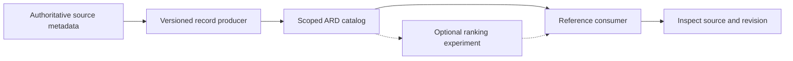
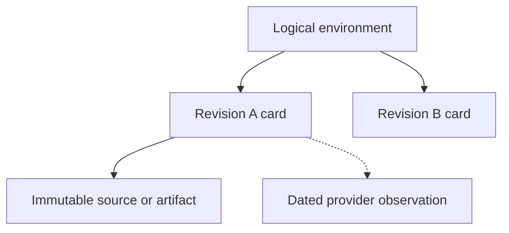
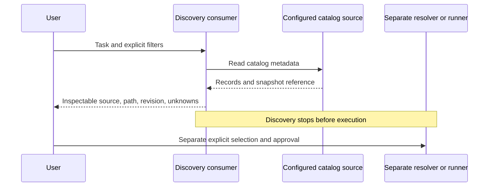
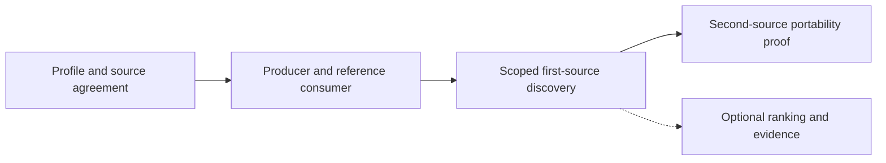

# RFC 011: ARD-backed catalog discovery for portable environments

**Status**: Draft
**Created**: 2026-08-27
**Updated**: 2026-09-06
**Authors**: @thegovind
**RFC ID**: 011

## Summary

OpenEnv can resolve a known environment and enumerate installed packages. A
different customer job comes first: find an unfamiliar environment for a task,
inspect its source and limitations, and identify the exact subject being
selected without running it.

This RFC proposes a versioned metadata producer and a reference consumer for an
explicitly scoped inventory. OpenEnv owns an experimental Environment Card.
[Agentic Resource Discovery (ARD)](https://github.com/ards-project/ard-spec)
carries it through its generic entry and search contracts. A producer maps
authoritative source metadata into records; a consumer finds and inspects those
records while preserving source, environment locator, and revision.

The first implementation milestone is useful, metadata-only discovery. Its
acceptance criteria cover inventory accounting, record correctness, selection
usefulness, complete-card handling, and update/removal behavior. A deterministic
lexical baseline is a valid outcome. Optional semantic ranking is evaluated
separately against that baseline. Basic discovery does not depend on RFC 008
validation reports; any claim of a validated property does.

This RFC ships no implementation. It adds no runtime endpoint or dependency,
does not provision a registry, and does not change `AutoEnv`, `EnvClient`,
`openenv push`, or the existing `openenv.yaml` format. Discovery never installs
or imports candidate code, pulls images, wakes deployments, resets or steps
environments, or invokes their tools.

## Motivation

### The customer job

A researcher choosing an environment needs to answer:

1. Does a candidate for this task exist in the advertised inventory?
2. What does the agent do, and what prerequisites or limitations are declared?
3. Which source, environment within that source, and revision does the record
   describe?
4. Which facts are declarations, verified evidence, or unknown?
5. How can the selected subject be inspected and later resolved without
   silently changing it?

Discovery, relevance ranking, environment validation, and execution approval
answer different questions. A format does not populate an inventory. A search
score does not establish quality or permission. A missing validation report
does not make an otherwise useful metadata record undiscoverable.

### Existing surfaces

| Surface | What it already provides | Limit for this job |
| --- | --- | --- |
| `EnvironmentDiscovery` | Installed `openenv-*` packages and packaged manifests | Not a catalog of unfamiliar remote resources |
| `AutoEnv.from_env("owner/repo")` | Resolution of a known Hub identifier | May probe a deployment, install code, and instantiate a client |
| Environment READMEs and package metadata | Authored descriptions and usage information | Scattered inputs rather than one maintained interchange contract |
| Public docs catalog and provider metadata APIs | Pre-install browsing and provider-scoped records | Not a complete, provider-independent environment inventory |
| Optional `TaskProvider` API | Tasks and splits within a known environment | Runtime-facing task introspection, not a cold global catalog |

The data is uneven, not absent. At OpenEnv main commit
[`b9d8c1f9`](https://github.com/huggingface/OpenEnv/commit/b9d8c1f953e0c3e0bbee2f3f6f6c73d8eae61f5f),
38 top-level environment manifests exist. Five have descriptions, while all 38
corresponding `pyproject.toml` files have project descriptions. These are useful
producer inputs, although a present description is not necessarily a good
task-oriented summary.

A September 6, 2026 public Hub request with `author=openenv`, `limit=100`, and
`full=true` returned 14 Space records with `cardData`, `sha`, and `lastModified`.
Thirteen had Docker SDK and the exact `openenv` tag. Those are provider records
and candidate-selection signals, not a validated environment count.

The repository and Hub populations differ. A repository-to-Hub coverage
percentage requires an authoritative mapping; a capped name-search response
cannot supply one. Runtime state must not remove an otherwise eligible source
artifact from discovery.

### Goals and non-goals

The proposal provides task-oriented discovery before execution, explicit
inventory scope, source/revision identity, honest uncertainty, and an
interchange format that can be tested across independent producers and
consumers.

It does not define a central registry operator, crawler, ranking service,
submission API, trust reputation system, signing scheme, execution-provider
offer, Train button, job, rollout, or evaluation record. It does not make MCP
support mandatory for every environment.

It does not certify build reproducibility, training value, or semantic tool
safety merely because a record parses or names a source commit. Such evidence
belongs to the appropriate validation or operator process.

## Design

### 1. Ownership and the first concrete path



- **OpenEnv owns** the card schema, versioning policy, fixtures, and environment
  semantics.
- **A source producer owns** inventory enumeration, metadata mapping,
  provenance, and correction/removal of its published records.
- **A catalog publisher owns** its publication authority, snapshot location,
  freshness policy, and the scope it claims to cover.
- **ARD owns** the generic entry, publication, search, filter, and federation
  contracts.
- **A finder owns** indexing and retrieval behavior for its configured sources.
- **A consumer/operator owns** local trust policy and any later execution
  decision.

The first implementation PR must identify a producer, an independently
implemented consumer, a versioned catalog snapshot, and the supported
complete-record path. The initial source may be the maintained OpenEnv
repository or a defined public provider inventory. These are different
populations and must not be presented as interchangeable.

The producer should reuse authored package descriptions, README declarations,
manifests, and provider facts before introducing duplicate metadata fields.
Missing task descriptions need author review, not an invented positive claim.
A closed task-domain taxonomy or required Hugging Face-specific canonical ID is
not a prerequisite.

This RFC targets ARD v0.91 at
[`aa3e598`](https://github.com/ards-project/ard-spec/commit/aa3e598bb7752a9175897823234311216acfa864).
Implementations must state their supported profile. A valid extension type is
not proof that every finder preserves every field, supports every filter, or
returns a complete card.

### 2. What a record identifies

The initial unit is an environment definition at a stated revision, where that
revision can be established. It is not every task instance, a running server,
or a training job.



Keep three layers separate:

| Layer | Meaning | Does not establish |
| --- | --- | --- |
| Logical environment | The continuing environment concept | Global canonical identity from a similar name |
| Revision card and artifact references | The particular subject selected | A reproducible build or identical episode outcomes by itself |
| Provider observation | Hosting state observed at a time for a stated revision | Artifact identity, license, or execution permission |

A source locator identifies the provider record and the environment within it.
One repository may contain many environments. For repository-backed sources,
the initial profile uses a repository URI, a repository-relative environment
path, and a full source revision. A provider ID or repository name alone is not
enough.

Each revision-bound card describes one revision. `source.revision` is
authoritative; any `artifacts[].revision` or interface `source_revision`
describing that subject must agree with it. A revision mismatch is invalid.

The initial publication profile uses a distinct ARD identifier for each
revision-bound card. This makes an identifier-only result refer to one card
revision rather than silently changing the selected subject. The publisher owns
that identifier; it is not a global canonical environment ID. A different
identity/version scheme needs an explicit producer-consumer contract.

Optional trusted `canonical_id`, `same_as`, or `version_of` assertions may
relate records later. Similar names never justify a merge. Equal digests can
identify equal artifacts without proving that two publishers mean the same
logical environment. Provider observations remain distinct.

### 3. The experimental Environment Card

The proposed media type is:

```text
application/vnd.openenv.environment-card+json
```

The card is an OpenEnv-owned extension, not a request for an OpenEnv core type
in ARD. Its initial schema and valid/invalid fixtures belong with the first
producer-consumer implementation. Until an accepted schema is published,
implementers must pin the draft/profile revision rather than assume a released
wire contract.

| Field | Requirement | Meaning |
| --- | --- | --- |
| `schema_version` | Required | Version of the card shape |
| `name` | Required | Human-readable environment name |
| `description` | Required | Authored or reviewed task-oriented description |
| `owner` | Required | Source-maintainer/owner claim or `unknown`; not proof of copyright ownership, publisher authority, or endorsement |
| `source` | Required | Provider-scoped record identity and environment locator, with revision when established |
| `artifact_availability` | Required | `resolvable`, `external`, or `unknown`, as defined below |
| `artifacts` | Conditional | Immutable representations of the selected subject; required for `resolvable` |
| `license` | Required | Applicable environment-artifact SPDX expression, `other`, or `unknown`; never inferred from popularity or a missing field |
| `license_url` | Conditional | Required for `other`; may cite authoritative evidence for an SPDX declaration |
| `interfaces` | Required | One orchestration descriptor and optional evidenced agent-tool descriptors |
| `manifest_spec_version` | Optional | The source manifest's own format/version marker, not a runtime compatibility certificate |
| `framework_requirement` | Optional | Source-declared OpenEnv package requirement, not a validated compatibility result |
| `validation` | Conditional | Required for a `validated` interface claim |
| `canonical_id` | Optional | Identity assertion from an authority the consumer explicitly trusts |

This revision separates manifest-format, package-requirement, and protocol
version claims. A producer must not copy `openenv.yaml`'s `spec_version` into a
runtime-protocol guarantee. A protocol `version` may be included in an interface
descriptor only when its meaning and source are explicit.

For the initial repository profile, `source` contains:

- `provider`: the provider profile name.
- `id`: its native record locator, not an asserted transfer-stable or canonical
  identity.
- `uri`: the source repository URI.
- `path`: the normalized relative path to the environment; `.` means the
  repository root. Absolute paths and parent traversal are invalid.
- `revision`: the full immutable source revision when established.

A Git artifact uses its cloneable repository URI and full revision. Its `path`
must preserve the selected environment within a monorepo. Multiple artifact
representations require evidence binding them to the same source revision; an
image tag is not such evidence.

#### Availability, access, and unknowns

- **`resolvable`** means an immutable artifact reference is supplied. It does not
  mean that a deployment is running or that every caller has access.
- **`external`** means the environment is described but the catalog does not
  distribute a usable artifact. A known, sourced revision may still be
  recorded. Distribution restrictions do not erase identity.
- **`unknown`** means the producer cannot establish artifact availability.

Do not fabricate a revision for an external or unknown subject. A revision of a
metadata declaration must not be passed off as the environment's revision.
Only a claim bound to the identified artifact may be presented as validated.

Required unknown-sensitive fields, such as `license`, use an explicit sentinel.
An omitted optional tool descriptor means unknown, not "no tools."

### 4. A concrete GitHub-backed Echo example

The following ARD entry contains the complete card in `data`. Its source is
the public OpenEnv monorepo at commit
[`b9d8c1f9`](https://github.com/huggingface/OpenEnv/tree/b9d8c1f953e0c3e0bbee2f3f6f6c73d8eae61f5f/envs/echo_env).
The environment path is part of the selection; cloning the repository is not
the same as selecting its root package.

The description and framework requirement come from Echo's
[`pyproject.toml`](https://github.com/huggingface/OpenEnv/blob/b9d8c1f953e0c3e0bbee2f3f6f6c73d8eae61f5f/envs/echo_env/pyproject.toml).
The `BSD-3-Clause` declaration is supported by the pinned
[`LICENSE`](https://github.com/huggingface/OpenEnv/blob/b9d8c1f953e0c3e0bbee2f3f6f6c73d8eae61f5f/LICENSE)
and Echo's source headers referring to that license. It describes this source,
not a blanket assertion about every dependency or future dataset.

`example.org` is a reserved illustrative publication authority. The source and
license are real; this example does not claim that GitHub or Hugging Face has
published or verified the card. A real publisher must choose an authority it
can substantiate.

```json
{
  "@context": "https://agenticresourcediscovery.org/context/v1",
  "identifier": "urn:air:example.org:openenv:echo_env:b9d8c1f953e0c3e0bbee2f3f6f6c73d8eae61f5f",
  "displayName": "Echo Environment",
  "type": "application/vnd.openenv.environment-card+json",
  "data": {
    "schema_version": "0.1-draft",
    "name": "echo_env",
    "description": "Echo Environment for OpenEnv - simple test environment that echoes back messages",
    "owner": {
      "authority": "github.com",
      "id": "huggingface"
    },
    "source": {
      "provider": "github",
      "id": "huggingface/OpenEnv",
      "uri": "https://github.com/huggingface/OpenEnv.git",
      "path": "envs/echo_env",
      "revision": "b9d8c1f953e0c3e0bbee2f3f6f6c73d8eae61f5f"
    },
    "artifact_availability": "resolvable",
    "artifacts": [
      {
        "kind": "git",
        "uri": "https://github.com/huggingface/OpenEnv.git",
        "path": "envs/echo_env",
        "revision": "b9d8c1f953e0c3e0bbee2f3f6f6c73d8eae61f5f"
      }
    ],
    "license": "BSD-3-Clause",
    "license_url": "https://github.com/huggingface/OpenEnv/blob/b9d8c1f953e0c3e0bbee2f3f6f6c73d8eae61f5f/LICENSE",
    "manifest_spec_version": 1,
    "framework_requirement": "openenv>=0.3.1",
    "interfaces": [
      {
        "role": "orchestration",
        "protocol": "openenv"
      },
      {
        "role": "agent-tools",
        "protocol": "mcp",
        "status": "declared",
        "source_revision": "b9d8c1f953e0c3e0bbee2f3f6f6c73d8eae61f5f"
      }
    ]
  },
  "description": "Echo Environment for OpenEnv - simple test environment that echoes back messages",
  "tags": ["openenv", "rl-environment", "smoke-test"],
  "capabilities": ["echo_message", "echo_with_length"],
  "representativeQueries": [
    "find an environment that echoes a message",
    "find a minimal environment for checking OpenEnv tool calls",
    "find an environment for a client smoke test"
  ]
}
```

The `owner` claim identifies the source repository account. It is separate from
the ARD publisher and from legal copyright attribution. The MCP declaration is
bound to the inspected source, not promoted to validated status.

The two task-oriented query examples plus the smoke-test query are indexing
hints, not evaluation labels or a training-quality claim. The root
`capabilities` list contains no simulation controls.

A manifest wraps one or more such entries in its `entries` array. An ARD
consumer that does not understand the OpenEnv payload may still display the
generic fields, but must not invent card-specific facts.

### 5. Producer workflow and metadata precedence

The first producer consumes a frozen, explicitly defined source inventory. A
repository-source producer may enumerate the maintained environment directories
at one Git revision. A provider adapter may enumerate its native public records.
Neither may use ranked search results or running status as the inventory
definition.

| Input | Permitted use |
| --- | --- |
| `openenv.yaml` and package metadata | Names, manifest marker, declared framework requirements, and existing descriptions |
| README or explicit author metadata | Reviewed task summary, prerequisites, documentation, and claims with a stated source |
| Provider metadata | Native source identity, repository URI/revision, and separately dated provider facts |
| Authoritative license source | The applicable declaration and evidence URL; conflicts remain unknown |
| Stable RFC 008 contracts, when available | Reused normalization inputs and optional validation evidence |

The producer must preserve provenance and revision for mapped claims. It must
not infer licenses, ownership verification, runtime support, or validation from
names, tags, popularity, or generated prose.

An explicit, reviewed declaration takes precedence over a heuristic. Conflicting
authoritative inputs need a documented resolution or an explicit unknown/error.
Missing task descriptions must be visible to maintainers; filling a string with
a generic name is not evidence of task usefulness.

The OpenEnv maintainers own the initial first-party publication policy and
designate the producer and publication channel before the first public
milestone. The implementation must publish a versioned metadata snapshot with a
recorded source inventory and generation version. A moving "latest" pointer may
aid browsing, but a selected result retains its snapshot and artifact references.

The snapshot is not the environment artifact. Its own immutable reference or
digest is recorded separately; a producer must not confuse its generation
revision with an environment's revision.

The publication process includes correction and removal. On refresh, a consumer
must distinguish a superseded/withdrawn listing from a failed or incomplete
fetch. Historical source identity need not be erased when a listing is removed.
The first implementation must demonstrate this lifecycle, not merely an
initial successful import.

### 6. Consumer and complete-result contract

ARD v0.91 search results need only carry an identifier. Its `url`, when present,
addresses the artifact document, not necessarily the ARD entry. A generic
get-by-identifier operation is not defined by that draft.

The first reference path therefore uses complete inline cards in a versioned
catalog snapshot. The consumer may inspect a complete search result directly or
look up its identifier in the same explicitly configured snapshot. The
revision-qualified identifier must select exactly one card. The consumer
validates the card and retains the complete metadata needed for selection.

If neither a complete card nor an authoritative configured source is available,
the result remains generic/incomplete metadata. The consumer must not guess a
URL from the identifier, fabricate missing fields, or present a resolved
environment. This is an explicit acceptance case, not an empty-success fallback.
Partial search fields must not overwrite conflicting source/revision or other
authoritative card facts from the configured snapshot.

A later URL-carried card profile needs a bounded metadata-only retrieval
contract: known metadata origins, size/time limits, redirect policy, and
origin-scoped credentials. It must not turn a card lookup into a request to an
arbitrary candidate deployment. Such a profile can be added without inventing
an environment execution endpoint.



The first consumer may use local list/filter/lexical search over the snapshot.
That demonstrates the publication format, not a claim to implement every ARD
registry feature. Integration with an existing public finder must state and
exercise the supported result and filter profile.

The eventual `openenv discover` command name remains a UI choice. Its output
must preserve provider, repository URI, environment path, revision, and
uncertainty. This GitHub example is not a Hugging Face Space ID: a later
operation must not feed `source.id` alone into a known-Hub resolver and silently
select another source or revision.

Illustrative output, not a command implemented by this RFC:

```text
$ openenv discover "client smoke test"

Echo Environment
source:      github / huggingface/OpenEnv
path:        envs/echo_env
revision:    b9d8c1f953e0c3e0bbee2f3f6f6c73d8eae61f5f
artifact:    resolvable source reference
license:     BSD-3-Clause (source evidence linked)
agent tools: MCP declared
validation:  not supplied

Metadata only. Execution approval is a separate consumer decision.
```

### 7. Roles, validation, and policy authority

Every card has one orchestration descriptor. It declares the OpenEnv role; it
does not list reset/step/state, transports, endpoints, or liveness. Orchestration
must not be copied into an agent-facing prompt, capability list, or tool list.

Agent tools are optional. An evidenced publisher claim may be `declared`; a
`validated` claim needs a report for the same identified artifact and the named
property. Omission is unknown. Endpoint reachability alone proves neither MCP
support nor useful or safe tools.

An agent-tools descriptor carries `role: agent-tools`, its `protocol`, and
`status: declared` or `validated`. For a revision-bound subject,
`source_revision` is required and must match the card's source revision.
Revision-unbound claims must identify their declaration source and cannot be
presented as validated evidence for an immutable artifact. Their
`declaration_source` is a metadata reference, not an invocation endpoint, and
follows the same bounded metadata-retrieval policy as other references.

An agent-facing operation that gives simulation control is incompatible with
the OpenEnv boundary regardless of its name. Name checks can raise diagnostics,
but do not prove semantic safety. A consumer must not silently remove a suspect
tool and upgrade the rest of the card to validated.

The initial revision-bound MCP validation integration reuses RFC 008's
`runtime.tool_declaration_accuracy` result and a report whose embedded source
digest matches the artifact. That check does not certify the semantic
orchestration boundary. Any such future claim needs separately defined evidence.

**Basic discovery does not depend on RFC 008 implementation or reports.** The
shared normalized manifest is a reusable producer input when stable. Until the
report contract defines immutable evidence references and the relevant checks
exist, producers emit `declared` or omit unsupported claims. This RFC does not
duplicate the normalized manifest, grader registry, report schema, or operator
quality policy.

As of September 6, 2026, the RFC 008 document is on main with status In Review.
Its initial implementation stack was merged and reverted by
[huggingface/OpenEnv#1108](https://github.com/huggingface/OpenEnv/pull/1108) on
September 1. Restoration PRs
[huggingface/OpenEnv#1110](https://github.com/huggingface/OpenEnv/pull/1110),
[huggingface/OpenEnv#1111](https://github.com/huggingface/OpenEnv/pull/1111), and
[huggingface/OpenEnv#1112](https://github.com/huggingface/OpenEnv/pull/1112)
remain open. The older `openenv validate` output is not automatically equivalent
to the proposed RFC 008 evidence format.

Publisher identity, artifact ownership claims, and local execution policy stay
separate. ARD `trustManifest` supplies verification inputs, not authority by its
presence. Verified publisher status requires the declared trust framework and
ARD publisher-authority binding to succeed.

This revision removes the required publisher-supplied
`requires_explicit_trust` field. Approval depends on the consumer, action, and
local policy, not a boolean in untrusted static metadata. If an older
experimental card contains the field, `false` or omission must never lower
approval requirements; at most the field can add caution. A result, a score,
or a provider observation does not grant execution permission.

### 8. Security and failure behavior

Catalog descriptions, queries, tags, owner claims, and tool descriptions are
untrusted data. Display and model inputs must preserve that distinction: record
content cannot alter system instructions, filters, ranking policy, or trust
policy.

Default discovery contacts only configured metadata sources, not candidate
deployments. It does not install/import code, pull artifacts, wake services,
reset/step an environment, or call a tool. Any later opt-in reachability check
is separate, origin-restricted, and timestamped.

Credentials and caches are scoped to the caller and configured origin.
Credentials are not forwarded to a referral, provider, redirect target, or
candidate unless separately authorized for that origin. The first public
milestone does not add private inventory.

Malformed records, unsupported profile versions/filters, partial results, and
unavailable sources produce explicit outcomes. Incomplete enumeration must not
look like a complete empty inventory. Do not truncate a full card into a
success-shaped partial one when a transport or storage limit is exceeded.

The implementation defines and tests input size, timeout, pagination, and
cache-expiry limits. A URI or source commit establishes neither legal
permission, trusted authorship, an identical build, nor safe runtime behavior.

## Acceptance and delivery

### 1. First-source discovery readiness

The first milestone has an explicit, independently audited inventory scope. It
may start with maintained repository definitions or a provider snapshot.
Eligibility and exclusions are defined before evaluating the producer.
Community sources are not claimed covered by a first-party sample.

Acceptance requires:

1. **Inventory accounting:** every independently eligible fixture is represented
   or has an explicit, reviewable failure/exclusion. Live incomplete reads are
   labeled rather than silently treated as complete.
2. **Record correctness:** required fields and source mappings are checked;
   descriptions are useful for the stated task; unknowns remain explicit.
3. **Identity and handoff:** source URI, environment path, and revision survive
   production and consumption. Different revision cards do not collide or
   inherit evidence from different code.
4. **Complete-result handling:** a real, independently implemented consumer
   inspects the full card or reports incomplete/unsupported metadata honestly.
5. **Selection usefulness:** independently chosen task queries can lead users to
   appropriate records without prior knowledge of repository names. A filled
   schema or domain tag alone is not this evidence.
6. **Read-only behavior:** no candidate installation, import, image pull, wake,
   reset, step, or tool invocation during discovery.
7. **Lifecycle:** publication, correction, new revision, and withdrawal are
   demonstrated through the intended metadata path.

Positive and negative fixtures include a monorepo environment, different
revisions, incomplete metadata, unknown license or interface evidence, an
external subject, and a source/read failure. The implementation report publishes
the scope, examples, outcomes, and limitations.

The deterministic baseline is a valid first release outcome when it meets
these criteria. Basic discovery is not gated on a new ranker beating it.
An ingestion failure for an eligible record remains a completeness failure;
documenting the failure does not turn a partial inventory into a complete one.

### 2. Optional ranking experiments

A semantic ranker or other ranking change uses the same frozen inventory as
the baseline. Pre-register task-oriented queries, relevance labels, the
train/development/held-out split, metrics, latency/cost budgets, and the adoption
decision. Group near-duplicate queries before splitting and do not tune against
the held-out set.

Recall@k, nDCG@k, filter precision, per-query outcomes, and appropriate confidence
intervals can assess incremental value. The decision should justify the added
complexity and cost, not impose an unexplained fixed gain as permission for any
metadata discovery to exist.

This revision removes the mandatory 0.10 nDCG@5 improvement and its
implementation/CLI stop rule. A disappointing ranker is not evidence that a
useful inventory and lexical consumer should be withheld. Publish negative
ranking results and keep the working baseline.

### 3. Milestones and claim boundaries



- **Profile agreement:** OpenEnv owns the card semantics and designates the
  initial producer, publication location, and consumer contract.
- **Producer-consumer slice:** publish schema/fixtures and a versioned snapshot;
  demonstrate the complete metadata path and the readiness criteria above.
- **First-source use:** expose useful read-only browsing/search with its source
  scope explicit. A local consumer is not automatically a hosted ARD registry.
- **Finder integration:** coordinate one public finder/consumer implementation
  and verify its actual type, result, retrieval, and filter support. Publication
  alone does not guarantee indexing by every finder.
- **Portability claim:** independently enumerate a second real source and apply
  the same card contract without provider-specific assumptions in shared
  semantics. A second finder over the same source is not this proof.
- **Optional additions:** validation evidence, richer ranking, private
  inventories, or operational services have their own contracts and evidence.

A second-source proof is required before a strong cross-provider claim, not
before any clearly scoped first-source discovery is useful. A dedicated registry
is considered only if actual operational needs justify one.

The generic conformance adjustment in
[ards-project/ard-spec#85](https://github.com/ards-project/ard-spec/pull/85)
is coordinated with this work but not a prerequisite. ARD already permits the
extension type. That PR changes diagnostics, not source publication, indexing,
or execution support.

## Alternatives and trade-offs

**Provider-native metadata only:** a useful first-source input and baseline. It
can expose substantial metadata without a new service, but does not alone
define provider-independent environment semantics or a full consumer journey.

**Repository-generated static catalog:** simple, versionable, and appropriate
for repository definitions. It must not claim to enumerate every deployment or
community environment. Provider inventories cover a different population.

**Reuse a provider Space media type:** useful for a Space hosting record, but
not a substitute for an environment definition, its locator, or external
artifact semantics. Both records may coexist without merging their identities.

**Hand-maintained second manifest:** can bootstrap reviewed examples, but risks
drift. Prefer a generated projection of existing authoritative inputs, with a
small explicit authoring surface for facts that are genuinely missing.

**Add `agents.md` only to enter an agent index:** an environment is not
necessarily an agent skill or MCP server. Do not change its declared meaning to
fit a different resource category.

**New OpenEnv-specific network protocol or central registry:** unnecessary for
the first producer-consumer milestone. ARD provides an open interchange path;
operators remain free to implement services without making one operator the
framework's standard.

## Compatibility and open decisions

Existing environments, runtime APIs, CLI commands, and manifests do not change
in this docs-only PR. The first implementation must preserve those boundaries.
Experimental card consumers must pin the profile they understand and preserve
generic metadata when the domain payload is unsupported.

Compared with earlier draft examples, this revision makes manifest version
semantics explicit, removes a publisher-owned execution-policy decision, and
allows known identity on external records without claiming distribution.
No released Environment Card schema is being changed.

Decisions before the first producer-consumer milestone:

1. Which maintained source inventory and producer own the initial records, and
   which existing publication channel exposes versioned snapshots?
2. Where does OpenEnv publish the card schema/fixtures and its stable profile
   references, and which independent consumer demonstrates the first contract?
3. Do the proposed source URI/path/revision and revision-card identifier rules
   cover the first source without an unsubstantiated canonical identity claim?
4. What authoring/precedence policy resolves conflicting descriptions, license
   declarations, and artifact claims?
5. Which independently chosen tasks and observations establish useful selection
   for this scoped milestone?

Decisions before the stages they affect:

6. What metadata-only URL retrieval and source-discovery contract is needed
   beyond complete inline snapshots?
7. Which second provider profile proves portability, including transfer,
   deletion, and multiple-environment locators?
8. Which immutable RFC 008 report/check contracts support validated interface
   claims, including any distinct orchestration-boundary evidence?
9. What credential, referral, cache, and revocation rules enable private
   inventories?
10. Should later profiles describe harness-specific surfaces, task collections,
    or generic provider observations, without confusing them with the
    environment artifact?

## References

- [ARD v0.91 specification](https://github.com/ards-project/ard-spec/tree/aa3e598bb7752a9175897823234311216acfa864)
- [ards-project/ard-spec#44: deployment metadata](https://github.com/ards-project/ard-spec/issues/44)
- [ards-project/ard-spec#66: extension media-type guidance](https://github.com/ards-project/ard-spec/issues/66)
- [ards-project/ard-spec#85: generic diagnostic adjustment](https://github.com/ards-project/ard-spec/pull/85)
- [Hugging Face `hf-discover`](https://github.com/huggingface/hf-discover)
- [huggingface/OpenEnv#1024: docs/catalog completeness](https://github.com/huggingface/OpenEnv/pull/1024)
- [huggingface/OpenEnv#1094: Task API documentation](https://github.com/huggingface/OpenEnv/pull/1094)
- [huggingface/OpenEnv#366: external environments](https://github.com/huggingface/OpenEnv/issues/366)
- [huggingface/OpenEnv#795: dataset-bound environments](https://github.com/huggingface/OpenEnv/pull/795)
- [RFC 002: framework specification](./002-env-spec.md)
- [RFC 003: MCP support](./003-mcp-support.md)
- [RFC 005: agentic harness integration](./005-agentic-harnesses.md)
- [RFC 008: environment auto-validation](./008-environment-auto-validation.md)
