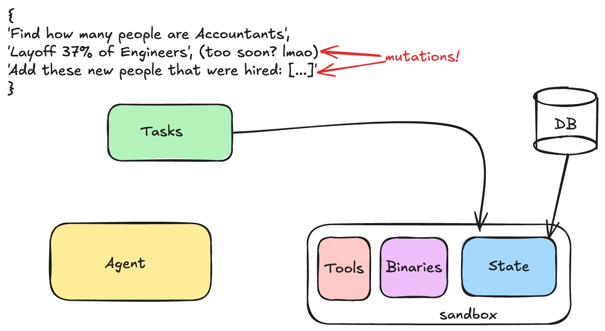

# [Proto RFC] Env & Tools Spec - Revised Design

**Status**: In Active Design Discussion
**Last Updated**: 2025-01-07

This proposal iterates on top of multiple RFCs (well... almost all of them). If we approve it, we will have to revise them accordingly. In this doc, let's focus on the idea and then we will figure out how to wordsmith changes into the RFCs on Github as a second step.

The whole reason behind this proposal is finding the best way to integrate MCP in a way that provides unique value, but more in general, it's a good opportunity to take another look at everything from first principles. It's not bad to do this: this is why we are in a RFC stage!

## Our Audience

We provide value to:

1. **Env builders**, by giving them more reach to be able to be used in multiple projects that would otherwise require adapters, thus lowering the cost of entry
2. **Model builders**, by giving them more inventory which is a proven path towards improved model performance
3. **The scientific community**, by giving them a path to reproducibility of setups including tools/rewards/evals
4. **Infra engineers**, by giving them a clear and stable contract that allows for separation of concerns so they can focus on optimizing the backend

## Our Principles

Let's start from the very beginning: what are our non-negotiable principles that we strive to stick to?

1. **Minimize deltas across a project's lifecycle.** One of the barriers to adoption of this tech is the deltas you have:
   1. Across every phase in a project's lifecycle: Training → Evals → Deployment
   2. Human ↔ Agent divergence

   Deltas hurt every ML project, but RL is particularly susceptible to them. We already know this, so we should provide a holistic solution for it, by design.

2. **We are hands-on.** We do not stop with providing a spec. We should not refrain from providing quality of life features and ready-made, importable code. These need not be part of the spec proper, but we provide them because we ultimately want to provide value (as per above). They will be optional.

3. **We are (economically) opinionated.** We do not refrain from having opinions about how we want our stuff to be used: a fully unopinionated project lacks a spine and delights none. However, it is not our place to pick winners and losers with respect to AI research as we work in a yet-to-be-crystallized space. So, we see differences in opinions in the research community (e.g. codeact vs traditional function calling) as opportunities to validate the flexibility of our system which should seamlessly support both. We should not obsess over this if we feel that a winner is clear and that taking an opinion can provide a ton of value (especially in more established areas like e.g. containers), but in general we should not do this often.

4. **Our design is LLM-friendly.** We know what LLMs like and don't like. We know what their limitations are (example: limited context window). We always think of these as we validate our designs. When there are tradeoffs between LLM-friendliness and infrastructure-friendliness, we evaluate tradeoffs holistically.

## Components

Ultimately, any abstraction is just a Venn diagram drawn over a set of components: naturally, where you draw your Venn diagram is somewhat arbitrary and you may indeed have multiple legit answers.

So, let us start by littering the floor with all the components without any groupings. I will use examples to ground us concretely at each step.

The components we have are the following:

1. There's gonna be **tasks** coming in with questions → these are purely data
2. These tasks are landing in a **stateful world**. Note that this is true for both deployment as well as for training (going back to our principle: they need to stay close to each other)
3. These tasks are solved by the **agent** that interacts with this stateful world via some **interface**
4. This interface, and the state are made of **software**, so there's gonna be deps and binaries to take care of
5. **Code execution** and/or bash access are technically optional but will be there so often, that in practice we are always going to need some form of **sandboxing**

### Example: Database Maintenance Task

Let's say I'm giving you a database containing a list of employees and as a single task, I'm giving you an ongoing task to stay alive over the course of months and maintain this database as events happen. This means querying for information, but it can totally also mean mutations. People get hired, people leave, and these mutations need to be performed.



I call the initial snapshot of the database our **state**. I would like to zoom in on it:

1. While it is made of data, it's not part of the dataset which normally contains tasks. You can have many different tasks operate on the same database snapshot!
2. While you query and mutate it via tools (e.g. MCP), it's not part of the MCP spec itself which only deals with interfacing to it
3. This snapshot is relevant while training. You are essentially simulating a real-world scenario. Note that it's critical that we have the ability to reset the db snapshot to its original state, but **crucially!!** the model absolutely cannot do that. This is the function of the `.reset()` method in the Gymnasium API. It's a simulation reset. The `.reset()` method is absolutely not a tool that the model is free to call! For example, if the model decides to drop every record from the DB, our reward system will penalize it and it will learn not to do it in the future. We would then reset the simulation state back to the beginning, and try again. If this were to be exposed to the model, we would have a huge discrepancy with Prod as the model would learn during training that every error is always recoverable and thus it will have no risk aversion.

This is actually something that existing libraries do not do well, because they often bundle it with data, or directly with tools but unfortunately it does not belong in either place.

## The Time Problem: Simulation vs Production

A critical insight that shapes our entire design:

**Simulation Time (Training/Eval)**:
- Time only advances when we say so (via `.step()`)
- Agent can "think" for arbitrary real-world time - simulation is paused
- Environment state is frozen until agent acts
- Can reset to initial state infinitely
- CodeAct blocks execute atomically from environment's perspective

**Real Time (Production)**:
- Time flows continuously
- Events arrive on their own schedule (people get hired *now*, not when agent is ready)
- Agent must react with bounded latency
- Cannot reset (it's the real world). Deleting records is a one-way door.
- No "turns" in the traditional sense - continuous stream of events

**Key insight**: You can simulate production (via event queues), but you can't "productionize" simulation (can't pause reality).

This temporal duality drives the need for two distinct interfaces:
- **Simulation control**: Reset, step, reward computation (training/eval only)
- **Agent-environment interaction**: Tool calls (training AND production)

## Proposed Architecture

### Core Abstraction: Environment = MCP Servers + Simulation Layer

We define an **Environment** as having two distinct layers:

```
┌─────────────────────────────────────────────────────────┐
│  SIMULATION LAYER (HTTP - Training/Eval Only)           │
│  ┌───────────────────────────────────────────────────┐  │
│  │ • .reset() / .step() - orchestration              │  │
│  │ • Event queue (first-class citizen)               │  │
│  │ • Reward computation                              │  │
│  │ • Evaluation logic                                │  │
│  │ • Data/task loading                               │  │
│  │ • State checkpointing (git-based)                 │  │
│  └───────────────────────────────────────────────────┘  │
│                                                          │
│  PRODUCTION CORE (MCP - Always Present)                 │
│  ┌───────────────────────────────────────────────────┐  │
│  │ • MCP tool servers (search, database, etc.)       │  │
│  │ • State management and access                     │  │
│  │ • Sandboxing (Docker)                             │  │
│  │ • Binary distribution and versioning              │  │
│  └───────────────────────────────────────────────────┘  │
└─────────────────────────────────────────────────────────┘
```

**In Training/Eval**: Full stack (both layers)
**In Production**: Simulation layer removed, only MCP servers remain


### Two Protocols, Two Purposes

**Why two protocols?** They serve fundamentally different principles:

1. **HTTP**: Simulation control protocol
   - Training loop ↔ Simulator
   - Asymmetric (training loop controls simulation)
   - Operations: `reset()`, `step()`, `get_state()`
   - Disappears in production

2. **MCP**: Agent-environment protocol
   - Agent ↔ Environment tools
   - Symmetric (agent calls tools, environment responds)
   - Operations: Tool calls (`search()`, `execute_sql()`, etc.)
   - Present in both training AND production

The boundary between simulation and production is explicit. The MCP interface is identical across the lifecycle (principle #1: minimize deltas).

### Event Queue as First-Class Citizen

Environments fall into two categories:

1. **Static environments**: State only changes when agent acts (chess, coding puzzles)
2. **Dynamic environments**: State changes independently (database with external events, customer service)

We make the event queue a first-class abstraction:
- **Empty queue** = static environment
- **Populated queue** = dynamic environment with external events

```python
class Environment:
    def __init__(
        self,
        mode: str,  # "sim" or "prod"
        mcp_servers: List[MCPServerConfig],
        event_queue: EventQueue,  # Empty for static, populated for dynamic
        ...
    ):
        self.event_queue = event_queue
```

## Tool Duality: Simulation vs Production

### The Challenge

Tools must behave differently in simulation vs production:

**Example: Expedia Flight Search**
- **Production**: Call real Expedia API (costs money, real data, rate limits)
- **Simulation**: Return synthetic/mock flight data (free, fast, reproducible)

**Question**: Who is responsible for this duality?

### Ideal End State: Tool Providers Own It

Ultimately, tool providers (like Expedia) should ship dual-mode MCP servers:

```python
class ExpediaMCPServer:
    def __init__(self):
        self.mode = os.getenv("MODE", "prod")

        if self.mode == "sim":
            self.client = ExpediaSimClient()  # Expedia provides this
        elif self.mode == "prod":
            self.client = ExpediaAPIClient()  # Real API

    @mcp_tool
    def search_flights(self, origin: str, destination: str):
        # Same interface, different implementation
        return self.client.search(origin, destination)
```

**Benefits**:
- Tool provider owns simulation quality (they know their domain best)
- Single package to maintain
- Realistic test data from source

### Pragmatic Path: Three-Phase Strategy

**Phase 1 (v0.3-v0.6)**: We own tool simulation
- Environment builders provide tool simulations as fallback
- Easy patterns/utilities for common cases (search, payments, email)
- Build critical mass and prove value

**Phase 2 (v0.6-v1.0)**: Mixed ownership
- Early adopter tool providers ship dual-mode servers
- Both patterns coexist (fallback + native dual-mode)
- Show ROI: "Your tool is used in 50 environments"

**Phase 3 (v1.0+)**: Tool providers own duality
- Standard practice in ecosystem
- We deprecate environment-level simulation
- Clean separation of concerns

**Critical**: Design the abstraction NOW so migration is seamless.

### Implementation: Tool Registry with Sim/Prod Mapping

**Key insight**: Use a registry to explicitly map production tools to their simulation equivalents. Tools not in the registry are assumed to be dual-mode (handle mode internally).

```python
class Environment:
    def __init__(
        self,
        mode: str,  # "sim" or "prod"
        mcp_servers: List[MCPServerConfig],

        # Tool registry: maps prod tool -> sim tool
        # If tool not in registry, assumes it's dual-mode
        tool_registry: ToolRegistry | None = None,

        # Simulation config
        event_queue: EventQueue | None = None,
        data_loader: DataLoader | None = None,
        reward_functions: List[RewardFunction] | None = None,
    ):
        self.mode = mode
        self.tool_registry = tool_registry or ToolRegistry()

        # Initialize MCP clients
        self.mcp_clients = [
            MCPClient(cfg.url)
            for cfg in mcp_servers
        ]

    def call_tool(self, tool_name: str, params: dict):
        """Call MCP tool, using registry to resolve sim vs prod."""

        # Check registry for sim/prod mapping
        if self.mode == "sim" and self.tool_registry.has_mapping(tool_name):
            # Use sim version from registry
            sim_tool_name = self.tool_registry.get_sim_tool(tool_name)
            mcp_client = self._find_mcp_client_for_tool(sim_tool_name)
            return mcp_client.call_tool(sim_tool_name, params)

        else:
            # Not in registry: assume dual-mode tool (same in prod and sim)
            # Or we're in prod mode: use production tool directly
            mcp_client = self._find_mcp_client_for_tool(tool_name)
            return mcp_client.call_tool(tool_name, params)
```

**Tool Registry**:

```python
class ToolRegistry:
    """Maps production tools to simulation tools.

    If a tool is not in the registry, it's assumed to be dual-mode
    (same tool works in both sim and prod, handles mode internally).
    """

    def __init__(self, mappings: Dict[str, str] | None = None):
        """
        Args:
            mappings: Dict mapping prod_tool_name -> sim_tool_name

        Example:
            registry = ToolRegistry({
                "expedia.search_flights": "expedia_sim.search_flights",
                "stripe.charge_card": "stripe_sim.mock_charge",
            })
        """
        self.mappings = mappings or {}

    def has_mapping(self, tool_name: str) -> bool:
        """Check if tool has explicit sim mapping."""
        return tool_name in self.mappings

    def get_sim_tool(self, prod_tool_name: str) -> str:
        """Get simulation tool for a production tool."""
        return self.mappings[prod_tool_name]

    def register(self, prod_tool: str, sim_tool: str):
        """Register a prod -> sim mapping."""
        self.mappings[prod_tool] = sim_tool
```

**Example usage**:

```python
# Phase 1: Explicit sim/prod mappings
tool_registry = ToolRegistry({
    # Expedia doesn't have dual-mode server yet
    "expedia.search_flights": "expedia_sim.search_flights",
    "expedia.book_flight": "expedia_sim.book_flight",

    # Stripe doesn't have dual-mode server yet
    "stripe.charge_card": "stripe_sim.mock_charge",
})

env = Environment(
    mode="sim",
    mcp_servers=[
        MCPServerConfig("expedia", "http://expedia-mcp:8001"),      # Prod server
        MCPServerConfig("expedia_sim", "http://expedia-sim:8002"),  # Sim server
        MCPServerConfig("stripe", "http://stripe-mcp:8003"),        # Prod server
        MCPServerConfig("stripe_sim", "http://stripe-sim:8004"),    # Sim server
        MCPServerConfig("database", "http://db-mcp:8005"),          # Dual-mode!
    ],
    tool_registry=tool_registry,
)

# In sim mode:
env.call_tool("expedia.search_flights", {...})  # → Uses expedia_sim.search_flights
env.call_tool("database.execute_sql", {...})    # → Uses database.execute_sql (dual-mode)

# In prod mode:
env_prod = Environment(mode="prod", ...)
env_prod.call_tool("expedia.search_flights", {...})  # → Uses expedia.search_flights
env_prod.call_tool("database.execute_sql", {...})    # → Uses database.execute_sql
```

**Phase 2/3: Migration path**:

```python
# As Expedia ships dual-mode server, remove from registry
tool_registry = ToolRegistry({
    # Expedia now dual-mode - removed from registry!
    # "expedia.search_flights": "expedia_sim.search_flights",  # No longer needed

    # Stripe still needs mapping
    "stripe.charge_card": "stripe_sim.mock_charge",
})

env = Environment(
    mode="sim",
    mcp_servers=[
        MCPServerConfig("expedia", "http://expedia-mcp:8001"),      # Now dual-mode!
        MCPServerConfig("stripe", "http://stripe-mcp:8003"),        # Prod only
        MCPServerConfig("stripe_sim", "http://stripe-sim:8004"),    # Sim only
    ],
    tool_registry=tool_registry,
)

# Expedia tools work automatically in both modes now
env.call_tool("expedia.search_flights", {...})  # Server handles mode internally
```

**Utilities we provide**:

```python
from openenv.simulation import (
    mock_response,           # Static response
    mock_from_dataset,       # Sample from dataset
    mock_from_function,      # Custom function
    record_and_replay,       # Record prod, replay in sim
)

# Helper to create sim MCP servers from utilities
from openenv.simulation import create_sim_mcp_server

# Example: Create sim server for Expedia
expedia_sim_server = create_sim_mcp_server(
    name="expedia_sim",
    tools={
        "search_flights": mock_from_dataset("flights.json"),
        "book_flight": mock_response({"confirmation": "SIM123"}),
    }
)
```

## State Checkpointing and Transactionality

### Motivation

We need the ability to rollback to intermediate states, not just the initial state. Use cases:
- **Tree search**: Explore multiple futures from same state
- **Curriculum learning**: Reset to challenging states
- **Debugging**: "What if I had done X at step 5?"
- **Counterfactual training**: Generate alternative trajectories

### Design: Git-Based Checkpointing

Every `.step()` can create a checkpoint (like a git commit):

```python
# Initial state (checkpoint 0)
env.reset()

# Step 1 (checkpoint 1)
obs1 = env.step(action1)

# Step 2 (checkpoint 2)
obs2 = env.step(action2)

# Rollback to checkpoint 1
env.reset(checkpoint=1)

# Try different action from checkpoint 1
obs = env.step(action_alternative)  # Creates checkpoint 3
```

**Implementation**: Use git to track filesystem changes. For managed state (databases), we'll need transaction logs or snapshots.

### Known Limitations

**🚨 OPEN QUESTION: Transactionality of External Tools**

The ability to roll back to arbitrary intermediate states requires that not only the environment be able to roll back, but that tools also have this ability. Quick taxonomy of tools:

- **Transactional tools**: Database queries, filesystem operations (via git)
- **Idempotent tools**: Search, read-only operations (no rollback needed)
- **Non-transactional tools**: Send email, charge credit card, deploy to prod

We can roll back for stateless and transactional tools, but many tools are just non-transactional: you can't recall an email after you sent it.

**Proposed approach**:
Given that many tools are non-transactional, why bother? We use environments in simulation, and a key insight is that **non-transactional tools are the most likely ones to be simulated**.

So, here's our blueprint:

- Accept the general limitation and document clearly: some tools just might not allow us to do this.
- In sim mode, tool providers should mock non-transactional operations
- In prod mode, non-transactional tools that modify state should probably not exist in training scenarios
- We provide checkpointing for what we control (filesystem, managed databases)

**TODO**: Figure out how to annotate tools for transactionality without adding cognitive burden to devs. If we have this, the env shell is always gonna be transactional, so we can easily propagate this signal and let people running training know if they can even do rollbacks. Can even decide at run time: you may have non-transactional tools in the env and never use them during a particular simulation, which can therefore be valid.

### API (Initial Design)

```python
class Environment:
    def reset(self, checkpoint: int | None = None) -> Observation:
        """Reset to checkpoint (default: initial state)."""
        if checkpoint is None:
            # Reset to initial state
            self._restore_initial_snapshot()
        else:
            # Restore to specific checkpoint (git reset)
            self.checkpoint_manager.restore(checkpoint)

        return self._get_initial_observation()

    def step(self, action: Action) -> Observation:
        """Execute action, automatically create checkpoint."""
        # Execute action via MCP
        result = self._call_mcp_tools(action)

        # Create checkpoint (git commit)
        checkpoint_id = self.checkpoint_manager.create()

        # Process events from queue
        events = self.event_queue.pop_until(self.current_time + dt)

        # Compute rewards
        reward = self._compute_rewards(result, events)

        return Observation(reward=reward, ...)

    def get_checkpoints(self) -> List[int]:
        """Get list of available checkpoints."""
        return self.checkpoint_manager.list()
```

**🚨 OPEN QUESTION**:
- Auto-checkpoint every step, or manual control?
- How to handle branching trajectories (linear IDs vs tree structure)?
- Storage efficiency (in-memory vs disk, delta snapshots)?

## Collapsing World into Environment

**Previous idea**: `World = Data + Environment + Evals + Rewards`

**Revised approach**: Absorb World into Environment. Everything that belongs to simulation lives in the Environment's simulation layer:

```python
class Environment:
    # Production core (MCP)
    mcp_clients: List[MCPClient]

    # Simulation layer (HTTP) - only in sim mode
    event_queue: EventQueue
    data_loader: DataLoader | None
    reward_functions: List[RewardFunction]
    eval_functions: List[EvalFunction]
    checkpoint_manager: CheckpointManager
```

**Rationale**: Clear boundary - everything in simulation disappears in production, everything in MCP core remains.

**🚨 OPEN QUESTION**: This means we are changing the semantics of the Environment class. Previously, it did not contain a pointer to data and evals and now it does. We do retain the Gym API though.

## MCP as Interface

**MCP is our interface to/from agents.** Note that this means exposing every action as a tool, including actions that are not what you would normally call tool-based. For example: chess. You normally would not expose moves as MCP because it's not a "tool", but it is possible to do it, and you get the benefits of MCP:

- **Action discovery**: `list_tools()` tells agents what actions are available
- **Type safety**: JSON Schema for parameters
- **Language independence**: MCP servers can be written in any language

Every query and every mutation performed by the agent will come through MCP calls.

### Special Methods: Not Exposed via MCP

We reserve special methods that the model cannot call:
- `.reset()` - simulation reset (would teach agents that errors are always recoverable)
- `.step()` - advance simulation time / compute rewards
- `.get_state()` - introspect episode metadata

These are exposed via HTTP (simulation control protocol), not MCP (agent protocol).

## CodeAct and ToolCall Paradigms

If our users write everything based on MCP, we can programmatically switch between tool calling and CodeAct style. This will require a thin proxy layer.

**Tool calling-style**: Each tool call is a discrete action
```python
# Agent generates
action1 = ToolCallAction(tool_name="search_web", params={...})
obs1 = env.step(action1)

action2 = ToolCallAction(tool_name="read_file", params={...})
obs2 = env.step(action2)
```

**CodeAct-style**: Write code that calls multiple tools
```python
# Agent generates Python code
code = """
results = search_web(query="python patterns")
filtered = [r for r in results if "async" in r]
content = read_file(filtered[0]['url'])
print(content[:100])
"""

# One step executes entire code block
obs = env.step(CodeAction(code=code))
```

**Implementation**: We make a `CodeActEnvironment` or something like this where the action space is defined only as `CodeAction` and nothing else. This actual bridges the gap with the Gym API since they normally want you to have a discrete, finite, enumerable action space and now we have this. Both in MCP mode and in CodeAct mode (maybe in a bit of a weaker sense since we do not taxonomize every possible input, but the action types themselves are, and their args are at least typechecked).

## Human-Agent Parity

Assume we expose the following tools via MCP:
- `screen()` - Render current state as image
- `keyboard(text)` - Type text
- `mouse(x, y, click=True)` - Mouse interaction

Then we can build a Docker that both:
- Agents can interact with via MCP tools (production interface)
- Humans can remote desktop into (same environment, different interface)

This validates that agents get the same interface humans would have.

**🚨 OPEN QUESTION**: Should we actually support VNC/RDP, or just simulate with MCP tools?

## Tool Discoverability

Given limited context windows, we can't dump all tools to the agent. We need hierarchical discovery.

**Approach**: Directory-like structure + `find_tools` utility

```
database_environment/
    database_mcp_server/
        execute_sql.py
        query_schema.py
        backup_db.py
    search_mcp_server/
        web_search.py
        semantic_search.py
```

We'll provide a `find_tools(query)` convenience tool that helps agents discover relevant tools.

More in general, I don't believe we need to solve this particular problem. Being all-in on MCP means that however you decide to solve this problem, we will be naturally compatible!

## Convenience Features: Traits/Mixins

Bundle common patterns as importable traits:

```python
class CompetitiveCodingEnv(HumanComputerInterfaceable, BashAccess, PythonAccess):
    # Automatically includes screen/keyboard/mouse + bash + Python interpreter
    ...
```

**🚨 OPEN QUESTION**: How do traits interact with MCP server deployment? Are they:
- Server-side mixins that pre-configure MCP servers?
- Client-side mixins?
- Configuration/deployment artifacts (docker-compose snippets)?

[Davide] I was thinking of server-side mixins. Basically, just a convenience feature to Env builders so that they don't have to rebuild the same things over and over.

## Open Questions

### High Priority

1. **Tool transactionality**: How do we handle non-transactional tools in checkpointing? Require it? Document limitations? Provide best-effort?

2. **Reward placement**: Environment-level (fixed per environment) or task-level (varies per task)?
[Davide] Let's do Environment-level. Env already has a pointer to data anyway, so this distinction is no longer critical to call as it was in the previous design.

3. **CodeAct proxy design**: Where does ToolCall ↔ CodeAct conversion happen exactly?
[Davide] Every env needs to have specs for Observations and Actions. We can simply make a `CodeActEnv` that can have a constructor like `CodeActEnv.from_env(MySpecialEnv)`. It would go in, read the dataclasses for Actions that the provided env has, and make each action (already MCP) available as a MCP tool to be used _inside_ a CodeAction.

4. **Checkpointing details**:
   - Auto vs manual checkpoint creation?
   - Storage strategy (in-memory, disk, hybrid)?
   - Branching support (linear vs tree)?

[Davide] Auto, at least for the env. We should do disk for storage, and we should do tree. So... Basically exactly the git API (may or may not use git behind the scenes). Performance is something we can figure out. We can have git in a sidecar and queue operations while the env runs -- no need for git snapshots to block the env.

### Medium Priority

5. **Traits implementation**: How do convenience traits work with MCP deployment?
[Davide] They could exist at the Env level, and all they do is bring pre-made MCP servers.

6. **MCP mode propagation**: Environment variable vs per-call context?
[Davide] Explain this further? I don't understand the question

7. **Streaming support**: How does hybrid MCP approach work with streaming tool calls?
[Davide] In Prod mode, we don't care since we get out of the way so we can support. In Sim mode, maybe this is not as critical?

### Lower Priority

8. **Human interface**: VNC/RDP or just MCP tool simulation?
[Davide] No need for us to choose. Even if we do not implement VNC/RDP ourselves, someone else can. We are just talking about a convenience feature, not a critical part of our spec.

9. **Tool provider incentives**: How do we convince Expedias of the world to ship dual-mode servers?
[Davide] This is critical and a hard question. Maybe this is also the wrong question for us at this point because we do not control it. So, let us take a step back and ask a _different_ question that we have more control over. Let's look at the end state. We basically want to have a registry of (prod, sim) mapping available to everyone so that they can reuse the same tools in many different envs. So... Why don't we instead do this by hosting a public registry? We already have a Hub for environments, so it's not hard for us to add another hub for these. Please turn this into a more detailed proposal, leveraging HF hub.

10. **Docker nesting**: Clean patterns for MCP servers inside environment containers?
[Davide] I think now we do: deps that you need in Prod go inside the Dockerfile of the MCP server while deps that you only need in sim mode (e.g. evals, or other deps that you may need for mocked tools) go into the Env dockerfile. Open question: this assumes that Sim mode deps are a superset of Prod mode which is in fact not true. For example, the sim Expedia does not need `requests` since it mocks everything. One solution is that we first bring every dep from MCP servers so our mapping would have sent us a different Expedia tool in sim mode that would not have brought in requests. But do test it and flesh it out a bit more.

## What We're NOT Undecided On

- ✅ Environment = MCP Servers + Simulation Layer
- ✅ Dual protocol (HTTP for sim control, MCP for agent interaction) is correct
- ✅ Tool duality starts with us (Phase 1), migrates to tool providers (Phase 2-3)
    - [Davide] Maybe the hub is really the answer here, so we don't make changes
- ✅ Event queue is first-class citizen
- ✅ World abstraction absorbed into Environment
- ✅ Checkpointing via git for filesystem state
- ✅ Time semantics differ between simulation and production

## Next Steps

1. Validate this design with concrete implementations (database env, travel booking env)
2. Build Phase 1 simulation utilities (`mock_response`, `mock_from_dataset`, etc.)
3. Define MCP server contract and best practices for dual-mode servers
4. Resolve open questions through prototyping
5. Update existing RFCs (001-004) to reflect this design
