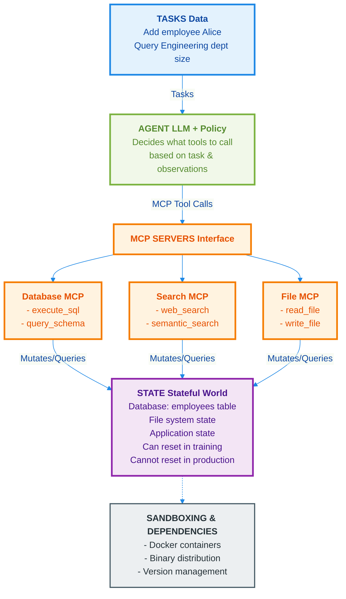
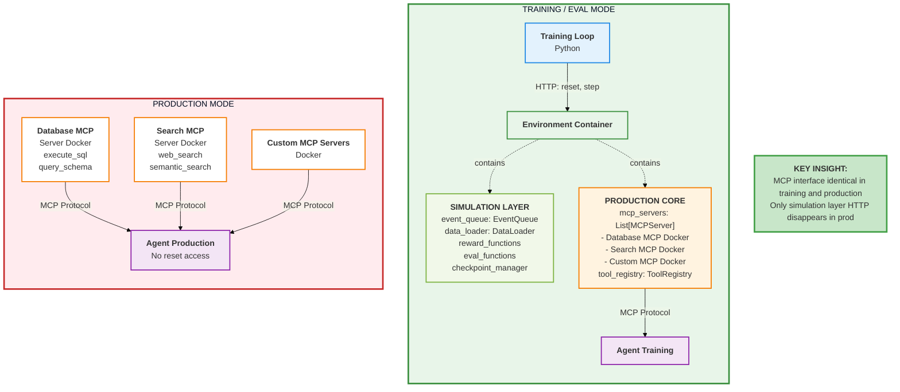

# [Proto RFC] Env & Tools Spec - Revised Design

**Status**: In Active Design Discussion
**Last Updated**: 2025-01-07

This proposal iterates on top of multiple RFCs (well... almost all of them). If we approve it, we will have to revise them accordingly. In this doc, let's focus on the idea and then we will figure out how to wordsmith changes into the RFCs on Github as a second step.

The whole reason behind this proposal is finding the best way to integrate MCP in a way that provides unique value, but more in general, it's a good opportunity to take another look at everything from first principles. It's not bad to do this: this is why we are in a RFC stage!

## Our Audience

We provide value to:

1. **Env builders**, by giving them more reach to be able to be used in multiple projects that would otherwise require adapters, thus lowering the cost of entry
2. **Model builders**, by giving them more inventory which is a proven path towards improved model performance
3. **The scientific community**, by giving them a path to reproducibility of setups including tools/rewards/evals
4. **Infra engineers**, by giving them a clear and stable contract that allows for separation of concerns so they can focus on optimizing the backend

## Our Principles

Let's start from the very beginning: what are our non-negotiable principles that we strive to stick to?

1. **Minimize deltas across a project's lifecycle.** One of the barriers to adoption of this tech is the deltas you have:
   1. Across every phase in a project's lifecycle: Training → Evals → Deployment
   2. Human ↔ Agent divergence

   Deltas hurt every ML project, but RL is particularly susceptible to them. We already know this, so we should provide a holistic solution for it, by design.

2. **We are hands-on.** We do not stop with providing a spec. We should not refrain from providing quality of life features and ready-made, importable code. These need not be part of the spec proper, but we provide them because we ultimately want to provide value (as per above). They will be optional.

3. **We are (economically) opinionated.** We do not refrain from having opinions about how we want our stuff to be used: a fully unopinionated project lacks a spine and delights none. However, it is not our place to pick winners and losers with respect to AI research as we work in a yet-to-be-crystallized space. So, we see differences in opinions in the research community (e.g. codeact vs traditional function calling) as opportunities to validate the flexibility of our system which should seamlessly support both. We should not obsess over this if we feel that a winner is clear and that taking an opinion can provide a ton of value (especially in more established areas like e.g. containers), but in general we should not do this often.

4. **Our design is LLM-friendly.** We know what LLMs like and don't like. We know what their limitations are (example: limited context window). We always think of these as we validate our designs. When there are tradeoffs between LLM-friendliness and infrastructure-friendliness, we evaluate tradeoffs holistically.

## Components

Ultimately, any abstraction is just a Venn diagram drawn over a set of components: naturally, where you draw your Venn diagram is somewhat arbitrary and you may indeed have multiple legit answers.

So, let us start by littering the floor with all the components without any groupings. I will use examples to ground us concretely at each step.

The components we have are the following:

1. There's gonna be **tasks** coming in with questions → these are purely data
2. These tasks are landing in a **stateful world**. Note that this is true for both deployment as well as for training (going back to our principle: they need to stay close to each other)
3. These tasks are solved by the **agent** that interacts with this stateful world via some **interface**
4. This interface, and the state are made of **software**, so there's gonna be deps and binaries to take care of
5. **Code execution** and/or bash access are technically optional but will be there so often, that in practice we are always going to need some form of **sandboxing**

### Example: Database Maintenance Task

Let's say I'm giving you a database containing a list of employees and as a single task, I'm giving you an ongoing task to stay alive over the course of months and maintain this database as events happen. This means querying for information, but it can totally also mean mutations. People get hired, people leave, and these mutations need to be performed.



I call the initial snapshot of the database our **state**. I would like to zoom in on it:

1. While it is made of data, it's not part of the dataset which normally contains tasks. You can have many different tasks operate on the same database snapshot!
2. While you query and mutate it via tools (e.g. MCP), it's not part of the MCP spec itself which only deals with interfacing to it
3. This snapshot is relevant while training. You are essentially simulating a real-world scenario. Note that it's critical that we have the ability to reset the db snapshot to its original state, but **crucially!!** the model absolutely cannot do that. This is the function of the `.reset()` method in the Gymnasium API. It's a simulation reset. The `.reset()` method is absolutely not a tool that the model is free to call! For example, if the model decides to drop every record from the DB, our reward system will penalize it and it will learn not to do it in the future. We would then reset the simulation state back to the beginning, and try again. If this were to be exposed to the model, we would have a huge discrepancy with Prod as the model would learn during training that every error is always recoverable and thus it will have no risk aversion.

This is actually something that existing libraries do not do well, because they often bundle it with data, or directly with tools but unfortunately it does not belong in either place.

## The Time Problem: Simulation vs Production

A critical insight that shapes our entire design:

**Simulation Time (Training/Eval)**:
- Time only advances when we say so (via `.step()`)
- Agent can "think" for arbitrary real-world time - simulation is paused
- Environment state is frozen until agent acts
- Can reset to initial state infinitely
- CodeAct blocks execute atomically from environment's perspective

**Real Time (Production)**:
- Time flows continuously
- Events arrive on their own schedule (people get hired *now*, not when agent is ready)
- Agent must react with bounded latency
- Cannot reset (it's the real world). Deleting records is a one-way door.
- No "turns" in the traditional sense - continuous stream of events

**Key insight**: You can simulate production (via event queues), but you can't "productionize" simulation (can't pause reality).

This temporal duality drives the need for two distinct interfaces:
- **Simulation control**: Reset, step, reward computation (training/eval only)
- **Agent-environment interaction**: Tool calls (training AND production)

## Proposed Architecture

### Core Abstraction: Environment = MCP Servers + Simulation Layer

We define an **Environment** as having two distinct layers:

```
┌─────────────────────────────────────────────────────────┐
│  SIMULATION LAYER (HTTP - Training/Eval Only)           │
│  ┌───────────────────────────────────────────────────┐  │
│  │ • .reset() / .step() - orchestration              │  │
│  │ • Event queue (first-class citizen)               │  │
│  │ • Reward computation                              │  │
│  │ • Evaluation logic                                │  │
│  │ • Data/task loading                               │  │
│  │ • State checkpointing (git-based)                 │  │
│  └───────────────────────────────────────────────────┘  │
│                                                          │
│  PRODUCTION CORE (MCP - Always Present)                 │
│  ┌───────────────────────────────────────────────────┐  │
│  │ • MCP tool servers (search, database, etc.)       │  │
│  │ • State management and access                     │  │
│  │ • Sandboxing (Docker)                             │  │
│  │ • Binary distribution and versioning              │  │
│  └───────────────────────────────────────────────────┘  │
└─────────────────────────────────────────────────────────┘
```

**In Training/Eval**: Full stack (both layers)
**In Production**: Simulation layer removed, only MCP servers remain



### Two Protocols, Two Purposes

**Why two protocols?** They serve fundamentally different principles:

1. **HTTP**: Simulation control protocol
   - Training loop ↔ Simulator
   - Asymmetric (training loop controls simulation)
   - Operations: `reset()`, `step()`, `get_state()`
   - Disappears in production

2. **MCP**: Agent-environment protocol
   - Agent ↔ Environment tools
   - Symmetric (agent calls tools, environment responds)
   - Operations: Tool calls (`search()`, `execute_sql()`, etc.)
   - Present in both training AND production

The boundary between simulation and production is explicit. The MCP interface is identical across the lifecycle (principle #1: minimize deltas).

### Event Queue as First-Class Citizen

Environments fall into two categories:

1. **Static environments**: State only changes when agent acts (chess, coding puzzles)
2. **Dynamic environments**: State changes independently (database with external events, customer service)

We make the event queue a first-class abstraction:
- **Empty queue** = static environment
- **Populated queue** = dynamic environment with external events

```python
class Environment:
    def __init__(
        self,
        mode: str,  # "sim" or "prod"
        mcp_servers: List[MCPServerConfig],
        event_queue: EventQueue,  # Empty for static, populated for dynamic
        ...
    ):
        self.event_queue = event_queue
```

## Tool Duality: Simulation vs Production

### The Challenge

Tools must behave differently in simulation vs production:

**Example: Expedia Flight Search**
- **Production**: Call real Expedia API (costs money, real data, rate limits)
- **Simulation**: Return synthetic/mock flight data (free, fast, reproducible)

**Question**: Who is responsible for this duality?

### Ideal End State: Tool Providers Own It

Ultimately, tool providers (like Expedia) should ship dual-mode MCP servers:

```python
class ExpediaMCPServer:
    def __init__(self):
        self.mode = os.getenv("MODE", "prod")

        if self.mode == "sim":
            self.client = ExpediaSimClient()  # Expedia provides this
        elif self.mode == "prod":
            self.client = ExpediaAPIClient()  # Real API

    @mcp_tool
    def search_flights(self, origin: str, destination: str):
        # Same interface, different implementation
        return self.client.search(origin, destination)
```

**Benefits**:
- Tool provider owns simulation quality (they know their domain best)
- Single package to maintain
- Realistic test data from source

### Pragmatic Path: Three-Phase Strategy

**Phase 1 (v0.3-v0.6)**: We own tool simulation
- Environment builders provide tool simulations as fallback
- Easy patterns/utilities for common cases (search, payments, email)
- Build critical mass and prove value

**Phase 2 (v0.6-v1.0)**: Mixed ownership via Hugging Face Hub
- Community-contributed tool simulations on HF Hub
- Tool providers start shipping dual-mode servers
- Both patterns coexist (see HF Hub section below)

**Phase 3 (v1.0+)**: Tool providers own duality
- Standard practice in ecosystem
- Deprecate most environment-level simulations
- Clean separation of concerns

**Critical**: Design the abstraction NOW so migration is seamless.

### Implementation: Tool Registry with Sim/Prod Mapping

**Key insight**: Use a registry to explicitly map production tools to their simulation equivalents. Tools not in the registry are assumed to be dual-mode (handle mode internally).

```python
class Environment:
    def __init__(
        self,
        mode: str,  # "sim" or "prod"
        mcp_servers: List[MCPServerConfig],

        # Tool registry: maps prod tool -> sim tool
        # If tool not in registry, assumes it's dual-mode
        tool_registry: ToolRegistry | None = None,

        # Simulation config
        event_queue: EventQueue | None = None,
        data_loader: DataLoader | None = None,
        reward_functions: List[RewardFunction] | None = None,
    ):
        self.mode = mode
        self.tool_registry = tool_registry or ToolRegistry()

        # Initialize and manage MCP servers
        self.mcp_servers = [
            MCPServer.from_config(cfg)
            for cfg in mcp_servers
        ]
        # Start servers (managed lifecycle)
        for server in self.mcp_servers:
            server.start()

    def call_tool(self, tool_name: str, params: dict):
        """Call MCP tool, using registry to resolve sim vs prod."""

        # Check registry for sim/prod mapping
        if self.mode == "sim" and self.tool_registry.has_mapping(tool_name):
            # Use sim version from registry
            sim_tool_name = self.tool_registry.get_sim_tool(tool_name)
            server = self._find_mcp_server_for_tool(sim_tool_name)
            return server.call_tool(sim_tool_name, params)

        else:
            # Not in registry: assume dual-mode tool (same in prod and sim)
            # Or we're in prod mode: use production tool directly
            server = self._find_mcp_server_for_tool(tool_name)
            return server.call_tool(tool_name, params)
```

**Tool Registry**:

```python
class ToolRegistry:
    """Maps production tools to simulation tools.

    If a tool is not in the registry, it's assumed to be dual-mode
    (same tool works in both sim and prod, handles mode internally).
    """

    def __init__(self, mappings: Dict[str, str] | None = None):
        """
        Args:
            mappings: Dict mapping prod_tool_name -> sim_tool_name

        Example:
            registry = ToolRegistry({
                "expedia.search_flights": "expedia_sim.search_flights",
                "stripe.charge_card": "stripe_sim.mock_charge",
            })
        """
        self.mappings = mappings or {}

    def has_mapping(self, tool_name: str) -> bool:
        """Check if tool has explicit sim mapping."""
        return tool_name in self.mappings

    def get_sim_tool(self, prod_tool_name: str) -> str:
        """Get simulation tool for a production tool."""
        return self.mappings[prod_tool_name]

    def register(self, prod_tool: str, sim_tool: str):
        """Register a prod -> sim mapping."""
        self.mappings[prod_tool] = sim_tool

    @classmethod
    def from_hub(cls, hub_id: str) -> "ToolRegistry":
        """Load tool registry from Hugging Face Hub.

        Args:
            hub_id: HF Hub repository ID (e.g., "openenv/tool-registry-v1")

        Returns:
            ToolRegistry with community-contributed mappings
        """
        from huggingface_hub import hf_hub_download
        import json

        config_path = hf_hub_download(repo_id=hub_id, filename="registry.json")
        with open(config_path) as f:
            mappings = json.load(f)

        return cls(mappings=mappings)
```

**Example usage**:

```python
# Phase 1: Explicit sim/prod mappings
tool_registry = ToolRegistry({
    # Expedia doesn't have dual-mode server yet
    "expedia.search_flights": "expedia_sim.search_flights",
    "expedia.book_flight": "expedia_sim.book_flight",

    # Stripe doesn't have dual-mode server yet
    "stripe.charge_card": "stripe_sim.mock_charge",
})

env = Environment(
    mode="sim",
    mcp_servers=[
        MCPServerConfig("expedia", "http://expedia-mcp:8001"),      # Prod server
        MCPServerConfig("expedia_sim", "http://expedia-sim:8002"),  # Sim server
        MCPServerConfig("stripe", "http://stripe-mcp:8003"),        # Prod server
        MCPServerConfig("stripe_sim", "http://stripe-sim:8004"),    # Sim server
        MCPServerConfig("database", "http://db-mcp:8005"),          # Dual-mode!
    ],
    tool_registry=tool_registry,
)

# Or load from HF Hub (Phase 2)
tool_registry = ToolRegistry.from_hub("openenv/tool-registry-v1")
```

**Utilities we provide**:

```python
from openenv.simulation import (
    mock_response,           # Static response
    mock_from_dataset,       # Sample from dataset
    mock_from_function,      # Custom function
    record_and_replay,       # Record prod, replay in sim
)

# Helper to create sim MCP servers from utilities
from openenv.simulation import create_sim_mcp_server

# Example: Create sim server for Expedia
expedia_sim_server = create_sim_mcp_server(
    name="expedia_sim",
    tools={
        "search_flights": mock_from_dataset("flights.json"),
        "book_flight": mock_response({"confirmation": "SIM123"}),
    }
)
```

## Hugging Face Hub Integration: Community Tool Registries

### Motivation

Getting tool providers like Expedia to ship dual-mode servers requires critical mass. We need a chicken-and-egg solution: a way to share tool simulation mappings across environments before tool providers invest in dual-mode servers.

**Key insight**: Tool simulators are just MCP servers - they should be published to standard MCP registries (whatever the MCP ecosystem uses). What we need to publish on HF Hub are the **mappings** (tool registries) that tell environments which sim tools to use for which prod tools.

### Proposed HF Hub Structure

```
Hugging Face Hub
├── openenv/environments/          # Existing: Environment packages
│   ├── database-env
│   ├── coding-env
│   └── travel-booking-env
│
└── openenv/tool-registries/       # NEW: Community registries (mappings)
    ├── standard-registry-v1       # Curated mappings for common tools
    ├── finance-tools-registry     # Domain-specific (fintech)
    └── saas-tools-registry        # Domain-specific (SaaS APIs)
```

**Note**: Tool simulations themselves (expedia-sim, stripe-sim, etc.) are published to standard MCP registries, not our Hub.

### Tool Simulations (MCP Servers)

Tool simulations are just MCP servers. They're published to standard MCP registries (whatever the MCP ecosystem provides). For example:

- `expedia-sim` - Simulated Expedia flight search API
- `stripe-sim` - Simulated Stripe payment API
- `sendgrid-sim` - Simulated email service
- `github-sim` - Simulated GitHub API

These are discovered and installed via standard MCP tooling, not OpenEnv-specific infrastructure.

**Usage** (using standard MCP discovery):

```python
env = Environment(
    mode="sim",
    mcp_servers=[
        MCPServerConfig("expedia", "https://api.expedia.com"),     # Prod
        MCPServerConfig("expedia_sim", "mcp://expedia-sim"),       # Sim (from MCP registry)
        MCPServerConfig("stripe", "https://api.stripe.com"),
        MCPServerConfig("stripe_sim", "mcp://stripe-sim"),
    ],
    tool_registry=ToolRegistry({
        "expedia.search_flights": "expedia_sim.search_flights",
        "stripe.charge_card": "stripe_sim.charge_card",
    })
)
```

### Tool Registries (Published to HF Hub)

**This is what we publish to HF Hub**: Registries are JSON files mapping prod tools → sim tools.

```json
// openenv/standard-registry-v1/registry.json
{
  "expedia.search_flights": "expedia_sim.search_flights",
  "expedia.book_flight": "expedia_sim.book_flight",
  "stripe.charge_card": "stripe_sim.charge_card",
  "stripe.create_customer": "stripe_sim.create_customer",
  "sendgrid.send_email": "sendgrid_sim.send_email",
  "github.create_pr": "github_sim.create_pr"
}
```

**Usage**:

```python
# Load community registry from HF Hub
registry = ToolRegistry.from_hub("openenv/standard-registry-v1")

# Use in environment
env = Environment(
    mode="sim",
    mcp_servers=[
        # Prod and sim servers (from MCP registries)
        MCPServerConfig("expedia", prod_url),
        MCPServerConfig("expedia_sim", "mcp://expedia-sim"),
        MCPServerConfig("stripe", prod_url),
        MCPServerConfig("stripe_sim", "mcp://stripe-sim"),
    ],
    tool_registry=registry,  # Loaded from HF Hub
)
```

### Contribution Workflow (Registry Focus)

1. **Environment builder creates/finds sim tools**:
   - Build MCP server for tool simulation (e.g., `expedia-sim`)
   - Publish to MCP registry using standard MCP tooling

2. **Contribute mapping to HF Hub registry**:
   ```bash
   openenv create-registry travel-tools
   openenv registry add expedia.search_flights expedia_sim.search_flights
   openenv registry add expedia.book_flight expedia_sim.book_flight
   openenv push-registry openenv/travel-tools
   ```

3. **Others discover and reuse registries**:
   ```bash
   openenv search-registries "travel"
   # Results: openenv/travel-tools, openenv/saas-tools
   ```

4. **Use community registry**:
   ```python
   registry = ToolRegistry.from_hub("openenv/travel-tools")
   env = Environment(mode="sim", tool_registry=registry, ...)
   ```

### Benefits

1. **Network effects**: Environment builders share tool mappings, reducing duplicate registry work
2. **Discovery**: Search HF Hub for existing registries before creating your own
3. **Quality**: Community curates and upvotes best registries
4. **Versioning**: Semantic versioning for registries (standard-registry-v1, v2, etc.)
5. **Incentive alignment**: Tool providers see which sim tools are popular → incentive to ship official dual-mode servers
6. **Separation of concerns**: Sim tools live in MCP ecosystem, mappings live on HF Hub

### Implementation Plan

**Phase 2a (v0.4)**:
- Add HF Hub integration for tool registries
- CLI commands: `create-registry`, `push-registry`, `search-registries`
- `ToolRegistry.from_hub()` for loading community mappings

**Phase 2b (v0.5)**:
- Advanced registry features (domain-specific, versioned, composable)
- Usage analytics: track which sim tools are referenced in registries
- Quality scoring and curation for registries

**Phase 3 (v0.6+)**:
- Tool provider feedback loop: show them registry usage data
- Encourage official dual-mode server adoption
- Namespace claiming for tool providers

### Future Consideration: Direct Sim Tool Hosting (Under Discussion)

While tool simulations are MCP servers that should live in MCP registries, there's a case for **also** hosting them on HF Hub:

**Pros**:
- **Tight integration**: One-stop shop for environments + registries + sim tools
- **Quality control**: Curated sim tools alongside environments
- **Discovery**: Unified search across all OpenEnv resources
- **Bootstrapping**: Helps ecosystem get started before MCP registries mature

**Cons**:
- **Duplication**: MCP ecosystem already has/will have registries
- **Maintenance burden**: We'd need to host and maintain sim tool infrastructure
- **Fragmentation**: Creates competing discovery mechanisms

**Open question**: Should we provide convenience features for hosting sim tools on HF Hub, or strictly delegate to MCP ecosystem?

## State Checkpointing and Transactionality

### Motivation

We need the ability to rollback to intermediate states, not just the initial state. Use cases:
- **Tree search**: Explore multiple futures from same state
- **Curriculum learning**: Reset to challenging states
- **Debugging**: "What if I had done X at step 5?"
- **Counterfactual training**: Generate alternative trajectories

### Design: Git-Based Checkpointing

**Decision**: Automatic checkpointing with git-like API (tree structure, disk storage).

Every `.step()` automatically creates a checkpoint:

```python
# Initial state (checkpoint 0)
env.reset()

# Step 1 (checkpoint 1 - auto-created)
obs1 = env.step(action1)

# Step 2 (checkpoint 2 - auto-created)
obs2 = env.step(action2)

# Rollback to checkpoint 1
env.reset(checkpoint=1)

# Try different action from checkpoint 1
obs = env.step(action_alternative)  # Creates checkpoint 3 (branches from 1)
```

**Implementation**:
- Use git to track filesystem changes
- For managed state (databases), use transaction logs or snapshots
- Async sidecar for performance (git operations don't block environment)

```python
class CheckpointManager:
    """Git-based checkpointing with async sidecar for performance."""

    def __init__(self, state_path: str):
        self.repo = git.Repo.init(state_path)
        self.checkpoint_queue = Queue()
        self.sidecar_thread = Thread(target=self._checkpoint_worker)
        self.sidecar_thread.start()

    def create(self) -> str:
        """Queue checkpoint creation (non-blocking)."""
        checkpoint_id = str(uuid.uuid4())
        self.checkpoint_queue.put(("create", checkpoint_id))
        return checkpoint_id

    def restore(self, checkpoint_id: str):
        """Restore to checkpoint (blocking - must wait for queue)."""
        self.checkpoint_queue.join()  # Wait for pending checkpoints
        self.repo.head.reset(checkpoint_id, index=True, working_tree=True)

    def _checkpoint_worker(self):
        """Background worker that performs git operations."""
        while True:
            op, checkpoint_id = self.checkpoint_queue.get()
            if op == "create":
                self.repo.index.add_all()
                self.repo.index.commit(f"Checkpoint {checkpoint_id}")
            self.checkpoint_queue.task_done()
```

### Known Limitations: Transactionality

**Challenge**: The ability to roll back to arbitrary intermediate states requires that tools also support rollback.

**Tool taxonomy**:
- **Transactional tools**: Database queries, filesystem operations (via git)
- **Idempotent tools**: Search, read-only operations (no rollback needed)
- **Non-transactional tools**: Send email, charge credit card, deploy to prod

**Proposed approach**: Non-transactional tools are typically simulated in training anyway.

Blueprint:
- Accept limitation and document clearly
- In sim mode, tool providers mock non-transactional operations
- In prod mode, non-transactional tools shouldn't exist in training scenarios
- We provide checkpointing for what we control (filesystem, managed databases)

**Optional: Tool transactionality annotations**:

```python
@mcp_tool(transactional=False)
def send_email(to: str, subject: str, body: str):
    """Send email (non-transactional, cannot be rolled back)."""
    ...

# Environment can query and warn users
if env.has_non_transactional_tools():
    warnings.warn("Environment contains non-transactional tools. "
                  "Checkpointing may not work as expected.")
```

### API

```python
class Environment:
    def reset(self, checkpoint: str | None = None) -> Observation:
        """Reset to checkpoint (default: initial state).

        Args:
            checkpoint: Checkpoint ID (git commit hash) or None for initial
        """
        if checkpoint is None:
            self._restore_initial_snapshot()
        else:
            self.checkpoint_manager.restore(checkpoint)
        return self._get_initial_observation()

    def step(self, action: Action) -> Observation:
        """Execute action, automatically create checkpoint."""
        # Execute action via MCP
        result = self._call_mcp_tools(action)

        # Create checkpoint (non-blocking, queued to sidecar)
        checkpoint_id = self.checkpoint_manager.create()

        # Process events from queue
        events = self.event_queue.pop_until(self.current_time + dt)

        # Compute rewards
        reward = self._compute_rewards(result, events)

        return Observation(reward=reward, checkpoint=checkpoint_id, ...)

    def get_checkpoints(self) -> List[str]:
        """Get list of available checkpoint IDs (git commits)."""
        return self.checkpoint_manager.list_commits()

    def get_checkpoint_tree(self) -> Dict[str, List[str]]:
        """Get checkpoint tree (branching structure)."""
        return self.checkpoint_manager.get_tree()
```

## Environment Semantics: Data + Evals Included

**Change from previous design**: Environment now contains pointers to data and evals.

**Rationale**: This is intentional and beneficial because:
1. **Clear simulation boundary**: Everything needed for training lives in Environment
2. **Reuse without fragmentation**: While data/evals can vary per task, having them in Environment doesn't prevent reuse - just instantiate Environment with different data loaders
3. **Simpler lifecycle**: Production deployment just strips simulation layer, including data/evals
4. **Gym API preserved**: Core `reset()`, `step()`, `state()` interface unchanged

```python
class Environment:
    # Production core (MCP) - Environment wraps and manages these servers
    mcp_servers: List[MCPServer]

    # Simulation layer - only present in sim mode
    event_queue: EventQueue
    data_loader: DataLoader | None          # NEW: Data is part of env
    reward_functions: List[RewardFunction]  # Environment-level rewards
    eval_functions: List[EvalFunction]      # NEW: Evals are part of env
    checkpoint_manager: CheckpointManager
```

**Usage**:

```python
# Same environment, different tasks
env_train = DatabaseEnv(
    mode="sim",
    data_loader=TaskLoader("train_tasks.json"),
    reward_functions=[SQLCorrectness(), PerformanceScore()],
)

env_eval = DatabaseEnv(
    mode="sim",
    data_loader=TaskLoader("eval_tasks.json"),
    reward_functions=[SQLCorrectness(), PerformanceScore()],
)

# Production: no data/evals
env_prod = DatabaseEnv(mode="prod")
```

## MCP as Universal Interface

**MCP is our interface to/from agents.** This includes exposing every action as a tool, even actions that aren't traditionally "tools":

- **Action discovery**: `list_tools()` tells agents what actions are available
- **Type safety**: JSON Schema for parameters
- **Language independence**: MCP servers can be written in any language

**Examples**:
- Chess: `move_piece` is exposed as MCP tool (not a "tool" conceptually, but uses tool interface)
- Database: `execute_sql` is an MCP tool
- Travel: `search_flights` is an MCP tool

Every query and every mutation performed by the agent comes through MCP calls.

### Special Methods: Not Exposed via MCP

We reserve special methods that the model cannot call (simulation control):
- `.reset()` - simulation reset (would teach agents errors are always recoverable)
- `.step()` - advance simulation time / compute rewards
- `.get_state()` - introspect episode metadata

These are exposed via HTTP (simulation control protocol), not MCP (agent protocol).

## CodeAct and ToolCall Paradigms

**Decision**: Create `CodeActEnv` wrapper that converts any environment to CodeAct mode.

### Tool Calling Style

Each tool call is a discrete action:

```python
# Agent generates
action1 = ToolCallAction(tool_name="search_web", params={...})
obs1 = env.step(action1)

action2 = ToolCallAction(tool_name="read_file", params={...})
obs2 = env.step(action2)
```

### CodeAct Style

Write code that calls multiple tools:

```python
# Agent generates Python code
code = """
results = search_web(query="python patterns")
filtered = [r for r in results if "async" in r]
content = read_file(filtered[0]['url'])
print(content[:100])
"""

# One step executes entire code block
obs = env.step(CodeAction(code=code))
```

### Implementation: CodeActEnv Wrapper

```python
class CodeActEnv:
    """Wrapper that converts any Environment to CodeAct mode.

    Takes an existing environment and exposes its MCP tools as
    Python functions inside a code execution environment.
    """

    @classmethod
    def from_env(cls, env: Environment) -> "CodeActEnv":
        """Create CodeAct environment from existing environment.

        Args:
            env: Base environment with MCP tools

        Returns:
            CodeActEnv where agent writes code to call tools
        """
        # Introspect environment's action space (MCP tools)
        tools = env.list_tools()  # Gets MCP tool definitions

        # Create Python executor with tools pre-imported
        executor = PythonExecutor()
        for tool in tools:
            # Wrap each MCP tool as Python function
            executor.register_function(
                name=tool.name,
                func=lambda **kwargs: env.call_tool(tool.name, kwargs)
            )

        return cls(base_env=env, executor=executor)

    def step(self, action: CodeAction) -> Observation:
        """Execute code (calls MCP tools as Python functions)."""
        result = self.executor.run(action.code)
        return self._make_observation(result)
```

**Usage**:

```python
# Start with any MCP-based environment
database_env = DatabaseEnv(...)

# Convert to CodeAct
codeact_env = CodeActEnv.from_env(database_env)

# Agent now writes code instead of tool calls
code = """
result = execute_sql("SELECT * FROM employees WHERE dept='Engineering'")
count = len(result)
print(f"Found {count} engineers")
"""

obs = codeact_env.step(CodeAction(code=code))
```

**Benefits**:
- Bridges Gym API (discrete action space = CodeAction type)
- Action types are enumerable and typechecked
- Seamless conversion: any Environment → CodeAct mode
- Tools pre-imported, no import statements needed (security)

## Human-Agent Parity

Assume we expose the following tools via MCP:
- `screen()` - Render current state as image
- `keyboard(text)` - Type text
- `mouse(x, y, click=True)` - Mouse interaction

Then we can build a Docker that both:
- Agents interact with via MCP tools (production interface)
- Humans can remote desktop into (same environment, different interface)

This validates that agents get the same interface humans would have.

**Note**: Supporting actual VNC/RDP is optional - we provide the MCP tools for simulation. If someone wants to add VNC support, our architecture doesn't prevent it.

## Tool Discoverability

Given limited context windows, we can't dump all tools to the agent. Hierarchical discovery is needed.

**Our approach**: Directory-like structure + optional `find_tools` utility.

```
database_environment/
    database_mcp_server/
        execute_sql.py
        query_schema.py
        backup_db.py
    search_mcp_server/
        web_search.py
        semantic_search.py
```

We can provide a `find_tools(query)` convenience tool that helps agents discover relevant tools.

**Key insight**: Being all-in on MCP means we're naturally compatible with however the MCP ecosystem solves discoverability (Gateway patterns, hierarchical servers, semantic search, etc.). We don't need to pick a winner.

## Convenience Features: Traits/Mixins

**Decision**: Server-side mixins that bring pre-made MCP servers.

Bundle common patterns as importable traits for environment builders:

```python
from openenv.traits import HumanComputerInterfaceable, BashAccess, PythonAccess

class CompetitiveCodingEnv(Environment, HumanComputerInterfaceable, BashAccess, PythonAccess):
    """Competitive coding environment with common tools pre-configured.

    Traits automatically:
    - HumanComputerInterfaceable: Adds screen/keyboard/mouse MCP servers
    - BashAccess: Adds bash execution MCP server
    - PythonAccess: Adds Python interpreter MCP server
    """

    def __init__(self, mode: str):
        # Traits inject their MCP servers
        mcp_servers = self._get_trait_mcp_servers()

        super().__init__(
            mode=mode,
            mcp_servers=mcp_servers,
            ...
        )
```

**Implementation**:

```python
class BashAccess:
    """Mixin that adds bash execution capability."""

    def _get_trait_mcp_servers(self) -> List[MCPServerConfig]:
        """Return MCP servers needed for this trait."""
        return [
            MCPServerConfig(
                name="bash",
                url="http://bash-mcp:8100",  # Pre-built server
                docker_image="openenv/bash-mcp:latest"
            )
        ]
```

**Benefits**:
- Environment builders don't rebuild common tools
- Standardized implementations (same bash server used everywhere)
- Easy to compose (multiple traits on one environment)
- Traits can be published to HF Hub too

## Dependency Management: Prod vs Sim

**Challenge**: Production and simulation have different dependencies.

**Example**:
- **Prod Expedia MCP server**: Needs `requests`, `aiohttp` (to call real API)
- **Sim Expedia MCP server**: Needs `faker`, `datasets` (to generate mock data)
- **Environment in sim mode**: Needs eval dependencies, reward model libraries

**Solution**: Separate Dockerfiles for each concern.

```
travel-booking-env/
├── prod-mcp-servers/
│   ├── expedia/
│   │   ├── Dockerfile              # Only prod deps (requests, etc.)
│   │   └── server.py
│   └── stripe/
│       ├── Dockerfile              # Only prod deps
│       └── server.py
│
├── sim-mcp-servers/
│   ├── expedia-sim/
│   │   ├── Dockerfile              # Only sim deps (faker, etc.)
│   │   └── server.py
│   └── stripe-sim/
│       ├── Dockerfile              # Only sim deps
│       └── server.py
│
└── environment/
    ├── Dockerfile                   # Sim-only deps (evals, rewards)
    └── environment.py
```

**How it works**:

1. **Prod mode**: Environment loads only prod MCP servers
   ```python
   env = Environment(
       mode="prod",
       mcp_servers=[
           MCPServerConfig("expedia", prod_url),  # prod-mcp-servers/expedia
           MCPServerConfig("stripe", prod_url),
       ]
   )
   # Environment Dockerfile not even built (not needed in prod)
   ```

2. **Sim mode**: Environment loads sim MCP servers via registry
   ```python
   env = Environment(
       mode="sim",
       mcp_servers=[
           MCPServerConfig("expedia", prod_url),      # For registry lookup
           MCPServerConfig("expedia_sim", sim_url),   # sim-mcp-servers/expedia-sim
           MCPServerConfig("stripe", prod_url),
           MCPServerConfig("stripe_sim", sim_url),
       ],
       tool_registry=ToolRegistry({
           "expedia.*": "expedia_sim.*",  # Maps to sim server
           "stripe.*": "stripe_sim.*",
       })
   )
   # Environment container built with sim deps (evals, rewards)
   ```

**Benefits**:
- Prod containers are lean (no unnecessary deps)
- Sim MCP servers don't need `requests` (won't bring it in)
- Clear separation: prod deps in MCP server Dockerfile, sim deps in env or sim MCP server Dockerfile

## What We've Decided

- ✅ **Environment = MCP Servers + Simulation Layer**
- ✅ **Dual protocol** (HTTP for sim control, MCP for agent interaction) is correct
- ✅ **Event queue is first-class** citizen (empty = static, populated = dynamic)
- ✅ **World abstraction absorbed into Environment** (data + evals included)
- ✅ **Checkpointing via git API** (automatic, disk storage, tree structure, async sidecar)
- ✅ **Time semantics differ** between simulation and production
- ✅ **Rewards are environment-level** (env already has pointer to data)
- ✅ **CodeActEnv wrapper pattern** (`CodeActEnv.from_env()` converts any env)
- ✅ **Traits as server-side mixins** (bring pre-made MCP servers)
- ✅ **Tool registry with HF Hub** integration for community simulations
- ✅ **Dependency separation** via separate Dockerfiles (prod MCP, sim MCP, env)

## Open Questions

### High Priority

1. **Tool transactionality annotations**: Should we provide `@mcp_tool(transactional=False)` or just document limitations? How do we warn users at runtime?

### Medium Priority

2. **HF Hub curation**: Who maintains standard-registry? How do we handle quality/security of community-contributed sims?

3. **Streaming in sim mode**: Do we need to support streaming tool calls during training, or is request-response sufficient?

### Lower Priority

4. **Tool provider migration incentives**: Besides usage metrics on Hub, what else can we offer to get official dual-mode servers?

## Next Steps

1. **Prototype HF Hub integration** for tool simulations (v0.4)
2. **Validate docker dependency separation** with real environment (travel booking)
3. **Implement CodeActEnv wrapper** with existing environments
4. **Build reference traits** (BashAccess, PythonAccess, HumanComputerInterfaceable)
5. **Git-based checkpointing** with async sidecar
6. **Update RFCs 001-004** to reflect this unified design
