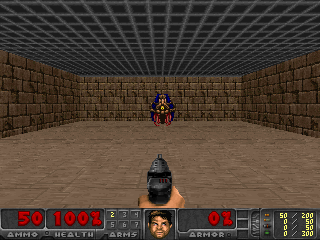

# Doom Environment - GIF Generation Guide

This guide explains how to generate GIFs of different Doom scenarios for the README.

## Quick Start

```bash
# Navigate to doom_env directory
cd src/envs/doom_env

# Install with GIF generation dependencies
pip install -e ".[gif_generation]"

# Or install specific packages
pip install imageio

# Generate GIFs (this will take a few minutes)
python generate_gifs.py
```

## What Gets Generated

The script will create 4 GIF files in the `assets/` directory:

1. **basic.gif** - Basic scenario showing simple movement and shooting
2. **deadly_corridor.gif** - Corridor navigation with monsters
3. **defend_the_center.gif** - Defending a central position
4. **health_gathering.gif** - Collecting health packs

Each GIF will be:
- 80 frames long
- 12 fps (frames per second)
- 320x240 resolution
- Approximately 1-3 MB in size

## Custom Generation

You can customize the generation:

```bash
# Different scenarios
python generate_gifs.py --scenario basic my_way_home take_cover

# More frames and higher FPS
python generate_gifs.py --frames 150 --fps 20

# Higher resolution (larger file size)
python generate_gifs.py --resolution RES_640X480

# Single scenario
python generate_gifs.py --scenario basic --frames 100 --fps 15
```

## Available Scenarios

- `basic` - Simple movement and shooting
- `deadly_corridor` - Navigate corridor with monsters
- `defend_the_center` - Defend central position
- `defend_the_line` - Defend a line against enemies
- `health_gathering` - Collect health packs
- `my_way_home` - Navigate to target location
- `predict_position` - Predict object positions
- `take_cover` - Learn cover mechanics

## Troubleshooting

### ImportError: No module named 'imageio'

Install with GIF generation support:
```bash
pip install -e ".[gif_generation]"
```

Or install imageio directly:
```bash
pip install imageio
```

### ImportError: No module named 'vizdoom'

Install the doom_env package (includes ViZDoom):
```bash
pip install -e .
```

### Scenario not found

Make sure you're using one of the built-in scenario names listed above, or provide a full path to a .cfg file:
```bash
python generate_gifs.py --scenario /path/to/custom_scenario.cfg
```

## README Integration

The GIFs are already referenced in the README.md file in the "Scenarios Gallery" section. Once generated, they will automatically display when viewing the README.

The references look like:
```markdown

```

## Re-generating GIFs

To update the GIFs with different settings or refresh them:

1. Delete old GIFs: `rm assets/*.gif`
2. Run the generator with your desired settings
3. The new GIFs will replace the old ones

## Note

The script runs headless (no window) and uses random actions to showcase the environments. The GIFs show what the agent sees, not necessarily optimal gameplay.
