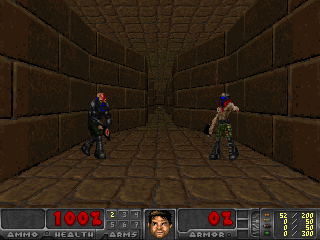
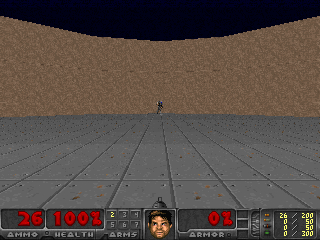
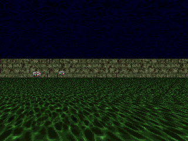
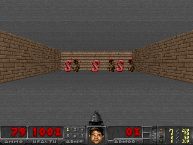
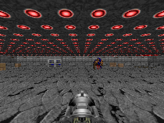

# Doom Environment

A ViZDoom-based environment for OpenEnv. ViZDoom is a Doom-based AI research platform for visual reinforcement learning, allowing agents to play Doom using only visual information. Referencing the [ViZDoom documentation](https://vizdoom.cs.put.edu.pl/). And, also for licensing information, please refer to the [ViZDoom license](https://github.com/Farama-Foundation/ViZDoom?tab=readme-ov-file#license)

## References

- [ViZDoom Documentation](http://vizdoom.cs.put.edu.pl/)
- [ViZDoom GitHub](https://github.com/mwydmuch/ViZDoom)

<p align="center">
  
</p>


## Overview

This environment wraps ViZDoom scenarios and exposes them through the OpenEnv API. It provides:
- **Visual observations**: RGB or grayscale screen buffers
- **Game variables**: Health, ammo, kills, etc.
- **Flexible action space**: Discrete actions or button combinations
- **Multiple scenarios**: Built-in scenarios like "basic", "deadly_corridor", "defend_the_center", etc.

     

## Quick Start

The simplest way to use the Doom environment is through the `DoomEnv` class:

```python
from doom_env import DoomAction, DoomEnv

try:
    # Create environment from Docker image
    doom_env = DoomEnv.from_docker_image("doom-env:latest")

    # Reset to start a new episode
    result = doom_env.reset()
    print(f"Screen shape: {result.observation.screen_shape}")
    print(f"Available actions: {result.observation.available_actions}")

    # Take actions
    for i in range(100):
        # Use discrete action (e.g., 0=no-op, 1-7=various actions)
        result = doom_env.step(DoomAction(action_id=1))

        # Optional: Render the game
        doom_env.render()  # Shows visualization window

        print(f"Step {i}:")
        print(f"  Reward: {result.reward}")
        print(f"  Done: {result.observation.done}")

        if result.observation.done:
            print("Episode finished!")
            break

finally:
    # Always clean up
    doom_env.close()
```

That's it! The `DoomEnv.from_docker_image()` method handles:
- Starting the Docker container
- Waiting for the server to be ready
- Connecting to the environment
- Container cleanup when you call `close()`

## Web Interface

The Doom environment includes a built-in web interface for interactive testing and exploration. The web interface is **enabled by default** in the Docker image.

```bash
# Start the container with web interface (default)
docker run -p 8000:8000 doom-env:latest

# Or explicitly enable it
docker run -p 8000:8000 -e ENABLE_WEB_INTERFACE=true doom-env:latest

# Disable web interface (API only)
docker run -p 8000:8000 -e ENABLE_WEB_INTERFACE=false doom-env:latest

# Access the web interface in your browser:
# - Interactive UI: http://localhost:8000/web
# - API Documentation: http://localhost:8000/docs
# - Health Check: http://localhost:8000/health
```

The web interface provides:
- **Interactive gameplay**: Control the agent through a web UI
- **Real-time visualization**: See what the agent sees
- **API explorer**: Test all endpoints with OpenAPI/Swagger
- **Environment info**: View available actions, scenarios, and configuration

**Note**: When `ENABLE_WEB_INTERFACE=false`, only the core API endpoints are available (no `/web` interface).

## Building the Docker Image

The Doom environment Docker image can be built in standalone mode using only public base images. This makes it suitable for CI/CD, GitHub, and HuggingFace deployments.

```bash
# Build from project root
docker build -t doom-env:latest -f src/envs/doom_env/server/Dockerfile src/envs/doom_env

# Or build from the doom_env directory
cd src/envs/doom_env
docker build -t doom-env:latest -f server/Dockerfile .
```

**What gets installed:**

The Dockerfile uses the `pyproject.toml` to install all dependencies:
- **OpenEnv core**: Installed as a dependency
- **Core packages**: FastAPI, Uvicorn, Pydantic, Requests (from pyproject.toml)
- **ViZDoom**: Installed with all system dependencies (SDL2, Boost, OpenGL, etc.)
- **NumPy**: For array operations
- **Web interface support**: Enabled by default via `ENABLE_WEB_INTERFACE=true`

**Build details:**
- Base image: `python:3.11-slim` (public)
- Installation: Uses `pip install -e` with pyproject.toml
- System deps: ViZDoom build tools and runtime libraries
- Size: ~1.5-2GB (includes ViZDoom system dependencies)

## Scenarios Gallery

ViZDoom comes with multiple built-in scenarios for different research tasks:

### Basic Scenario
Simple environment for learning basic movement and shooting mechanics.

*Agent learning to navigate and shoot in the basic scenario*

### Deadly Corridor
Navigate through a corridor while avoiding or eliminating monsters.

*Agent navigating the deadly corridor*

### Defend the Center
Stay alive as long as possible while defending the center position.

*Agent defending the center against waves of enemies*

### Health Gathering
Collect health packs scattered around the environment to survive.

*Agent collecting health packs for survival*

> **Note**: To generate these GIFs yourself, run:
> ```bash
> cd src/envs/doom_env
> pip install numpy imageio vizdoom
> python generate_gifs.py
> ```

## Environment Details

### Action Space

Actions can be specified in two ways:

1. **Discrete Actions** (recommended for most use cases):
   ```python
   DoomAction(action_id=2)  # Single integer action
   ```

   Available discrete actions (depends on scenario):
   - `0`: No-op (do nothing)
   - `1-N`: Various single button presses (move left, right, shoot, etc.)

2. **Button Combinations**:
   ```python
   DoomAction(buttons=[1, 0, 1, 0])  # Press specific buttons
   ```

   Each element is 0 (not pressed) or 1 (pressed).

### Observation Space

**DoomObservation** contains:
- `screen_buffer` (List[int]): Flattened screen pixels
  - RGB: Shape [height, width, 3] before flattening
  - Grayscale: Shape [height, width] before flattening
- `screen_shape` (List[int]): Original shape of the screen
- `game_variables` (List[float]): Health, ammo, kills, etc.
- `available_actions` (List[int]): Valid action IDs
- `episode_finished` (bool): Whether episode has ended
- `reward` (float): Reward from last action
- `done` (bool): Same as episode_finished
- `metadata` (dict): Additional info (scenario name, available buttons)

### Scenarios

ViZDoom comes with several built-in scenarios:

- **basic**: Simple scenario to learn basic movement and shooting
- **deadly_corridor**: Navigate a corridor while avoiding/killing monsters
- **defend_the_center**: Stay alive as long as possible in the center
- **defend_the_line**: Defend a line against incoming monsters
- **health_gathering**: Collect health packs to survive
- **my_way_home**: Navigate to a specific location
- **predict_position**: Predict where an object will be
- **take_cover**: Learn to take cover from enemy fire

## Advanced Usage

### Custom Configuration

You can customize the environment when creating the server:

```python
from doom_env.server.doom_env_environment import DoomEnvironment

# Create with custom settings
env = DoomEnvironment(
    scenario="deadly_corridor",
    screen_resolution="RES_320X240",  # Higher resolution
    screen_format="GRAY8",             # Grayscale instead of RGB
    window_visible=True,               # Show game window
    use_discrete_actions=True          # Use discrete action space
)
```

### Connecting to an Existing Server

If you already have a Doom environment server running:

```python
from doom_env import DoomEnv

# Connect to existing server
doom_env = DoomEnv(base_url="http://localhost:8000")

# Use as normal
result = doom_env.reset()
result = doom_env.step(DoomAction(action_id=1))
```

Note: When connecting to an existing server, `doom_env.close()` will NOT stop the server.

### Processing Visual Observations

The screen buffer is flattened for JSON serialization. To use it:

```python
import numpy as np

result = doom_env.reset()
obs = result.observation

# Reshape to original dimensions
screen = np.array(obs.screen_buffer).reshape(obs.screen_shape)

# screen is now a numpy array with shape [height, width, channels]
# You can visualize it, pass to a neural network, etc.
```

### Rendering

The Doom environment supports multiple rendering options depending on your use case:

#### Option 1: Web Interface (Recommended for Docker)

The easiest way to visualize the game when using Docker:

```bash
# Start the container with web interface
docker run -p 8000:8000 doom-env:latest

# Open in your browser:
# http://localhost:8000/web
```

**Advantages:**
- No local dependencies needed
- Works in browser
- Interactive controls
- Real-time visualization

#### Option 2: Client-Side Rendering (Docker Mode)

Render on your local machine using the screen buffer from Docker:

```python
from doom_env import DoomAction, DoomEnv

env = DoomEnv.from_docker_image("doom-env:latest")
result = env.reset()

for _ in range(100):
    result = env.step(DoomAction(action_id=1))
    env.render()  # Display using cv2 or matplotlib

env.close()
```

**Requirements:** Install rendering library on your **local machine** (not in Docker):
```bash
pip install opencv-python
# or
pip install matplotlib
```

**Note:** This downloads the screen buffer from Docker via HTTP and renders it locally. Works well but has some network overhead.

#### Option 3: Local Mode with Native Window (Best Performance)

For the fastest rendering, run locally with ViZDoom's native window:

```python
from envs.doom_env.server.doom_env_environment import DoomEnvironment
from envs.doom_env.models import DoomAction

# Native ViZDoom window (most efficient)
env = DoomEnvironment(
    scenario="basic",
    window_visible=True,  # Enable native SDL2 window
)

obs = env.reset()
for _ in range(100):
    obs = env.step(DoomAction(action_id=1))
    # No render() call needed - native window updates automatically

env.close()
```

**Advantages:**
- Native SDL2 rendering (fastest)
- No network overhead
- Smooth real-time gameplay

#### Rendering Dependencies

Install optional rendering dependencies:

```bash
# Using pip
pip install -e ".[rendering]"

# Or install individually
pip install opencv-python  # Preferred for rendering
# or
pip install matplotlib     # Fallback option
```

#### Render Modes

Both environments support two render modes:

- **`mode="human"`** (default): Display in a window
- **`mode="rgb_array"`**: Return numpy array for custom processing

```python
# Get frame as numpy array
frame = env.render(mode="rgb_array")
print(frame.shape)  # e.g., (240, 320, 3)
```

## Development & Testing

### Local Development

Install dependencies and run locally without Docker:

```bash
# Install the environment in development mode
cd src/envs/doom_env
uv pip install -e .

# Or using pip
pip install -e .

# Run the server locally
uv run server --host 0.0.0.0 --port 8000

# Or using uvicorn directly
uvicorn server.app:app --reload
```

### Testing

Test the environment logic directly:

```bash
# From the doom_env directory
python3 -c "
from server.doom_env_environment import DoomEnvironment
from models import DoomAction

env = DoomEnvironment(scenario='basic')
obs = env.reset()
print(f'Initial observation shape: {obs.screen_shape}')

for i in range(10):
    obs = env.step(DoomAction(action_id=1))
    print(f'Step {i}: reward={obs.reward}, done={obs.done}')
"
```

### Running the Example Script

The `example.py` script demonstrates both Docker and local usage with rendering:

```bash
# Run with Docker (no rendering)
python example.py

# Run with Docker and rendering
python example.py --render

# Run locally without Docker
python example.py --local

# Run locally with rendering (uses native ViZDoom window)
python example.py --local --render

# Run for more steps
python example.py --local --render --steps 300
```

## Deploying to Hugging Face Spaces

Deploy your Doom environment to Hugging Face Spaces:

```bash
# From the doom_env directory
openenv push

# Or specify options
openenv push --repo-id my-org/doom-env --private
```

The `openenv push` command will:
1. Validate the environment setup
2. Prepare for Hugging Face Docker space
3. Upload to Hugging Face

After deployment, your space will include:
- **Web Interface** at `/web` - Interactive UI
- **API Documentation** at `/docs` - OpenAPI/Swagger
- **Health Check** at `/health` - Monitoring

The doom-env space is already pushed and available at: [Huggingface Doom OpenEnv](https://huggingface.co/spaces/Crashbandicoote2/doom_env)

## Project Structure

```
doom_env/
├── .dockerignore                # Docker build exclusions
├── __init__.py                  # Module exports (DoomAction, DoomObservation, DoomEnv)
├── README.md                    # This file
├── GIF_GENERATION.md            # Guide for generating scenario GIFs
├── openenv.yaml                 # OpenEnv manifest
├── pyproject.toml               # Dependencies (vizdoom, numpy, etc.)
├── uv.lock                      # Locked dependencies
├── client.py                    # DoomEnv HTTP client
├── models.py                    # DoomAction and DoomObservation dataclasses
├── example.py                   # Example usage script
├── generate_gifs.py             # Script to generate GIFs of scenarios
├── assets/                      # Directory for generated GIFs
│   ├── .gitkeep
│   └── README.md                # Assets directory documentation
└── server/
    ├── __init__.py              # Server module exports
    ├── doom_env_environment.py  # Core ViZDoom wrapper
    ├── app.py                   # FastAPI application
    ├── requirements.txt         # Python dependencies for Docker
    └── Dockerfile               # Container with ViZDoom dependencies
```

## Dependencies

- **ViZDoom**: Doom-based AI research platform
- **NumPy**: Array operations for screen buffers
- **OpenEnv Core**: Base framework
- **FastAPI/Uvicorn**: HTTP server
- **System libraries**: SDL2, Boost, OpenGL, etc. (handled in Dockerfile)

All dependencies are defined in `pyproject.toml` and automatically installed during Docker build.

## Configuration

### Environment Variables

The Docker container supports several environment variables for configuration:

**Web Interface:**
- `ENABLE_WEB_INTERFACE` (default: `true`) - Enable/disable the web UI at `/web`

**Doom Environment:**
- `DOOM_SCENARIO` (default: `basic`) - Which scenario to load
- `DOOM_SCREEN_RESOLUTION` (default: `RES_160X120`) - Screen resolution
- `DOOM_SCREEN_FORMAT` (default: `RGB24`) - Screen format (RGB24, GRAY8, etc.)
- `DOOM_WINDOW_VISIBLE` (default: `false`) - Show native ViZDoom window

**Example:**
```bash
docker run -p 8000:8000 \
  -e ENABLE_WEB_INTERFACE=true \
  -e DOOM_SCENARIO=deadly_corridor \
  -e DOOM_SCREEN_RESOLUTION=RES_320X240 \
  doom-env:latest
```

## Troubleshooting

### ViZDoom Installation Issues

If you encounter issues installing ViZDoom:

```bash
# Make sure you have system dependencies (Ubuntu/Debian)
sudo apt-get install cmake libboost-all-dev libsdl2-dev libfreetype6-dev

# Then install ViZDoom
pip install vizdoom
```

### Docker Build Issues

If Docker build fails with ViZDoom dependencies:
- Ensure you have sufficient disk space
- Check that the base image is accessible
- Verify system dependencies in Dockerfile

### Runtime Errors

- **"Could not load scenario"**: Check scenario name or path
- **"Invalid action_id"**: Ensure action_id is within valid range
- **Screen buffer issues**: Verify screen format and resolution settings

## References

- [ViZDoom Documentation](http://vizdoom.cs.put.edu.pl/)
- [ViZDoom GitHub](https://github.com/mwydmuch/ViZDoom)
- [OpenEnv Documentation](https://github.com/meta-pytorch/OpenEnv)

## License

BSD 3-Clause License (see LICENSE file in repository root)

⠀⠀⠀⠀⠀⠀⠀⠀⠀⠀⠀⠀⠀⠀⠀⠀⠀⠀⠀⠀⠀⠀⠀⠀⠀⠀⠀⠀⠀⠀⠀⠀⠀⠀⠀⠀⠀⠀⠀⠀⠀⠀⠀⠀⠀⣠⢾⠍⡉⠉⠙⣿⣆⠀⠀⠀⠀⠀⠀⠀⠀⠀⠀⠀⠀
⠀⠀⠀⠀⠀⠀⠀⠀⠀⠀⠀⠀⠀⠀⠀⠀⠀⠀⠀⠀⠀⠀⠀⠀⠀⠀⠀⢀⣠⣴⠾⠿⠽⢷⣶⣤⡀⠀⠀⠀⠀⠀⠀⠀⢀⣟⡟⣠⣿⣶⡀⣷⡻⡄⠀⠀⠀⠀⠀⠀⠀⠀⠀⠀⠀
⠀⠀⠀⠀⠀⠀⠀⠀⠀⠀⠀⠀⠀⠀⠀⠀⠀⠀⠀⠀⠀⠀⠀⠀⠀⢠⠴⡟⡋⡀⠀⣀⣀⠀⠀⠉⠛⣦⡀⠀⠀⠀⠀⠀⠀⢿⣅⣽⣿⣿⣷⣿⣿⠃⠀⠀⠀⠀⠀⠀⠀⠀⠀⠀⠀
⠀⠀⠀⠀⠀⠀⠀⠀⠀⠀⠀⠀⠀⠀⠀⠀⠀⠀⠀⠀⠀⠀⠀⠀⡴⠃⢀⢾⣿⣿⣿⣯⣬⣽⣿⣀⡀⠈⠙⣆⠀⠀⠀⠀⢀⣸⣯⣿⣾⡷⢻⣿⠋⠀⠀⠀⠀⠀⠀⠀⠀⠀⠀⠀⠀
⠀⠀⠀⠀⠀⠀⠀⠀⠀⠀⠀⠀⠀⠀⠀⠀⠀⠀⠀⠀⠀⠀⠀⣜⢁⠁⣾⡿⣙⠿⣯⣭⣍⣹⠼⠋⠁⣴⠀⢘⣧⠀⠀⡴⢛⣭⢟⠽⠋⢠⣼⠁⠀⠀⠀⠀⠀⠀⠀⠀⠀⠀⠀⠀⠀
⠀⠀⠀⠀⠀⠀⠀⠀⠀⠀⠀⠀⠀⠀⠀⠀⠀⠀⠀⠀⠀⠀⢸⢻⠘⢸⡿⢷⣬⣧⡀⠀⠀⠀⢀⣤⠾⢿⡇⠘⣿⡆⣸⠛⣿⡿⣟⡀⠀⡾⡇⠀⠀⠀⠀⠀⠀⠀⠀⠀⠀⠀⠀⠀⠀
⠀⠀⠀⠀⠀⠀⠀⠀⠀⠀⠀⠀⠀⠀⠀⠀⠀⠀⠀⠀⠀⠀⢸⣾⣦⣿⣿⡄⠈⢿⢿⣷⣶⡾⠋⠁⠀⣸⠇⡰⠛⢷⣷⣻⡿⠺⣿⣿⠽⠋⠀⠀⠀⠀⠀⠀⠀⠀⠀⠀⠀⠀⠀⠀⠀
⠀⠀⠀⠀⠀⠀⠀⠀⠀⠀⠀⠀⠀⠀⠀⣀⣀⣀⣀⣀⠀⣴⠏⠀⣿⠙⢻⣿⣄⠈⠀⠸⠀⠉⠀⣠⣾⠟⢀⣧⡇⠀⢽⣿⣿⣬⣼⣿⡀⠀⠀⠀⠀⠀⠀⠀⠀⠀⠀⠀⠀⠀⠀⠀⠀
⠀⠀⠀⠀⠀⠀⠀⠀⠀⠀⠀⠀⠀⣰⠚⣿⣿⣿⣿⣿⡿⠟⢛⣰⣿⣧⣷⣝⡿⣷⣞⢷⣄⣲⣾⣿⡃⢰⡿⡟⢀⣴⣿⣿⣿⣯⡿⠿⣿⣶⣤⣀⠀⠀⠀⠀⠀⠀⠀⠀⠀⠀⠀⠀⠀
⠀⠀⠀⠀⠀⠀⠀⠀⠀⠀⠀⣠⠞⢁⣼⣿⣿⣿⡟⠋⠁⣉⣽⣿⣿⣿⣿⣿⣽⣯⣿⡄⠉⠁⢷⣬⣹⣿⣿⣤⡾⠁⣸⣿⣿⡟⠁⠀⠀⢹⣿⣿⣷⡆⠀⠀⠀⠀⠀⠀⠀⠀⠀⠀⠀
⠀⠀⠀⠀⠀⠀⠀⠀⠀⢀⣾⡷⠞⣫⣾⣿⣿⣿⣧⡀⣤⠀⠈⣻⣿⣿⣿⣿⣿⣿⣿⣷⣖⠀⠘⢿⣿⣿⣿⣿⣿⣿⣿⣿⣿⠃⠋⠻⢤⣅⡺⢦⡀⠳⡄⠀⠀⠀⠀⠀⠀⠀⠀⠀⠀
⠀⠀⠀⠀⠀⠀⠀⠀⣰⣿⣯⣴⠞⠁⣀⣿⣿⣿⣿⣷⣄⣤⠤⢊⣿⣿⣿⣿⣿⣿⣿⣿⣯⣴⣴⣶⣿⣿⠟⣸⣿⣿⣿⣿⡏⡆⠀⢠⣤⣠⣥⠀⡟⣶⣿⡄⠀⠀⠀⠀⠀⠀⠀⠀⠀
⠀⠀⠀⠀⠀⠀⠀⠀⣽⡿⣿⣏⡀⠀⠹⣟⣿⡿⣿⣿⣋⣶⣺⡽⣿⣏⣅⠛⠂⠴⠶⠿⠿⠃⠈⠉⠻⣷⣶⣿⣿⣿⣿⡿⠀⣿⡄⠈⣷⣮⠙⢀⡿⠘⢻⣇⠀⠀⠀⠀⠀⠀⠀⠀⠀
⠀⠀⠀⠀⠀⠀⠀⠀⢸⣧⢻⡶⠀⠀⠘⢿⣿⣿⣿⣿⣿⠋⠉⠀⠀⠉⠻⠿⠶⠶⠶⠦⠴⠞⠛⠷⠗⠈⠛⢿⣿⣿⡿⢁⣼⠯⠄⠀⠀⠀⣠⡞⠁⣠⣾⣿⠀⠀⠀⠀⠀⠀⠀⠀⠀
⠀⠀⠀⠀⠀⠀⠀⠀⢸⣻⣾⣷⡀⢐⠀⣿⣿⣿⣿⣿⠁⠀⠠⠀⠀⠀⠀⠀⠀⠀⠀⠀⠀⡁⠰⣾⣿⠀⠀⠈⢻⣿⣅⢿⣇⠀⠀⠀⠀⢀⣿⡟⠀⡷⢿⢿⠀⠀⠀⠀⠀⠀⠀⠀⠀
⠀⠀⠀⠀⠀⠀⠀⠀⠀⠙⣿⡎⣤⣌⡰⣿⣿⣿⣿⣟⠀⠠⠀⢀⡀⠀⠂⠀⠀⠉⠉⠉⠈⠉⠙⢾⣭⡤⠂⠀⠀⠹⣿⣎⣿⣶⣒⣿⣷⣿⣯⣮⡵⣿⣾⣿⡀⠀⠀⠀⠀⠀⠀⠀⠀
⠀⠀⠀⠀⠀⠀⠀⠀⠀⠀⠈⢻⢿⠛⣿⠛⠛⢿⣿⣿⣃⢀⣀⣀⠀⣀⣤⣾⠓⠶⠖⠷⣤⣄⡀⠀⠀⠀⠀⠀⠀⢠⣿⣿⣾⣿⣿⣿⠍⣩⣉⣿⡆⠰⣿⣭⡇⠀⠀⠀⠀⠀⠀⠀⠀
⠀⠀⠀⠀⠀⠀⠀⠀⠀⠀⢀⡸⠾⢴⡇⠀⠀⢸⣿⣿⣯⣭⣿⣿⣿⡿⠛⠛⠛⠛⠛⠛⠛⠟⠻⣷⣶⣴⣶⣮⡴⠫⢾⣿⣿⣟⠉⣹⣿⣿⣿⣿⣷⣄⠸⢿⡇⠀⠀⠀⠀⠀⠀⠀⠀
⠀⠀⠀⠀⠀⠀⠀⠀⠀⣴⠋⡽⠁⡾⠀⠀⠀⣼⣿⣧⣁⣴⣶⠾⢿⣿⡶⠀⠒⠒⠂⠀⠀⠀⣰⣾⣧⣌⣉⠙⠂⢠⢿⣿⣿⣫⡿⠿⠋⠉⠈⠙⢻⣽⢧⠀⣽⣄⠀⠀⠀⠀⠀⠀⠀
⠀⠀⠀⠀⠀⠀⢀⣴⡻⣻⣼⣿⣰⠇⠀⠀⠀⠉⣁⣿⣟⢉⣼⣶⣶⡿⠿⣿⡟⠛⠛⠛⣷⣾⢿⣯⣤⣤⡉⠳⡶⢋⡞⣿⣿⣇⠀⠀⠙⠀⠀⠀⢀⣿⣫⠇⣈⣁⣣⡀⠀⠀⠀⠀⠀
⠀⠀⠀⠀⠀⣠⠎⠉⣰⣿⣿⣿⠉⢲⣤⠀⠀⠾⣿⣿⣳⣜⢿⡟⠫⢠⣶⣾⣷⣤⣤⣼⣯⡤⣤⣀⣻⠻⣿⣦⣠⠞⣼⣿⡿⢿⣤⡸⣷⣦⣤⣴⣿⣿⣯⠼⢥⣈⣿⡗⠶⢤⡀⠀⠀
⠀⠀⠀⠀⢰⡃⠀⣼⣿⣿⣿⣿⣷⣤⣁⣀⣤⣾⣿⣿⣿⣿⣿⣿⠷⣾⣟⣀⣫⣄⣀⣀⣠⣄⠘⢿⡤⠴⣷⡿⠃⠘⡽⣿⣃⠘⣿⣿⣿⣿⣿⣿⣿⠿⡿⠟⠀⠘⣝⢿⡆⠀⠻⣦⡀
⠀⠀⠀⢀⡏⢀⣾⣿⣿⣿⣿⣿⣿⣿⣿⣿⣿⡿⢳⣿⣯⣿⣿⣿⡿⣾⣿⡏⠙⣿⡉⠙⡍⠉⢿⣟⣴⠶⠾⢿⣟⠷⣿⡿⠿⣷⣾⡇⢻⣿⣿⡏⡴⠞⠻⣞⡍⠙⢫⣿⣧⠀⠀⠘⠃
⠀⠀⢀⣾⢿⡾⢷⣿⣿⠋⣿⣿⣿⣿⣿⣿⣿⡗⣼⢿⣿⣿⠘⣿⣿⣷⣼⣣⣶⠾⠿⠛⠶⣦⠚⣠⣴⣿⣿⠋⢰⣼⣯⠁⠐⢺⣿⣿⣮⣿⣿⣿⡟⠂⢀⣽⡓⡀⠒⢹⣿⠇⠀⣤⡀
⠀⠀⣿⠿⣾⣳⣼⣏⠛⠛⢿⣯⣶⣿⢋⣼⣿⢱⣟⣷⣮⠻⣷⠘⠿⣿⣭⣉⡉⣠⣤⣤⣄⣉⣉⣁⣾⡿⠟⣠⣾⡏⣡⠎⠀⢸⣿⡌⣿⣿⣿⣿⣟⡂⠠⢿⡅⢨⡏⣾⣟⠀⠀⠈⠁
⠀⢸⡿⠓⢀⣿⣿⣿⡷⣦⣼⠟⣹⡵⠛⢳⢟⣾⣿⣿⡿⠀⣿⠄⡀⣿⣯⠙⣿⡟⠛⢛⠛⣿⣿⡏⢉⡇⠀⢯⣿⡇⡅⢴⠀⢸⣾⡇⠸⣟⠹⣿⢿⡏⢰⣿⣆⣈⠁⣽⣿⠀⠀⠀⠀
⢀⡖⠘⠃⢠⣿⣯⡟⠻⣿⣻⡟⠃⠀⠀⠸⣿⢿⣿⣿⣿⣾⣿⣿⣿⣿⣿⣧⢸⣧⣤⣭⣤⣿⣿⡔⢿⣿⡿⣿⣿⣿⣷⣤⣠⣿⣿⠃⠀⣿⣇⣿⣿⣷⣿⣿⠿⢽⣷⣩⣿⠀⠀⠀⠀
⣾⠁⣠⠹⣿⣿⡟⠻⣶⣿⢻⡇⠀⠀⠀⠀⠈⢹⡿⣿⣿⣿⣿⢟⣟⢿⢿⣿⣿⡷⠶⠶⠶⠈⢯⡻⡄⢻⣿⢀⠙⢿⣿⣿⣷⡟⠁⢀⣴⢟⣺⣿⣿⣿⣥⣽⣶⣄⣈⣿⣿⠀⠀⠀⠀
⣭⠎⠿⢠⡟⢿⣿⣷⣽⣿⣼⡇⠀⠀⠀⠀⢠⣿⢿⡛⢿⡿⣿⡾⣿⡇⢠⣿⣿⡇⠀⠀⠀⠀⣈⢻⡖⢸⣿⢿⣾⢏⠟⠛⢿⣧⣀⣸⣴⡿⢻⣿⣻⣍⠉⣉⠛⣛⠛⠛⢿⡷⠀⠀⢀
⢳⣶⠖⠈⢿⣿⣛⠹⣿⣿⢸⡃⠀⠀⠀⣠⠟⣩⠞⠀⠈⣿⡟⣵⡿⠃⣼⣿⣿⠁⠐⠀⠘⠃⠉⣸⣇⠀⠹⣦⢻⣟⠀⠀⠀⠹⣿⣴⣯⣼⣿⣿⣿⣿⡄⣿⡀⢿⣰⡇⢸⡇⠀⠠⠋
⠸⣹⡶⠀⢸⣿⣿⣿⣷⣛⢻⡇⠀⠀⢠⡷⠃⠁⠀⠀⠀⣿⠸⣿⠀⠠⣿⣿⣧⡀⠀⠀⠀⠀⢰⣿⣄⠁⠀⣹⢦⣿⣦⠀⠀⠀⣿⣿⣿⡏⣿⡏⡛⠟⢲⣶⢶⣾⣷⡭⣸⡴⠊⠀⠀
⠀⢹⡄⣄⡘⣿⣿⣿⣿⠹⡿⠁⠀⠀⣿⠇⠀⠀⠀⠀⡶⠘⡇⣿⡃⠂⣻⣿⣿⣷⡄⠀⠀⠀⢸⣿⣝⡓⢰⣿⣾⡏⣿⣦⠀⠀⢹⣾⣿⡎⢰⣷⣓⠀⣼⣿⢸⣿⢹⡆⢿⠇⠀⠀⠀
⠀⠀⠙⠻⣿⣿⠧⠭⠭⠟⠁⠀⠀⣸⡽⢐⠀⠀⠀⢸⣇⣸⡷⣿⠃⠀⢿⣿⣿⣿⣿⣿⣷⣦⣿⣿⣯⡟⢺⣿⣿⣇⣸⡿⡇⠀⢀⡟⣿⡧⢸⣷⡌⢀⣿⣿⣼⣿⠮⣿⠋⠀⠀⠀⠀
⠀⠀⠀⠀⠀⠈⠁⠀⠀⠀⠀⠀⢀⣟⣷⡿⠀⠀⠀⠀⠉⢸⡇⡷⠀⢀⠈⠻⣿⣿⢿⣿⢿⣿⣿⣿⣿⣷⣾⣿⣿⡇⠉⠀⠀⠀⢸⡇⢸⣿⡾⡿⣧⣼⣿⠵⣿⣇⡾⠁⠀⠀⠀⠀⠀
⠀⠀⠀⠀⠀⠀⠀⠀⠀⠀⠀⠀⢸⣾⣼⡛⢸⡄⠀⠀⠀⢸⣧⢳⣀⠀⠀⠀⣿⢋⡟⠈⢧⢻⣿⣿⣿⣿⣿⣿⣿⣷⡀⠀⠀⠀⠈⡇⠀⢯⡇⠀⠉⠙⠙⠉⠉⠋⠀⠀⠀⠀⠀⠀⠀
⠀⠀⠀⠀⠀⠀⠀⠀⠀⠀⠀⠀⢸⣿⣿⢹⡸⣷⠀⠀⠀⠄⠻⢷⣄⣀⢀⣼⣣⠟⠀⠀⠈⢣⠹⣿⣿⣿⣿⣿⣿⠿⢷⡄⠀⠀⠀⠀⠀⢸⡇⠀⠀⠀⠀⠀⠀⠀⠀⠀⠀⠀⠀⠀⠀
⠀⠀⠀⠀⠀⠀⠀⠀⠀⠀⠀⠀⢸⣿⣿⡈⢁⣽⣷⡆⠀⠀⠀⠀⢈⣽⣿⡿⠃⠀⠀⠀⠀⠀⠙⣌⢻⣿⣿⣿⣿⠀⠈⢿⣦⠓⠀⠀⠀⣸⡇⠀⠀⠀⠀⠀⠀⠀⠀⠀⠀⠀⠀⠀⠀
⠀⠀⠀⠀⠀⠀⠀⠀⠀⠀⠀⠀⣸⠚⢿⣷⣿⣿⣯⣻⡄⠀⠀⢀⣾⠟⡿⠁⠀⠀⠀⠀⠀⠀⠀⠈⢦⡻⣿⣿⣷⡀⢠⣾⣫⡿⣬⡃⠆⠛⣧⠀⠀⠀⠀⠀⠀⠀⠀⠀⠀⠀⠀⠀⠀
⠀⠀⠀⠀⠀⠀⠀⠀⠀⠀⠀⢠⣻⣷⢾⣟⠛⠁⠉⢻⣿⣆⣠⡾⢿⣿⠁⠀⠀⠀⠀⠀⠀⠀⠀⠀⠘⣇⣸⣿⣿⣾⣾⣿⠇⠀⠈⢙⡟⠿⢻⣆⠀⠀⠀⠀⠀⠀⠀⠀⠀⠀⠀⠀⠀
⠀⠀⠀⠀⠀⠀⠀⠀⠀⠀⠀⢸⣿⣫⡾⠿⣦⣀⣀⣠⡿⢿⣏⡴⣿⡏⠀⠀⠀⠀⠀⠀⠀⠀⠀⠀⠀⢸⣿⣿⣿⣿⣿⣿⣤⣤⣤⡞⠁⢂⣹⣿⠀⠀⠀⠀⠀⠀⠀⠀⠀⠀⠀⠀⠀
⠀⠀⠀⠀⠀⠀⠀⠀⠀⠀⠀⣸⣉⣿⡳⠀⠀⠈⠁⠀⠀⠈⢿⡄⣿⡇⠀⠀⠀⠀⠀⠀⠀⠀⠀⠀⠀⠘⣿⢿⣿⣿⣿⣷⣄⠀⠀⠀⢀⡀⠘⣿⡇⠀⠀⠀⠀⠀⠀⠀⠀⠀⠀⠀⠀
⠀⠀⠀⠀⠀⠀⠀⠀⠀⢀⣰⣷⣻⣿⡟⠶⠶⠤⠤⠀⠀⠀⣸⣿⡿⠀⠀⠀⠀⠀⠀⠀⠀⠀⠀⠀⠀⠀⠙⣿⣿⣿⣿⣿⣿⣶⣖⣾⠭⡁⠈⢿⣳⣦⠀⠀⠀⠀⠀⠀⠀⠀⠀⠀⠀
⠀⠀⠀⠀⠀⠀⠀⠀⢰⣟⣿⣽⠋⣿⠃⢤⣭⣭⠀⠀⠀⣠⣟⣿⣆⠀⠀⠀⠀⠀⠀⠀⠀⠀⠀⠀⠀⠀⢀⣾⡿⣿⣿⣿⣿⣯⡥⠶⠀⣛⠀⢶⡿⡬⣷⡀⠀⠀⠀⠀⠀⠀⠀⠀⠀
⠀⠀⠀⠀⠀⠀⠀⠀⣶⡿⢱⣿⣰⡿⠿⠶⢭⣦⠀⠀⣰⡿⢁⢿⣾⡇⠀⠀⠀⠀⠀⠀⠀⠀⠀⠀⠀⠀⢰⣿⣢⣿⣿⣿⣿⣷⣶⠖⠛⠙⢷⣌⡉⠹⣷⡇⠀⠀⠀⠀⠀⠀⠀⠀⠀
⠀⠀⠀⠀⠀⠀⠀⢰⣿⣗⣿⣿⣿⡀⣶⣶⠀⣹⣷⣾⣿⣷⡼⣯⣿⣆⠀⠀⠀⠀⠀⠀⠀⠀⠀⠀⠀⢀⣾⢿⣿⣿⣿⣿⣿⣿⣿⣗⣼⠄⠀⣿⣷⣀⣿⢷⠀⠀⠀⠀⠀⠀⠀⠀⠀
⠀⠀⠀⠀⠀⠀⠀⠈⢹⣿⡿⢻⣿⣷⣽⣏⣰⣿⣿⣿⣷⣶⣧⢹⣷⡟⠀⠀⠀⠀⠀⠀⠀⠀⠀⠀⠀⠸⣭⠿⣿⣿⣿⣿⣿⣿⣿⣿⣥⣤⣾⠏⠻⡇⣿⡏⠀⠀⠀⠀⠀⠀⠀⠀⠀
⠀⠀⠀⠀⠀⠀⠀⠀⢸⣿⢿⣿⣿⣟⠻⠿⠿⠛⠹⣿⣿⣿⣿⣾⣿⠀⠀⠀⠀⠀⠀⠀⠀⠀⠀⠀⠀⠀⠈⡇⣻⣿⣿⣿⣿⣿⡍⠛⠛⠋⠁⠀⣀⢿⣿⡀⠀⠀⠀⠀⠀⠀⠀⠀⠀
⠀⠀⠀⠀⠀⠀⠀⠀⢸⡿⣿⣿⣿⣿⡗⠓⣤⠀⢀⣤⣿⢃⣸⠟⠁⠀⠀⠀⠀⠀⠀⠀⠀⠀⠀⠀⠀⠀⠀⠘⢿⠻⣿⣿⣿⣿⣿⣏⣹⣧⢀⣾⡉⢸⣿⡆⠀⠀⠀⠀⠀⠀⠀⠀⠀
⠀⠀⠀⠀⠀⠀⠀⠀⣼⡿⣿⣿⣿⣛⠁⠘⡋⠙⣋⣥⣿⢾⡏⠀⠀⠀⠀⠀⠀⠀⠀⠀⠀⠀⠀⠀⠀⠀⠀⠀⠀⢣⡜⣿⣿⣿⣿⡏⠛⢩⡉⠀⡛⢸⣿⢷⠀⠀⠀⠀⠀⠀⠀⠀⠀
⠀⠀⠀⠀⠀⠀⠀⢀⣿⣷⣿⣿⣿⣯⣤⡤⡒⣛⣭⣭⢾⡿⠀⠀⠀⠀⠀⠀⠀⠀⠀⠀⠀⠀⠀⠀⠀⠀⠀⠀⠀⠈⣿⢹⣿⣿⣿⣿⡦⠼⣷⠚⣩⠏⠹⣯⡀⠀⠀⠀⠀⠀⠀⠀⠀
⠀⠀⠀⠀⠀⠀⠀⣿⡅⢠⣿⣿⣿⣧⣤⠾⠟⢛⣫⡵⣿⠁⠀⠀⠀⠀⠀⠀⠀⠀⠀⠀⠀⠀⠀⠀⠀⠀⠀⠀⠀⠀⢸⣳⢿⣿⣿⣿⣿⡶⣿⡞⠋⠀⠀⢻⣧⠀⠀⠀⠀⠀⠀⠀⠀
⠀⠀⠀⠀⠀⠀⢰⣿⢡⢿⣿⣿⣿⣀⡀⠚⣠⣼⠁⢀⣿⠀⠀⠀⠀⠀⠀⠀⠀⠀⠀⠀⠀⠀⠀⠀⠀⠀⠀⠀⠀⠀⢸⣇⣼⣿⣿⣿⣿⣇⣼⣷⣶⣿⠟⠀⣿⣇⠀⠀⠀⠀⠀⠀⠀
⠀⠀⠀⠀⠀⠀⣞⠇⣶⣷⣬⣭⣉⣛⢛⣛⠉⣩⡷⢾⣿⠀⠀⠀⠀⠀⠀⠀⠀⠀⠀⠀⠀⠀⠀⠀⠀⠀⠀⠀⠀⠀⠀⡯⢽⣿⣿⣿⣿⣟⣉⣩⣤⡤⠶⠂⠸⣾⡄⠀⠀⠀⠀⠀⠀
⠀⠀⠀⠀⠀⣾⣿⡷⣿⣽⣾⣟⣿⣭⠈⠁⠀⣿⣠⣼⣿⠀⠀⠀⠀⠀⠀⠀⠀⠀⠀⠀⠀⠀⠀⠀⠀⠀⠀⠀⠀⠀⠀⣷⢦⣿⣿⣿⣿⣿⣯⣁⣾⣷⣶⣿⠣⣷⣵⠀⠀⠀⠀⠀⠀
⠀⠀⠀⠀⢀⣾⢻⠤⠟⠓⠚⠻⢧⣀⠀⠀⠀⠙⣿⣿⣯⠀⠀⠀⠀⠀⠀⠀⠀⠀⠀⠀⠀⠀⠀⠀⠀⠀⠀⠀⠀⠀⠀⢸⢻⣿⣿⢡⠿⠛⠋⠉⠩⠀⠀⠀⠒⠄⠞⣦⠀⠀⠀⠀⠀
⠀⠀⠀⠀⢸⣷⣴⢞⣏⣀⠀⡀⠀⣹⣦⠾⠟⢂⡍⠻⣷⠀⠀⠀⠀⠀⠀⠀⠀⠀⠀⠀⠀⠀⠀⠀⠀⠀⠀⠀⠀⠀⠀⢨⠿⢛⣿⡶⢷⣤⣄⣀⣀⡀⢠⣴⣀⠠⡼⣿⡁⠀⠀⠀⠀
⠀⠀⠀⠀⢘⡃⢰⠀⡀⠀⠀⢀⡀⠀⠀⠈⠀⠀⢩⠈⣽⠀⠀⠀⠀⠀⠀⠀⠀⠀⠀⠀⠀⠀⠀⠀⠀⠀⠀⠀⠀⠀⠀⢸⣼⣿⣿⡀⣀⠒⣿⣿⠇⠀⠀⠀⠀⡀⡇⠘⣿⡀⠀⠀⠀
⠀⠀⠀⠀⠀⡇⢸⠈⠁⠀⠀⢸⡇⠀⡇⠀⢖⣔⣾⣾⡋⠀⠀⠀⠀⠀⠀⠀⠀⠀⠀⠀⠀⠀⠀⠀⠀⠀⠀⠀⠀⠀⠀⠈⠑⣟⢿⣀⣿⣾⢿⣿⡇⠈⠁⠀⠀⠀⣿⣤⣧⠇⠀⠀⠀
