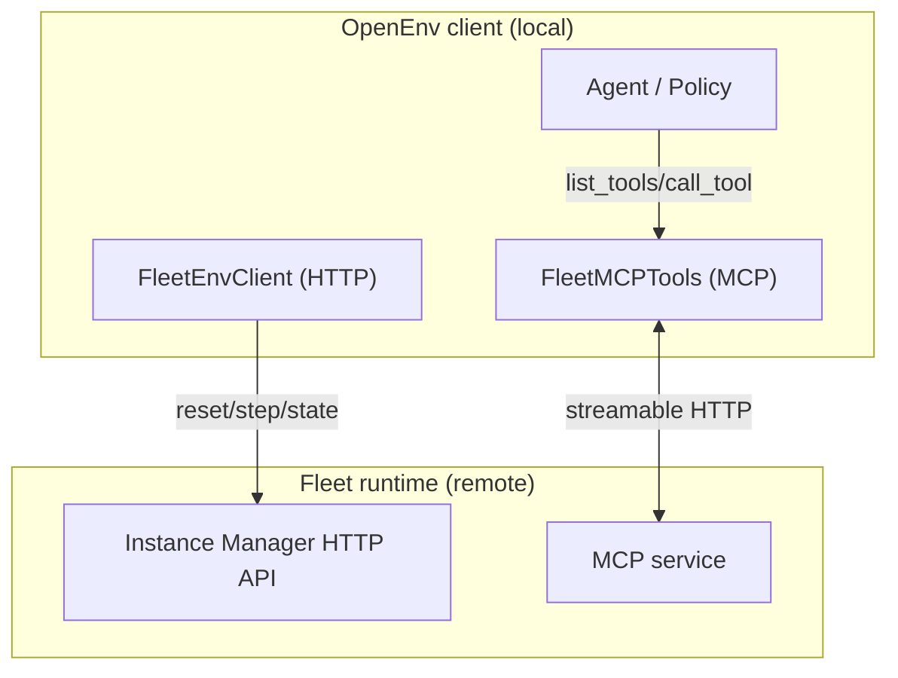

### Fleet environments

This integration lets you run OpenEnv environments on **Fleet** (remote) without Docker.
The key idea is simple: keep **orchestration** and **agent actions** separate.

- **Orchestration (HTTP)**: reset / step / state (episode + lifecycle control)
- **Agent actions (MCP)**: tools/list + tools/call (what the agent can do)

That boundary matches **RFC 001** (split planes) and lines up with **RFC 003**’s “tool-call actions”.
If you want the longer-form design background, see:

- **RFC 001**: [`rfcs/001-abstractions.md`](../../../rfcs/001-abstractions.md)
- **RFC 003**: [`rfcs/003-mcp-support.md`](../../../rfcs/003-mcp-support.md)

### What this is *not* (container/provider abstraction)

This Fleet integration is intentionally **not** a “container runtime” abstraction (no Docker provider, no local container lifecycle).
In particular, there is **no local Dockerized setup** where you spin up an “env server” container alongside an “env” container; Fleet hosts the runtime remotely (HTTP env server + MCP service), and the client connects to it.
Fleet provisions and runs the environment remotely; on the client side we just hold two handles:

- `FleetEnvClient` for the HTTP orchestration plane
- `FleetMCPTools` for the MCP agent plane

### Architecture (one picture)



### What FleetMCPTools does (and why)

Fleet currently exposes **more than one MCP endpoint** (commonly `api/v1/mcp` and `mcp`).
`FleetMCPTools` handles that so your agent code doesn’t need to care:

- **Union tools**: `await tools.list_tools()` returns a `ListToolsAction` where `.tools` is the union of tools across endpoints.
- **OpenAI-friendly format**: `.tools` is already in OpenAI “tools” dict format (via `convert_tool_format()`).
- **Route calls**: `await tools.call_tool(name, args)` routes to the endpoint that owns `name` (cached after discovery).

### Pseudocode (how the wiring works)

This is intentionally “conceptual code” — it’s here to make the split-plane design obvious:

```python
class FleetEnvClient(HTTPEnvClient):
    @classmethod
    def from_fleet(cls, api_key: str, env_key: str, **kwargs):
        # 1) Provision a remote instance via Fleet SDK
        env = Fleet(api_key=api_key).make(env_key=env_key, image_type="mcp", **kwargs)

        # 2) Orchestrator handle talks to the Instance Manager (HTTP)
        orch = cls(
            base_url=env.urls.manager.api,
            default_headers={"Authorization": f"Bearer {api_key}"},
        )

        # 3) Agent handle talks to MCP (may be multiple endpoints today)
        mcp_urls = (
            f"{env.urls.root}api/v1/mcp",
            f"{env.urls.root}mcp",
        )
        tools = FleetMCPTools(api_key=api_key, mcp_urls=mcp_urls)

        return orch, tools
```

### Quickstart

- Install: `pip install "openenv-core[fleet]"`
- Set: `export FLEET_API_KEY="..."`
- Run: `python examples/fleet_env_example.py <env_key>`

### Walkthrough (what the example is doing)

See `examples/fleet_env_example.py`.

1. **Provision** a remote env on Fleet:
   - `orch, tools = FleetEnvClient.from_fleet(...)`
2. **Reset** the episode via HTTP:
   - `obs = orch.reset()`
3. **Discover tools** via MCP:
   - `listed = await tools.list_tools()`
   - `tool_defs = listed.tools`
   - Each entry in `tool_defs` has `{"type": "function", "function": {"name": ..., "parameters": ...}}`
4. **Call a tool** (the example picks a “safe” action from the schema and calls `computer`)

Here’s a real run (trimmed) so you know what “healthy” looks like:

```text
Provisioning Fleet environment: amazon...
Orchestrator: Resetting environment...
Reset complete. Initial observation keys: []

Agent: Discovering tools...
Available tools (1): ['computer']
[{'type': 'object', 'properties': {'action': {'enum': ['screenshot', ..., 'cursor_position'], 'type': 'string'}, ...}, 'required': ['action']}]

Target Tool: computer
Agent: Calling tool 'computer' with {'action': 'cursor_position'}...
Agent: Tool execution result received.
result=CallToolResult(... structuredContent={'result': {'output': 'X=683,Y=384', ...}})
```

### TODOs / known sharp edges

- **MCP endpoint abstraction**: stop hardcoding `("api/v1/mcp", "mcp")` and discover endpoints (or accept a single unified endpoint when Fleet provides one).
- **Reset inconsistencies**: some env keys don’t behave consistently on `/reset` (needs better error reporting + a compatibility note per env type).
- **Determinism in examples**: example currently randomizes among safe actions; add an explicit seed or a single default for reproducible docs.
- **Tool dedupe rules**: if the same tool name exists on two endpoints, define/record the policy (first-wins vs prefer `api/v1/mcp`, etc.).
- **Better surfacing of schemas**: optional flag to return both OpenAI-shaped tool defs and raw MCP `inputSchema` for debugging.
- **Retries / backoff**: MCP list/call should have bounded retries and clearer failure modes when one endpoint is down.