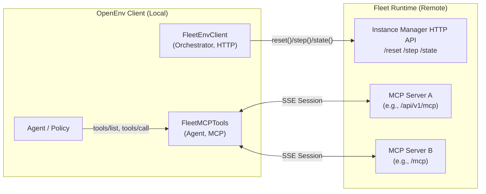

### Fleet Runtime Integration (OpenEnv) — Design Proposal

### Goal
Run OpenEnv environments on **Fleet** (remote) with **no Docker**, strictly adhering to:
- **RFC 001**: Agent interacts via MCP tools; Orchestration via HTTP.
- **RFC 003**: Standardized `ListToolsAction` and `CallToolAction`.

### Architecture

We implement a client-side adapter (`FleetEnvClient`) that aggregates Fleet's interfaces into the OpenEnv contract.



### 1. Combined Action Space (Client-Side Multiplexing)
Fleet instances expose multiple MCP endpoints (e.g., `api/v1/mcp` for browser control, `mcp` for API tools). 

**The Strategy:**
1.  **Connect to ALL**: The client establishes sessions with both `root + "api/v1/mcp"` and `root + "mcp"`.
2.  **Union Tools**: `FleetMCPTools.list_tools()` returns the union of tools from all connected endpoints.
3.  **Route Execution**: `FleetMCPTools.call_tool()` routes the call to the endpoint that owns the tool.

### 2. Client Implementation (`FleetEnvClient`)

This adapter replaces `LocalDockerProvider` and remains orchestration-only (HTTP). Agent tool calls are handled by `FleetMCPTools` (MCP).

```python
# Pseudocode implementation of the Client Adapter
class FleetEnvClient(HTTPEnvClient):
    @classmethod
    def from_fleet(cls, api_key, env_key, **kwargs):
        # 1. Provision Instance via Fleet SDK
        env = fleet.make(env_key, ...)
        
        # 2. Establish MCP Sessions (Streamable HTTP)
        # We connect to BOTH to provide the full browser + api toolset
        mcp_sessions = []
        for path in ["api/v1/mcp", "mcp"]:
            url = f"{env.urls.root}{path}"
            if is_reachable(url):
                mcp_sessions.append(connect_mcp(url, api_key))
                
        orch = cls(base_url=env.urls.manager.api)
        tools = FleetMCPTools(mcp_urls=mcp_sessions)
        return orch, tools

    # step/reset/state remain HTTP only
```

### 3. Usage (User Perspective)

```python
# The user simply provides keys. No Docker required.
orch, tools = FleetEnvClient.from_fleet(
    api_key=os.environ["FLEET_API_KEY"],
    env_key=os.environ["FLEET_ENV_KEY"]
)

# Orchestrator controls episode (HTTP)
orch.reset()

# Agent uses MCP tools (Browser + API)
tools_list = await tools.list_tools()
result = await tools.call_tool("computer", {...})
```

### Architecture Note: RFC vs Implementation

This design uses a **Client-Side Adapter** pattern to integrate Fleet without modifying remote server images.

**RFC Ideal (Server-Side Execution):**
```
Agent -> Client -> [Network] -> Server -> Internal MCP Server
                                   ^
                                   | Server executes tool
```

**Fleet Adapter (Client-Side Execution):**
```
Agent -> Client -> [MCP Client] -> [Network] -> Remote MCP Endpoint
            ^
            | Client executes tool via MCP
```

**Why:** Fleet servers expose raw MCP endpoints but lack a `/step` handler that wraps them as of now. The `FleetEnvClient` bridges this gap, preserving the user-facing `env.step()` interface while handling protocol details locally.