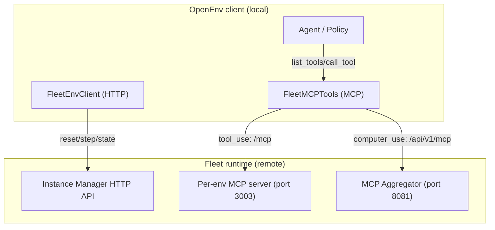

### Fleet environments

This integration lets you run Fleet environments through OpenEnv, simplifying the interaction and adhering to OpenEnv standards; keeping **orchestration** and **agent actions** separate.

- **Orchestration (HTTP)**: reset / step / state (episode + lifecycle control)
- **Agent actions (MCP)**: tools/list + tools/call (what the agent can do)

That boundary matches **RFC 001** (split planes) and lines up with **RFC 003**'s "tool-call actions".
If you want the longer-form design background, see:

- **RFC 001**: [`rfcs/001-abstractions.md`](../../../rfcs/001-abstractions.md)
- **RFC 003**: [`rfcs/003-mcp-support.md`](../../../rfcs/003-mcp-support.md)

### What this is *not* (container/provider abstraction)

This Fleet integration is intentionally **not yet** a "container runtime" abstraction (no Docker provider, no local container lifecycle).
In particular, there is **no local Dockerized setup** where you spin up an "env server" container alongside an "env" container; Fleet hosts the runtime remotely (HTTP env server + MCP service), and the client connects to it.

Fleet provisions and runs the environment remotely; on the client side we just hold two handles:

- `FleetEnvClient` for the HTTP orchestration plane
- `FleetMCPTools` for the MCP agent plane

### Architecture (one picture)


```mermaid
flowchart TB
  subgraph Client["OpenEnv client (local)"]
    Agent["Agent / Policy"]
    Orch["FleetEnvClient (HTTP)"]
    Tools["FleetMCPTools (MCP)"]
  end

  subgraph Runtime["Fleet runtime (remote)"]
    HTTP["Instance Manager HTTP API"]
    MCP3003["Per-env MCP server (port 3003)"]
    MCP8081["MCP Aggregator (port 8081)"]
  end

  Orch -- reset/step/state --> HTTP
  Agent -- list_tools/call_tool --> Tools
  Tools -- "tool_use: /mcp" --> MCP3003
  Tools -- "computer_use: /api/v1/mcp" --> MCP8081
```

### MCP Endpoint Routing by Modality

Fleet exposes two MCP endpoints per instance, on different ports:

| Modality | Endpoint | Port | What it serves |
|----------|----------|------|----------------|
| `tool_use` | `{root}/mcp` | 3003 | Per-env API tools only |
| `computer_use` | `{root}/api/v1/mcp` | 8081 | `computer` tool + aggregated API tools |

`FleetEnvClient.from_fleet()` / `from_fleet_async()` selects the correct endpoint based on `image_type`:
- `image_type="mcp"` (computer_use) → `/api/v1/mcp`
- `image_type="standard"` (tool_use) → `/mcp`

This eliminates partial failure ambiguity — each modality talks to exactly one endpoint.

### Sequence: SkyRL → OpenEnv (training rollout)

```
SkyRL Generator                    SkyRL FleetTaskEnv (env.py)         OpenEnv FleetTaskEnv (task_env.py)    FleetEnvClient (client.py)         FleetMCPTools (mcp_tools.py)       Fleet Runtime
      |                                    |                                    |                                    |                                    |                                    |
      |-- _env_init(env, prompt) --------->|                                    |                                    |                                    |                                    |
      |                                    |-- init_async(prompt) ------------->|                                    |                                    |                                    |
      |                                    |                                    |-- fleet_rollout_started            |                                    |                                    |
      |                                    |                                    |                                    |                                    |                                    |
      |                                    |                                    |-- _ensure_provisioned() ---------->|                                    |                                    |
      |                                    |                                    |   image_type = "mcp" | "standard"  |-- from_fleet_async() ------------->|                                    |
      |                                    |                                    |                                    |   sdk_image_type = "mcp" | None    |                                    |
      |                                    |                                    |                                    |-- async_fleet.make() --------------------------------------------->| provision instance
      |                                    |                                    |                                    |<-- env handle + urls -----------------------------------------------|
      |                                    |                                    |                                    |                                    |                                    |
      |                                    |                                    |                                    |   if mcp: url = /api/v1/mcp        |                                    |
      |                                    |                                    |                                    |   else:   url = /mcp               |                                    |
      |                                    |                                    |                                    |-- FleetMCPTools(url) ------------->|                                    |
      |                                    |                                    |<-- (orch, tools) ------------------|                                    |                                    |
      |                                    |                                    |                                    |                                    |                                    |
      |                                    |                                    |-- reset() (swallowed on failure)   |                                    |                                    |
      |                                    |                                    |                                    |                                    |                                    |
      |                                    |                                    |-- tools.list_tools() -------------------------------------------->|-- list_tools() ---------------------->| MCP endpoint
      |                                    |                                    |   FATAL if fails or empty          |                                    |<-- tools[] --------------------------|
      |                                    |                                    |                                    |                                    |                                    |
      |                                    |                                    |   filter by modality:              |                                    |                                    |
      |                                    |                                    |     computer_use → keep "computer" |                                    |                                    |
      |                                    |                                    |     tool_use → exclude "computer"  |                                    |                                    |
      |                                    |                                    |   FATAL if no tools after filter   |                                    |                                    |
      |                                    |                                    |                                    |                                    |                                    |
      |                                    |                                    |   (computer_use) screenshot ------------------------------------------------>| call_tool("computer", screenshot)-->|
      |                                    |                                    |                                    |                                    |                                    |
      |                                    |<-- obs {prompt, tools, screenshot} |                                    |                                    |                                    |
      |                                    |                                    |                                    |                                    |                                    |
      |                                    |   self.tools = obs["tools"]        |                                    |                                    |                                    |
      |                                    |   FATAL if empty                   |                                    |                                    |                                    |
      |                                    |   build system prompt + tools_json |                                    |                                    |                                    |
      |<-- (prompt, info) -----------------|                                    |                                    |                                    |                                    |
      |                                    |                                    |                                    |                                    |                                    |
      |== AGENT LOOP (per turn) ===========|====================================|====================================|====================================|====================================|
      |                                    |                                    |                                    |                                    |                                    |
      |-- step_async(action) ------------->|                                    |                                    |                                    |                                    |
      |                                    |-- step_async(action) ------------->|                                    |                                    |                                    |
      |                                    |                                    |-- tools.call_tool(name, args) ------------------------------------------->| call_tool(name, args) ------------->|
      |                                    |                                    |<-- result -----------------------------------------------------------------|<-- result --------------------------|
      |                                    |                                    |                                    |                                    |                                    |
      |                                    |                                    |   if done: _compute_reward()       |                                    |                                    |
      |                                    |                                    |     fleet_rollout_completed        |                                    |                                    |
      |                                    |<-- (obs, reward, done, info) ------|                                    |                                    |                                    |
      |<-- (obs, reward, done, info) ------|                                    |                                    |                                    |                                    |
```

**Failure handling:**
- `_ensure_provisioned()` fails → `fleet_rollout_completed(failure_reason="init_error")` → raise
- `list_tools()` fails or empty → `fleet_rollout_completed(failure_reason="tools_error")` → raise
- No `computer` tool for computer_use → `fleet_rollout_completed(failure_reason="computer_tool_missing")` → raise
- `reset()` fails → warning only, continues with empty observation (non-fatal)
- `screenshot` fails → warning only, continues without screenshot (non-fatal)

### Pseudocode

```python
class FleetEnvClient(HTTPEnvClient):
    @classmethod
    def from_fleet(cls, api_key, env_key, data_key, data_version, image_type, **kwargs):
        # 1) Provision a remote instance via Fleet SDK
        sdk_image_type = image_type if image_type == "mcp" else None
        env = Fleet(api_key=api_key).make(
            env_key=env_key, image_type=sdk_image_type, data_key=f"{data_key}:{data_version}", **kwargs
        )

        # 2) Orchestrator handle talks to the Instance Manager (HTTP)
        orch = cls(base_url=env.urls.manager.api, ...)

        # 3) Pick MCP endpoint based on modality
        if image_type == "mcp":
            mcp_urls = (f"{env.urls.root}api/v1/mcp",)  # aggregator (port 8081)
        else:
            mcp_urls = (f"{env.urls.root}mcp",)          # per-env server (port 3003)
        tools = FleetMCPTools(api_key=api_key, mcp_urls=mcp_urls)

        return orch, tools
```

### Quickstart

- Install: `pip install "openenv-core[fleet]"`
- Set: `export FLEET_API_KEY="..."`
- Run: `python examples/fleet_env_example.py <env_key>`

### Walkthrough (what the example is doing)

See `examples/fleet_env_example.py`.

1. **Provision** a remote env on Fleet:
   - `orch, tools = FleetEnvClient.from_fleet(...)`
2. **Reset** the episode via HTTP:
   - `obs = orch.reset()`
3. **Discover tools** via MCP:
   - `listed = await tools.list_tools()`
   - `tool_defs = listed.tools`
   - Each entry in `tool_defs` has `{"type": "function", "function": {"name": ..., "parameters": ...}}`
4. **Call a tool** (the example picks a "safe" action from the schema and calls `computer`)

Here's a real run (trimmed) so you know what "healthy" looks like:

```text
Provisioning Fleet environment: amazon...
Orchestrator: Resetting environment...
Reset complete. Initial observation keys: []

Agent: Discovering tools...
Available tools (1): ['computer']
[{'type': 'object', 'properties': {'action': {'enum': ['screenshot', ..., 'cursor_position'], 'type': 'string'}, ...}, 'required': ['action']}]

Target Tool: computer
Agent: Calling tool 'computer' with {'action': 'cursor_position'}...
Agent: Tool execution result received.
result=CallToolResult(... structuredContent={'result': {'output': 'X=683,Y=384', ...}})
```

### Telemetry

Structured error tracking via [Logfire](https://logfire.pydantic.dev/). Covers init failures, tool call failures, MCP timeouts, and verifier errors across all fleet task executions.

**Setup:**

```python
from envs.fleet_env import configure_fleet_telemetry

# Default environment is "training_rollouts" - shows up in Logfire env dropdown
configure_fleet_telemetry(token="your-logfire-token")

# Or specify a custom environment
configure_fleet_telemetry(token="your-logfire-token", environment="production")
```

If you never call `configure_fleet_telemetry()`, logfire silently drops all events (no noise, no crashes).

**Consistent Schema:**

All events include these base attributes (set automatically via task context):

| Attribute | Description | Example |
|-----------|-------------|---------|
| `env_key` | Environment key | `github`, `amazon` |
| `env_version` | Environment version | `v0.0.12` |
| `task_key` | Task identifier | `github-create-issue-001` |
| `modality` | Task modality | `tool_use`, `computer_use` |

**What gets tracked:**

| Event | Level | Description |
|-------|-------|-------------|
| `fleet_rollout_started` | info | Rollout attempt started (emitted before provisioning, counts init failures too) |
| `fleet_rollout_completed` | info | Rollout terminated: includes `reward`, `step_count`, `failure_reason` |
| `fleet_provisioning_completed` | info | Instance provisioned: includes `provisioning_time_s` (queue delay + create time) |
| `fleet_make_retry` | warning | Transient `Fleet.make()` failure, retrying |
| `fleet_make_failed` | error | `Fleet.make()` permanently failed |
| `fleet_env_reset_failed` | warning | Env reset threw (non-fatal, continues with empty observation) |
| `fleet_screenshot_failed` | exception | Initial screenshot threw |
| `fleet_tool_call_failed` | exception | Agent tool call threw (Python exception after retries exhausted) |
| `fleet_mcp_tool_error` | warning | MCP server returned error in tool result (tool ran but failed) |
| `fleet_verifier_failed` | exception | Verifier **code** threw an exception (not model failure — model getting wrong answer = reward 0.0 without verifier_error) |
| `fleet_list_tools_retry` | warning | list_tools retrying |
| `fleet_list_tools_exhausted` | error | list_tools retries exhausted |
| `fleet_call_tool_retry` | warning | call_tool retrying |
| `fleet_call_tool_exhausted` | error | call_tool retries exhausted |

**Failure reasons in `fleet_rollout_completed`:**

| `failure_reason` | Meaning |
|------------------|---------|
| `init_error` | Provisioning failed (`_ensure_provisioned()`) |
| `tools_error` | `list_tools()` MCP call failed or returned no tools |
| `computer_tool_missing` | Tools listed but no `computer` tool for computer_use modality (MCP image config issue) |

**Example Logfire SQL Query:**

```sql
-- Rollout summary by env/version
SELECT
    attributes->>'env_key' as env,
    attributes->>'env_version' as version,
    attributes->>'modality' as modality,
    COUNT(*) FILTER (WHERE message = 'fleet_rollout_started') as total_rollouts,
    COUNT(*) FILTER (WHERE message = 'fleet_rollout_completed') as completed,
    COUNT(*) FILTER (WHERE message = 'fleet_rollout_completed'
        AND attributes->>'failure_reason' = 'init_error') as init_errors,
    COUNT(*) FILTER (WHERE message = 'fleet_rollout_completed'
        AND attributes->>'failure_reason' = 'tools_error') as tools_errors,
    COUNT(*) FILTER (WHERE message = 'fleet_rollout_completed'
        AND attributes->>'failure_reason' = 'computer_tool_missing') as computer_missing,
    COALESCE(SUM(CAST(attributes->>'step_count' AS INT))
        FILTER (WHERE message = 'fleet_rollout_completed'), 0) as total_steps,
    COUNT(*) FILTER (WHERE message IN (
        'fleet_tool_call_failed', 'fleet_mcp_tool_error')) as tool_errors,
    COUNT(*) FILTER (WHERE message = 'fleet_verifier_failed') as verifier_errors
FROM records
WHERE service_name = 'openenv-fleet'
GROUP BY 1, 2, 3
ORDER BY total_rollouts DESC;
```

```sql
-- Provisioning latency by env (detects Fleet queue serialization)
SELECT
    attributes->>'env_key' as env,
    COUNT(*) as instances,
    ROUND(AVG(CAST(attributes->>'provisioning_time_s' AS FLOAT)), 1) as avg_provision_s,
    MAX(CAST(attributes->>'provisioning_time_s' AS FLOAT)) as max_provision_s,
    MIN(CAST(attributes->>'provisioning_time_s' AS FLOAT)) as min_provision_s
FROM records
WHERE service_name = 'openenv-fleet'
    AND message = 'fleet_provisioning_completed'
GROUP BY 1
ORDER BY avg_provision_s DESC;
```

### TODOs

- **Reset inconsistencies**: some env keys don't behave consistently on `/reset` (needs better error reporting + a compatibility note per env type).
- **Support for all OpenEnv environments**: Starting with OpenEnv, we want to support any backend to run environments at scale.
- **GA access**: GA the Fleet platform.
